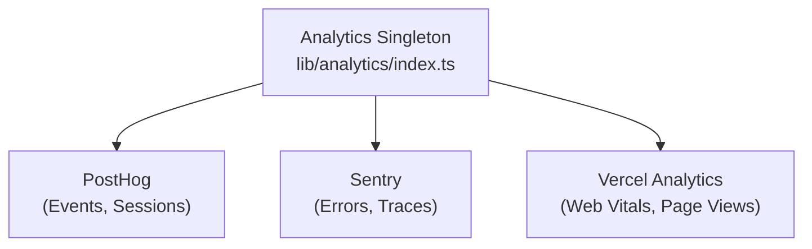

# نظام التحليلات

يتكامل قالب Ever Works مع **PostHog** و**Sentry** و**Vercel Analytics** لتتبع الأحداث بشكل شامل ومراقبة الأخطاء وتسجيل الجلسة وتحليلات الأداء.

## بنيان



## فئة التحليلات

الفئة الأساسية 0 في 1 هي فئة مفردة تدير التهيئة وإرسال الأحداث عبر الموفرين:

```typescript
class Analytics {
  private static instance: Analytics;
  private initialized: boolean;
  private exceptionTrackingProvider: ExceptionTrackingProvider;

  static getInstance(): Analytics;
  init(): void;
  trackEvent(name: string, properties?: EventProperties): void;
  trackPageView(url: string): void;
  identify(userId: string, properties?: UserProperties): void;
  reset(): void;
}
```

### حل موفر تتبع الاستثناءات

يدعم النظام تكوين تتبع الاستثناءات المرن:

```typescript
type ExceptionTrackingProvider = 'sentry' | 'posthog' | 'both' | 'none';
```

يتم تحديد المزود عن طريق التحقق من التوفر:
1. اقرأ قيمة التكوين 0
2. التحقق من تمكين الموفر الذي تم اختياره
3. ارجع إلى البديل المتاح إذا لم يتم تكوين الخيار الأساسي

## تكامل PostHog

### التكوين

```bash
NEXT_PUBLIC_POSTHOG_KEY=phc_xxx
NEXT_PUBLIC_POSTHOG_HOST=https://us.i.posthog.com

# Optional
NEXT_PUBLIC_POSTHOG_DEBUG=false
NEXT_PUBLIC_POSTHOG_SESSION_RECORDING=true
NEXT_PUBLIC_POSTHOG_AUTO_CAPTURE=true
NEXT_PUBLIC_POSTHOG_SAMPLE_RATE=1.0
NEXT_PUBLIC_POSTHOG_SESSION_RECORDING_SAMPLE_RATE=0.1
NEXT_PUBLIC_POSTHOG_EXCEPTION_TRACKING=true
```

### خدمة PostHog API

تقع الخدمة من جانب الخادم على `lib/services/posthog-api.service.ts` ، وتوفر بيانات تحليلات المسؤول:

```typescript
class PostHogApiService {
  constructor(); // Reads from analyticsConfig

  isConfigured(): boolean;
  async getTotalPageViews(days?: number): Promise<number>;
  async getTopPages(days?: number): Promise<PageData[]>;
  async getEventCounts(eventName: string, days?: number): Promise<number>;
}
```

**مطلوب للوصول إلى واجهة برمجة التطبيقات من جانب الخادم:**
```bash
POSTHOG_PERSONAL_API_KEY=phx_xxx
POSTHOG_PROJECT_ID=12345
```

### خطاف من جانب العميل

```typescript
import { useAnalytics } from '@/hooks/use-analytics';

const {
  trackEvent,      // (name: string, properties?: object) => void
  trackPageView,   // (url: string) => void
  identify,        // (userId: string, properties?: object) => void
} = useAnalytics();
```

### ربط التحليلات الجغرافية

```typescript
import { useGeoAnalytics } from '@/hooks/use-geo-analytics';

const {
  geoData,         // Geographic analytics data
  isLoading,
} = useGeoAnalytics();
```

## التكامل الحراسة

### التكوين

```bash
NEXT_PUBLIC_SENTRY_DSN=https://xxx@sentry.io/xxx
SENTRY_AUTH_TOKEN=sntrys_xxx
SENTRY_ORG=your-org
SENTRY_PROJECT=your-project
NEXT_PUBLIC_SENTRY_EXCEPTION_TRACKING=true
```

سنتري يوفر:
- **تتبع الأخطاء** - الالتقاط التلقائي للاستثناءات التي لم تتم معالجتها
- **مراقبة الأداء** - تتبع المعاملات لمسارات واجهة برمجة التطبيقات وعمليات تحميل الصفحات
- **إعادة تشغيل الجلسة** - تسجيل الجلسة الاختياري

## تحليلات فيرسيل

تتوفر Vercel Analytics تلقائيًا عند نشرها على Vercel:

```bash
# Enabled by default on Vercel deployments
NEXT_PUBLIC_VERCEL_ANALYTICS=true
```

يوفر:
- **مؤشرات أداء الويب** - مراقبة مؤشرات أداء الويب الأساسية (LCP، وFID، وCLS).
- **مشاهدات الصفحة** - التتبع التلقائي لعرض الصفحة
- **رؤى الجمهور** - التحليلات الجغرافية وتحليلات الأجهزة

## لوحة تحكم تحليلات المسؤول

توفر لوحة معلومات المسؤول تحليلات مجمعة من خلال الرابط `useAdminStats` :

```typescript
import { useAdminStats } from '@/hooks/use-admin-stats';

const {
  stats,           // Dashboard statistics
  isLoading,
} = useAdminStats();
```

يوفر الخطاف `useDashboardStats` مقاييس أكثر تفصيلاً:

```typescript
import { useDashboardStats } from '@/hooks/use-dashboard-stats';

const {
  stats,           // { items, users, revenue, pageViews, ... }
  isLoading,
  refetch,
} = useDashboardStats();
```

## تعطيل التحليلات

يتم تعطيل موفري التحليلات عندما يكون تكوينهم مفقودًا. لا يتم تحميل شفرة التتبع إذا لم يتم تعيين متغيرات البيئة المقابلة. وهذا يسمح للقالب بالعمل دون أي تحليلات قيد التطوير.
