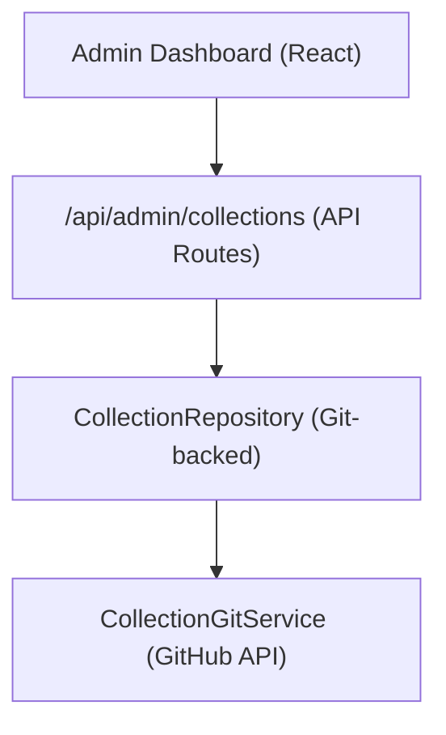

# نظام التحصيل

تتيح المجموعات للمسؤولين تنظيم مجموعات من العناصر لعرضها على الموقع. يقوم النظام بتخزين بيانات المجموعة في مستودع CMS المستند إلى Git ويوفر عمليات CRUD من خلال لوحة تحكم المسؤول.

## بنيان



يتم تخزين المجموعات كملفات في مستودع CMS المستند إلى Git (تم تكوينه عبر `DATA_REPOSITORY` )، باستخدام `CollectionGitService` لعمليات القراءة/الكتابة من خلال GitHub API.

## نموذج البيانات

```typescript
interface Collection {
  id: string;
  name: string;
  slug: string;
  description?: string;
  isActive: boolean;
  items: string[];          // Array of item slugs
  item_count: number;       // Computed from items array
  displayOrder?: number;
  created_at: string;
  updated_at: string;
}
```

## مستودع المجموعة

يقع المستودع في `lib/repositories/collection.repository.ts` ، ويوفر ما يلي:

```typescript
class CollectionRepository {
  async findAll(options?: CollectionListOptions): Promise<Collection[]>;
  async findById(id: string): Promise<Collection | null>;
  async findBySlug(slug: string): Promise<Collection | null>;
  async create(data: CreateCollectionRequest): Promise<Collection>;
  async update(id: string, data: UpdateCollectionRequest): Promise<Collection>;
  async delete(id: string): Promise<void>;
  async assignItems(id: string, itemSlugs: string[]): Promise<void>;
}
```

### خيارات القائمة

```typescript
interface CollectionListOptions {
  search?: string;           // Filter by name
  includeInactive?: boolean; // Include inactive collections
  sortBy?: 'name' | 'item_count' | 'created_at';
  sortOrder?: 'asc' | 'desc';
  page?: number;
  limit?: number;
}
```

## ربط المسؤول

```typescript
import { useAdminCollections } from '@/hooks/use-admin-collections';

const {
  collections,        // Collection[]
  total, page, totalPages, limit,
  isLoading, isSubmitting,
  createCollection,   // (data: CreateCollectionRequest) => Promise<boolean>
  updateCollection,   // (id: string, data: UpdateCollectionRequest) => Promise<boolean>
  deleteCollection,   // (id: string) => Promise<boolean>
  assignItems,        // (id: string, itemSlugs: string[]) => Promise<boolean>
  fetchAssignedItems, // (id: string) => Promise<Item[]>
  refetch, refreshData,
} = useAdminCollections({ page: 1, limit: 10, search: '' });
```

## نقاط نهاية واجهة برمجة التطبيقات

| الطريقة | نقطة النهاية | الوصف |
|--------|----------|-------------|
| احصل على | `/api/admin/collections` | قائمة المجموعات (مرقّمة) |
| مشاركة | `/api/admin/collections` | إنشاء مجموعة جديدة |
| ضع | `/api/admin/collections/:id` | تحديث مجموعة |
| حذف | `/api/admin/collections/:id` | حذف مجموعة |
| احصل على | 4ـ | الحصول على العناصر المخصصة |
| مشاركة | 5 ــ | تعيين العناصر إلى المجموعة |

## العرض من جانب العميل

يتحقق الخطاف 6 من وجود أي مجموعات نشطة، ويستخدم للعرض الشرطي:

```typescript
import { useCollectionsExists } from '@/hooks/use-collections-exists';
const { exists, isLoading } = useCollectionsExists();
```

## التكوين

تتطلب المجموعات متغيرات البيئة التالية:

```bash
DATA_REPOSITORY=https://github.com/owner/repo   # Git CMS repository
GH_TOKEN=ghp_xxx                                  # GitHub API token
GITHUB_BRANCH=main                                # Branch for collection data
```

يقوم "0" بتحليل عنوان URL "1" لاستخراج مالك GitHub والمستودع، ثم يستخدم الرمز المميز لمصادقة واجهة برمجة التطبيقات (API).
