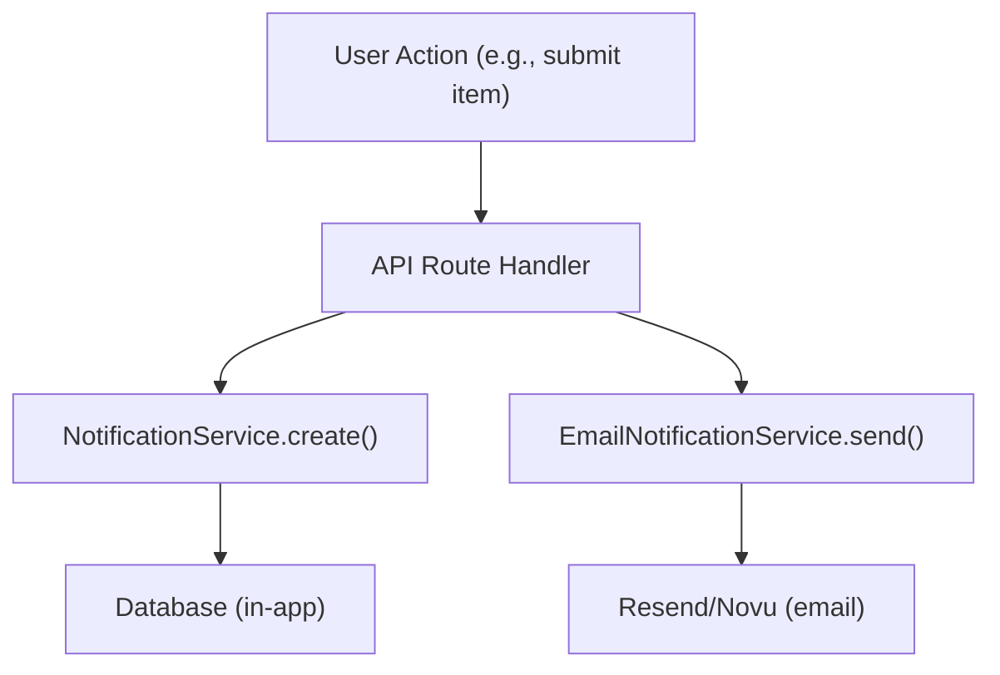

# نظام الإخطار

يوفر قالب Ever Works كلاً من الإشعارات داخل التطبيق (المخزنة في قاعدة البيانات) وإشعارات البريد الإلكتروني (عبر Resend أو Novu). يتم تشغيل الإشعارات من خلال أحداث النظام مثل عمليات إرسال العناصر وتقارير المحتوى وفشل الدفع.

## الإخطارات داخل التطبيق

### خدمة الإخطار

تقع الخدمة في `lib/services/notification.service.ts` ، وتدير الإشعارات المدعومة بقاعدة البيانات:

```typescript
class NotificationService {
  // Create a generic notification
  static async create(data: CreateNotificationData);

  // Convenience methods for specific events
  static async createItemSubmissionNotification(adminUserId, itemId, itemName, submittedBy);
  static async createCommentReportedNotification(adminUserId, commentId, content, reportedBy);
  static async createItemReportedNotification(adminUserId, itemId, itemName, reportedBy);
  static async createUserRegisteredNotification(adminUserId, userName, userEmail);
  static async createPaymentFailedNotification(userId, subscriptionId, errorMessage);
  static async createSystemAlertNotification(adminUserId, title, message);
}
```

### أنواع الإخطارات

```typescript
type NotificationType =
  | "item_submission"      // New item requires admin review
  | "comment_reported"     // Comment flagged by user
  | "item_reported"        // Item flagged by user
  | "user_registered"      // New user account created
  | "payment_failed"       // Subscription payment failed
  | "system_alert";        // Generic system notification
```

### بنية بيانات الإخطار

```typescript
interface CreateNotificationData {
  userId: string;                    // Recipient user ID
  type: NotificationType;
  title: string;
  message: string;
  data?: Record<string, unknown>;    // Arbitrary metadata (actionUrl, etc.)
}
```

### إحصائيات الإخطار

```typescript
interface NotificationStats {
  total: number;
  unread: number;
  byType: Record<string, number>;
}
```

### ربط المسؤول

```typescript
import { useAdminNotifications } from '@/hooks/use-admin-notifications';

const {
  notifications,     // Notification[]
  stats,             // NotificationStats
  isLoading,
  markAsRead,        // (id: string) => Promise<boolean>
  markAllAsRead,     // () => Promise<boolean>
  deleteNotification,// (id: string) => Promise<boolean>
  refetch,
} = useAdminNotifications();
```

## إشعارات البريد الإلكتروني

### خدمة إشعارات البريد الإلكتروني

تقع هذه الخدمة في `lib/services/email-notification.service.ts` ، وتتعامل مع تسليم البريد الإلكتروني للمعاملات:

```typescript
class EmailNotificationService {
  // Send notification emails for various events
  static async sendItemSubmissionEmail(adminEmail, itemData);
  static async sendPaymentSuccessEmail(userEmail, paymentData);
  static async sendPaymentFailedEmail(userEmail, paymentData);
  static async sendSubscriptionCancelledEmail(userEmail, subscriptionData);
  static async sendTrialEndingEmail(userEmail, trialData);
  static async sendWelcomeEmail(userEmail, userData);
}
```

### تكوين مزود البريد الإلكتروني

يدعم القالب اثنين من موفري البريد الإلكتروني:

**إعادة الإرسال** (افتراضي):
```bash
RESEND_API_KEY=re_xxx
```

** نوفو **:
```bash
NOVU_API_KEY=xxx
NOVU_TEMPLATE_ID=xxx        # Optional: custom template ID
NOVU_BACKEND_URL=xxx         # Optional: self-hosted Novu URL
```

تم تكوين اختيار الموفر في تكوين الموقع:
```json
{
  "mail": {
    "provider": "resend",
    "default_from": "noreply@yourdomain.com"
  }
}
```

### خدمة الدفع عبر البريد الإلكتروني

يحتوي نظام الدفع الفرعي على خدمة البريد الإلكتروني الخاصة به ( `lib/payment/services/payment-email.service.ts` ) مع مساعدين لتنسيق بيانات الدفع:

```typescript
import {
  paymentEmailService,
  extractCustomerInfo,    // Extract customer data from webhook event
  formatAmount,           // Format currency amounts
  formatPaymentMethod,    // Format card details
  formatBillingDate,      // Format billing period dates
  getPlanName,            // Map plan ID to display name
  getBillingPeriod,       // Format billing interval
} from '@/lib/payment/services/payment-email.service';
```

## تفضيلات الإخطار

يمكن للمستخدمين إدارة تفضيلات الإشعارات الخاصة بهم من خلال واجهة الإعدادات. تتحكم التفضيلات في أنواع الإشعارات التي تؤدي إلى تسليم البريد الإلكتروني أثناء إنشاء الإشعارات داخل التطبيق دائمًا.

## تدفق الأحداث



## الوثائق ذات الصلة

- [التقارير والإشراف على المحتوى](./reports-moderation.md) -- الإشعارات الناتجة عن التقارير
- [الخطافات الإلكترونية للدفع](../ Payment/webhooks.md) -- إشعارات البريد الإلكتروني المتعلقة بالدفع
