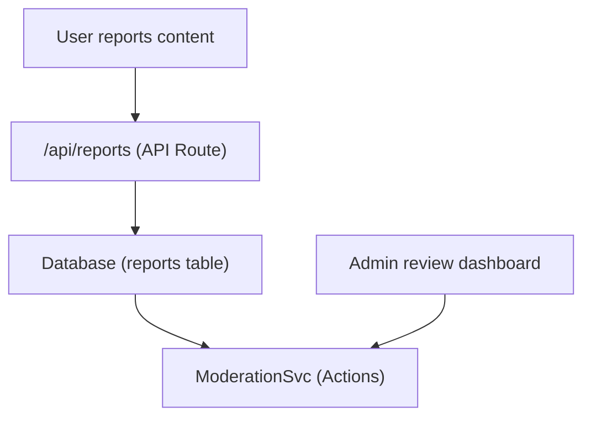

# التقارير والإشراف على المحتوى

يشتمل قالب Ever Works على نظام للإبلاغ عن المحتوى والإشراف عليه يمكّن المستخدمين من الإبلاغ عن المحتوى غير المناسب ويمكّن المسؤولين من اتخاذ إجراء بشأن العناصر والتعليقات التي تم الإبلاغ عنها.

## بنيان



## أنواع المحتوى

يدعم النظام الإبلاغ عن نوعين من المحتوى:

```typescript
enum ReportContentType {
  ITEM = 'item',
  COMMENT = 'comment',
}
```

## خدمة الاعتدال

تقع الخدمة في `lib/services/moderation.service.ts` ، وتوفر إجراءات الإشراف:

### قرار مالك المحتوى

```typescript
async function getContentOwner(
  contentType: ReportContentTypeValues,
  contentId: string
): Promise<ContentOwnerResult>;
// Returns: { success: boolean, userId?: string, error?: string }
```

يحل مشكلة مؤلف المحتوى المبلغ عنه من خلال البحث عن التعليقات عبر `getCommentById()` أو العناصر عبر 1.

### إجراءات الاعتدال

| العمل | الوصف | تأثير |
|--------|-----------|--------|
| **إزالة المحتوى** | حذف العنصر أو التعليق المبلغ عنه | تمت إزالة المحتوى، وتم تسجيل التاريخ |
| **تحذير المستخدم** | زيادة عدد التحذيرات | تمت زيادة عداد التحذير |
| **تعليق المستخدم** | تعليق الحساب مؤقتا | الوصول إلى الحساب مقيد |
| **حظر المستخدم** | حظر الحساب نهائيا | الحساب مقيد نهائيا |
| **رفض التقرير** | وضع علامة على التقرير على أنه تم حله دون اتخاذ إجراء | التقرير مغلق |

### تنفيذ العمل

ينشئ كل إجراء إدخالاً لسجل الإشراف وقد يؤدي إلى تشغيل إشعارات البريد الإلكتروني:

```typescript
// Example: Remove content
async function removeContent(
  contentType: ReportContentTypeValues,
  contentId: string,
  reportId: string,
  adminId: string
): Promise<ModerationResult>;
```

تفوض الخدمة إلى :
- `deleteComment()` -- لإزالة التعليق
- `ItemRepository` -- لإزالة العنصر
- `createModerationHistory()` -- لتتبع المراجعة
- `incrementWarningCount()` -- لتحذيرات المستخدم
- `suspendUserQuery()` / `banUserQuery()` -- لإجراءات الحساب
- `EmailNotificationService` -- لرسائل البريد الإلكتروني الخاصة بإشعارات المستخدم

## ربط المسؤول

```typescript
import { useAdminReports } from '@/hooks/use-admin-reports';

const {
  reports,           // Report[]
  total, page, totalPages,
  isLoading, isSubmitting,
  resolveReport,     // (id, action, reason?) => Promise<boolean>
  dismissReport,     // (id, reason?) => Promise<boolean>
  deleteReport,      // (id) => Promise<boolean>
  refetch, refreshData,
} = useAdminReports({ page: 1, limit: 10 });
```

## سير عمل الاعتدال

1. **محتوى تقارير المستخدم** - تحديد سبب وإرساله عبر واجهة برمجة تطبيقات التقرير
2. **إشعار المسؤول** - 0 أو 1 1 تنبيهات للمسؤولين
3. **مراجعات المشرف** - عرض تفاصيل التقرير في لوحة تحكم المشرف
4. **يتخذ المشرف الإجراء** -- يختار من بين: إزالة المحتوى، أو تحذير المستخدم، أو التعليق، أو الحظر، أو الرفض
5. **السجل المسجل** - `createModerationHistory()` يسجل الإجراء باستخدام معرف المسؤول والطابع الزمني والسبب
6. **إعلام المستخدم** - يتم إرسال إشعار عبر البريد الإلكتروني إلى مالك المحتوى حول الإجراء المتخذ

## تعداد إجراءات الإشراف

```typescript
enum ModerationAction {
  REMOVE_CONTENT = 'remove_content',
  WARN_USER = 'warn_user',
  SUSPEND_USER = 'suspend_user',
  BAN_USER = 'ban_user',
  DISMISS = 'dismiss',
}
```

## نقاط نهاية واجهة برمجة التطبيقات

| الطريقة | نقطة النهاية | الوصف |
|--------|----------|-------------|
| مشاركة | `/api/reports` | تقديم تقرير جديد |
| احصل على | `/api/admin/reports` | قائمة التقارير (المشرف، مرقّمة) |
| مشاركة | `/api/admin/reports/:id/resolve` | حل تقرير بالإجراء |
| مشاركة | `/api/admin/reports/:id/dismiss` | رفض تقرير |
| حذف | 4ـ | حذف تقرير |

## الوثائق ذات الصلة

- [نظام الإشعارات](./notifications.md)--كيفية تسليم إشعارات التقرير
- [التصويت والتعليقات](./voting-comments.md) -- نظام التعليق الذي يمكن الإبلاغ عنه
