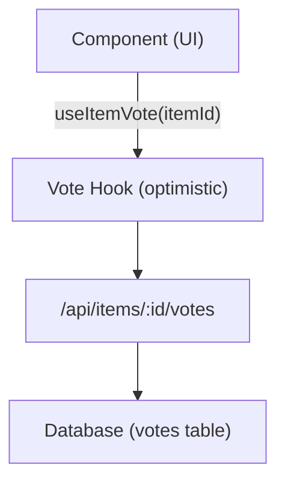

# نظام التصويت والتعليقات

يتضمن قالب Ever Works نظامًا كاملاً للتصويت والتعليق يسمح للمستخدمين بالتصويت لصالح/التصويت السلبي على العناصر، وترك المراجعات بتقييمات النجوم، والتفاعل مع المحتوى. يستخدم كلا النظامين تحديثات متفائلة للحصول على تعليقات فورية على واجهة المستخدم.

## نظام التصويت

###الهندسة المعمارية

يستخدم نظام التصويت نموذج التصويت لكل عنصر حيث يمكن لكل مستخدم مصادق عليه الإدلاء بصوت واحد (لأعلى أو لأسفل) لكل عنصر. يقوم النظام بتتبع صافي عدد الأصوات وأصوات المستخدمين الفرديين.



### خطاف useItemVote

```typescript
import { useItemVote } from '@/hooks/use-item-vote';

const {
  voteCount,       // number -- net vote count
  userVote,        // 'up' | 'down' | null
  isLoading,       // boolean
  handleVote,      // (type: 'up' | 'down') => void
  refreshVotes,    // () => void
} = useItemVote(itemId);
```

### سلوك التصويت

| الحالة الحالية | العمل | النتيجة |
|--------------|--------|--------|
| لا يوجد تصويت | انقر فوق | التصويت كمفيد (+1) |
| لا يوجد تصويت | انقر للأسفل | التصويت السلبي (-1) |
| تم التصويت عليه | انقر فوق | إزالة التصويت (تبديل) |
| تم التصويت عليه | انقر للأسفل | التبديل إلى التصويت السلبي (-2 صافي) |
| تم التصويت ضده | انقر للأسفل | إزالة التصويت (تبديل) |
| تم التصويت ضده | انقر فوق | قم بالتبديل إلى التصويت الإيجابي (+2 صافي) |

### تحديثات متفائلة

ينفذ خطاف التصويت تحديثات متفائلة مع التراجع:

1. **onMutate** - إلغاء الاستعلامات الصادرة، والتقاط لقطة للحالة الحالية، وتطبيق التحديث المتفائل
2. **onSuccess** - استبدل البيانات المتفائلة باستجابة الخادم
3. **onError** -- ارجع إلى اللقطة، وأظهر نخب الخطأ

### المصادقة

المستخدمون غير المصادق عليهم الذين يحاولون التصويت يرون نموذج تسجيل الدخول عبر `useLoginModal` :

```typescript
if (!user) {
  loginModal.onOpen('Please sign in to vote on this item');
  throw new Error('Authentication required');
}
```

### إدارة ذاكرة التخزين المؤقت

يوفر خطاف الأداة المساعدة `useVoteCache` عمليات ذاكرة التخزين المؤقت عبر المكونات:

```typescript
import { useVoteCache } from '@/hooks/use-item-vote';

const {
  invalidateAllVotes,     // () => void
  invalidateItemVotes,    // (itemId: string) => void
  clearVoteCache,         // () => void
  prefetchItemVotes,      // (itemId: string) => Promise<void>
} = useVoteCache();
```

## نظام التعليقات

###الهندسة المعمارية

تدعم التعليقات عمليات CRUD الكاملة مع تصنيفات النجوم والإشراف والتحديثات في الوقت الفعلي.

### خطاف الاستخدام للتعليقات

```typescript
import { useComments } from '@/hooks/use-comments';

const {
  comments,              // CommentWithUser[]
  isPending,
  createComment,         // ({ content, itemId, rating }) => Promise
  isCreating,
  updateComment,         // ({ commentId, content?, rating? }) => Promise
  isUpdating,
  deleteComment,         // (commentId) => Promise
  isDeleting,
  rateComment,           // ({ commentId, rating }) => void
  isRatingComment,
  updateCommentRating,   // ({ commentId, rating }) => void
  isUpdatingRating,
  commentRating,         // number
  isLoadingRating,
} = useComments(itemId);
```

### نموذج بيانات التعليق

يتضمن كل تعليق:
- `id` -- المعرف الفريد
- `content` -- نص التعليق
- `rating` -- تصنيف النجوم الاختياري (1-5)
- 3 - مرجع المؤلف
- 4-- البند المرتبط
- `user` -- بيانات المستخدم المعبأة (الاسم والبريد الإلكتروني والصورة)
- `createdAt` / `updatedAt` -- الطوابع الزمنية

### تكامل التقييم

التعليقات والتقييمات متكاملة بإحكام:
- يؤدي إنشاء تعليق بتقييم إلى تحديث التصنيف الإجمالي للعنصر
- يؤدي تحرير تقييم التعليق إلى إعادة الحساب
- تتم إعادة جلب الاستعلام 8 بعد أي تغيير في التعليق

### الأحداث المشتركة بين المكونات

يرسل نظام التعليق أحداث DOM مخصصة للتنسيق بين المكونات:

```typescript
const COMMENT_MUTATION_EVENT = "comment:mutated";
window.dispatchEvent(new CustomEvent(COMMENT_MUTATION_EVENT, { detail: comment }));
```

يمكن للمكونات الأخرى الاستماع إلى تغييرات التعليق دون اقتران React Query المباشر.

### الإشراف الإداري

يوفر الخطاف `useAdminComments` إدارة التعليقات على مستوى المسؤول:

```typescript
import { useAdminComments } from '@/hooks/use-admin-comments';

const {
  comments,         // AdminCommentItem[]
  totalComments,
  totalPages,
  isDeleting,       // string | null (ID of comment being deleted)
  deleteComment,    // (id: string) => Promise<boolean>
} = useAdminComments({ page: 1, limit: 10, search: '' });
```

### نقاط نهاية واجهة برمجة التطبيقات

| الطريقة | نقطة النهاية | الوصف |
|--------|----------|-------------|
| احصل على | `/api/items/:id/comments` | جلب التعليقات لعنصر |
| مشاركة | `/api/items/:id/comments` | قم بإنشاء تعليق جديد |
| ضع | `/api/items/:id/comments/:commentId` | تحديث تعليق |
| حذف | `/api/items/:id/comments/:commentId` | احذف تعليق |
| مشاركة | 4ـ | قيم التعليق |
| ضع | 5 ــ | تحديث تقييم التعليق |
| احصل على | 6ـ | احصل على التقييم الإجمالي |

## ميزة تكامل العلم

يحترم كل من التصويت والتعليقات العلامات المميزة:

```typescript
const flags = getFeatureFlags();
// flags.ratings -- Controls star rating display
// flags.comments -- Controls comment section visibility
```

عندما لا يتم تكوين قاعدة البيانات ( `DATABASE_URL` مفقود)، يتم تعطيل هذه الميزات تلقائيًا.
