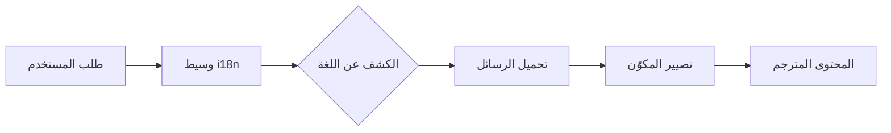

# نظرة عامة على التدويل

صُمِّم Ever Works مع مراعاة التدويل، ويدعم لغاتٍ متعددةً عبر `next-intl`.

## 🌍 اللغات المدعومة

يتضمن القالب دعماً مدمجاً لـ:

- 🇬🇧 **الإنجليزية** (en) – اللغة الافتراضية
- 🇫🇷 **الفرنسية** (fr)
- 🇪🇸 **الإسبانية** (es)
- 🇩🇪 **الألمانية** (de)
- 🇨🇳 **الصينية** (zh)
- 🇸🇦 **العربية** (ar)
- 🇧🇬 **البلغارية** (bg)
- 🇳🇱 **الهولندية** (nl)
- 🇮🇱 **العبرية** (he)
- 🇮🇹 **الإيطالية** (it)
- 🇵🇱 **البولندية** (pl)
- 🇵🇹 **البرتغالية** (pt)
- 🇷🇺 **الروسية** (ru)

## كيف يعمل

### التوطين القائم على عنوان URL

يستخدم Ever Works الكشف عن اللغة القائم على عنوان URL:

```
https://yoursite.com/en/about    → الإنجليزية
https://yoursite.com/fr/about    → الفرنسية
https://yoursite.com/es/about    → الإسبانية
```

### الكشف التلقائي عن اللغة

يقوم النظام تلقائياً بـ:
1. الكشف عن لغة متصفح المستخدم
2. إعادة التوجيه إلى إعداد اللغة المناسب
3. تذكّر تفضيلات اللغة للمستخدم
4. الرجوع إلى اللغة الافتراضية (الإنجليزية)

## بنية الترجمة



## ملفات الترجمة

تُخزَّن الترجمات في ملفات JSON:

```
messages/
├── en.json    # الإنجليزية
├── fr.json    # الفرنسية
├── es.json    # الإسبانية
├── de.json    # الألمانية
├── zh.json    # الصينية
└── ar.json    # العربية
```

## مثال سريع

```typescript
import { useTranslations } from 'next-intl';

export function MyComponent() {
  const t = useTranslations('common');

  return (
    <div>
      <h1>{t('welcome')}</h1>
      <p>{t('description')}</p>
    </div>
  );
}
```

## الميزات

### ✅ تغطية ترجمة شاملة
- مكوّنات واجهة المستخدم
- تسميات النماذج ورسائل التحقق
- قوالب البريد الإلكتروني
- رسائل الخطأ
- بيانات SEO التعريفية

### ✅ دعم RTL
- تخطيط RTL تلقائي للعربية والعبرية
- انعكاس عناصر واجهة المستخدم
- محاذاة النص الصحيحة

### ✅ تنسيق التواريخ والأرقام
- تنسيقات تواريخ خاصة بكل لغة
- تنسيق العملة
- تنسيق الأرقام

### ✅ صيغة الجمع
- صيغ جمع تلقائية
- قواعد خاصة بكل لغة

## الخطوات التالية

- [دليل الترجمة ←](./translation-guide) – اعرف كيفية إضافة الترجمات وإدارتها
- [البدء](/getting-started) – إعداد مشروعك
- [التخصيص](/guides/customization) – تخصيص موقعك

## تحتاج إلى مساعدة؟

قم بزيارة [صفحة الدعم](/advanced-guide/support) للحصول على مساعدة في التدويل.
