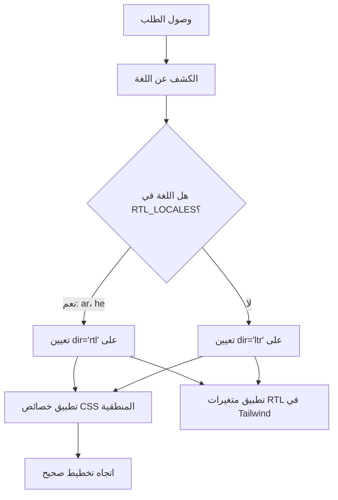

# دعم RTL (من اليمين إلى اليسار)

يوفر القالب دعماً كاملاً للغات ذات اتجاه النص من اليمين إلى اليسار (RTL)، كالعربية والعبرية. توثّق هذه الصفحة كيفية عمل اكتشاف RTL، وتطبيق اتجاه التخطيط، وتكييف المكوّنات مع سياقات RTL.

## نظرة عامة على البنية المعمارية



## الملفات المصدرية

| الملف | الغرض |
|------|---------|
| `lib/constants.ts` | تعريف قائمة لغات RTL |
| `app/layout.tsx` | التخطيط الجذري مع سمة `dir` |
| `components/language-switcher.tsx` | خريطة اللغات مع بيانات `isRTL` الوصفية |

## إعداد لغات RTL

```typescript
export const RTL_LOCALES: readonly Locale[] = ['ar', 'he'] as const;
```

## كيف يُطبَّق الاتجاه

### الاكتشاف في التخطيط الجذري

```typescript
export default async function RootLayout({ children }) {
  const locale = await getLocale();
  const dir = RTL_LOCALES.includes(locale as Locale) ? 'rtl' : 'ltr';

  return (
    <html lang={locale} dir={dir} suppressHydrationWarning>
      <body className={`${getFontClassNames(locale)} antialiased`}>
        {children}
      </body>
    </html>
  );
}
```

## استراتيجيات CSS لدعم RTL

### 1. الخصائص المنطقية في CSS

| الخاصية الفيزيائية | الخاصية المنطقية | قيمة LTR | قيمة RTL |
|-------------------|-----------------|-------------|-------------|
| `margin-left` | `margin-inline-start` | هامش أيسر | هامش أيمن |
| `margin-right` | `margin-inline-end` | هامش أيمن | هامش أيسر |
| `padding-left` | `padding-inline-start` | حشو أيسر | حشو أيمن |
| `text-align: left` | `text-align: start` | محاذاة يسرى | محاذاة يمنى |
| `left` | `inset-inline-start` | موضع أيسر | موضع أيمن |

### 2. دعم RTL في Tailwind CSS

```html
<div class="ml-4 rtl:mr-4 rtl:ml-0">
  محتوى بهامش مدرك للاتجاه
</div>

<svg class="rtl:rotate-180">
  <path d="M1 9 4-4-4-4" />
</svg>
```

### 3. أدوات Tailwind المنطقية

```html
<div class="ps-4">  <!-- padding-inline-start: 1rem -->
<div class="pe-4">  <!-- padding-inline-end: 1rem -->
<div class="ms-4">  <!-- margin-inline-start: 1rem -->
<div class="me-4">  <!-- margin-inline-end: 1rem -->
```

## مشكلات RTL الشائعة

| المشكلة | السبب | الحل |
|-------|-------|-----|
| محاذاة النص خاطئة | استخدام `text-left` بدلاً من `text-start` | استخدام الخصائص المنطقية |
| الأيقونات غير معكوسة | غياب `rtl:rotate-180` على الأيقونات الاتجاهية | إضافة متغير RTL |
| الهامش في الجانب الخاطئ | استخدام `ml-*` بدلاً من `ms-*` | استخدام أدوات Tailwind المنطقية |

## إضافة لغة RTL جديدة

1. **أضف اللغة** إلى `LOCALES` في `lib/constants.ts`
2. **أضفها إلى `RTL_LOCALES`**
3. **أنشئ ملف رسائل** `messages/ur.json`
4. **أضف إدخالاً في خريطة اللغات** في `components/language-switcher.tsx`
5. **أضف SVG للعلم** في `public/flags/ur.svg`
6. **اختبر التخطيط بعناية** في وضع RTL

## أفضل الممارسات

1. **تفضيل خصائص CSS المنطقية** على الخصائص الفيزيائية
2. **استخدام `dir="rtl"` على `<html>`** (يُعالَج بالفعل في التخطيط الجذري)
3. **الاختبار بمحتوى عربي/عبري حقيقي**، وليس بمحتوى إنجليزي في وضع RTL
4. **عدم عكس الصور الزخرفية** أو شعارات العلامة التجارية
