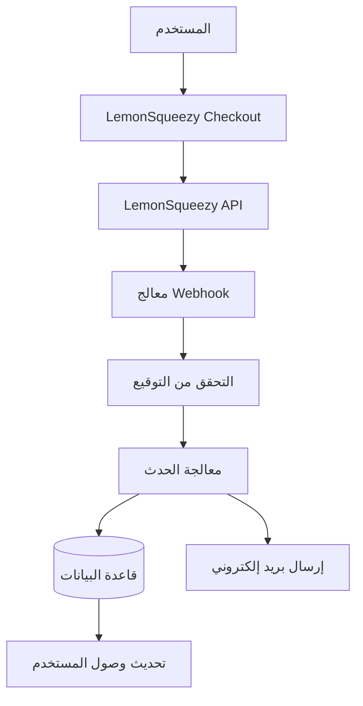

# تكوين LemonSqueezy

يشرح هذا الدليل كيفية تكوين LemonSqueezy كمزود دفع في تطبيق Ever Works.

## نظرة عامة

LemonSqueezy هي منصة merchant of record تبسّط:

- 💰 المدفوعات العالمية مع الامتثال الضريبي التلقائي
- 🌍 الدعم لأكثر من 135 دولة
- 📊 الحماية المدمجة من الاحتيال
- 🔄 إدارة الاشتراكات
- 💳 طرق دفع متعددة
- 📧 إيصالات البريد الإلكتروني الآلية

:::tip لماذا LemonSqueezy؟
تعمل LemonSqueezy كـ merchant of record، وتتعامل تلقائياً مع جميع متطلبات الامتثال الضريبي وضريبة القيمة المضافة وضريبة المبيعات. هذا يعني أنك لن تحتاج إلى التسجيل للضرائب في دول مختلفة.
:::

## متغيرات البيئة المطلوبة

أضف هذه المتغيرات إلى ملف `.env.local` الخاص بك:

```env
# تكوين LemonSqueezy
LEMONSQUEEZY_API_KEY=your_api_key_here
LEMONSQUEEZY_WEBHOOK_SECRET=your_webhook_secret_here
LEMONSQUEEZY_STORE_ID=your_store_id_here

# معرّف المنتج/المتغيّر (اختياري)
NEXT_PUBLIC_LEMONSQUEEZY_PRO_VARIANT_ID=variant_id_here
NEXT_PUBLIC_LEMONSQUEEZY_SPONSOR_VARIANT_ID=variant_id_here
```

## إعداد لوحة تحكم LemonSqueezy

### الخطوة 1: إنشاء متجرك

1. سجّل في [LemonSqueezy](https://lemonsqueezy.com)
2. أنشئ متجراً جديداً
3. أكمل إعدادات المتجر (الاسم والعملة وما إلى ذلك)
4. انسخ **معرّف المتجر** من عنوان URL أو الإعدادات

### الخطوة 2: إنشاء المنتجات

1. انتقل إلى **المنتجات** → **منتج جديد**
2. أنشئ مستويات التسعير الخاصة بك:

| المنتج | السعر | النوع | الوصف |
|--------|-------|-------|-------|
| **خطة Pro** | 10$/شهر | اشتراك | ميزات متقدمة |
| **خطة الداعم** | 20$ | لمرة واحدة | دعم متميز |

3. لكل منتج، أنشئ **متغيّرات** بأسعار محددة
4. انسخ **معرّف المتغيّر** لكل خيار تسعير

### الخطوة 3: الحصول على مفتاح API

1. انتقل إلى **الإعدادات** → **API**
2. أنشئ مفتاح API جديداً
3. انسخ مفتاح API (يبدأ بـ `ls_`)
4. أضفه إلى `.env.local` كـ `LEMONSQUEEZY_API_KEY`

### الخطوة 4: تكوين Webhooks

1. انتقل إلى **الإعدادات** → **Webhooks**
2. انقر على **إنشاء Webhook**
3. تكوين الـ webhook:
   - **URL**: `https://نطاقك.com/api/lemonsqueezy/webhook`
   - **الأحداث**: حدد جميع أحداث الاشتراك والطلب
   - **السر**: أنشئ مفتاحاً سرياً

4. انسخ **سر Webhook** وأضفه إلى `.env.local`

#### الأحداث الموصى بها

حدد هذه الأحداث في تكوين الـ webhook:

- ✅ `subscription_created` - اشتراك جديد
- ✅ `subscription_updated` - تغييرات الاشتراك
- ✅ `subscription_cancelled` - الإلغاء
- ✅ `subscription_payment_success` - دفع ناجح
- ✅ `subscription_payment_failed` - فشل الدفع
- ✅ `subscription_trial_will_end` - انتهاء الفترة التجريبية
- ✅ `order_created` - شراء لمرة واحدة
- ✅ `order_refunded` - تمت معالجة الاسترداد

## نقطة نهاية Webhook

الـ Webhook متاح على: `/api/lemonsqueezy/webhook`

### تعيين الأحداث المدعومة

| حدث LemonSqueezy | الحدث الداخلي | الوصف |
|------------------|--------------|-------|
| `subscription_created` | `SUBSCRIPTION_CREATED` | تم إنشاء اشتراك جديد |
| `subscription_updated` | `SUBSCRIPTION_UPDATED` | تم تحديث الاشتراك |
| `subscription_cancelled` | `SUBSCRIPTION_CANCELLED` | تم إلغاء الاشتراك |
| `subscription_payment_success` | `SUBSCRIPTION_PAYMENT_SUCCEEDED` | الدفع ناجح |
| `subscription_payment_failed` | `SUBSCRIPTION_PAYMENT_FAILED` | فشل الدفع |
| `subscription_trial_will_end` | `SUBSCRIPTION_TRIAL_ENDING` | الفترة التجريبية تنتهي قريباً |
| `order_created` | `PAYMENT_SUCCEEDED` | دفع لمرة واحدة |
| `order_refunded` | `REFUND_SUCCEEDED` | تمت معالجة الاسترداد |

## التنفيذ

### هندسة نظام الدفع



### الميزات

#### الأمان

- ✅ التحقق من توقيع HMAC (SHA-256)
- ✅ التحقق من سر الـ webhook
- ✅ معالجة شاملة للأخطاء
- ✅ تسجيل الطلبات

#### الوظائف

- ✅ إدارة دورة حياة الاشتراك
- ✅ معالجة المدفوعات الآلية
- ✅ إشعارات البريد الإلكتروني
- ✅ مزامنة قاعدة البيانات
- ✅ مراقبة الأخطاء

## مثال الاستخدام

### إنشاء Checkout

```typescript
import { LemonSqueezyProvider } from '@/lib/payment/providers/lemonsqueezy-provider';

const lsProvider = new LemonSqueezyProvider({
  apiKey: process.env.LEMONSQUEEZY_API_KEY!,
  storeId: process.env.LEMONSQUEEZY_STORE_ID!,
});

// إنشاء جلسة checkout
const checkout = await lsProvider.createCheckout({
  variantId: 'variant_id_here',
  customerId: 'customer_id',
  redirectUrl: 'https://yoursite.com/success',
});

// إعادة توجيه المستخدم إلى checkout.url
```

## الاختبار

### وضع الاختبار

1. توفر LemonSqueezy وضع اختبار للتطوير
2. استخدم مفاتيح API للاختبار (متوفرة في لوحة التحكم)
3. اختبر webhooks باستخدام أداة اختبار webhooks الخاصة بـ LemonSqueezy

### الاختبار المحلي

```bash
# استخدم أداة مثل ngrok لعرض الخادم المحلي
ngrok http 3000

# حدّث URL الـ webhook في لوحة تحكم LemonSqueezy
https://your-ngrok-url.ngrok.io/api/lemonsqueezy/webhook
```

## المراقبة

يتم تسجيل جميع أحداث webhook:

- ✅ **النجاح**: `✅ LemonSqueezy [event] handled successfully`
- ❌ **الأخطاء**: `❌ Failed to handle [event]: [error details]`

تحقق من سجلات التطبيق لمراقبة نشاط webhook.

## استكشاف الأخطاء وإصلاحها

### المشكلات الشائعة

**المشكلة**: خطأ "No signature provided"

- **الحل**: تأكد من أن LemonSqueezy يرسل رأس `x-signature`
- تحقق من تكوين webhook في لوحة تحكم LemonSqueezy

**المشكلة**: خطأ "Invalid signature"

- **الحل**: تحقق من أن `LEMONSQUEEZY_WEBHOOK_SECRET` يتطابق مع السر في LemonSqueezy
- تأكد من تكوين URL الـ webhook بشكل صحيح

**المشكلة**: Webhook لا يستقبل الأحداث

- **الحل**: تأكد من أن URL الـ webhook يمكن الوصول إليه عامةً
- استخدم ngrok للاختبار المحلي
- تحقق من سجلات webhooks في LemonSqueezy

## أفضل ممارسات الأمان

1. **HTTPS فقط**: دائماً استخدم HTTPS لنقاط نهاية webhook في الإنتاج
2. **تدوير الأسرار**: قم بتدوير أسرار webhook بانتظام
3. **المراقبة**: راقب سجلات webhook للنشاط المشبوه
4. **متغيرات البيئة**: لا تُلتزم أبداً بالأسرار في التحكم بالإصدار
5. **تحديد المعدل**: طبّق تحديد المعدل لـ webhooks الإنتاج
