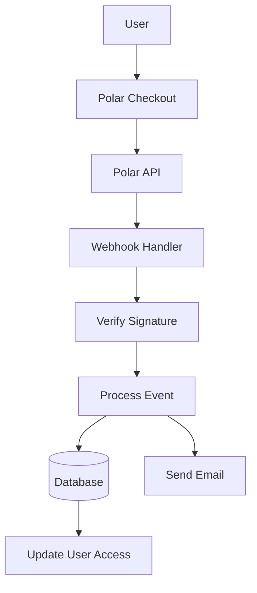

#التكوين القطبي

يشرح هذا الدليل كيفية تكوين Polar كموفر للدفع في تطبيق Ever Works الخاص بك.

## نظرة عامة

Polar عبارة عن منصة دفع حديثة مصممة للمطورين والمبدعين وتقدم:

- 💻 واجهة برمجة تطبيقات ووثائق صديقة للمطورين
- 🔄 دعم الاشتراك والدفع لمرة واحدة
- 🐙 تكامل GitHub للرعايات
- 💰 هيكل تسعير شفاف
- 🔒 معالجة الدفع الآمنة
- 📊 التحليلات وإعداد التقارير المدمجة

:::تلميح لماذا القطبية؟
تم تصميم Polar خصيصًا للمطورين والمشاريع مفتوحة المصدر، حيث تقدم واجهة برمجة تطبيقات نظيفة ووثائق ممتازة وتكامل GitHub السلس للرعايات وتحقيق الدخل.
:::

## متغيرات البيئة المطلوبة

أضف هذه المتغيرات إلى ملفك `.env.local` :

```env
# Polar Configuration
POLAR_API_KEY=your_polar_api_key_here
POLAR_WEBHOOK_SECRET=your_webhook_secret_here
POLAR_APP_URL=https://your-app-url.com

# Product IDs (optional)
NEXT_PUBLIC_POLAR_SUBSCRIPTION_PRODUCT_ID=product_id_here
NEXT_PUBLIC_POLAR_ONETIME_PRODUCT_ID=product_id_here
```

:::warning
لا تلتزم مطلقًا بمفاتيحك السرية للتحكم في الإصدار. احتفظ بـ 0 في ملف 1 الخاص بك.
:::

## إعداد لوحة القيادة القطبية

### الخطوة 1: قم بإنشاء حسابك

1. قم بالتسجيل في [Polar](https://polar.sh)
2. أكمل إعداد حسابك
3. تحقق من عنوان بريدك الإلكتروني

### الخطوة الثانية: إنشاء المنتجات

1. انتقل إلى **المنتجات** → **منتج جديد**
2. قم بإنشاء مستويات التسعير الخاصة بك:

| المنتج | السعر | اكتب | الوصف |
|---------|------|------|-------------|
| ** الخطة الاحترافية ** | 10 دولارات شهريًا | الاشتراك | الميزات المتقدمة |
| **خطة الراعي** | 20 دولارًا | لمرة واحدة | دعم مميز |

3. تكوين إعدادات المنتج:
   - تحديد دورة التسعير والفوترة
   - إضافة أوصاف المنتج
   - تكوين مستويات الوصول
4. انسخ **معرف المنتج** لكل منتج

### الخطوة 3: احصل على مفتاح API

1. انتقل إلى **الإعدادات** → **مفاتيح واجهة برمجة التطبيقات**
2. قم بإنشاء مفتاح API جديد
3. انسخ مفتاح API
4. أضفه إلى "2" الخاص بك كـ "3".

:::tip
يوفر Polar مفاتيح منفصلة للتطوير والإنتاج. استخدم مفاتيح الاختبار أثناء التطوير.
:::

### الخطوة 4: تكوين خطافات الويب

1. انتقل إلى **الإعدادات** → **الخطافات عبر الويب**
2. انقر **إنشاء خطاف ويب**
3. تكوين خطاف الويب:
   - **عنوان URL**: 4
   - **الأحداث**: حدد جميع أحداث الدفع والاشتراك
   - **سر**: قم بإنشاء مفتاح سري

4. انسخ **سر خطاف الويب** وأضفه إلى 5

#### الأحداث الموصى بها

حدد هذه الأحداث في تكوين webhook الخاص بك:

- ✅ `payment.succeeded` - الدفع بنجاح
- ✅ `payment.failed` - فشل الدفع
- ✅ `subscription.created` - اشتراك جديد
- ✅ `subscription.updated` - تغييرات الاشتراك
- ✅ `subscription.cancelled` - الإلغاء
- ✅ `subscription.trial_will_end` - انتهاء المحاكمة
- ✅ `refund.created` - تمت معالجة عملية استرداد الأموال

## هندسة نظام الدفع



### المزود القطبي

يقوم الموفر القطبي ( `lib/payment/lib/providers/polar-provider.ts` ) بتنفيذ ما يلي:

- ✅ إدارة العملاء
- ✅ إدارة المنتجات والأسعار
- ✅ دورة حياة الاشتراك
- ✅ معالجة الدفع
- ✅ التعامل مع Webhook
- ✅ دعم استرداد الأموال

### مسارات واجهة برمجة التطبيقات

تتوفر طرق واجهة برمجة التطبيقات التالية:

| الطريق | الطريقة | الوصف |
|-------|--------|-------------|
| `/api/polar/webhook` | مشاركة | التعامل مع خطافات الويب القطبية |
| `/api/polar/subscription` | مشاركة | إنشاء اشتراك |
| `/api/polar/subscription` | ضع | تحديث الاشتراك |
| 4ـ | حذف | الغاء الاشتراك |
| 5 ــ | مشاركة | إنشاء جلسة الخروج |
| 6ـ | احصل على | التحقق من حالة الدفع |

### مكونات واجهة المستخدم

يستخدم النظام مكونات الخروج الخاصة بـ Polar:

- `PolarCheckoutButton` - مكون زر الخروج
- `PolarPaymentForm` - نموذج الدفع مع التحقق من صحته
- تصميم مستجيب للجوال وسطح المكتب
- دعم طرق الدفع المتعددة

## أمثلة الاستخدام

### إنشاء اشتراك

```typescript
import { PolarProvider } from '@/lib/payment/providers/polar-provider';

const configs = createProviderConfigs({
  apiKey: process.env.POLAR_API_KEY!,
  webhookSecret: process.env.POLAR_WEBHOOK_SECRET!,
  options: {
    appUrl: process.env.POLAR_APP_URL!
  }
});

const polarProvider = new PolarProvider(configs.polar);

const subscription = await polarProvider.createSubscription({
  customerId: 'customer_id',
  productId: 'product_id',
  paymentMethodId: 'payment_method_id',
  trialPeriodDays: 7
});
```

### إنشاء جلسة الدفع

```typescript
const checkout = await polarProvider.createCheckout({
  productId: 'product_id_here',
  customerId: 'customer_id',
  successUrl: 'https://yoursite.com/success',
  cancelUrl: 'https://yoursite.com/cancel'
});

// Redirect user to checkout.url
```

### استخدم مكون الدفع

```tsx
import { PolarCheckoutButton } from '@/lib/payment';

function PaymentPage() {
  return (
    <PolarCheckoutButton
      productId="product_id_here"
      amount={1000} // 10.00 USD in cents
      currency="usd"
      isSubscription={true}
      onSuccess={(paymentId) => {
        console.log('Payment succeeded:', paymentId);
        // Redirect to success page or update UI
      }}
      onError={(error) => {
        console.error('Payment error:', error);
        // Show error message to user
      }}
    />
  );
}
```

## اختبار التكامل الخاص بك

### وضع الاختبار

1. **استخدم مفاتيح اختبار واجهة برمجة التطبيقات** (متوفرة في لوحة القيادة القطبية)
2. **استخدم طرق الدفع التجريبية**:
   - بطاقات الاختبار المتوفرة في لوحة القيادة القطبية
   - وضع الاختبار لجميع تدفقات الدفع

3. **اختبر خطافات الويب محليًا** باستخدام أداة مثل ngrok:

   ``` باش
   نجروك http3000
   ```

   قم بتحديث عنوان URL الخاص بخطاف الويب في لوحة القيادة القطبية إلى عنوان URL الخاص بـ ngrok.

### اختبار خطاف الويب

```bash
# Use ngrok to expose your local server
ngrok http 3000

# Update webhook URL in Polar dashboard
https://your-ngrok-url.ngrok.io/api/polar/webhook

# Trigger test events from Polar dashboard
```

## معالجة الأخطاء

يعالج النظام تلقائيًا الأخطاء الشائعة:

| نوع الخطأ | التعامل |
|------------|----------|
| تم رفض الدفع | رسالة خطأ سهلة الاستخدام |
| مشاكل الشبكة | منطق إعادة المحاولة التلقائي |
| فشل Webhook | تم تسجيله للمراجعة اليدوية |
| أخطاء التحقق | تسليط الضوء على حقل النموذج |
| أخطاء الاشتراك | مسح رسائل الخطأ |

## أفضل الممارسات الأمنية

1. **مفاتيح واجهة برمجة التطبيقات**:
   - لا تكشف مطلقًا عن المفاتيح السرية في التعليمات البرمجية من جانب العميل
   - استخدام متغيرات البيئة
   - تدوير المفاتيح بانتظام

2. **التحقق عبر الويب**:
   - التحقق دائمًا من توقيعات webhook
   - التحقق من صحة بيانات الحدث قبل المعالجة
   - استخدم HTTPS لجميع نقاط نهاية خطاف الويب

3. **بيانات الدفع**:
   - لا تقم أبدًا بتخزين تفاصيل الدفع
   - استخدم معالجة الدفع الآمنة لدى Polar
   - تنفيذ المصادقة الصحيحة

4. **جلسات المستخدم**:
   - التحقق من مصادقة المستخدم
   - التحقق من أذونات المستخدم
   - تسجيل كافة أنشطة الدفع

## التكامل مع جيثب

يقدم Polar تكاملًا سلسًا مع GitHub:

- **رعايات GitHub**: قم بتوصيل Polar مع رعاة GitHub
- **الوصول إلى المستودع**: منح الوصول بناءً على الاشتراكات
- **دعم المنظمة**: إدارة اشتراكات الفريق
- **الوصول الآلي**: إدارة الوصول التلقائي

### إعداد تكامل GitHub

1. انتقل إلى **الإعدادات** → **عمليات التكامل** → **GitHub**
2. قم بتوصيل حساب GitHub الخاص بك
3. تكوين قواعد الوصول إلى المستودع
4. قم بإعداد إدارة الوصول الآلي

## التبعيات

الحزم المطلوبة (المضمنة بالفعل في Ever Works):

```json
{
  "@polar-sh/sdk": "^1.0.0"
}
```

## استكشاف الأخطاء وإصلاحها

### القضايا الشائعة

**المشكلة**: Webhook لا يستقبل الأحداث

- **الحل**: التحقق من إمكانية الوصول إلى عنوان URL للخطاف على الويب بشكل عام
- استخدم ngrok للاختبار المحلي
- التحقق من صحة سر webhook

**المشكلة**: فشل الدفع بصمت

- **الحل**: تحقق من وحدة تحكم المتصفح بحثًا عن الأخطاء
- التحقق من صحة مفاتيح API
- التحقق من سجلات لوحة القيادة القطبية

**المشكلة**: عدم تحديث الاشتراك

- **الحل**: التحقق من تكوين أحداث webhook
- التحقق من سجلات معالج webhook
- التأكد من عمل تحديثات قاعدة البيانات

**المشكلة**: تكامل GitHub لا يعمل

- **الحل**: تحقق من اتصال GitHub في لوحة القيادة القطبية
- التحقق من إعدادات الوصول إلى المستودع
- التأكد من منح الأذونات المناسبة

## المقارنة: القطبية مقابل مقدمي الخدمات الآخرين

| ميزة | القطبية | شريط | ليمونسكويزي |
|---------|-------|-------|--------------|
| ** التركيز على المطورين ** | ✅ ممتاز | ⚠️ جيد | ⚠️ جيد |
| **تكامل جيثب** | ✅ أصلي | ❌ لا | ❌ لا |
| ** مفتوح المصدر ** | ✅ نعم | ⚠️ محدود | ⚠️ محدود |
| **تعقيد الإعداد** | ✅ بسيطة | ⚠️ معتدل | ✅ بسيطة |
| **جودة واجهة برمجة التطبيقات** | ✅ ممتاز | ✅ ممتاز | ⚠️ جيد |
| **الامتثال الضريبي** | ⚠️ دليل | ⚠️ دليل | ✅ اوتوماتيك |
| **الأفضل لـ** | المطورين، OSS | حجم كبير | المبيعات العالمية |

## الخطوات التالية

- [تكوين الشريط](./stripe) - مزود الدفع البديل
- [تكوين LemonSqueezy](./lemonsqueezy) - مزود الدفع البديل
- [نظرة عامة على الدفع](/الدفع) - قارن بين موفري خدمات الدفع
- [متغيرات البيئة](/deployment/environment-variables) - إعداد البيئة بالكامل
- [النشر](/deployment) - انشر تكامل الدفع الخاص بك

## الموارد

- [التوثيق القطبي](https://docs.polar.sh/)
- [مرجع واجهة برمجة التطبيقات](https://docs.polar.sh/api)
- [دليل الويب هوك](https://docs.polar.sh/webhooks)
- [تكامل جيثب](https://docs.polar.sh/integrations/github)

## الدعم

هل تحتاج إلى مساعدة في التكامل القطبي؟ قم بزيارة [صفحة الدعم] (/advanced-guide/support) أو انضم إلى مجتمعنا.
