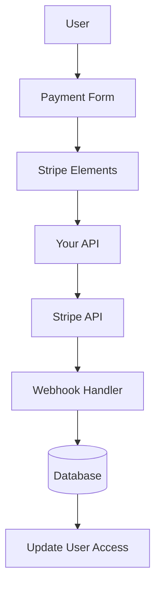

# تكوين الشريط

يشرح هذا الدليل كيفية تكوين Stripe في تطبيق Ever Works الخاص بك بنظام اشتراك ودفع كامل.

## نظرة عامة

Stripe عبارة عن منصة دفع شاملة تدعم:

- 💳 دفعات لمرة واحدة
- 🔄 الاشتراكات المتكررة
- 🌍 طرق دفع متعددة (بطاقات، Apple Pay، Google Pay)
- 💰 عملات متعددة
- 📊 التحليلات وإعداد التقارير المتقدمة

## متغيرات البيئة المطلوبة

أضف هذه المتغيرات إلى ملفك `.env.local` :

```bash
# Stripe Configuration
STRIPE_SECRET_KEY=sk_test_your_stripe_secret_key_here
STRIPE_WEBHOOK_SECRET=whsec_your_stripe_webhook_secret_here
NEXT_PUBLIC_STRIPE_PUBLISHABLE_KEY=pk_test_your_stripe_publishable_key_here

# Stripe Price IDs
NEXT_PUBLIC_STRIPE_SUBSCRIPTION_PRICE_ID=price_subscription_id_here
NEXT_PUBLIC_STRIPE_ONETIME_PRICE_ID=price_onetime_id_here
NEXT_PUBLIC_STRIPE_FREE_PRICE_ID=price_free_id_here

# Product Pricing (for display purposes)
NEXT_PUBLIC_PRODUCT_PRICE_PRO=10.00
NEXT_PUBLIC_PRODUCT_PRICE_SPONSOR=20.00
NEXT_PUBLIC_PRODUCT_PRICE_FREE=0.00
```

:::warning
لا تلتزم مطلقًا بمفاتيحك السرية للتحكم في الإصدار. احتفظ بـ 0 في ملف 1 الخاص بك.
:::

## تكوين لوحة القيادة الشريطية

### الخطوة 1: إنشاء المنتجات

في [Stripe Dashboard](https://dashboard.stripe.com/):

1. انتقل إلى **المنتجات** → **إضافة منتج**
2. إنشاء المنتجات التالية:

| المنتج | السعر | اكتب | الوصف |
|---------|------|------|-------------|
| **خطة مجانية** | 0.00 دولار | لمرة واحدة | الميزات الأساسية |
| ** الخطة الاحترافية ** | 10.00 دولار | الاشتراك الشهري | الميزات المتقدمة |
| **خطة الراعي** | 20.00 دولارًا | لمرة واحدة | دعم مميز |

3. انسخ **معرف السعر** لكل منتج (يبدأ بـ `price_` )

### الخطوة 2: تكوين خطافات الويب

تتيح Webhooks لـ Stripe إخطار تطبيقك بأحداث الدفع.

1. انتقل إلى **المطورين** → **خطافات الويب** → **إضافة نقطة نهاية**
2. قم بتعيين عنوان URL لنقطة النهاية:
   - التطوير: 3
   - الإنتاج: 4

3. حدد الأحداث للاستماع إليها:
   - 5
   - 6
   - 7
   - 8
   - 9
   - 10
   - 11
   - ١٢

4. انسخ **سر التوقيع** (يبدأ بـ `whsec_` )

### الخطوة 3: استرداد مفاتيح واجهة برمجة التطبيقات

في لوحة تحكم Stripe الخاصة بك:

1. **المفتاح السري**: **المطورون** → **مفاتيح واجهة برمجة التطبيقات** → **المفتاح السري** (يبدأ بـ `sk_` )
2. **المفتاح القابل للنشر**: **المطورون** → **مفاتيح واجهة برمجة التطبيقات** → **المفتاح القابل للنشر** (يبدأ بـ `pk_` )
3. **خطاف الويب السري**: **المطورون** → **خطافات الويب** → حدد خطاف الويب الخاص بك → **سر التوقيع**

:::tip
استخدم مفاتيح **وضع الاختبار** أثناء التطوير (تبدأ بـ 16 و17). قم بالتبديل إلى مفاتيح **الوضع المباشر** للإنتاج.
:::

## هندسة نظام الدفع



### مزود الشريط

ينفذ موفر الشريط ( `lib/payment/lib/providers/stripe-provider.ts` ):

- ✅ إدارة العملاء
- ✅ إنشاء نية الدفع
- ✅ إدارة الاشتراكات
- ✅ التعامل مع Webhook
- ✅ دعم نية الإعداد
- ✅ المبالغ المستردة والإلغاءات

### مسارات واجهة برمجة التطبيقات

تتوفر طرق واجهة برمجة التطبيقات التالية:

| الطريق | الطريقة | الوصف |
|-------|--------|-------------|
| `/api/stripe/webhook` | مشاركة | التعامل مع خطافات الويب الشريطية |
| `/api/stripe/subscription` | مشاركة | إنشاء اشتراك |
| `/api/stripe/subscription` | ضع | تحديث الاشتراك |
| 4ـ | حذف | الغاء الاشتراك |
| 5 ــ | مشاركة | إنشاء نية الدفع |
| 6ـ | احصل على | التحقق من الدفع |
| `/api/stripe/setup-intent` | مشاركة | إعداد طريقة الدفع |

### مكونات واجهة المستخدم

يستخدم النظام Stripe Elements لنماذج الدفع الآمنة:

- 8 - مكون الغلاف الرئيسي
- `StripePaymentForm` - نموذج الدفع مع التحقق من صحته
- دعم Apple Pay و Google Pay
- تصميم مستجيب للجوال وسطح المكتب

## أمثلة الاستخدام

### إنشاء اشتراك

```typescript
import { StripeProvider } from '@/lib/payment/providers/stripe-provider';

const configs = createProviderConfigs({
  apiKey: process.env.STRIPE_SECRET_KEY!,
  webhookSecret: process.env.STRIPE_WEBHOOK_SECRET!,
  options: {
    publishableKey: process.env.NEXT_PUBLIC_STRIPE_PUBLISHABLE_KEY!,
    apiVersion: '2023-10-16'
  }
});

const stripeProvider = new StripeProvider(configs.stripe);

const subscription = await stripeProvider.createSubscription({
  customerId: 'cus_customer_id',
  priceId: 'price_subscription_id',
  paymentMethodId: 'pm_payment_method_id',
  trialPeriodDays: 7
});
```

### استخدم مكون الدفع

```tsx
import { PaymentForm } from '@/lib/payment';

function PaymentPage() {
  return (
    <PaymentForm
      amount={1000} // 10.00 USD in cents
      currency="usd"
      isSubscription={true}
      onSuccess={(paymentId) => {
        console.log('Payment succeeded:', paymentId);
        // Redirect to success page or update UI
      }}
      onError={(error) => {
        console.error('Payment error:', error);
        // Show error message to user
      }}
    />
  );
}
```

## اختبار التكامل الخاص بك

### وضع الاختبار

1. **استخدم مفاتيح اختبار API** (ابدأ بـ `sk_test_` و `pk_test_` )
2. **استخدم أرقام بطاقة الاختبار**:
   - النجاح : 2
   - الرفض: 3
   - تأمين ثلاثي الأبعاد: 4

3. **اختبر خطافات الويب محليًا** باستخدام Stripe CLI:

   ``` باش
   شريط الاستماع - الأمام إلى المضيف المحلي:3000/api/stripe/webhook
   ```

### اختبار خطاف الويب

```bash
# Install Stripe CLI
brew install stripe/stripe-cli/stripe

# Login to your Stripe account
stripe login

# Forward webhooks to your local server
stripe listen --forward-to localhost:3000/api/stripe/webhook

# Trigger test events
stripe trigger payment_intent.succeeded
```

## معالجة الأخطاء

يعالج النظام تلقائيًا الأخطاء الشائعة:

| نوع الخطأ | التعامل |
|------------|----------|
| تم رفض البطاقة | رسالة خطأ سهلة الاستخدام |
| أموال غير كافية | أعد المحاولة باستخدام بطاقة مختلفة |
| مشاكل الشبكة | منطق إعادة المحاولة التلقائي |
| فشل Webhook | تم تسجيله للمراجعة اليدوية |
| أخطاء التحقق | تسليط الضوء على حقل النموذج |

## أفضل الممارسات الأمنية

1. **مفاتيح واجهة برمجة التطبيقات**:
   - لا تكشف مطلقًا عن المفاتيح السرية في التعليمات البرمجية من جانب العميل
   - استخدام متغيرات البيئة
   - تدوير المفاتيح بانتظام

2. **التحقق عبر الويب**:
   - التحقق دائمًا من توقيعات webhook
   - التحقق من صحة بيانات الحدث قبل المعالجة

3. **بيانات الدفع**:
   - لا تقم أبدًا بتخزين أرقام البطاقات
   - استخدم الرمز المميز لـ Stripe
   - تنفيذ الامتثال PCI

4. **جلسات المستخدم**:
   - التحقق من مصادقة المستخدم
   - التحقق من أذونات المستخدم
   - تسجيل كافة أنشطة الدفع

## التبعيات

الحزم المطلوبة (المضمنة بالفعل في Ever Works):

```json
{
  "@stripe/react-stripe-js": "^3.7.0",
  "@stripe/stripe-js": "^7.3.0",
  "stripe": "^18.1.0"
}
```

## استكشاف الأخطاء وإصلاحها

### القضايا الشائعة

**المشكلة**: Webhook لا يستقبل الأحداث

- **الحل**: التحقق من إمكانية الوصول إلى عنوان URL للخطاف على الويب بشكل عام
- استخدم Stripe CLI للاختبار المحلي
- التحقق من صحة سر webhook

**المشكلة**: فشل الدفع بصمت

- **الحل**: تحقق من وحدة تحكم المتصفح بحثًا عن الأخطاء
- التحقق من صحة مفاتيح API
- التحقق من سجلات لوحة القيادة الشريطية

**المشكلة**: خدمة الأمان ثلاثي الأبعاد لا تعمل

- **الحل**: تأكد من أنك تتعامل مع الحالة 0
- تنفيذ تدفق إعادة التوجيه المناسب
- الاختبار باستخدام بطاقات اختبار 3D Secure

## الخطوات التالية

- [تكوين LemonSqueezy](./lemonsqueezy) - مزود الدفع البديل
- [متغيرات البيئة](/deployment/environment-variables) - إعداد البيئة بالكامل
- [النشر](/deployment) - انشر تكامل الدفع الخاص بك

## الموارد

- [توثيق الشريط](https://stripe.com/docs)
- [دليل تكامل Next.js](https://stripe.com/docs/Payments/accept-a-Payment?platform=web&ui=elements)
- [إدارة الاشتراكات](https://stripe.com/docs/billing/subscriptions)
- [أحداث الويب هوك](https://stripe.com/docs/api/events/types)

## الدعم

هل تحتاج إلى مساعدة في تكامل Stripe؟ قم بزيارة [صفحة الدعم] (/advanced-guide/support) أو انضم إلى مجتمعنا.
