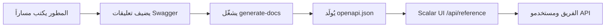

# تدريب على توثيق API

أتقِن نظام توثيق API الآلي باستخدام تعليقات Swagger وواجهة Scalar UI.

## 🎯 الأهداف التعليمية

بعد إتمام هذا الوحدة، ستتمكن من:

- ✅ فهم سير عمل توثيق API
- ✅ كتابة تعليقات Swagger صحيحة
- ✅ اتباع اتفاقيات العلامات المعيارية
- ✅ توليد التوثيق والتحقق منه
- ✅ استكشاف المشكلات الشائعة وحلها
- ✅ صيانة توثيق API عالي الجودة

**الوقت التقديري**: يومان إلى ثلاثة أيام

---

## لماذا هذا النظام؟

### المشكلات التي يحلها

- **توثيق غير متسق**: كان هناك 8 علامات Stripe مختلفة متناثرة عبر نقاط النهاية
- **مزامنة يدوية**: كان التوثيق يتأخر كثيراً عن الكود الفعلي
- **تجربة مطور سيئة**: واجهة Swagger UI أساسية بإمكانيات محدودة

### المزايا التي تحققت

- **مزامنة تلقائية**: يُولَّد التوثيق مباشرةً من التعليقات في الكود
- **واجهة حديثة**: Scalar UI مع اختبار تفاعلي وتجربة مستخدم أفضل
- **معايير موحدة**: نظام علامات موحد وقوالب توثيق

---

## بنية النظام

### المكوّنات الأساسية

1. **تعليقات Swagger في الكود**
   - تعليقات JSDoc مع وسم `@swagger`
   - تنسيق مواصفة OpenAPI 3.0
   - مضمّنة مباشرةً في ملفات المسارات

2. **سكريبت generate-docs**
   - يفحص جميع ملفات `app/api/**/route.ts`
   - يستخرج تعليقات Swagger ويتحقق منها
   - يُولِّد ملف `public/openapi.json` الموحَّد

3. **واجهة Scalar UI**
   - واجهة توثيق حديثة ومتجاوبة
   - اختبار API تفاعلي
   - متاحة على `/api/reference`

### سير العمل الكامل



---

## الأوامر الأساسية

```bash
yarn generate-docs
yarn docs:watch
yarn docs:validate
git status public/openapi.json
```

---

## نظام العلامات المعياري

### اتفاقيات العلامات

#### العمليات الإدارية

```yaml
"Admin - Users"        # إدارة المستخدمين
"Admin - Categories"   # إدارة الفئات
"Admin - Items"        # إدارة المحتوى
"Admin - Comments"     # إدارة التعليقات
```

#### وظائف التطبيق الأساسية

```yaml
"Authentication"       # الدخول والخروج وإعادة تعيين كلمة المرور
"Favorites"           # المفضلة للمستخدم
"Items & Content"     # تصفح المحتوى العام
```

#### أنظمة الدفع

```yaml
"Stripe - Core"              # الدفع، Payment Intent
"Stripe - Subscriptions"     # إدارة الاشتراكات
"LemonSqueezy - Core"        # جميع عمليات LemonSqueezy
```

---

## أفضل الممارسات

### كتابة أوصاف فعّالة

- استخدم أفعال الإجراء: "إنشاء"، "تحديث"، "حذف"، "استرجاع"
- كن محدداً: "استرجاع ملف المستخدم" وليس "استرجاع مستخدم"
- لا تتجاوز 50 حرفاً لضمان قابلية القراءة في الواجهة

### أمثلة واقعية

```yaml
# ❌ أمثلة سيئة
example: "string"

# ✅ أمثلة جيدة
example: "john.doe@company.com"
example: "user_123abc456def"
```

---

## قائمة التحقق للمطور

قبل تسليم تغييرات API:

- [ ] تمت إضافة تعليق Swagger أو تحديثه
- [ ] تم استخدام العلامة الصحيحة من النظام المعياري
- [ ] العنوان والوصف ذوا معنى
- [ ] جميع حقول جسم الطلب موثقة
- [ ] جميع رموز الاستجابة موثقة
- [ ] تم تشغيل `yarn generate-docs`
- [ ] تم التحقق من التوثيق على `/api/reference`
- [ ] `public/openapi.json` مضمَّن في الـ commit
