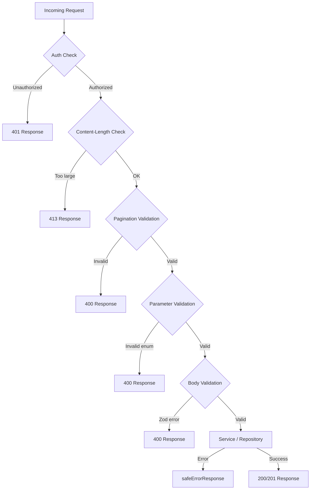

# API заявка за валидиране

Шаблонът валидира API заявки на множество слоеве: схеми на Zod за валидиране на тялото/заявката, помощни функции за страници и ограничения на размера на тялото и вградени предпазители на типа за параметри enum. Тази страница документира всеки механизъм за валидиране и как се използват в манипулатори на API маршрути.

## Архитектура за валидиране



## Схеми за валидиране на Zod

### Схема за местоположение (`lib/validations/item.ts`)

Всички полета не са задължителни; строгостта се контролира от настройките на ниво формуляр:

```typescript
export const locationSchema = z.object({
  address: z.string().optional(),
  city: z.string().optional(),
  state: z.string().optional(),
  country: z.string().optional(),
  postal_code: z.string().optional(),
  latitude: z.number()
    .min(-90, 'Latitude must be between -90 and 90')
    .max(90, 'Latitude must be between -90 and 90')
    .optional(),
  longitude: z.number()
    .min(-180, 'Longitude must be between -180 and 180')
    .max(180, 'Longitude must be between -180 and 180')
    .optional(),
  service_area: z.enum(['local', 'regional', 'national', 'global']).optional(),
  is_remote: z.boolean().optional(),
  geocoded_by: z.enum(['mapbox', 'google']).optional(),
}).optional();
```

### Схеми на клиентски артикул (`lib/validations/client-item.ts`)

#### Създаване на елемент

```typescript
export const clientCreateItemSchema = z.object({
  name: z.string()
    .min(ITEM_VALIDATION.NAME_MIN_LENGTH)
    .max(ITEM_VALIDATION.NAME_MAX_LENGTH),
  description: z.string()
    .min(ITEM_VALIDATION.DESCRIPTION_MIN_LENGTH)
    .max(ITEM_VALIDATION.DESCRIPTION_MAX_LENGTH),
  source_url: z.string().url('Invalid URL format'),
  category: z.union([
    z.string().min(1, 'Category is required'),
    z.array(z.string().min(1)).min(1),
  ]).optional().nullable(),
  tags: z.array(z.string().min(1)).optional().default([]),
  icon_url: z.string().url().optional().or(z.literal('')),
  location: locationSchema,
});
```

#### Актуализиране на елемент

Използва същите дефиниции на полета, като всички полета са незадължителни:

```typescript
export const clientUpdateItemSchema = z.object({
  name: z.string().min(...).max(...).optional(),
  description: z.string().min(...).max(...).optional(),
  source_url: z.string().url().optional(),
  category: z.union([z.string(), z.array(z.string())]).optional(),
  tags: z.array(z.string()).optional(),
  icon_url: z.string().url().optional().or(z.literal('')),
  location: locationSchema,
});
```

#### Списък на параметрите на заявката

Параметрите на заявката използват `.transform()` за преобразуване на въведените низове във въведени стойности:

```typescript
export const clientItemsListQuerySchema = z.object({
  page: z.string().optional()
    .transform(val => (val ? parseInt(val, 10) : 1))
    .refine(val => !Number.isNaN(val))
    .refine(val => val >= 1),
  limit: z.string().optional()
    .transform(val => (val ? parseInt(val, 10) : 10))
    .refine(val => !Number.isNaN(val))
    .refine(val => val >= 1 && val <= 100),
  status: z.enum(['all', 'pending', 'approved', 'rejected']).optional().default('all'),
  search: z.string().max(100).optional(),
  sortBy: z.enum(['name', 'updated_at', 'status', 'submitted_at']).optional().default('updated_at'),
  sortOrder: z.enum(['asc', 'desc']).optional().default('desc'),
  deleted: z.string().optional().transform(val => val === 'true'),
});
```

### Схема на парола (`lib/validations/auth.ts`)

```typescript
export const passwordSchema = z.string()
  .min(8, "Password must be at least 8 characters")
  .regex(/[A-Z]/, "Must contain at least one uppercase letter")
  .regex(/[a-z]/, "Must contain at least one lowercase letter")
  .regex(/[0-9]/, "Must contain at least one number")
  .regex(/[^A-Za-z0-9]/, "Must contain at least one special character");
```

### Фирмени схеми (`lib/validations/company.ts`)

```typescript
export const createCompanySchema = z.object({
  name: z.string().min(1).max(255),
  website: z.string().url().optional().or(z.literal("")),
  domain: z.string().max(255).optional()
    .transform(val => val?.toLowerCase().trim() || undefined),
  slug: z.string().max(255).optional()
    .transform(val => val?.toLowerCase().trim() || undefined)
    .refine(val => !val || /^[a-z0-9-]+$/.test(val)),
  status: z.enum(["active", "inactive"]).default("active"),
});
```

### Изведени типове

Всички схеми експортират изведени от Zod типове заедно със схемата:

```typescript
export type ClientUpdateItemInput = z.infer<typeof clientUpdateItemSchema>;
export type ClientCreateItemInput = z.infer<typeof clientCreateItemSchema>;
export type CreateCompanyInput = z.infer<typeof createCompanySchema>;
```

## Валидиране на пагинация (`lib/utils/pagination-validation.ts`)

Споделена помощна програма за валидиране на `page` и `limit` параметри на заявката:

```typescript
export function validatePaginationParams(
  searchParams: URLSearchParams
): PaginationParams | PaginationError {
  const page = pageParam ? parseInt(pageParam, 10) : 1;
  const limit = limitParam ? parseInt(limitParam, 10) : 10;

  if (isNaN(page) || page < 1) {
    return { error: 'Invalid page parameter. Must be a positive integer.', status: 400 };
  }
  if (isNaN(limit) || limit < 1 || limit > 100) {
    return { error: 'Invalid limit parameter. Must be between 1 and 100.', status: 400 };
  }
  return { page, limit };
}
```

Използването в манипулатори на маршрути следва дискриминиран модел на обединение:

```typescript
const paginationResult = validatePaginationParams(searchParams);
if ('error' in paginationResult) {
  return NextResponse.json(
    { success: false, error: paginationResult.error },
    { status: paginationResult.status }
  );
}
const { page, limit } = paginationResult;
```

## Заявка за ограничения на размера на тялото (`lib/utils/request-body.ts`)

### `readBodyWithLimit`

Чете тялото на заявката чрез `ReadableStream` с инкрементална проверка на размера:

```typescript
export async function readBodyWithLimit<T = unknown>(
  request: NextRequest,
  options: ReadBodyOptions
): Promise<ReadBodyResult<T>>
```

Характеристики:
- Бърз път: първо проверява заглавката `Content-Length`
- Инкрементално: чете парчета поток и проверява размера при пристигането на байтове
- Анулиране: извиква `reader.cancel()`, когато лимитът е надвишен
- Анализ на JSON: по избор, грациозно обработва `SyntaxError`

```typescript
// Usage
const { data } = await readBodyWithLimit(request, { maxSize: 1024 });
```

### `validateContentLength`

Ранно отхвърляне без четене на тялото:

```typescript
export function validateContentLength(request: NextRequest, maxSize: number): boolean
```

Изхвърля `BodySizeLimitError`, ако заглавката `Content-Length` надвишава ограничението.

### `BodySizeLimitError`

Персонализиран клас на грешка със свойства `maxSize` и `actualSize`:

```typescript
export class BodySizeLimitError extends Error {
  constructor(
    public readonly maxSize: number,
    public readonly actualSize: number
  ) {
    super(`Request body too large. Maximum size is ${maxSize} bytes, received ${actualSize} bytes.`);
  }
}
```

## Вградено валидиране на параметри

За enum параметри, които не са обхванати от схемите на Zod, манипулаторите на маршрути използват предпазители от вграден тип:

```typescript
// Type-safe status validation
const validStatuses = ['draft', 'pending', 'approved', 'rejected'] as const;
type ItemStatus = (typeof validStatuses)[number];
const isItemStatus = (s: string): s is ItemStatus =>
  (validStatuses as readonly string[]).includes(s);

if (statusParam && !isItemStatus(statusParam)) {
  return NextResponse.json(
    { success: false, error: `Invalid status. Must be one of: ${validStatuses.join(', ')}` },
    { status: 400 }
  );
}
```

Този модел се повтаря за параметрите `sortBy` и `sortOrder`.

## Дезинфекция на въвеждане на търсене

Параметрите за търсене на текст се изрязват и нормализират:

```typescript
const searchRaw = searchParams.get('search');
const search = searchRaw?.trim() ? searchRaw.trim() : undefined;
```

CSV параметрите се анализират и нормализират:

```typescript
const parseCsv = (value: string | null): string[] | undefined => {
  if (!value) return undefined;
  const arr = value.split(',').map(v => v.trim()).filter(Boolean);
  return arr.length ? arr : undefined;
};
```

## Помощни програми за пагиниране (`lib/paginate.ts`)

Прости помощници за страниране за страниране на ниво шаблон:

```typescript
export const PER_PAGE = 12;

export function totalPages(size: number, perPage: number = PER_PAGE) {
  return Math.ceil(size / perPage);
}

export function paginateMeta(rawPage: number | string = 1, perPage: number = PER_PAGE) {
  const page = typeof rawPage === 'string' ? parseInt(rawPage) : rawPage;
  const start = (page - 1) * perPage;
  return { page, start };
}
```

## Резюме на слоя за валидиране

|Слой|Местоположение|Механизъм|Цел|
|-------|----------|-----------|---------|
|авт|Обработчик на маршрут|`session?.user?.isAdmin`|Ролеви достъп|
|Размер на тялото|`lib/utils/request-body.ts`|Четец на потоци|Предотвратете извънгабаритни полезни товари|
|Пагинация|`lib/utils/pagination-validation.ts`|Анализ на URLSearchParams|Проверка на страница/лимит|
|Enum параметри|Вграден манипулатор на маршрут|Тип охранителни функции|Проверка на състоянието, сортиране по и т.н.|
|Схема на тялото|`lib/validations/*.ts`|Зод схеми|Валидиране на структурирани входни данни|
|Търсене|Вграден манипулатор на маршрут|Изрязване + анализ на CSV|Саниране на входа|
