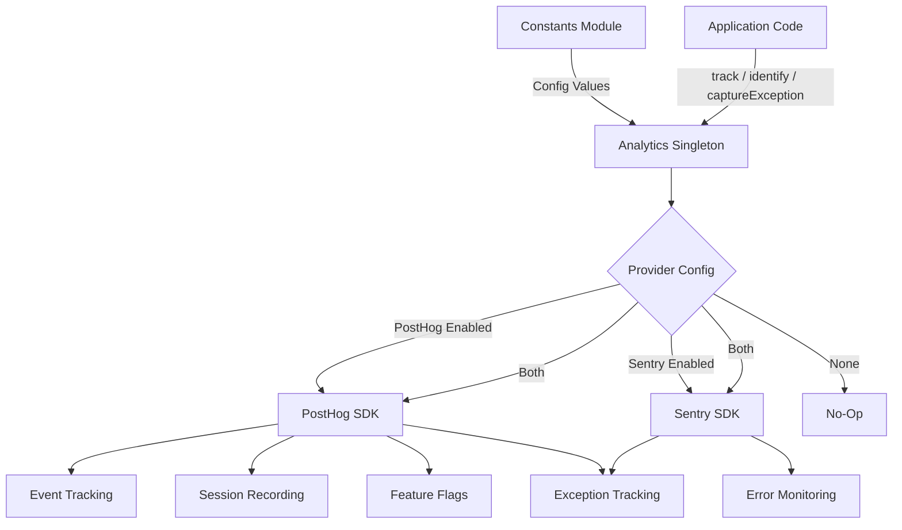
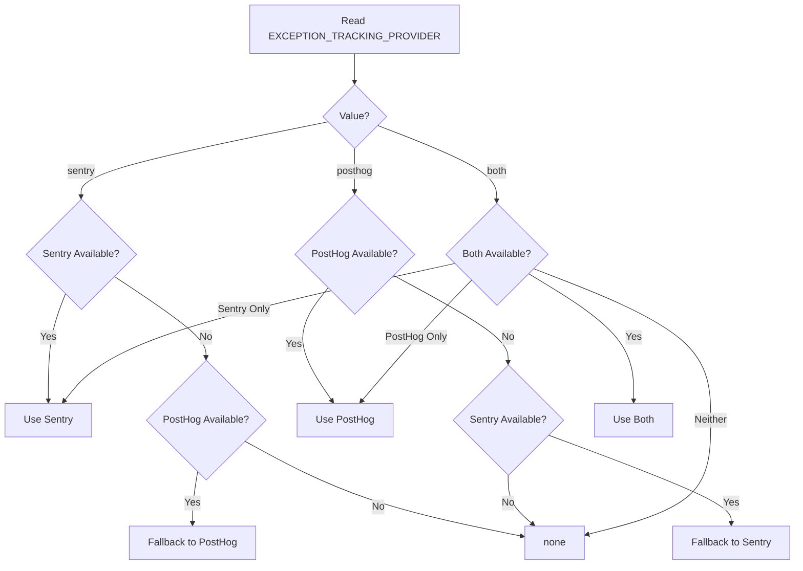

# Модул за анализ

Модулът за анализ (`template/lib/analytics/`) предоставя унифициран единичен клас за проследяване на събития от страна на клиента, идентификация на потребителя, оценка на флага на функцията и улавяне на изключения. Той интегрира **PostHog** за продуктов анализ и **Sentry** за наблюдение на грешки, с поддръжка за използване на всеки доставчик поотделно, и двата едновременно, или нито един от тях.

## Преглед на архитектурата



## Изходни файлове

|Файл|Описание|
|------|-------------|
|`lib/analytics/index.ts`|`Analytics` единичен клас и `analytics` експорт|

## Основен клас: `Analytics`

Класът `Analytics` е сингълтон, който обвива PostHog и Sentry. Безопасно е да се обадите от страната на сървъра -- всички методи се връщат тихо, когато `window` е недефиниран.

### Типови дефиниции

```typescript
type EventProperties = Properties;          // PostHog Properties type
type UserProperties = Record<string, any>;
type ExceptionTrackingProvider = 'sentry' | 'posthog' | 'both' | 'none';
```

### Единичен достъп

```typescript
// Get the singleton instance
const analytics = Analytics.getInstance();

// Or use the pre-created export
import { analytics } from '@/lib/analytics';
```

### `init(): void`

Инициализира PostHog с централизирана конфигурация и настройва проследяване на изключения. Трябва да се извика веднъж от страна на клиента (обикновено в основно оформление или компонент на доставчик).

```typescript
// In your root layout or PostHog provider
'use client';
import { analytics } from '@/lib/analytics';

useEffect(() => {
  analytics.init();
}, []);
```

**Поведение:**
- Пропуска инициализацията, ако вече е инициализирана или ако работи от страната на сървъра
- Чете конфигурация от константи (`POSTHOG_KEY`, `POSTHOG_HOST`, `POSTHOG_ENABLED` и др.)
- Конфигурира запис на сесия с маскиране, когато `POSTHOG_SESSION_RECORDING_ENABLED` е вярно
- Прилага честота на семплиране (`POSTHOG_SAMPLE_RATE`) -- в производството по подразбиране е 10%
- Настройва глобални манипулатори `window.onerror` и `unhandledrejection`, когато проследяването на изключение на PostHog е активирано
- Свързва PostHog със Sentry, когато и двата доставчика са активни

### `identify(userId: string, properties?: UserProperties): void`

Свързва текущия анонимен потребител с идентифициран потребителски идентификатор. Също така задава потребителския контекст на Sentry, когато Sentry е активиран.

```typescript
analytics.identify(session.user.id, {
  email: session.user.email,
  plan: 'premium',
});
```

### `reset(): void`

Нулира текущата потребителска идентичност (напр. при излизане). Изчиства потребителските контексти на PostHog и Sentry.

```typescript
analytics.reset();
```

### `track(eventName: string, properties?: EventProperties): void`

Улавя персонализирано събитие в PostHog.

```typescript
analytics.track('item_submitted', {
  itemId: 'abc-123',
  category: 'SaaS Tools',
});
```

### `trackPageView(url: string, properties?: EventProperties): void`

Ръчно заснема събитие за показване на страница. Използвайте, когато `POSTHOG_AUTO_CAPTURE` е деактивиран и се нуждаете от изрично проследяване на показванията на страници.

```typescript
analytics.trackPageView(window.location.href, {
  referrer: document.referrer,
});
```

### `isFeatureEnabled(flagKey: string, defaultValue?: boolean): boolean`

Оценява синхронно флаг на функция PostHog.

```typescript
const showNewUI = analytics.isFeatureEnabled('new-dashboard-ui', false);
```

### `reloadFeatureFlags(): Promise<void>`

Принуждава повторно извличане на флагове за функции от сървъра PostHog.

```typescript
await analytics.reloadFeatureFlags();
```

### `captureException(error: Error | string, context?: Record<string, any>): void`

Унифицирано проследяване на изключения, което се изпраща до конфигурирания доставчик(и).

```typescript
try {
  await riskyOperation();
} catch (error) {
  analytics.captureException(error, {
    component: 'PaymentForm',
    action: 'submit',
  });
}
```

**Маршрутизиране на доставчик:**
- `'posthog'` -- Изпраща `$exception` събитие до PostHog с проследяване на стека
- `'sentry'` -- Извиква `Sentry.captureException` с допълнителен контекст
- `'both'` -- Изпраща и до двата доставчика
- `'none'` -- Безшумно изхвърля

### `captureError(error: Error, context?: Record<string, any>): void`

**Отхвърлено.** Псевдоним за `captureException`. Записва предупреждение за оттегляне.

### `getExceptionTrackingProvider(): ExceptionTrackingProvider`

Връща текущия активен доставчик на проследяване на изключение.

### `setUserProperties(properties: UserProperties): void`

Задава постоянни потребителски свойства в потребителския профил на PostHog чрез `posthog.people.set()`.

```typescript
analytics.setUserProperties({
  subscription_tier: 'premium',
  company: 'Acme Corp',
});
```

### `setSuperProperties(properties: Record<string, any>): void`

Регистрира супер свойства, изпратени с всяко следващо събитие чрез `posthog.register()`.

```typescript
analytics.setSuperProperties({
  app_version: '2.1.0',
  environment: 'production',
});
```

## Константи за конфигурация

Цялата конфигурация на анализа се управлява от константи от `lib/constants.ts`:

|Константа|По подразбиране|Описание|
|----------|---------|-------------|
|`POSTHOG_KEY`|env var|API ключ на проект PostHog|
|`POSTHOG_HOST`|env var|URL адрес на хост на API на PostHog|
|`POSTHOG_ENABLED`|получени|Вярно, когато са зададени и ключ, и хост|
|`POSTHOG_DEBUG`|env var|Активиране на регистрирането на грешки в PostHog|
|`POSTHOG_SESSION_RECORDING_ENABLED`|`'true'`|Активиране на запис на сесия|
|`POSTHOG_AUTO_CAPTURE`|`'false'`|Автоматично заснемане на изгледи на страници|
|`POSTHOG_SAMPLE_RATE`|`0.1` (продукция) / `1.0` (dev)|Честота на семплиране на събития|
|`POSTHOG_SESSION_RECORDING_SAMPLE_RATE`|`0.1` (продукция) / `1.0` (dev)|Честота на семплиране на запис|
|`EXCEPTION_TRACKING_PROVIDER`|`'both'`|Кой доставчик обработва изключения|
|`SENTRY_ENABLED`|получени|Вярно, когато DSN е зададен и env позволява|

## Разрешение на доставчика на проследяване на изключение

Доставчикът се определя по време на изграждане с резервна логика:



## Използване с Next.js

Типична интеграция в проект за маршрутизатор на приложение Next.js:

```tsx
// app/providers.tsx
'use client';
import { useEffect } from 'react';
import { analytics } from '@/lib/analytics';
import { useSession } from 'next-auth/react';
import { usePathname } from 'next/navigation';

export function AnalyticsProvider({ children }: { children: React.ReactNode }) {
  const { data: session } = useSession();
  const pathname = usePathname();

  useEffect(() => {
    analytics.init();
  }, []);

  useEffect(() => {
    if (session?.user?.id) {
      analytics.identify(session.user.id, {
        email: session.user.email,
      });
    }
  }, [session]);

  useEffect(() => {
    analytics.trackPageView(pathname);
  }, [pathname]);

  return <>{children}</>;
}
```
