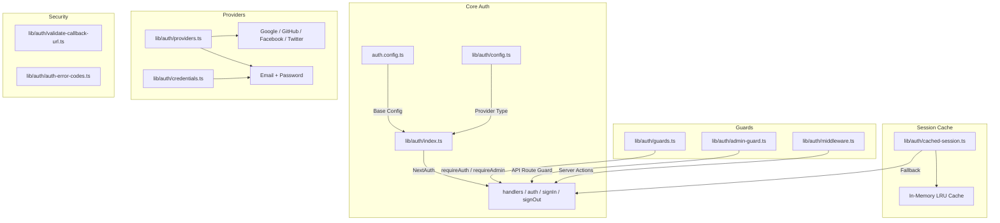
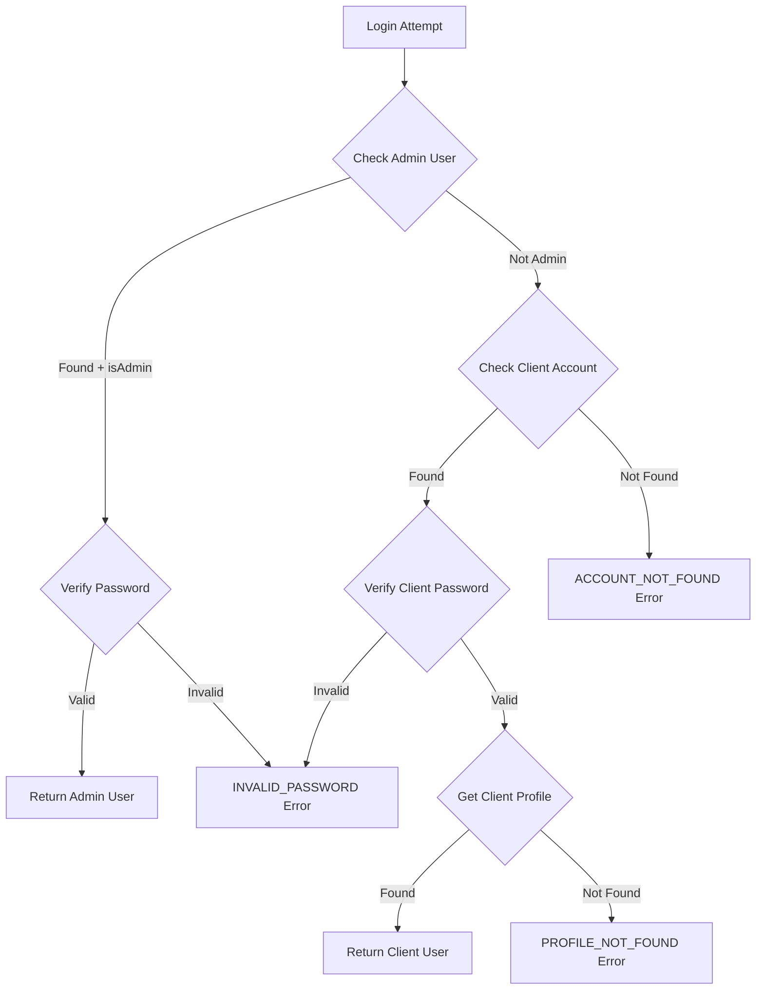

# Модул за помощни програми за удостоверяване

Модулът за помощни програми за удостоверяване (`template/lib/auth/`) предоставя цялостен слой за удостоверяване, изграден върху NextAuth.js (Auth.js) с поддръжка за множество доставчици, кеширане на сесии, защита от страна на сървъра, валидирани действия на сървъра и Supabase като алтернативен бекенд за удостоверяване.

## Преглед на архитектурата



## Изходни файлове

|Файл|Описание|
|------|-------------|
|`lib/auth/index.ts`|Конфигурация на NextAuth.js с адаптер Drizzle|
|`lib/auth/config.ts`|Конфигурация на типа доставчик на удостоверяване|
|`lib/auth/credentials.ts`|Доставчик на идентификационни данни за имейл/парола|
|`lib/auth/providers.ts`|Фабрика на доставчик на OAuth|
|`lib/auth/guards.ts`|Пазачи на страници от страна на сървъра|
|`lib/auth/admin-guard.ts`|Администратор на API маршрут|
|`lib/auth/middleware.ts`|Валидиран междинен софтуер за действие на сървъра|
|`lib/auth/cached-session.ts`|Слой за кеширане на сесии|
|`lib/auth/session-cache.ts`|Реализация на кеша|
|`lib/auth/validate-callback-url.ts`|Проверка на пренасочване на URL|
|`lib/auth/auth-error-codes.ts`|Код на грешка enum|
|`lib/auth/supabase/`|Supabase auth клиент/сървър/среден софтуер|

## Конфигурация на NextAuth.js (`index.ts`)

Основният експорт осигурява стандартния интерфейс NextAuth.js:

```typescript
import { auth, signIn, signOut, handlers, unstable_update } from '@/lib/auth';
```

### Стратегия на сесията

- **Стратегия:** JWT (не сесии на база данни)
- **Максимална възраст:** 30 дни
- **Възраст на актуализацията:** 24 часа (интервал за опресняване на сесията)

### JWT обратно извикване

JWT обратното извикване обогатява токените с:
- `userId` -- от потребителски обект или токен `sub`
- `clientProfileId` -- автоматично създадено за потребители на OAuth при първо влизане
- `isAdmin` -- определено от `isClient`/`isAdmin` флагове или по подразбиране на `false`
- `provider` -- името на доставчика на удостоверяване

### Обратно извикване на сесия

Обратното извикване на сесията картографира JWT полетата към обекта на сесията:
- `session.user.id`
- `session.user.clientProfileId`
- `session.user.provider`
- `session.user.isAdmin`

### Персонализирани страници

```typescript
pages: {
  signIn: '/auth/signin',
  signOut: '/auth/signout',
  error: '/auth/error',
  verifyRequest: '/auth/verify-request',
  newUser: '/auth/register',
}
```

### събития

- **излизане** -- обезсилва кеша на сесията за потребителя
- **updateUser** -- анулира кеша на сесиите, когато потребителските данни се променят

## Конфигурация за удостоверяване (`config.ts`)

### `AuthProviderType`

```typescript
type AuthProviderType = 'supabase' | 'next-auth' | 'both';
```

### `AuthConfig`

```typescript
interface AuthConfig {
  provider: AuthProviderType;
  supabase?: {
    url: string;
    anonKey: string;
    redirectUrl?: string;
  };
  nextAuth?: {
    enableCredentials?: boolean;
    enableOAuth?: boolean;
    providers?: any[];
  };
}
```

### `getAuthConfig(): AuthConfig`

Разрешава конфигурация с този приоритет:
1. Глобална отмяна чрез `configureAuth()`
2. Откриване на базата на среда (Supabase URL/присъствие на ключ)
3. По подразбиране: `next-auth` с активирани идентификационни данни и OAuth

## Доставчик на идентификационни данни (`credentials.ts`)

### Функции за парола

```typescript
async function hashPassword(password: string): Promise<string>;
// Uses bcryptjs with 10 salt rounds, loaded via dynamic import

async function comparePasswords(plainText: string, hashed: string | null): Promise<boolean>;
// Returns false if hashed is null
```

### Поток на удостоверяване



### `AuthProviders` Enum

```typescript
enum AuthProviders {
  CREDENTIALS = 'credentials',
  GOOGLE = 'google',
  FACEBOOK = 'facebook',
  GITHUB = 'github',
  TWITTER = 'twitter',
  X = 'x',
  MICROSOFT = 'microsoft',
}
```

## Доставчици на OAuth (`providers.ts`)

### `createNextAuthProviders(config?): Provider[]`

Динамично създава екземпляри на доставчик на NextAuth въз основа на конфигурация:

```typescript
import { createNextAuthProviders } from '@/lib/auth/providers';

const providers = createNextAuthProviders({
  google: { enabled: true, clientId: '...', clientSecret: '...' },
  github: { enabled: true, clientId: '...', clientSecret: '...' },
  credentials: { enabled: true },
});
```

Поддържани доставчици: **Google**, **GitHub**, **Facebook**, **Twitter**, **Идентификационни данни**.

## Предпазители от страната на сървъра (`guards.ts`)

### `requireAuth(): Promise<Session>`

Изисква удостоверяване. Пренасочва към `/auth/signin`, ако не е удостоверен.

```typescript
export default async function ProtectedPage() {
  const session = await requireAuth();
  return <div>Welcome {session.user.email}</div>;
}
```

### `requireAdmin(): Promise<Session>`

Изисква администраторска роля. Пренасочва към `/admin/auth/signin`, ако не е удостоверен, `/unauthorized`, ако не е администратор.

```typescript
export default async function AdminPage() {
  const session = await requireAdmin();
  return <div>Admin Dashboard</div>;
}
```

### `getSession(): Promise<Session | null>`

Получава текущата сесия без пренасочване. Връща `null` за неавтентифицирани потребители.

### `checkIsAdmin(): Promise<boolean>`

Проверява статуса на администратор без пренасочване.

## API Route Guard (`admin-guard.ts`)

### `checkAdminAuth(): Promise<NextResponse | null>`

Връща `null`, ако е разрешено, или грешка `NextResponse` (401/403/500), ако не:

```typescript
export async function GET() {
  const authError = await checkAdminAuth();
  if (authError) return authError;
  // ... handle authorized request
}
```

### `withAdminAuth(handler): handler`

Функция от по-висок ред, която обвива манипулаторите на API маршрути:

```typescript
import { withAdminAuth } from '@/lib/auth/admin-guard';

export const GET = withAdminAuth(async (request) => {
  // Only reached if user is authenticated admin
  return NextResponse.json({ data: await getAdminData() });
});
```

## Валидирани действия на сървъра (`middleware.ts`)

### `validatedAction(schema, action)`

Обвива действие на сървъра с Zod валидиране:

```typescript
import { validatedAction } from '@/lib/auth/middleware';
import { z } from 'zod';

const schema = z.object({ name: z.string().min(1), email: z.string().email() });

export const updateProfile = validatedAction(schema, async (data, formData) => {
  await db.update(users).set(data);
  return { success: 'Profile updated' };
});
```

### `validatedActionWithUser(schema, action)`

Същото като по-горе, но също така проверява удостоверяването и инжектира потребителя:

```typescript
export const submitItem = validatedActionWithUser(schema, async (data, formData, user) => {
  await db.insert(items).values({ ...data, userId: user.id });
  return { success: 'Item submitted' };
});
```

### `ActionState` Тип

```typescript
type ActionState = {
  error?: string;
  success?: string;
  redirect?: string;
  [key: string]: any;
};
```

## Кеширане на сесии (`cached-session.ts`)

Намалява разходите за удостоверяване чрез кеширане на декодирани сесии в паметта.

### `getCachedSession(request?): Promise<Session | null>`

```typescript
import { getCachedSession } from '@/lib/auth/cached-session';

// In server components
const session = await getCachedSession();

// In API routes (pass request for token extraction)
const session = await getCachedSession(request);
```

### `invalidateSessionCache(token?, userId?): Promise<void>`

Невалидни кеширани сесии чрез токен или потребителски идентификатор.

### `clearSessionCache(): void`

Изчиства всички кеширани сесии (за внедрявания или критични актуализации).

### Извличане на токени

Токените се извличат от заявки в този ред:
1. `next-auth.session-token` или `__Secure-next-auth.session-token` бисквитка
2. `Authorization: Bearer <token>` заглавка
3. `X-Session-Token` персонализирана заглавка

## Кодове за грешки (`auth-error-codes.ts`)

```typescript
enum AuthErrorCode {
  ACCOUNT_NOT_FOUND = 'ACCOUNT_NOT_FOUND',
  INVALID_PASSWORD = 'INVALID_PASSWORD',
  PROFILE_NOT_FOUND = 'PROFILE_NOT_FOUND',
  GENERIC_ERROR = 'GENERIC_ERROR',
  RATE_LIMITED = 'RATE_LIMITED',
  USE_OAUTH_PROVIDER = 'USE_OAUTH_PROVIDER',
  SESSION_REFRESH_FAILED = 'SESSION_REFRESH_FAILED',
  PAGE_REFRESH_FAILED = 'PAGE_REFRESH_FAILED',
}
```

## Проверка на URL адреса за обратно извикване (`validate-callback-url.ts`)

### `isValidCallbackUrl(url: string | null): boolean`

Предотвратява уязвимости при отворено пренасочване:

```typescript
isValidCallbackUrl('/admin/items')       // true
isValidCallbackUrl('/client/dashboard')  // true
isValidCallbackUrl('https://evil.com')   // false
isValidCallbackUrl('//evil.com')         // false
```

### `getSafeRedirectPath(callbackUrl, fallbackPath): string`

Връща URL адреса за обратно извикване, ако е валиден, в противен случай резервния път.

### `createSafeCallbackUrl(pathname, search?): string`

Създава URL адрес за обратно извикване, ограничен до 2048 знака, за да предотврати замърсяване на параметрите.
