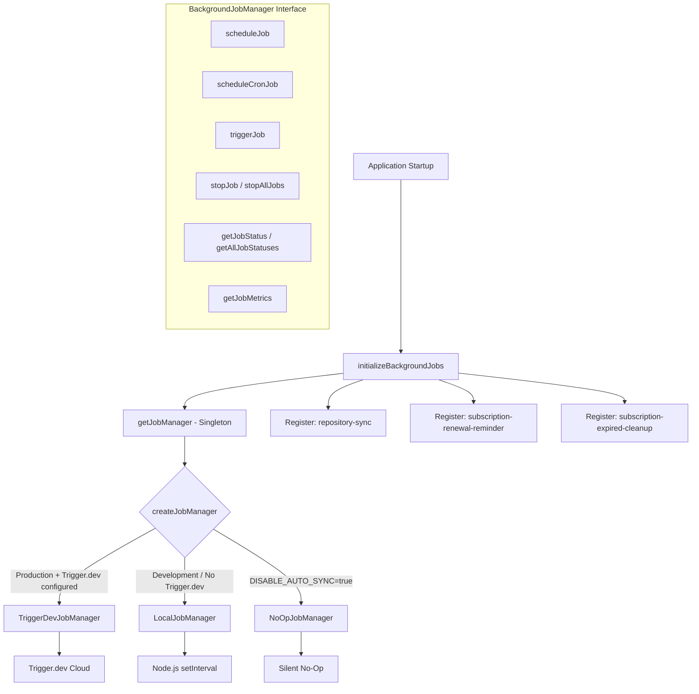
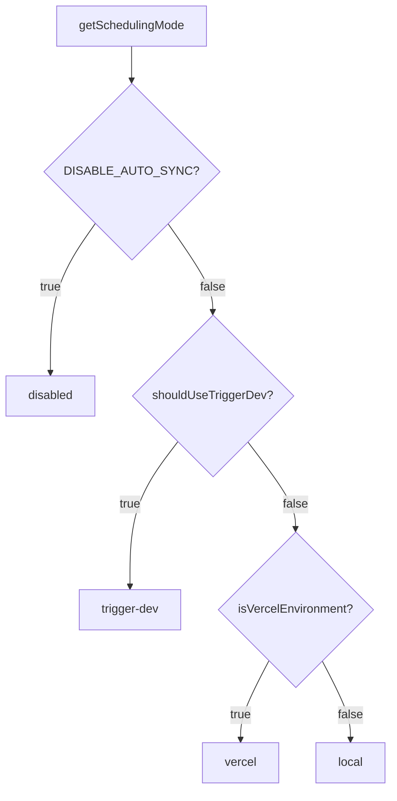

# Модул за фонови задачи

Модулът за фонови задачи (`template/lib/background-jobs/`) предоставя абстракционен слой за планиране и изпълнение на повтарящи се задачи. Той поддържа три стратегии за изпълнение -- **Trigger.dev** за производство, **локален `setInterval`** за разработка и режим **no-op** за пълно деактивиране на задания -- избрани автоматично въз основа на конфигурацията на средата.

## Преглед на архитектурата



## Изходни файлове

|Файл|Описание|
|------|-------------|
|`lib/background-jobs/types.ts`|Дефиниции на интерфейс и тип|
|`lib/background-jobs/config.ts`|Trigger.dev конфигурация и откриване на режим на планиране|
|`lib/background-jobs/job-factory.ts`|Фабрична функция и единичен мениджър|
|`lib/background-jobs/local-job-manager.ts`|`LocalJobManager` изпълнение|
|`lib/background-jobs/trigger-dev-job-manager.ts`|`TriggerDevJobManager` изпълнение|
|`lib/background-jobs/noop-job-manager.ts`|`NoOpJobManager` изпълнение|
|`lib/background-jobs/initialize-jobs.ts`|Регистрация на работа при стартиране на приложението|
|`lib/background-jobs/index.ts`|Износ на варели|

## Типови дефиниции

### `BackgroundJobManager` Интерфейс

```typescript
interface BackgroundJobManager {
  scheduleJob(id: string, name: string, job: () => void | Promise<void>, interval: number): void;
  scheduleCronJob(id: string, name: string, job: () => void | Promise<void>, cronExpression: string): void;
  triggerJob(id: string): Promise<void>;
  stopJob(id: string): void;
  stopAllJobs(): void;
  getJobStatus(id: string): JobStatus | undefined;
  getAllJobStatuses(): JobStatus[];
  getJobMetrics(): JobMetrics;
}
```

### `JobStatus`

```typescript
type JobStatusType = 'running' | 'completed' | 'failed' | 'scheduled' | 'stopped';

interface JobStatus {
  id: string;
  name: string;
  status: JobStatusType;
  lastRun: Date | null;
  nextRun: Date | null;
  duration: number;     // Last execution duration in ms
  error?: string;       // Error message if status is 'failed'
}
```

### `JobMetrics`

```typescript
interface JobMetrics {
  totalExecutions: number;       // Total invocations (not unique jobs)
  successfulJobs: number;
  failedJobs: number;
  averageJobDuration: number;    // Rolling average in ms
  lastCleanup: Date;
}
```

### `TriggerDevConfig`

```typescript
interface TriggerDevConfig {
  enabled: boolean;
  apiKey?: string;
  apiUrl?: string;
  environment: string;
  isFullyConfigured: boolean;
  isPartiallyConfigured: boolean;
}
```

### `SchedulingMode`

```typescript
type SchedulingMode = 'trigger-dev' | 'vercel' | 'local' | 'disabled';
```

## Конфигурационни функции

### `getTriggerDevConfig(): TriggerDevConfig`

Чете настройките на Trigger.dev от ConfigService.

### `shouldUseTriggerDev(): boolean`

Връща `true`, когато Trigger.dev е напълно конфигуриран, активиран и средата е производствена.

### `getSchedulingMode(): SchedulingMode`

Определя коя система за планиране трябва да бъде активна, използвайки този приоритет:



## Фабрика и Сингълтън

### `createJobManager(): BackgroundJobManager`

Създава подходящия мениджър на работа въз основа на средата:

```typescript
import { createJobManager } from '@/lib/background-jobs';

const manager = createJobManager();
// Returns: TriggerDevJobManager | LocalJobManager | NoOpJobManager
```

### `getJobManager(): BackgroundJobManager`

Връща сингълтон екземпляра, създавайки го при първо извикване:

```typescript
import { getJobManager } from '@/lib/background-jobs';

const manager = getJobManager();
manager.scheduleJob('my-job', 'My Job', async () => {
  await doWork();
}, 60_000);
```

### `resetJobManager(): void`

Спира всички задания и унищожава сингълтън (полезно за тестване):

```typescript
import { resetJobManager } from '@/lib/background-jobs';
resetJobManager();
```

## LocalJobManager

Използва Node.js `setInterval` за разработка и резервни среди.

**Ключови поведения:**
- Пропуска изпълнението, когато задание вече се изпълнява (предотвратява припокриване)
- Проследява показатели с пълзяща средна продължителност
- Преобразува cron изрази в интервали чрез опростено картографиране
- Намалява регистрирането на конзолата в режим на разработка

### Cron-to-Interval Mapping

|Cron модел|Интервал|
|-------------|----------|
| `*/30 * * * * *` |30 секунди|
| `*/2 * * * *` |2 минути|
| `*/5 * * * *` |5 минути|
| `*/15 * * * *` |15 минути|
| `0 * * * *` |1 час|
| `0 9 * * *` |24 часа|
|По подразбиране|1 минута|

## TriggerDevJobManager

Регистрира графици с `@trigger.dev/sdk` v4 API за графици. **Не** изпълнява локални таймери -- изпълнението се управлява от работния процес Trigger.dev.

**Ключови поведения:**
- Мързеливо зарежда `@trigger.dev/sdk` чрез динамично импортиране
- Преобразува базирани на интервали графици в cron изрази
- Проследява локални показатели, когато задачите се изпълняват в работния контекст
- `stopJob` / `stopAllJobs` само ясно локално състояние (дистанционните графици се управляват от Trigger.dev)

## NoOpJobManager

Всички операции са тихи без операции. Използва се, когато `DISABLE_AUTO_SYNC=true` се разработва.

## Регистрация на работа

Функцията `initializeBackgroundJobs()` регистрира всички задания за приложения при стартиране:

```typescript
import { initializeBackgroundJobs } from '@/lib/background-jobs/initialize-jobs';

// Called once during app initialization
await initializeBackgroundJobs();
```

### Регистрирани работни места

|ID на работа|График|Описание|
|--------|----------|-------------|
|`repository-sync`|На всеки 5 минути|Синхронизира базирано на Git CMS съдържание чрез `syncManager.performSync()`|
|`subscription-renewal-reminder`|Всеки ден в 9:00ч|Изпраща напомняния за подновяване на абонаменти, изтичащи след 7 дни|
|`subscription-expired-cleanup`|Всеки ден в полунощ|Обработва и изтича абонаменти след крайната им дата|

**Важно:** Всички обратни извиквания на задания използват динамично импортиране, за да попречат на webpack да обединява специфични за Node.js модули по време на изграждане:

```typescript
manager.scheduleJob('repository-sync', 'Repository Synchronization', async () => {
  // Dynamic import prevents webpack bundling of isomorphic-git chain
  const { syncManager } = await import('@/lib/services/sync-service');
  await syncManager.performSync();
}, 5 * 60 * 1000);
```

## Примери за използване

### Планиране на персонализирана работа

```typescript
import { getJobManager } from '@/lib/background-jobs';

const manager = getJobManager();

// Interval-based (every 10 minutes)
manager.scheduleJob('cleanup-temp', 'Temp File Cleanup', async () => {
  await cleanupTempFiles();
}, 10 * 60 * 1000);

// Cron-based (every hour)
manager.scheduleCronJob('hourly-report', 'Hourly Report', async () => {
  await generateReport();
}, '0 * * * *');
```

### Мониторинг на работни места

```typescript
const manager = getJobManager();

// Check specific job
const status = manager.getJobStatus('repository-sync');
console.log(status?.status, status?.lastRun, status?.duration);

// List all jobs
const allStatuses = manager.getAllJobStatuses();

// Get aggregate metrics
const metrics = manager.getJobMetrics();
console.log(`Total: ${metrics.totalExecutions}, Failed: ${metrics.failedJobs}`);
```

### Ръчно задействане

```typescript
const manager = getJobManager();
await manager.triggerJob('repository-sync');
```
