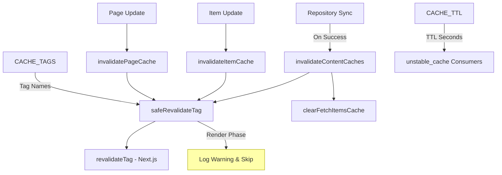
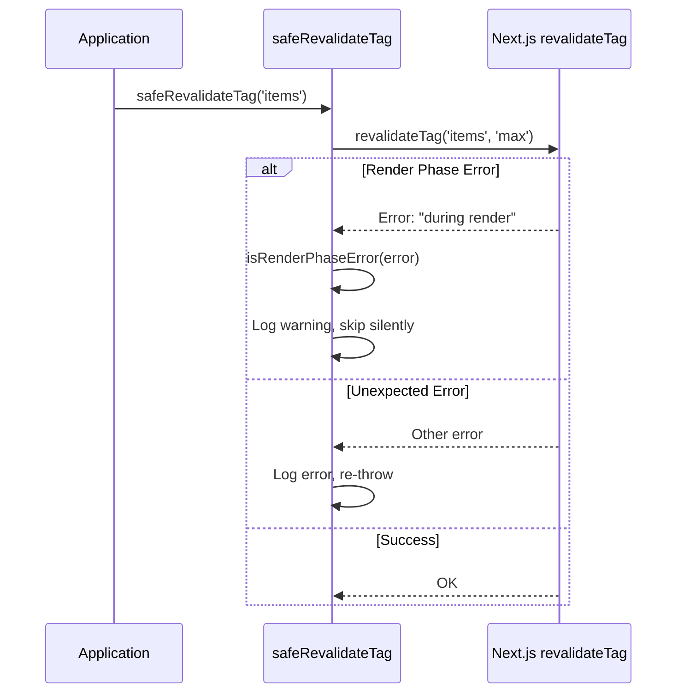
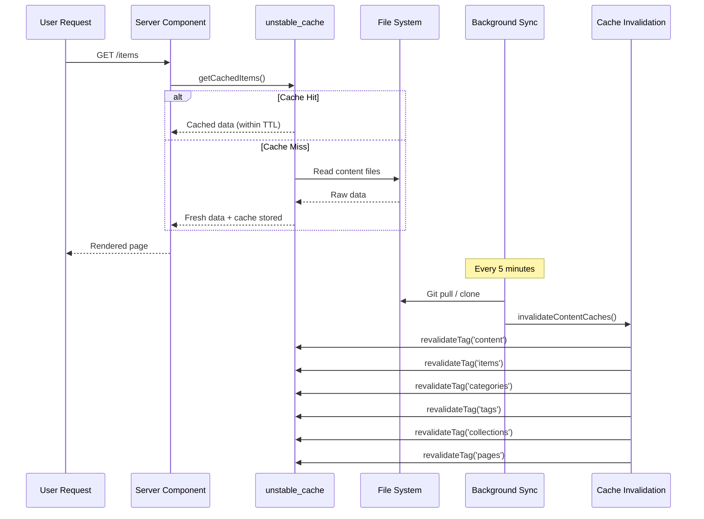

# Модул за невалидност на кеша

Модулът за анулиране на кеша (`template/lib/cache-config.ts` и `template/lib/cache-invalidation.ts`) осигурява централизирана система за кеш тагове и функции за анулиране за Next.js `unstable_cache` и `revalidateTag`. Той гарантира, че кешовете на съдържанието са правилно анулирани след синхронизиране на хранилището, като същевременно борави грациозно с ограниченията на фазата на изобразяване на Next.js.

## Преглед на архитектурата



## Изходни файлове

|Файл|Описание|
|------|-------------|
|`lib/cache-config.ts`|Кеширайте TTL константи и дефиниции на тагове|
|`lib/cache-invalidation.ts`|Функции за анулиране с безопасност във фаза на рендиране|

## Кеш TTL конфигурация

Всички TTL стойности са в **секунди**, използвани с Next.js `unstable_cache`:

```typescript
const CACHE_TTL = {
  CONTENT: 600,   // 10 minutes -- content listings
  ITEM: 600,      // 10 minutes -- individual items
  CONFIG: 600,    // 10 minutes -- site configuration
  PAGES: 600,     // 10 minutes -- static pages
} as const;
```

### Използване с `unstable_cache`

```typescript
import { unstable_cache } from 'next/cache';
import { CACHE_TTL, CACHE_TAGS } from '@/lib/cache-config';

const getCachedItems = unstable_cache(
  async () => fetchAllItems(),
  ['items-list'],
  {
    revalidate: CACHE_TTL.CONTENT,
    tags: [CACHE_TAGS.CONTENT, CACHE_TAGS.ITEMS],
  }
);
```

## Кеш етикети

Етикетите се използват с `revalidateTag()` за селективно обезсилване на кешовете.

### Статични етикети

|Константа на етикета|Стойност|Описание|
|-------------|-------|-------------|
|`CACHE_TAGS.CONTENT`|`'content'`|Главен маркер -- обезсилва всички кешове на съдържание|
|`CACHE_TAGS.ITEMS`|`'items'`|Колекция от всички елементи|
|`CACHE_TAGS.CATEGORIES`|`'categories'`|Всички категории|
|`CACHE_TAGS.TAGS`|`'tags'`|Всички етикети|
|`CACHE_TAGS.COLLECTIONS`|`'collections'`|Всички колекции|
|`CACHE_TAGS.CONFIG`|`'config'`|Конфигурация на сайта|
|`CACHE_TAGS.PAGES`|`'pages'`|Всички статични страници|

### Динамични тагове (функции)

|Функция на етикета|Примерен изход|Описание|
|-------------|---------------|-------------|
|`CACHE_TAGS.ITEM(slug)`|`'item:my-tool'`|Конкретен артикул от охлюв|
|`CACHE_TAGS.PAGE(slug)`|`'page:about'`|Конкретна страница по slug|
|`CACHE_TAGS.ITEMS_LOCALE(locale)`|`'items:en'`|Елементите са филтрирани по локал|
|`CACHE_TAGS.CATEGORIES_LOCALE(locale)`|`'categories:fr'`|Категории по локал|
|`CACHE_TAGS.TAGS_LOCALE(locale)`|`'tags:de'`|Етикети по локал|
|`CACHE_TAGS.COLLECTIONS_LOCALE(locale)`|`'collections:es'`|Колекции по локал|

### Пример: Кеширане, специфично за локал

```typescript
import { CACHE_TAGS, CACHE_TTL } from '@/lib/cache-config';

const getCachedItemsByLocale = unstable_cache(
  async (locale: string) => fetchItemsByLocale(locale),
  ['items-by-locale'],
  {
    revalidate: CACHE_TTL.CONTENT,
    tags: [CACHE_TAGS.ITEMS, CACHE_TAGS.ITEMS_LOCALE('en')],
  }
);
```

## Функции за анулиране

### `invalidateContentCaches(): Promise<void>`

Анулира **всички** кешове, свързани със съдържание. Извиква се, след като синхронизирането на хранилището завърши успешно.

```typescript
import { invalidateContentCaches } from '@/lib/cache-invalidation';

// After successful repository sync
await performSync();
await invalidateContentCaches();
```

**Невалидни тези тагове:**
- `CONTENT`, `ITEMS`, `CATEGORIES`, `TAGS`, `COLLECTIONS`, `PAGES`
- Също така изчиства кеша `fetchItems` в паметта чрез `clearFetchItemsCache()`

### `invalidateItemCache(slug: string): Promise<void>`

Анулира кеша за единичен елемент.

```typescript
import { invalidateItemCache } from '@/lib/cache-invalidation';

await invalidateItemCache('my-saas-tool');
// Revalidates tag: 'item:my-saas-tool'
```

### `invalidatePageCache(slug: string): Promise<void>`

Анулира кеша за една статична страница.

```typescript
import { invalidatePageCache } from '@/lib/cache-invalidation';

await invalidatePageCache('about');
// Revalidates tag: 'page:about'
```

## Безопасност на етапа на изобразяване

Next.js не позволява `revalidateTag()` по време на фазата на изобразяване на сървърните компоненти. Модулът се справя с това с `safeRevalidateTag` обвивка.

### Как работи



### Модели за откриване на грешки

Функцията `isRenderPhaseError` проверява множество шаблони, за да бъдат устойчиви срещу промени в съобщението за грешка на Next.js:

- `"during render"` -- Текущо Next.js съобщение
- `"render phase"` -- Алтернативно формулиране
- `"revalidate"` + `"render"` -- Налице са и двете ключови думи
- `"unsupported"` + `"render"` -- Проверка на комбинация

## Диаграма на потока на кеша


