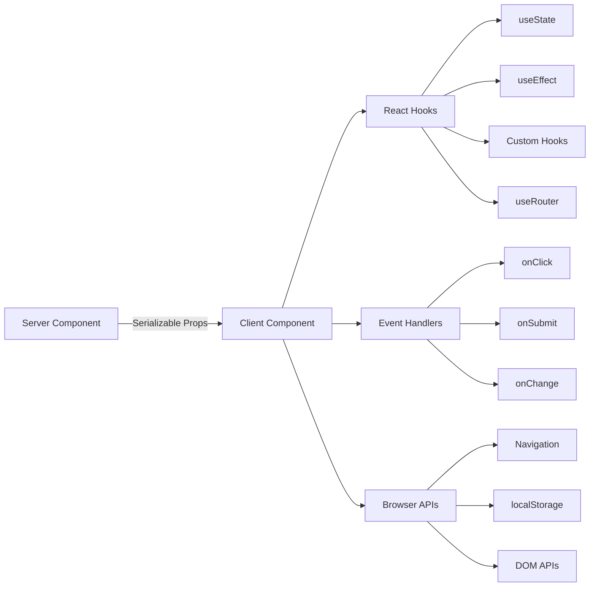

# Модели на клиентски компоненти

## Преглед

Клиентските компоненти в шаблона Ever Works са интерактивни „острови“, които обработват потребителски събития, управляват локално състояние и се интегрират с API на браузъра. Те се идентифицират чрез директивата `"use client"` в горната част на файла и се използват избирателно, когато се изисква интерактивност.

## Архитектура



## Изходни файлове

|Файл|Модел|
|------|---------|
|`template/app/[locale]/admin/page.tsx`|Минимална клиентска обвивка, делегираща на компонент|
|`template/app/not-found.tsx`|Клиентска навигация с `useRouter`|
|`template/app/global-error.tsx`|Граница на грешка с функция за нулиране|
|`template/components/filters/filter-url-parser.tsx`|Управление на състоянието на URL|
|`template/components/header/more-menu.tsx`|Интерактивни падащи менюта|

## Основни модели

### Модел 1: Минимални клиентски обвивки

Много компоненти на страницата използват възможно най-тънката клиентска обвивка:

```typescript
"use client";

import { AdminDashboard } from "@/components/admin";

export default function AdminPage() {
    return <AdminDashboard />;
}
```

Този модел запазва файла на страницата малък, като същевременно делегира цялата логика на отделен компонент. Директивата `"use client"` маркира границата, където дървото на сървърния компонент преминава към рендиране на клиент.

### Модел 2: Компоненти на границата на грешката

Глобалният манипулатор на грешки демонстрира модела на границата на грешката:

```typescript
'use client';

export default function GlobalError({
    error,
    reset,
}: {
    error: Error & { digest?: string };
    reset: () => void;
}) {
    useEffect(() => {
        console.error(error);
    }, [error]);

    return (
        <html lang="en">
            <body>
                <div>
                    <h1>Something went wrong!</h1>
                    {process.env.NODE_ENV !== 'production' && (
                        <div>
                            <p>{error.message}</p>
                            {error.digest && <p>Error ID: {error.digest}</p>}
                        </div>
                    )}
                    <Button onPress={() => reset()}>Refresh</Button>
                    <Link href="/">Go Home</Link>
                </div>
            </body>
        </html>
    );
}
```

Ключови аспекти:
- Проп `error` включва незадължителен `digest` за проследяване на сървърни грешки
- Функцията `reset()` рендерира децата на границата на грешката
- Следите на стека се показват само в разработка
- Компонентът обвива свои собствени тагове `<html>` и `<body>`, тъй като глобалните грешки заместват цялата страница

### Модел 3: Навигация от страна на клиента

Страницата Not Found демонстрира модели за навигация от страна на клиента:

```typescript
'use client';

import { useRouter } from 'next/navigation';

export default function NotFound() {
    const router = useRouter();

    return (
        <div>
            <Button onClick={() => router.back()}>Go Back</Button>
            <Button onClick={() => router.push('/')}>Back to Home</Button>
            <button onClick={() => router.push('/help')}>Contact Support</button>
        </div>
    );
}
```

Куката `useRouter` от `next/navigation` осигурява програмна навигация. Имайте предвид, че това е от `next/navigation`, а не от `next/router` (Pages Router).

### Модел 4: i18n-Aware клиентска навигация

Шаблонът предоставя куки за навигация, съобразени с локала, чрез `i18n/navigation.ts`:

```typescript
import { createNavigation } from "next-intl/navigation";
import { routing } from "./routing";

export const { Link, redirect, usePathname, useRouter, getPathname } =
    createNavigation(routing);
```

Клиентски компоненти, които се нуждаят от импортиране на навигация, съобразена с локала, от този модул вместо `next/navigation`:

```typescript
'use client';

import { Link, useRouter, usePathname } from '@/i18n/navigation';

function LocaleAwareComponent() {
    const router = useRouter();
    const pathname = usePathname();

    // router.push('/about') automatically includes the current locale prefix
    return <Link href="/about">About</Link>;
}
```

### Модел 5: Действия на сървъра с валидиране на формуляр

Клиентските компоненти се интегрират с действията на сървъра, като използват валидирания модел на действие от `lib/auth/middleware.ts`:

```typescript
// Server action (lib/auth/middleware.ts)
export function validatedAction<S extends z.ZodType, T>(
    schema: S,
    action: ValidatedActionFunction<S, T>
) {
    return async (prevState: ActionState, formData: FormData): Promise<T> => {
        const result = schema.safeParse(Object.fromEntries(formData));
        if (!result.success) {
            return { error: result.error.issues[0].message } as T;
        }
        return action(result.data, formData);
    };
}

// Client component
'use client';

import { useActionState } from 'react';
import { myServerAction } from './actions';

function MyForm() {
    const [state, formAction, isPending] = useActionState(myServerAction, {});

    return (
        <form action={formAction}>
            {state.error && <p>{state.error}</p>}
            <input name="email" type="email" />
            <button type="submit" disabled={isPending}>Submit</button>
        </form>
    );
}
```

### Модел 6: Управление на състоянието с персонализирани куки

Шаблонът организира логиката от страна на клиента в персонализирани кукички в директорията `hooks/`:

```typescript
'use client';

import { useFavorites } from '@/hooks/useFavorites';
import { useFilters } from '@/hooks/useFilters';

function ItemList() {
    const { favorites, toggleFavorite } = useFavorites();
    const { filters, updateFilter, resetFilters } = useFilters();

    return (
        <div>
            <FilterBar filters={filters} onChange={updateFilter} onReset={resetFilters} />
            <ItemGrid items={items} favorites={favorites} onToggleFavorite={toggleFavorite} />
        </div>
    );
}
```

## Граници на клиентския компонент

### Кога да използвате `"use client"`

- **Манипулатори на събития**: `onClick`, `onSubmit`, `onChange`
- **React куки**: `useState`, `useEffect`, `useRef`, персонализирани куки
- **API на браузъра**: `window`, `localStorage`, `navigator`
- **Клиентски библиотеки на трети страни**: Библиотеки с компоненти на потребителския интерфейс, изискващи интерактивност

### Кога да се запази като сървърен компонент

- Изобразяване на статично съдържание
- Извличане и трансформиране на данни
- Зареждане на превода (`getTranslations`)
- Генериране на метаданни
- Обвивки на оформлението

## Най-добри практики в шаблона

1. **Избутайте `"use client"` възможно най-дълбоко** -- дръжте границата близо до интерактивния лист
2. **Предавайте сървърни данни като реквизити** -- избягвайте повторно извличане на клиента
3. **Използвайте `useEffect` само за странични ефекти** -- не за извличане на данни
4. **Предпочитайте действията на сървъра пред API маршрутите** -- за изпращане на формуляри и мутации
5. **Импортиране на навигация от `@/i18n/navigation`** -- гарантира маршрутизиране, съобразено с локала
6. **Потребителски интерфейс само за разработка на Gate** -- използвайте `process.env.NODE_ENV !== 'production'` проверки
