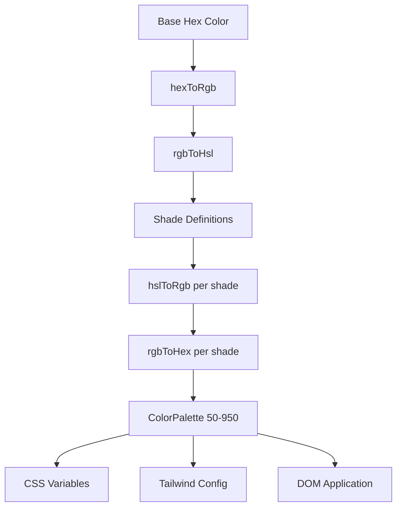

# Цветна система

Шаблонът използва динамична система за генериране на цветове, която създава пълни цветови палитри от базови шестнадесетични цветове. Това задвижва механизма за създаване на теми и позволява персонализиране на цвета по време на изпълнение чрез CSS променливи и интеграция на Tailwind CSS.

## Преглед на архитектурата



## Изходни файлове

|Файл|Цел|
|------|---------|
|`lib/color-generator.ts`|Генериране на основна палитра от шестнадесетични цветове|
|`lib/theme-color-manager.ts`|Цветно приложение на ниво тема и генериране на CSS|
|`lib/theme-utils.ts`|Полезни класове, помощници за непрозрачност и предварително зададени теми|

## Тръбопровод за преобразуване на цветовете

Системата преобразува цветовете чрез множество представяния, за да генерира точно нюанси. Четири функции за преобразуване се справят с пълното пътуване в двете посоки.

```typescript
// Hex -> RGB -> HSL (for manipulation) -> RGB -> Hex (output)
export function hexToRgb(hex: string): { r: number; g: number; b: number };
export function rgbToHsl(r: number, g: number, b: number): { h: number; s: number; l: number };
export function hslToRgb(h: number, s: number, l: number): { r: number; g: number; b: number };
export function rgbToHex(r: number, g: number, b: number): string;
```

Корекциите на лекотата и наситеността се извършват в цветовото пространство HSL, което осигурява перцептивно еднакви преходи на нюанси в палитрата.

## Дефиниции на нюанси

Всяко ниво на нюанс има фиксирани корекции на светлота и наситеността спрямо основния цвят (500):

|Сянка|Регулиране на лекотата|Настройване на наситеността|Използване|
|-------|-----------------|-------------------|-------|
| 50 | +45 | -30 |Най-светлите фонове|
| 100 | +40 | -25 |Ховър фонове|
| 200 | +30 | -20 |Активни фонове|
| 300 | +20 | -10 |Граници|
| 400 | +10 | -5 |Заместващ текст|
| **500** | **0** | **0** |**Основен цвят**|
| 600 | -10 | +5 |Състояния на задържане|
| 700 | -20 | +10 |Активни състояния|
| 800 | -30 | +15 |Акцент върху текста|
| 900 | -40 | +20 |Заглавия|
| 950 | -45 | +25 |Най-тъмните фонове|

## Интерфейс ColorPalette

```typescript
export interface ColorPalette {
  50: string;
  100: string;
  200: string;
  300: string;
  400: string;
  500: string;  // Base color
  600: string;
  700: string;
  800: string;
  900: string;
  950: string;
}
```

## Генериране на палитра

Функцията `generateColorPalette` приема всеки шестнадесетичен цвят и произвежда пълната палитра от 11 нюанса:

```typescript
import { generateColorPalette } from '@/lib/color-generator';

const palette = generateColorPalette('#3b82f6');
// Returns: { 50: '#e8f0fe', 100: '#d4e4fd', ..., 950: '#0a1d3d' }
```

Стойностите са ограничени между 0 и 100 както за светлота, така и за наситеността, за да се предотвратят цветове извън диапазона.

## Генериране на CSS променлива

Системата генерира персонализирани CSS свойства за всеки нюанс:

```typescript
import { generateCssVariables } from '@/lib/color-generator';

const palette = generateColorPalette('#3b82f6');
const css = generateCssVariables('theme-primary', palette);
// Output:
// --theme-primary: #3b82f6;
// --theme-primary-50: #e8f0fe;
// --theme-primary-100: #d4e4fd;
// ... (all 11 shades)
```

## Tailwind CSS интеграция

Генерирайте конфигурационни обекти на Tailwind, които препращат към CSS променливи:

```typescript
import { generateTailwindConfig } from '@/lib/color-generator';

const config = generateTailwindConfig('theme-primary');
// Returns: {
//   DEFAULT: 'var(--theme-primary)',
//   50: 'var(--theme-primary-50)',
//   100: 'var(--theme-primary-100)',
//   ...
// }
```

## Мениджър на цветовете на темата

Модулът `theme-color-manager.ts` прилага палети към DOM по време на изпълнение.

### Разширени конфигурации на теми

Четири вградени теми дефинират основни цветове за основен, вторичен, акцент, фон, повърхност и текст:

```typescript
export const EXTENDED_THEME_CONFIGS: Record<ThemeKey, ThemeConfig> = {
  everworks: {
    primary: "#3d70ef",
    secondary: "#00c853",
    accent: "#0056b3",
    background: "#ffffff",
    surface: "#f8f9fa",
    text: "#1a1a1a",
    textSecondary: "#6c757d",
  },
  corporate: { /* ... */ },
  material: { /* ... */ },
  funny: { /* ... */ },
};
```

### Прилагане на палети към DOM

```typescript
import { applyColorPalette, applyThemeWithPalettes } from '@/lib/theme-color-manager';

// Apply a single color palette
applyColorPalette('theme-primary', '#3d70ef');

// Apply an entire theme (primary + secondary + accent + utility colors)
applyThemeWithPalettes('everworks');
```

Функцията `applyColorPalette` също генерира RGB вариант за поддръжка на непрозрачност:

```typescript
// Sets both:
// --theme-primary: #3d70ef
// --theme-primary-rgb: 61, 112, 239
```

### Генериране на статичен CSS

За изобразяване от страна на сървъра или генериране на CSS по време на компилация:

```typescript
import { generateThemeCss } from '@/lib/theme-color-manager';

const css = generateThemeCss('everworks');
// Returns full CSS variable string for all theme colors
```

## Тематични класове за полезност

Модулът `theme-utils.ts` предоставя предварително изградени комбинации от клас Tailwind:

```typescript
import { themeClasses } from '@/lib/theme-utils';

// Button variants
themeClasses.button.primary   // "bg-theme-primary hover:bg-theme-accent text-white"
themeClasses.button.secondary // "bg-theme-secondary hover:bg-theme-secondary/80 text-white"
themeClasses.button.outline   // "border-2 border-theme-primary text-theme-primary ..."
themeClasses.button.ghost     // "text-theme-primary hover:bg-theme-primary/10"

// Text variants
themeClasses.text.primary     // "text-theme-text"
themeClasses.text.secondary   // "text-theme-text-secondary"
themeClasses.text.accent      // "text-theme-primary"
```

### Помощни функции

```typescript
import { withOpacity, getCssVariable, cn, buildThemeClasses } from '@/lib/theme-utils';

// Generate opacity variant
withOpacity('bg-theme-primary', 50); // "bg-theme-primary/50"

// Get CSS variable reference
getCssVariable('theme-primary'); // "var(--theme-primary)"

// Conditional class building
buildThemeClasses('base-class', 'theme-class', {
  'active-class': isActive,
  'disabled-class': isDisabled,
});
```

## Пакетно генериране на цветове на тема

Генерирайте конфигурация на CSS и Tailwind за няколко цвята наведнъж:

```typescript
import { generateThemeColors } from '@/lib/color-generator';

const result = generateThemeColors({
  primary: '#3d70ef',
  secondary: '#00c853',
  accent: '#0056b3',
});

// result.css - Complete CSS variable declarations
// result.tailwind - Tailwind config object for all colors
```

## Персонализирано приложение за тема

Приложете произволни цветове, без да използвате предварително зададените теми:

```typescript
import { applyCustomTheme } from '@/lib/theme-color-manager';

applyCustomTheme({
  primary: '#e91e63',
  secondary: '#9c27b0',
  accent: '#673ab7',
});
```

## Обработка на грешки

Мениджърът на цветовете на темата включва резервно поведение:

- Ако ключ на тема не бъде намерен, той се връща към темата по подразбиране `everworks`.
- Ако прилагането на тема изведе грешка и поисканата тема не е `everworks`, тя автоматично прави повторен опит с темата по подразбиране.
- Безопасност на SSR: `useThemeWithPalettes` проверява за `window` наличност, преди да приложи DOM промени.
