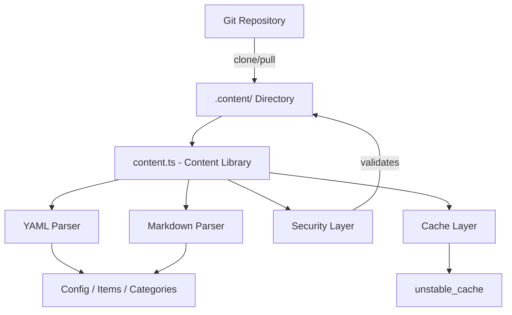
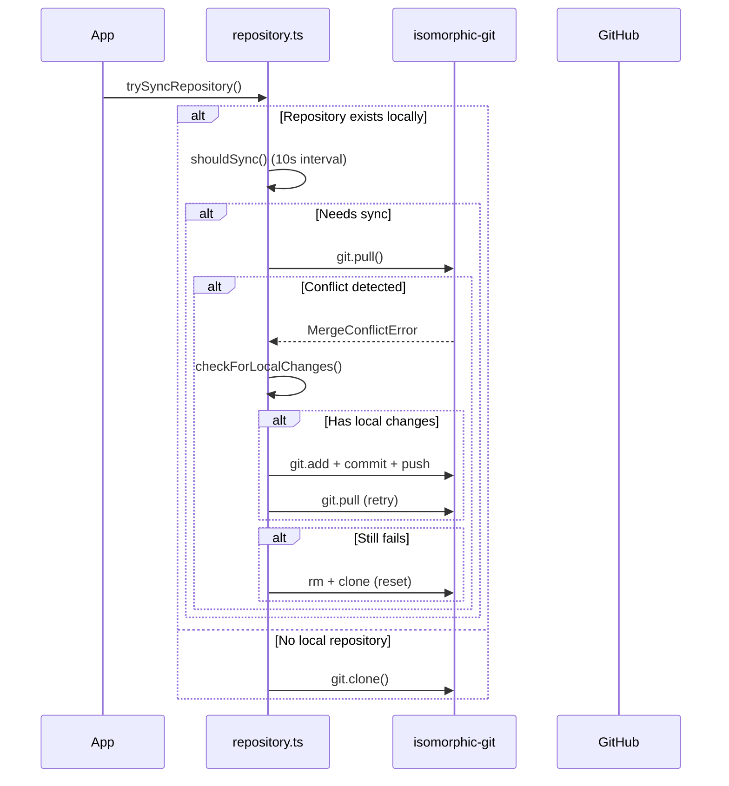

# Библиотека със съдържание

Библиотеката със съдържание (`lib/content.ts`) предоставя помощни програми от страна на сървъра за четене, анализиране и кеширане на съдържание от базирано на Git CMS хранилище. Той обработва файлове със съдържание на YAML/Markdown, управление на конфигурацията и синхронизиране на съдържание със стабилни мерки за сигурност.

## Преглед на архитектурата



## Изходни файлове

|Файл|Цел|
|------|---------|
|`lib/content.ts`|Обработка на основно съдържание, четене и кеширане|
|`lib/repository.ts`|Git клониране/изтегляне синхронизиране с отдалечено хранилище|
|`lib/lib.ts`|Помощни програми за път (`getContentPath`, `fsExists`, `dirExists`)|
|`lib/cache-config.ts`|Кеш тагове и TTL конфигурация|

## Защитен слой

Библиотеката със съдържание налага множество мерки за сигурност за предотвратяване на преминаване на пътя и атаки чрез инжектиране.

### Валидиране на кода на езика

```typescript
function validateLanguageCode(lang: string): boolean {
  const validLangPattern = /^[a-zA-Z0-9_-]+$/;
  return validLangPattern.test(lang) && lang.length <= 10;
}
```

Приемат се само буквено-цифрови знаци, тирета и долни черти с максимална дължина от 10 знака.

### Дезинфекция на името на файла

```typescript
function sanitizeFilename(filename: string): string {
  const sanitized = path.basename(filename);
  if (sanitized.includes('..') || sanitized.includes('/') || sanitized.includes('\\')) {
    throw new Error('Invalid filename: contains dangerous characters');
  }
  return sanitized;
}
```

Използва `path.basename` за премахване на компонентите на директорията и отхвърля всички останали знаци за преминаване.

### Валидиране на пътя

```typescript
function validatePath(filepath: string, basePath: string): void {
  const resolvedPath = path.resolve(filepath);
  const resolvedBase = path.resolve(basePath);
  if (!resolvedPath.startsWith(resolvedBase + path.sep) && resolvedPath !== resolvedBase) {
    throw new Error('Invalid file path: outside of allowed directory');
  }
}
```

Функцията `safeReadFile` извършва двойна проверка: валидира пътя и след това проверява дали разрешеният реален път (следващи символни връзки) остава в основната директория.

### URL валидиране

```typescript
function isValidUrl(url: string): boolean {
  const trimmed = url.trim();
  if (trimmed.startsWith('/') && !trimmed.startsWith('//')) return true;
  return trimmed.startsWith('http://') || trimmed.startsWith('https://');
}
```

Блокира `javascript:`, `data:`, `vbscript:` и други опасни схеми на протоколи.

### Проверка на CSS размера

```typescript
function isValidCssSize(value: string): boolean {
  if (['auto', 'inherit', 'initial', 'unset'].includes(value.trim())) return true;
  return /^\d+(\.\d+)?(px|em|rem|vh|vw|%|pt|cm|mm|in)?$/.test(value.trim());
}
```

Предотвратява инжектиране на CSS чрез персонализирани полета на герой frontmatter.

## Обработка на съдържанието

### Разбор на YAML

Файловете със съдържание се анализират с помощта на библиотеката `yaml` с валидиране на Zod схема за frontmatter:

```typescript
const customHeroFrontmatterSchema = z.object({
  background_image: z.string().refine(isValidUrl, {
    message: 'Invalid URL: must be http, https, or relative path'
  }).optional(),
  // ... additional validated fields
});
```

### Кеширане на конфигурацията

Конфигурацията на сайта се кешира с помощта на Next.js `unstable_cache` с дефинирани TTL и кеш тагове:

```typescript
import { CACHE_TAGS, CACHE_TTL } from './cache-config';

const getCachedConfig = unstable_cache(
  async () => { /* read and parse config.yml */ },
  [CACHE_TAGS.CONFIG],
  { revalidate: CACHE_TTL }
);
```

## Синхронизиране на Git хранилище

Модулът `repository.ts` управлява Git операции с помощта на `isomorphic-git`.

### Поток на синхронизиране



### Защита при изчакване

Всички Git операции са обвити с конфигурируеми изчаквания:

```typescript
async function withTimeout<T>(promise: Promise<T>, timeoutMs: number = 120000): Promise<T> {
  const timeoutPromise = new Promise<never>((_, reject) => {
    setTimeout(() => reject(new Error(`Operation timeout after ${timeoutMs}ms`)), timeoutMs);
  });
  return Promise.race([promise, timeoutPromise]);
}
```

### Разрешаване на конфликти

Системата обработва конфликти при сливане чрез многоетапна стратегия:

1. **Откриване на локални промени** чрез `git.statusMatrix()`
2. **Опит за натискане** на локални промени преди изтегляне
3. **Повторно изтегляне** след успешно натискане
4. **Пълно нулиране** (изтриване + повторно клониране) като последна възможност

### Резервно поведение

Ако `DATA_REPOSITORY` не е конфигуриран или клонирането е неуспешно, системата създава минимално резервно съдържание:

```typescript
// Creates empty content directory with minimal config
const DEFAULT_CONFIG = `site_name: Website
item_name: Item
items_name: Items
copyright_year: ${new Date().getFullYear()}
`;
```

## Налагане само на сървъра

Както `content.ts`, така и `repository.ts` използват импортирането на `server-only`, за да предотвратят случайно използване от страна на клиента:

```typescript
'use server';
import 'server-only';
```

Това гарантира, че операциите със съдържание с достъп до файловата система никога не изтичат в клиентски пакети.

## Ключови експортирани функции

|функция|Описание|
|----------|-------------|
|`getCachedConfig()`|Връща кеширана конфигурация на сайта от `config.yml`|
|`trySyncRepository()`|Клонира или изтегля съдържание от отдалечено Git хранилище|
|`pullChanges()`|Извлича най-новите промени с разрешаване на конфликти|
|`validateLanguageCode()`|Валидира формата на кода на езика i18n|
|`sanitizeFilename()`|Премахва компонентите на директорията от имената на файловете|
|`safeReadFile()`|Чете файлове с пълна защита при преминаване на пътя|
