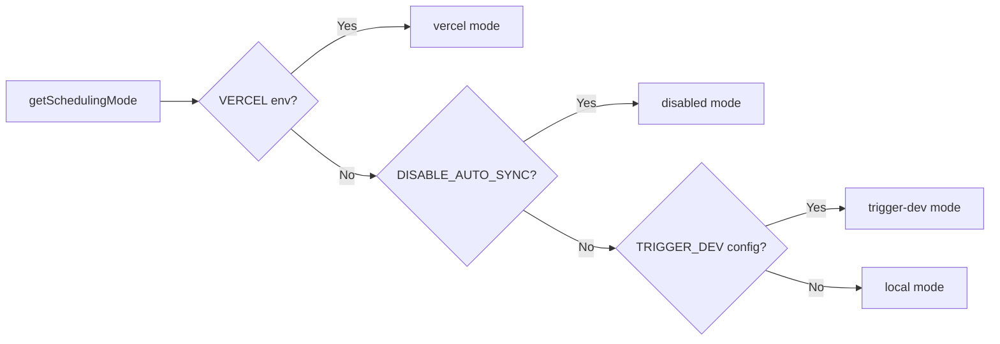

# Cron Job System

## Преглед

Шаблонът Ever Works внедрява гъвкава система за фонови задачи, която поддържа три режима на планиране: **Vercel Cron**, **Trigger.dev** и **локален планировчик**. Крайните точки на Cron са стандартни маршрути на API на Next.js, удостоверени чрез `CRON_SECRET`, а системата включва модул за инициализация на единичен елемент, който гарантира, че заданията се настройват точно веднъж на процес.

## Архитектура

```mermaid
flowchart TD
    A[Scheduling Mode Detection] --> B{getSchedulingMode}

    B -->|vercel| C[Vercel Cron]
    B -->|trigger-dev| D[Trigger.dev]
    B -->|local| E[Local Scheduler]
    B -->|disabled| F[No Jobs]

    C --> G[vercel.json crons]
    G --> G1[/api/cron/sync]
    G --> G2[/api/cron/subscription-reminders]
    G --> G3[/api/cron/subscription-expiration]

    G1 --> H[CRON_SECRET Verification]
    G2 --> H
    G3 --> H

    H -->|Valid| I[Execute Job]
    H -->|Invalid| J[401 Unauthorized]

    I --> I1[triggerManualSync]
    I --> I2[subscriptionRenewalReminderJob]
    I --> I3[processExpiredSubscriptions]

    D --> K[Trigger.dev SDK]
    E --> L[Internal setInterval]

    K --> I
    L --> I
```

## Изходни файлове

|Файл|Цел|
|------|---------|
|`template/vercel.json`|Дефиниции на графика на Vercel cron|
|`template/app/api/cron/sync/route.ts`|Крайна точка на cron за синхронизиране на съдържанието|
|`template/app/api/cron/subscription-reminders/route.ts`|Имейли за напомняне за подновяване|
|`template/app/api/cron/subscription-expiration/route.ts`|Обработка на изтекъл абонамент|
|`template/app/api/cron/jobs/background-jobs-init.ts`|Инициализация на единично задание|

## Конфигурация на Cron Schedule

### vercel.json

```json
{
    "crons": [
        {
            "path": "/api/cron/sync",
            "schedule": "0 3 * * *"
        },
        {
            "path": "/api/cron/subscription-reminders",
            "schedule": "0 9 * * *"
        },
        {
            "path": "/api/cron/subscription-expiration",
            "schedule": "0 0 * * *"
        }
    ]
}
```

|работа|График|време|Описание|
|-----|----------|------|-------------|
|Синхронизиране на съдържанието| `0 3 * * *` |3:00 сутринта UTC всеки ден|Синхронизира съдържание от базирана на Git CMS|
|Напомняния за абонамент| `0 9 * * *` |9:00 сутринта UTC всеки ден|Изпраща имейли за напомняне за подновяване|
|Изтичане на абонамента| `0 0 * * *` |Полунощ UTC всеки ден|Обработва изтекли абонаменти|

## Удостоверяване

### Безопасна тайна проверка на времето

Всички крайни точки на cron проверяват `CRON_SECRET`, като използват безопасно за времето сравнение, за да предотвратят атаки за определяне на времето:

```typescript
import crypto from 'crypto';

function verifyCronSecret(request: NextRequest): boolean {
    const authHeader = request.headers.get('authorization');
    const cronSecret = process.env.CRON_SECRET;

    // Development bypass
    if (!cronSecret && process.env.NODE_ENV === 'development') {
        console.log('[Cron] Bypassing cron auth in development');
        return true;
    }

    if (!cronSecret || !authHeader) return false;

    const expectedValue = `Bearer ${cronSecret}`;

    // Length check before timing-safe comparison
    if (authHeader.length !== expectedValue.length) return false;

    return crypto.timingSafeEqual(
        Buffer.from(authHeader, 'utf8'),
        Buffer.from(expectedValue, 'utf8')
    );
}
```

Основни функции за сигурност:
- **Безопасно сравнение във времето** чрез `crypto.timingSafeEqual` -- не позволява на нападателите да измерват разликите във времето за реакция, за да отгатнат тайната
- **Предварителна проверка на дължината** -- `timingSafeEqual` изисква буфери с еднаква дължина
- **Заобикаляне на разработката** -- само когато `CRON_SECRET` не е конфигуриран и `NODE_ENV=development`

### Автоматично удостоверяване на Vercel

Когато се внедри на Vercel, платформата автоматично включва заглавката `Authorization: Bearer <CRON_SECRET>` за конфигурирани cron задачи. Трябва само да зададете променливата на средата `CRON_SECRET` в таблото за управление на Vercel.

## Реализации на работа

### Задание за синхронизиране на съдържание

```typescript
export async function GET(request: Request): Promise<NextResponse> {
    const startTime = Date.now();

    // Verify authorization
    if (!isAuthorized) {
        return NextResponse.json({ success: false, message: "Unauthorized" }, { status: 401 });
    }

    try {
        const result = await triggerManualSync();
        const duration = Date.now() - startTime;

        return NextResponse.json({
            success: result.success,
            timestamp: new Date().toISOString(),
            duration,
            message: result.message,
        }, {
            headers: { "Cache-Control": "no-cache, no-store, must-revalidate" },
        });
    } catch (error) {
        return NextResponse.json({
            success: false,
            message: "Cron sync failed",
            details: safeErrorMessage(error, "Unknown error"),
        }, { status: 500 });
    }
}
```

Формат на отговора:
```json
{
    "success": true,
    "timestamp": "2025-01-15T03:00:05.123Z",
    "duration": 5123,
    "message": "Sync completed successfully"
}
```

### Задача за изтичане на абонамента

Това задание обработва изтекли абонаменти и изпраща уведомителни имейли:

```typescript
export async function GET(request: NextRequest) {
    if (!verifyCronSecret(request)) {
        return NextResponse.json({ success: false, message: 'Unauthorized' }, { status: 401 });
    }

    // 1. Find and update expired subscriptions
    const result = await subscriptionService.processExpiredSubscriptions();

    // 2. Send notification emails
    const { service: emailService } = await createEmailService();
    if (emailService.isServiceAvailable()) {
        for (const subscription of result.subscriptions) {
            const user = await getUserById(subscription.userId);
            const emailTemplate = getSubscriptionExpiredTemplate({ /* ... */ });
            await sendEmailSafely(emailService, emailConfig, emailTemplate, user.email);
        }
    }

    // 3. Return results
    return NextResponse.json({
        success: true,
        data: {
            processed: result.processed,
            affectedUsers,
            errors: result.errors,
            timestamp: new Date().toISOString()
        }
    });
}
```

Ключови поведения:
- Неуспешните имейли не причиняват неуспех на заданието
- Методът `POST` също се експортира като псевдоним за ръчни тригери
- Връща `207 Multi-Status` за частични успехи

### Задача за напомняне за абонамент

```typescript
export async function GET(request: NextRequest) {
    if (!verifyCronSecret(request)) {
        return NextResponse.json({ error: 'Unauthorized' }, { status: 401 });
    }

    const result = await subscriptionRenewalReminderJob();

    if (!result.success) {
        return NextResponse.json(
            { error: 'Job completed with errors', ...result },
            { status: 207 }  // Multi-Status for partial success
        );
    }

    return NextResponse.json({
        message: 'Subscription reminder job completed',
        ...result
    });
}

// Support POST for Vercel Cron
export async function POST(request: NextRequest) {
    return GET(request);
}
```

## Инициализация на фонови задачи

### Единичен модел

Модулът за инициализация използва `globalThis`, за да гарантира, че заданията се настройват точно веднъж, дори при извиквания на функции без сървър:

```typescript
const GLOBAL_KEY = '__BACKGROUND_JOBS_INIT__' as const;

interface BackgroundJobsGlobalState {
    initializationState: 'pending' | 'initializing' | 'completed';
    initializationPromise: Promise<void> | null;
    loggedMode: SchedulingMode | null;
}

export async function ensureBackgroundJobsInitialized(): Promise<void> {
    // Skip during tests and builds
    if (process.env.NODE_ENV === 'test') return;
    if (process.env.NEXT_PHASE === 'phase-production-build') return;

    const state = getGlobalState();

    // Fast path: already completed
    if (state.initializationState === 'completed') return;

    // Wait for in-progress initialization
    if (state.initializationState === 'initializing') {
        return state.initializationPromise;
    }

    // Start initialization
    state.initializationState = 'initializing';
    state.initializationPromise = doInitialize();

    try {
        await state.initializationPromise;
        state.initializationState = 'completed';
    } catch (error) {
        state.initializationState = 'pending'; // Allow retry
        throw error;
    }
}
```

### Режими на планиране



|Режим|Поведение|
|------|----------|
|`vercel`|Задачи, обработвани от Vercel Cron чрез HTTP крайни точки|
|`trigger-dev`|Задачи, управлявани от облачен планировчик Trigger.dev|
|`local`|Вътрешен `setInterval` базиран планировчик за разработка|
|`disabled`|Без автоматично планиране (`DISABLE_AUTO_SYNC=true`)|

## Променливи на средата

|Променлива|Задължително|Описание|
|----------|----------|-------------|
|`CRON_SECRET`|Само производство|Токен на носител за удостоверяване на cron|
|`DISABLE_AUTO_SYNC`|не|Задайте на `true`, за да деактивирате всички фонови задачи|
|`VERCEL`|Автоматична настройка|Автоматично зададено от платформата Vercel|

## Най-добри практики

1. **Винаги използвайте безопасно за времето сравнение** за тайни на cron -- предотвратява атаки за определяне на времето
2. **Експортирайте както GET, така и POST** -- Vercel Cron може да използва и двата метода
3. **Задайте `Cache-Control: no-cache`** на отговорите -- предотвратявайте кеширането на резултатите от работата
4. **Продължителност на заданието в регистъра** -- помага за идентифициране на регресии в производителността
5. **Справяйте се с неуспешните имейли елегантно** -- не позволявайте неуспешните известия да сринат работата
6. **Използвайте `207 Multi-Status`** за частични успехи - разграничава от пълния успех/неуспех
