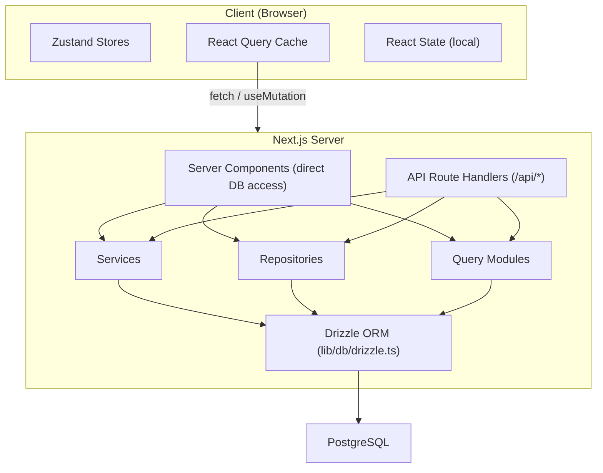

# Поток от данни и управление на състоянието

Този документ описва как данните протичат през шаблона Ever Works, от базата данни до потребителския интерфейс, като обхваща сървърни компоненти, API маршрути, React Query, Zustand магазини и модела на хранилището.

## Преглед на архитектурата

Шаблонът използва многопластова архитектура на данни:



## Извличане на данни от страна на сървъра

### Сървърни компоненти (директен достъп до DB)

Сървърните компоненти в директорията `app/` могат директно да импортират и извикват функции за заявка към база данни или методи за хранилище. Това е най-ефективният път, тъй като избягва ненужните HTTP двупосочни пътувания.

```typescript
// app/[locale]/admin/items/page.tsx (simplified)
import { getItems } from '@/lib/db/queries';

export default async function AdminItemsPage() {
  const items = await getItems();
  return <ItemsList items={items} />;
}
```

### API манипулатори на маршрути

API маршрутите в `app/api/` служат като мост между клиентските компоненти и логиката от страната на сървъра. Те следват модел на тънък манипулатор: валидират входа, извикват подходящата услуга или хранилище и връщат HTTP отговор.

```typescript
// Typical API route pattern
export async function GET(request: NextRequest) {
  const session = await auth();
  if (!session?.user) {
    return NextResponse.json({ error: 'Unauthorized' }, { status: 401 });
  }

  const data = await someRepository.findAll();
  return NextResponse.json({ success: true, data });
}
```

## Управление на състоянието от страна на клиента

### TanStack Query (React Query 5)

React Query е основният инструмент за управление на състоянието на сървъра от страна на клиента. Шаблонът го използва широко чрез персонализирани кукички в директорията `hooks/`.

**Глобална конфигурация** (`lib/react-query-config.ts`):
- Време на изчакване по подразбиране: 5 минути
- Време за събиране на боклука: 10 минути
- Автоматичен повторен опит с експоненциално забавяне (до 3 повторни опита)
- Повторно извличане на фокуса на прозореца и повторно свързване
- Без повторен опит при грешки на 4xx клиент

**Образец на кука**: Всяка област на функция има специални куки, които обгръщат React Query:

```typescript
// hooks/use-admin-items.ts (simplified pattern)
import { useQuery, useMutation, useQueryClient } from '@tanstack/react-query';

export function useAdminItems(params) {
  return useQuery({
    queryKey: ['admin', 'items', params],
    queryFn: () => fetch('/api/admin/items').then(r => r.json()),
    staleTime: 5 * 60 * 1000,
  });
}

export function useCreateItem() {
  const queryClient = useQueryClient();
  return useMutation({
    mutationFn: (data) => fetch('/api/admin/items', {
      method: 'POST',
      body: JSON.stringify(data),
    }).then(r => r.json()),
    onSuccess: () => {
      queryClient.invalidateQueries({ queryKey: ['admin', 'items'] });
    },
  });
}
```

### Магазини Zustand

Zustand се използва за потребителско състояние само за клиент, което не се нуждае от синхронизиране на сървъра. Примерите включват:

- **Състояние на темата**: Предпочитание за светъл/тъмен режим
- **Състояние на филтъра**: Активен избор на филтър
- **Модално състояние**: Отворено/затворено състояние за модални и наслагвания
- **Предпочитания за оформление**: Решетка срещу изглед на списък, състояние на страничната лента

### Реагирайте контекст

Доставчиците на контекст на React в `components/context/` и `components/providers/` предоставят споделено състояние на поддърветата на компонентите. Обвивката на основните доставчици (`app/[locale]/providers.tsx`) съставя:

- React Query доставчик (с клиент за заявки)
- Доставчик на тема
- Доставчик на сесия за удостоверяване
- Доставчик на тост известия

## Слоеве за достъп до данни

### Модел на хранилище

Хранилищата в `lib/repositories/` предоставят чиста абстракция върху операциите с бази данни. Всяко хранилище капсулира заявки за конкретен обект на домейн.

```
lib/repositories/
├── admin-analytics-optimized.repository.ts
├── admin-stats.repository.ts
├── category.repository.ts
├── client-dashboard.repository.ts
├── client-item.repository.ts
├── collection.repository.ts
├── integration-mapping.repository.ts
├── item.repository.ts
├── role.repository.ts
├── sponsor-ad.repository.ts
├── tag.repository.ts
├── twenty-crm-config.repository.ts
└── user.repository.ts
```

### Модули за заявки

Директорията `lib/db/queries/` съдържа 23+ модула за заявки, организирани по домейн. Те предоставят необработени функции за заявки на Drizzle ORM, които хранилищата и услугите използват.

### Слой услуги

Директорията `lib/services/` съдържа 30+ сервизни файла, които прилагат бизнес логика. Услугите организират множество хранилища, външни извиквания на API и странични ефекти (имейли, известия, уеб кукички).

## API клиентска архитектура

### API клиент от страната на сървъра

`lib/api/server-api-client.ts` предоставя централизиран HTTP клиент за повиквания от страна на сървъра с:
- Автоматичен повторен опит с експоненциално забавяне
- Конфигурируеми изчаквания (по подразбиране 30 секунди)
- Структурирано регистриране в процес на разработка
- Нормализация на грешката

### API клиент от страна на браузъра

`lib/api/api-client.ts` и `lib/api/api-client-class.ts` предоставят API абстракцията от страна на клиента, използвана от кукичките на React Query за извикване на API маршрути.

## Данни за съдържанието (базирана на Git CMS)

Съдържанието на елемент (списъци с директории) се съхранява в Git хранилище и се управлява чрез `lib/content.ts` и `lib/repository.ts`. Това съдържание се клонира в `.content/` по време на изграждане и се синхронизира периодично. Системата за съдържание използва `isomorphic-git` за Git операции директно от Node.js.

## Кеш стратегия

Шаблонът прилага подход за кеширане на много нива:

1. **React Query cache**: От страна на клиента с конфигурируеми остарели/GC пъти на заявка
2. **Кеш на Next.js**: Изобразяване от страна на сървъра и кеширане на данни чрез `lib/cache-config.ts`
3. **Анулиране на кеша**: Насочено обезсилване чрез `lib/cache-invalidation.ts` с помощта на маркери за повторно потвърждаване
4. **Обединяване на връзки към база данни**: Конфигурирано в `lib/db/drizzle.ts` с размер на пула между 1-50 връзки
