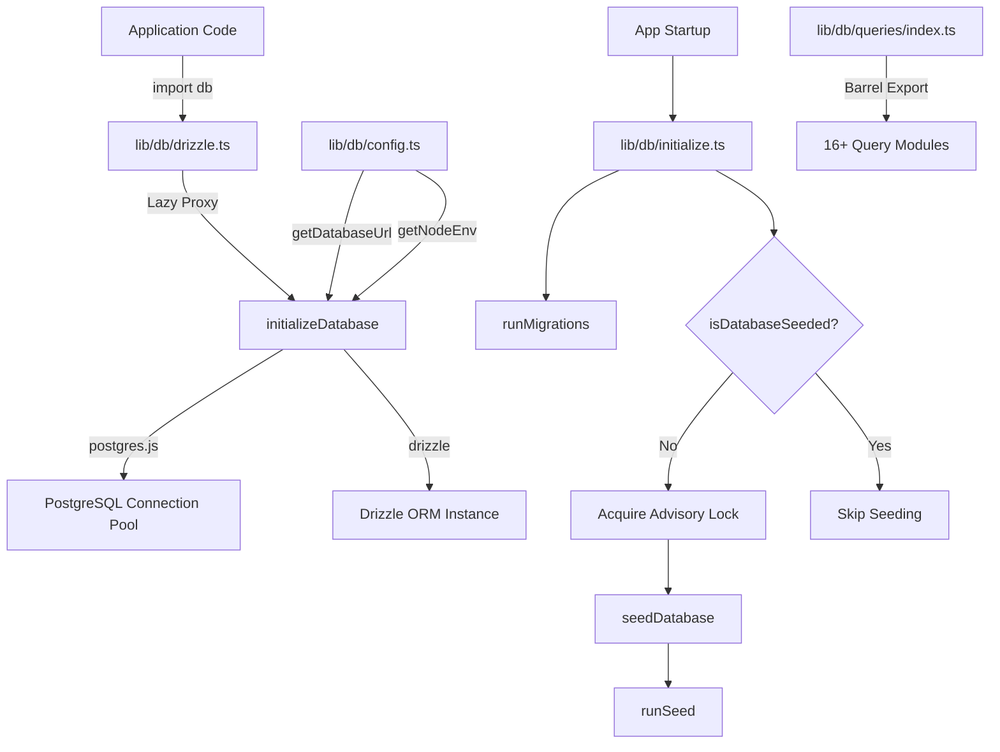
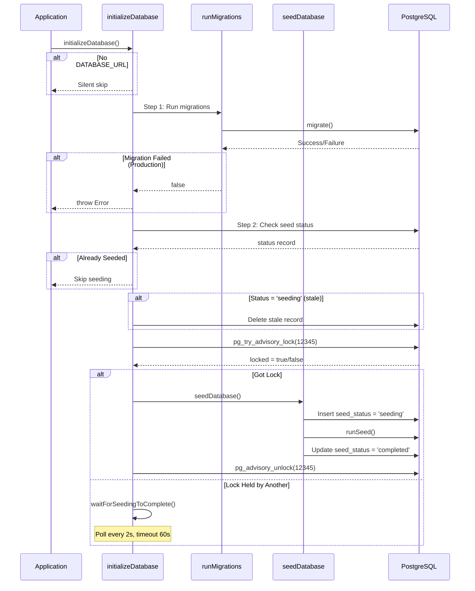

# Модул за помощни програми за бази данни

Модулът за помощни програми за база данни (`template/lib/db/`) управлява обединяването на връзките на PostgreSQL чрез `postgres.js`, инициализация на Drizzle ORM, автоматизирани миграции и зареждане на база данни с безопасно заключване при едновременност. Той е проектиран да работи в среда без сървър (Vercel), където множество студени стартирания могат да се състезават за инициализиране на базата данни.

## Преглед на архитектурата



## Изходни файлове

|Файл|Описание|
|------|-------------|
|`lib/db/config.ts`|Безопасна за скрипт конфигурация на база данни (без `server-only`)|
|`lib/db/drizzle.ts`|Пул за връзки и инстанция на Drizzle с мързелив прокси|
|`lib/db/initialize.ts`|Автоматична миграция и оркестрация на зареждане|
|`lib/db/migrate.ts`|Миграционен бегач|
|`lib/db/queries/index.ts`|Експортиране на барел за всички модули за заявки|

## Конфигурация на база данни (`config.ts`)

Функции, безопасни за скриптове, които **не** импортират `server-only`, позволявайки използване в миграционни и начални скриптове:

```typescript
function getDatabaseUrl(): string | undefined;
function getNodeEnv(): 'development' | 'production' | 'test';
function isProduction(): boolean;
```

## Връзка и ORM (`drizzle.ts`)

### Мързелив прокси модел

Експортирането на `db` използва JavaScript `Proxy` за отлагане на инициализацията на връзката до първото използване. Това предотвратява грешки при свързване по време на изграждане, когато `DATABASE_URL` може да не е наличен.

```typescript
// Proxy intercepts all property access and initializes on demand
export const db = new Proxy({} as ReturnType<typeof drizzle>, {
  get(target, prop) {
    const database = initializeDatabase();
    return database[prop as keyof typeof database];
  },
});
```

### Конфигурация на пула за връзки

```typescript
function getPoolSize(): number;
// - Reads DB_POOL_SIZE env var (clamped to 1-50)
// - Defaults: 20 (production), 10 (development)
```

Настройки на басейна:
- `idle_timeout`: 20 секунди
- `connect_timeout`: 30 секунди
- `prepare`: невярно (изисква се за някои среди без сървър)

### Сингълтън чрез `globalThis`

Връзката се кешира на `globalThis`, за да оцелее при презарежданията на модула Next.js в процес на разработка:

```typescript
const globalForDb = globalThis as unknown as {
  conn: postgres.Sql | undefined;
  db: ReturnType<typeof drizzle> | undefined;
};
```

### Директен достъп до екземпляри

За случаи, изискващи действителния екземпляр на Drizzle (напр. адаптерът NextAuth.js Drizzle):

```typescript
import { getDrizzleInstance } from '@/lib/db/drizzle';

const adapter = DrizzleAdapter(getDrizzleInstance(), { ... });
```

## Migration Runner (`migrate.ts`)

### `runMigrations(): Promise<boolean>`

Изпълнява миграции на Drizzle от папката `./lib/db/migrations`. Безопасно е да се обадите при всяко стартиране, защото `migrate()` на Drizzle е идемпотентен -- той проследява приложените миграции в `__drizzle_migrations` таблица.

```typescript
import { runMigrations } from '@/lib/db/migrate';

const success = await runMigrations();
if (!success) {
  console.error('Migrations failed -- run pnpm db:migrate manually');
}
```

**Поведение:**
- Записва скорошна хронология на миграцията преди и след изпълнение
- Връща `true` при успех, `false` при неуспех
- Не хвърля -- грешките се регистрират и се връщат като булево

## Инициализация на база данни (`initialize.ts`)

### `initializeDatabase(): Promise<void>`

Основната функция за инициализация, извикана при стартиране на приложението. Обслужва пълния жизнен цикъл:



### Безопасност на паралелността

Множество екземпляри без сървър могат да стартират едновременно. Модулът предотвратява дублиране на зареждане чрез:

1. **Препоръчително заключване на PostgreSQL** (`pg_try_advisory_lock(12345)`) -- без блокиране
2. **Таблица за състоянието на семената** проследяване на състояния `seeding`, `completed`, `failed`
3. **Остаряло откриване** -- 5-минутен праг за блокиран `seeding` статус
4. **Изчакване и анкета** -- екземпляри, които не могат да получат анкетата за заключване на всеки 2 секунди

### Помощни функции

```typescript
// Check if database has been successfully seeded
async function isDatabaseSeeded(): Promise<boolean>;

// Wait for another instance to finish seeding (60s timeout, 2s intervals)
async function waitForSeedingToComplete(): Promise<boolean>;
```

## Модули за заявки

Директорията `lib/db/queries/` съдържа специфични за домейна модули за заявки, всички повторно експортирани чрез `index.ts`:

|Модул|Домейн|
|--------|--------|
|`activity.queries.ts`|Регистриране на активността|
|`auth.queries.ts`|Удостоверяване (търсене на потребител, проверка на парола)|
|`client.queries.ts`|Клиентски профили|
|`comment.queries.ts`|Коментари|
|`company.queries.ts`|Фирмени профили|
|`dashboard.queries.ts`|Статистика на таблото|
|`engagement.queries.ts`|Гледания, гласове, събиране на любими|
|`item.queries.ts`|Артикул CRUD|
|`location-index.queries.ts`|Базирано на местоположение индексиране|
|`newsletter.queries.ts`|Абонаменти за бюлетин|
|`payment.queries.ts`|Записи за плащане|
|`report.queries.ts`|Доклади|
|`subscription.queries.ts`|Абонаменти|
|`survey.queries.ts`|Проучвания и отговори|
|`user.queries.ts`|Управление на потребителите|
|`vote.queries.ts`|Система за гласуване|

### Импортиране на модел

```typescript
import {
  getUserByEmail,
  getClientProfileByUserId,
  logActivity,
  isUserAdmin,
} from '@/lib/db/queries';
```

## Променливи на средата

|Променлива|Задължително|Описание|
|----------|----------|-------------|
|`DATABASE_URL`|Не (по избор DB)|Низ за свързване на PostgreSQL|
|`DB_POOL_SIZE`|не|Размер на пула на връзката (по подразбиране: 10/20)|
|`NODE_ENV`|не|Определя размера на пула по подразбиране и регистрирането|
