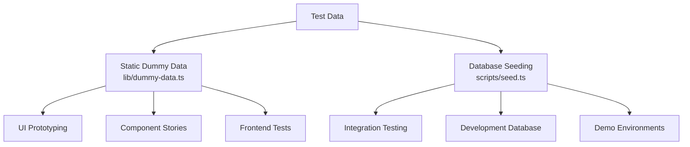
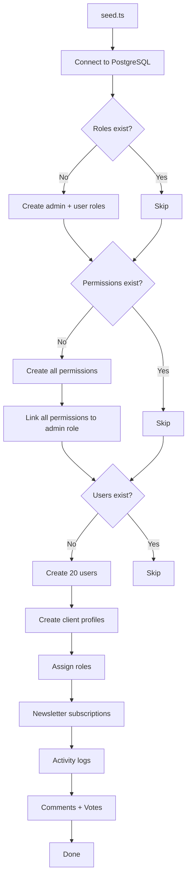
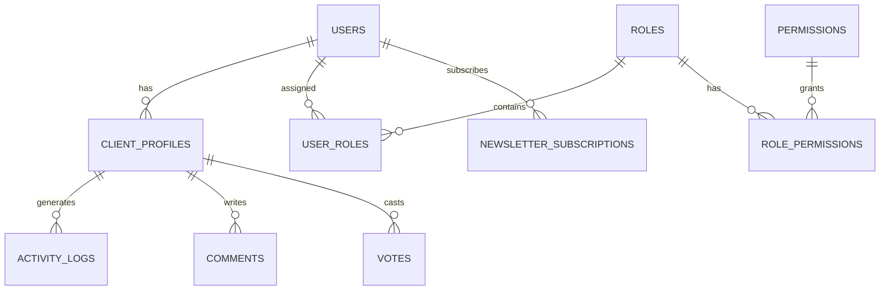

# Фиктивна система за данни

Шаблонът предоставя два подхода за тестване на данни: статични фиктивни данни за разработка на потребителски интерфейс и създаване на прототипи и система за зареждане на база данни за генериране на реалистични записи в PostgreSQL. Заедно те покриват пълния жизнен цикъл на разработка от макети до интеграционно тестване.

## Преглед



## Статични фиктивни данни

Модулът `lib/dummy-data.ts` експортира въведени примерни данни за използване в компоненти по време на разработката.

### Интерфейс за подаване

```typescript
export interface Submission {
  id: string;
  title: string;
  description: string;
  status: "approved" | "pending" | "rejected";
  submittedAt: string | null;
  approvedAt?: string;
  rejectedAt?: string;
  rejectionReason?: string;
  category: string;
  tags: string[];
  views: number;
  likes: number;
}
```

### dummySubmissions

Шест примерни подавания, покриващи всички състояния на статус:

|ID|Заглавие|Статус|Категория|Изгледи|Харесвания|
|---|---|---|---|---|---|
| 1 |Модерна платформа за електронна търговия|одобрени|Уеб разработка| 1250 | 89 |
| 2 |Приложение за управление на задачи|в очакване|Мобилна разработка| 567 | 23 |
| 3 |Табло за времето|отхвърлени|Уеб разработка| 890 | 45 |
| 4 |AI чат асистент|одобрени|AI/ML| 2100 | 156 |
| 5 |Приложение за проследяване на фитнес|в очакване|Мобилна разработка| 432 | 18 |
| 6 |Блог платформа|в очакване|Уеб разработка| 0 | 0 |

Употреба в компоненти:

```typescript
import { dummySubmissions } from '@/lib/dummy-data';

export function SubmissionList() {
  return (
    <div>
      {dummySubmissions.map((submission) => (
        <SubmissionCard key={submission.id} submission={submission} />
      ))}
    </div>
  );
}
```

### dummyПортфолио

Три примерни елемента от портфолио за представяне на карти с проекти:

|ID|Заглавие|Представено|Етикети|
|---|---|---|---|
| 1 |Платформа за електронна търговия|да|Next.js, Stripe, Електронна търговия|
| 2 |Приложение за управление на задачи|да|React, Firebase, в реално време|
| 3 |Табло за времето|не|Vue.js, API за времето, табло за управление|

Всеки елемент от портфолиото включва:

```typescript
{
  id: string;
  title: string;
  description: string;
  imageUrl: string;      // Unsplash placeholder image
  externalUrl: string;   // Demo link
  tags: string[];
  isFeatured: boolean;
}
```

## Зареждане на база данни

Скриптът `scripts/seed.ts` генерира реалистични данни директно в PostgreSQL, използвайки Drizzle ORM.

### Засяваща архитектура



### Връзки с данни



### Генерирани потребителски профили

Сеялката създава профили с детерминистична вариация:

```typescript
// Plan distribution
plan: i % 5 === 0 ? 'premium'    // 20% premium
    : i % 3 === 0 ? 'standard'   // ~13% standard
    : 'free';                     // ~67% free

// Job titles alternate
jobTitle: i % 2 === 0 ? 'Developer' : 'Designer';

// Companies alternate
company: i % 2 === 0 ? 'Acme Inc.' : 'Globex';

// Bios for every 3rd user
bio: i % 3 === 0 ? 'Power user' : null;
```

### Модели на регистрационния файл на дейността

Дневниците на активността преминават през четири типа действия:

|Индекс модел|Действие|Описание|
|---|---|---|
|`i % 4 === 0`|`SIGN_UP`|Създаване на акаунт|
|`i % 4 === 1`|`SIGN_IN`|Събитие за влизане|
|`i % 4 === 2`|`COMMENT`|Коментарът е публикуван|
|`i % 4 === 3`|`VOTE`|Гласувайте|

Времевите клейма са рандомизирани в рамките на последните 7 дни.

### Разпределение на гласовете

Гласовете използват разделяне 75/25 в полза на гласовете за:

```typescript
voteType: i % 4 === 0 ? VoteType.DOWNVOTE : VoteType.UPVOTE
```

### Конфигурация на връзката

Сидерът използва консервативни настройки за връзка, подходящи за скриптове:

```typescript
const conn = postgres(databaseUrl, {
  max: 1,              // Single connection (no pool needed)
  idle_timeout: 20,    // Close idle connections after 20s
  connect_timeout: 10, // 10-second connection timeout
  prepare: false,      // Disable prepared statements
});
```

## Засяване на ивични продукти

Скриптът `scripts/seed-stripe-products.ts` създава каталога за фактуриране в Stripe. Вижте документацията [Скриптове за база данни](../development/database-scripts.md) за пълния списък с продукти.

## Идемпотентност

И двата подхода за зареждане са проектирани да бъдат безопасни за многократно изпълнение:

|Тип данни|Състояние на предпазителя|Поведение при повторно изпълнение|
|---|---|---|
|Роли|`SELECT * FROM roles LIMIT 1`|Пропуснете, ако има такива|
|Разрешения|`SELECT * FROM permissions LIMIT 1`|Пропуснете, ако има такива|
|Потребители|`SELECT count(*) FROM users`|Пропуснете, ако броят е > 0|
|Бюлетин|Включен в блока за създаване на потребители|Пропуснати с потребители|

## Използване на фиктивни данни в разработката

### Модел 1: Прототипиране на компонент

Използвайте статични фиктивни данни за изграждане на UI компоненти, преди бекендът да е готов:

```typescript
import { dummySubmissions, type Submission } from '@/lib/dummy-data';

interface SubmissionCardProps {
  submission: Submission;
}

export function SubmissionCard({ submission }: SubmissionCardProps) {
  const statusColors = {
    approved: 'bg-green-100 text-green-800',
    pending: 'bg-yellow-100 text-yellow-800',
    rejected: 'bg-red-100 text-red-800',
  };

  return (
    <div className="p-4 border rounded-lg">
      <h3>{submission.title}</h3>
      <span className={statusColors[submission.status]}>
        {submission.status}
      </span>
      <p>{submission.description}</p>
      <div className="flex gap-2">
        {submission.tags.map(tag => (
          <span key={tag} className="badge">{tag}</span>
        ))}
      </div>
    </div>
  );
}
```

### Модел 2: Макети на таблото

```typescript
import { dummySubmissions } from '@/lib/dummy-data';

// Derive stats from dummy data
const stats = {
  total: dummySubmissions.length,
  approved: dummySubmissions.filter(s => s.status === 'approved').length,
  pending: dummySubmissions.filter(s => s.status === 'pending').length,
  rejected: dummySubmissions.filter(s => s.status === 'rejected').length,
  totalViews: dummySubmissions.reduce((sum, s) => sum + s.views, 0),
};
```

### Модел 3: Замяна с реални данни

Когато бекенд интеграцията е готова, разменете импортирането:

```typescript
// Before (dummy data)
import { dummySubmissions } from '@/lib/dummy-data';
const submissions = dummySubmissions;

// After (real data)
const submissions = await getSubmissions();
```

## Добавяне на нови фиктивни данни

Когато добавяте нови функции, разширете `lib/dummy-data.ts` с въведени примерни данни:

1. Дефинирайте интерфейса TypeScript за формата на данните
2. Експортирайте го за използване в компоненти
3. Създайте примерни записи, покриващи крайни случаи (празни полета, низове с максимална дължина, всички стойности на състоянието)
4. Използвайте реалистични стойности (собствени имена, валидни URL адреси, разумни числа)
5. Включете както представени, така и непредставени елементи, където е приложимо

```typescript
// Example: adding dummy reviews
export interface DummyReview {
  id: string;
  authorName: string;
  rating: number;
  comment: string;
  createdAt: string;
}

export const dummyReviews: DummyReview[] = [
  {
    id: "1",
    authorName: "Jane Developer",
    rating: 5,
    comment: "Excellent tool for rapid prototyping",
    createdAt: "2024-02-01T10:00:00Z"
  },
  // ... more entries covering 1-star, no comment, etc.
];
```
