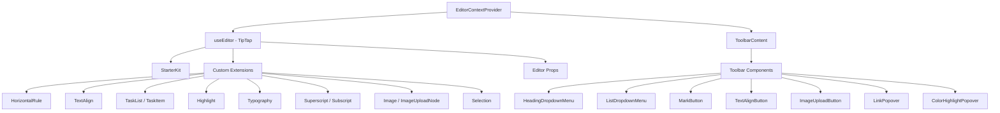

# Система за редактор

Шаблонът включва редактор с богат текст, изграден на TipTap (ProseMirror) с модулна архитектура от разширения, компоненти на лентата с инструменти, кукички и помощни функции. Редакторът поддържа заглавия, списъци, списъци със задачи, изображения, кодови блокове, форматиране на текст и др.

## Преглед на архитектурата



## Изходни файлове

|Справочник|Съдържание|
|-----------|----------|
|`lib/editor/extensions/`|Реекспортиране и конфигурация на разширението TipTap|
|`lib/editor/components/`|Компоненти на потребителския интерфейс (бутони на лентата с инструменти, изскачащи екрани, икони)|
|`lib/editor/hooks/`|React куки за управление на състоянието на редактора|
|`lib/editor/providers/`|Доставчик на контекст на редактора с настройка на разширението|
|`lib/editor/contents/`|Оформление на лентата с инструменти и компоненти на съдържанието на редактора|
|`lib/editor/utils/`|Помощни функции (преки пътища, проверка, качване)|

## Конфигурация на разширение

Разширенията са регистрирани в `EditorContextProvider`. `StarterKit` предоставя основна функционалност с допълнителни разширения, наслоени отгоре:

```typescript
const extensions = useMemo(() => [
  StarterKit.configure({
    horizontalRule: false,
    link: { openOnClick: false, enableClickSelection: true },
  }),
  HorizontalRule,
  TextAlign.configure({ types: ['heading', 'paragraph'] }),
  ImageUploadNode.configure({
    accept: 'image/*',
    maxSize: MAX_FILE_SIZE, // 5MB
    limit: 3,
    upload: handleImageUpload,
    onError: (error) => console.error('Upload failed:', error),
  }),
  TaskList,
  TaskItem.configure({ nested: true }),
  Highlight.configure({ multicolor: true }),
  Image,
  Typography,
  Superscript,
  Subscript,
  Selection,
], []);
```

### Резюме на разширението

|Разширение|Източник|Цел|
|-----------|--------|---------|
|`StarterKit`|`@tiptap/starter-kit`|Параграфи, получер, курсив, списъци, код, цитат|
|`HorizontalRule`|`@tiptap/extension-horizontal-rule`|Хоризонтални разделители|
|`TextAlign`|`@tiptap/extension-text-align`|Ляво, централно, дясно, подравняване|
|`TaskList` / `TaskItem`|`@tiptap/extension-list`|Интерактивни списъци с квадратчета за отметка|
|`Highlight`|`@tiptap/extension-highlight`|Многоцветно подчертаване на текст|
|`Typography`|`@tiptap/extension-typography`|Интелигентни кавички, тирета, многоточие|
|`Superscript`|`@tiptap/extension-superscript`|Горен индекс|
|`Subscript`|`@tiptap/extension-subscript`|Долен текст|
|`Selection`|`@tiptap/extensions`|Подобрено управление на селекцията|
|`Image`|`@tiptap/extension-image`|Показване на статично изображение|
|`ImageUploadNode`|По поръчка|Качване на изображение с плъзгане и пускане с напредък|

## Доставчик на контекст на редактора

Редакторът се предоставя чрез React Context за достъп до дърво:

```typescript
export const EditorContext = createContext<Editor | null>(null);

export function EditorContextProvider({ children }: { children: React.ReactNode }) {
  const editor = useEditor({
    immediatelyRender: false,
    shouldRerenderOnTransaction: false,
    editorProps: {
      attributes: {
        autocomplete: 'on',
        autocorrect: 'on',
        autocapitalize: 'off',
        'aria-label': 'Main content area, start typing to enter text.',
        class: cn('min-h-96'),
      },
    },
    extensions,
  });

  return <EditorContext.Provider value={editor}>{children}</EditorContext.Provider>;
}
```

Основни възможности за избор на конфигурация:
- `immediatelyRender: false` предотвратява несъответствия на SSR хидратация
- `shouldRerenderOnTransaction: false` оптимизира производителността, като избягва ненужните повторни изобразявания

## Конфигурация на лентата с инструменти

Компонентът `ToolbarContent` дефинира пълното оформление на лентата с инструменти, организирано в групи:

|Група|Компоненти|
|-------|------------|
|История|Отмени, повтори|
|Типове блокове|Падащо меню за заглавие (H1-H4), падащ списък (булет, подреден, задача), блоков цитат, кодов блок|
|Вградени знаци|Получер, курсив, зачертано, код, подчертаване, осветяване с цвят, връзка|
|Скрипт|Горен индекс, долен индекс|
|Подравняване|Ляво, централно, дясно, подравняване|
|Медия|Качване на изображение|

Групите са разделени от `ToolbarSeparator` компоненти с `Spacer` елементи за позициониране.

## Редакторски куки

### `useTiptapEditor`

Осигурява гъвкав достъп до екземпляра на редактора или от подпори, или от контекст:

```typescript
export function useTiptapEditor(providedEditor?: Editor | null): {
  editor: Editor | null;
  editorState?: Editor["state"];
  canCommand?: Editor["can"];
}
```

Тази кука обединява директно предоставен редактор с контекстния редактор, позволявайки на компонентите да работят както самостоятелно, така и в дървото на доставчика.

### Допълнителни куки

|Кука|Цел|
|------|---------|
|`use-editor.ts`|Управление на състоянието на основния редактор|
|`use-editor-sync.ts`|Синхронизация между екземплярите на редактора|
|`use-cursor-visibility.ts`|Позиция на курсора и проследяване на видимостта|
|`use-element-rect.ts`|Проследяване на ограничаващ правоъгълник на елемент|
|`use-scrolling.ts`|Позиция и поведение на превъртане|
|`use-throttled-callback.ts`|Забавено изпълнение на обратно извикване|
|`use-window-size.ts`|Отзивчиво проследяване на размера на прозореца|
|`use-unmount.ts`|Почистване при демонтиране на компонент|

## Полезни функции

### Форматиране на клавишни комбинации

Системата обработва специфични за платформата клавишни комбинации:

```typescript
export const MAC_SYMBOLS: Record<string, string> = {
  mod: "Command", command: "Command", meta: "Command",
  ctrl: "Ctrl", alt: "Option", shift: "Shift",
  // ... additional mappings
};

export const formatShortcutKey = (key: string, isMac: boolean, capitalize?: boolean) => {
  // Returns Mac symbols or formatted key names
};

export const parseShortcutKeys = (props: {
  shortcutKeys: string | undefined;
  delimiter?: string;
  capitalize?: boolean;
}) => string[];
```

### Проверка на схемата

```typescript
// Check if a mark type exists in the editor schema
export const isMarkInSchema = (markName: string, editor: Editor | null): boolean;

// Check if a node type exists in the editor schema
export const isNodeInSchema = (nodeName: string, editor: Editor | null): boolean;

// Check if extensions are registered
export function isExtensionAvailable(editor: Editor | null, extensionNames: string | string[]): boolean;
```

### Навигация по възел

```typescript
// Find a node at a specific document position
export function findNodeAtPosition(editor: Editor, position: number): TiptapNode | null;

// Find a node by reference or position
export function findNodePosition(props: {
  editor: Editor | null;
  node?: TiptapNode | null;
  nodePos?: number | null;
}): { pos: number; node: TiptapNode } | null;

// Move focus to the next node
export function focusNextNode(editor: Editor): boolean;
```

### Качване на изображение

```typescript
export const MAX_FILE_SIZE = 5 * 1024 * 1024; // 5MB

export const handleImageUpload = async (
  file: File,
  onProgress?: (event: { progress: number }) => void,
  abortSignal?: AbortSignal
): Promise<string>;
```

Манипулаторът за качване потвърждава размера на файла, поддържа проследяване на напредъка и обработва анулирането чрез `AbortSignal`.

### Дезинфекция на URL адреси

```typescript
export function isAllowedUri(uri: string | undefined, protocols?: ProtocolConfig): boolean;
export function sanitizeUrl(inputUrl: string, baseUrl: string, protocols?: ProtocolConfig): string;
```

Гарантира, че във връзките са разрешени само безопасни протоколи (`http`, `https`, `ftp`, `mailto` и др.). Опасните URL адреси се заменят с `"#"`.
