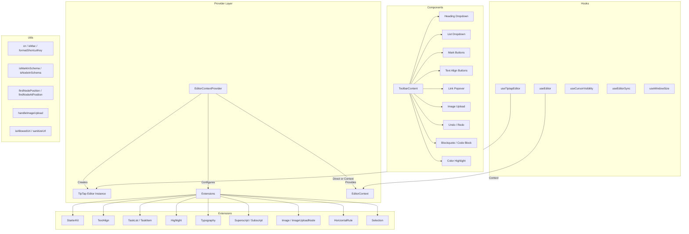

# Модул за помощни програми за редактор

Модулът за помощни програми за редактор (`template/lib/editor/`) предоставя пълно решение за редактиране на богат текст, изградено на **TipTap** (ProseMirror). Той включва предварително конфигуриран доставчик на редактор, разширения TipTap, пълна библиотека с компоненти на лентата с инструменти, помощни функции за манипулиране на DOM и персонализирани куки React за управление на състоянието на редактора.

## Преглед на архитектурата



## Изходни файлове

|Справочник|Описание|
|-----------|-------------|
|`lib/editor/index.ts`|Експорт на барел за всички подмодули|
|`lib/editor/providers/`|`EditorContextProvider` и `EditorContext`|
|`lib/editor/extensions/`|Реекспортиране на разширението TipTap|
|`lib/editor/hooks/`|Персонализирани куки за React|
|`lib/editor/utils/`|Полезни функции|
|`lib/editor/contents/`|`ToolbarContent` и `EditorContent` компоненти|
|`lib/editor/components/`|UI примитиви, бутони на лентата с инструменти, икони, възли|
|`lib/editor/styles/`|Редактор на CSS стилове|

## Доставчик на редактор

### `EditorContextProvider`

Обгръща деца с предварително конфигуриран екземпляр на редактор на TipTap:

```tsx
import { EditorContextProvider } from '@/lib/editor';

function MyEditor() {
  return (
    <EditorContextProvider>
      <ToolbarContent editor={null} />
      <EditorContent />
    </EditorContextProvider>
  );
}
```

### Конфигурация

Доставчикът конфигурира TipTap със следните настройки:

```typescript
const editor = useEditor({
  immediatelyRender: false,
  shouldRerenderOnTransaction: false,
  editorProps: {
    attributes: {
      autocomplete: 'on',
      autocorrect: 'on',
      autocapitalize: 'off',
      'aria-label': 'Main content area, start typing to enter text.',
      class: 'min-h-96',
    },
  },
  extensions: [/* ... */],
});
```

### Предварително конфигурирани разширения

|Разширение|Конфигурация|
|-----------|--------------|
|`StarterKit`|`horizontalRule: false`, `link.openOnClick: false`|
|`HorizontalRule`|По подразбиране|
|`TextAlign`|Отнася се за `heading` и `paragraph` възли|
|`ImageUploadNode`|Приемам: `image/*`, максимум 5 MB, ограничение до 3 изображения|
|`TaskList` / `TaskItem`|Вложените задачи са активирани|
|`Highlight`|Многоцветното е активирано|
|`Image`|По подразбиране|
|`Typography`|Интелигентни кавички и тирета|
|`Superscript` / `Subscript`|По подразбиране|
|`Selection`|По подразбиране|

## Кукички

### `useEditor(): Editor`

Извлича екземпляра на редактора от `EditorContext`. Трябва да се използва в `EditorContextProvider`.

```typescript
import { useEditor } from '@/lib/editor';

function MyComponent() {
  const editor = useEditor();
  // editor is the TipTap Editor instance
}
```

### `useTiptapEditor(providedEditor?): { editor, editorState?, canCommand? }`

Гъвкава кука, която приема незадължителен екземпляр на редактор или се връща към контекста TipTap:

```typescript
import { useTiptapEditor } from '@/lib/editor/hooks';

function ToolbarButton({ editor: externalEditor }) {
  const { editor, editorState, canCommand } = useTiptapEditor(externalEditor);

  const isBold = editorState ? editor?.isActive('bold') : false;
  const canBold = canCommand ? canCommand().toggleBold() : false;
}
```

### Други куки

|Кука|Цел|
|------|---------|
|`useCursorVisibility`|Проследява видимостта на позицията на курсора в прозореца за изглед|
|`useEditorSync`|Синхронизира съдържанието на редактора с външно състояние|
|`useElementRect`|Проследява елемент, ограничаващ правоъгълник|
|`useScrolling`|Открива състояние на превъртане|
|`useThrottledCallback`|Дроселира функция за обратно извикване|
|`useUnmount`|Изпълнява почистване при демонтиране на компонент|
|`useWindowSize`|Проследява размерите на прозореца|

## Полезни функции

### Помощник за име на клас

```typescript
function cn(...classes: (string | boolean | undefined | null)[]): string;
// Filters falsy values and joins with space
cn('min-h-96', isActive && 'bg-blue-500', undefined); // 'min-h-96 bg-blue-500'
```

### Откриване на платформа

```typescript
function isMac(): boolean;
// Returns true if navigator.platform includes 'mac'
```

### Форматиране на клавишни комбинации

```typescript
function formatShortcutKey(key: string, isMac: boolean, capitalize?: boolean): string;
// Mac: 'ctrl' -> '???', 'alt' -> '???', 'shift' -> '???', 'meta' -> '???'
// Windows: 'ctrl' -> 'Ctrl'

function parseShortcutKeys(props: {
  shortcutKeys: string | undefined;
  delimiter?: string;    // default: '+'
  capitalize?: boolean;  // default: true
}): string[];
// 'ctrl+shift+b' -> ['???', '???', 'B'] (Mac) or ['Ctrl', 'Shift', 'B'] (Windows)
```

### Проверка на схемата

```typescript
function isMarkInSchema(markName: string, editor: Editor | null): boolean;
// Checks if a mark type exists in the editor schema

function isNodeInSchema(nodeName: string, editor: Editor | null): boolean;
// Checks if a node type exists in the editor schema

function isExtensionAvailable(editor: Editor | null, extensionNames: string | string[]): boolean;
// Checks if one or more extensions are registered
// Logs a warning if none found
```

### Операции с възли

```typescript
function findNodeAtPosition(editor: Editor, position: number): TiptapNode | null;
// Returns the node at the given document position

function findNodePosition(props: {
  editor: Editor | null;
  node?: TiptapNode | null;
  nodePos?: number | null;
}): { pos: number; node: TiptapNode } | null;
// Finds position by node reference or position number

function focusNextNode(editor: Editor): boolean;
// Moves cursor to the next node, creating a paragraph if at end

function isNodeTypeSelected(editor: Editor | null, types: string[]): boolean;
// Checks if current selection is a NodeSelection matching any type

function isValidPosition(pos: number | null | undefined): pos is number;
// Type guard for valid document positions (>= 0)
```

### Качване на изображение

```typescript
const MAX_FILE_SIZE = 5 * 1024 * 1024; // 5MB

async function handleImageUpload(
  file: File,
  onProgress?: (event: { progress: number }) => void,
  abortSignal?: AbortSignal,
): Promise<string>;
// Returns the URL of the uploaded image
// Default implementation is a demo stub -- replace with actual upload logic
```

### URL валидиране

```typescript
function isAllowedUri(uri: string | undefined, protocols?: ProtocolConfig): boolean;
// Checks URI against allowed protocols:
// http, https, ftp, ftps, mailto, tel, callto, sms, cid, xmpp
// Plus any custom protocols passed in

function sanitizeUrl(inputUrl: string, baseUrl: string, protocols?: ProtocolConfig): string;
// Returns sanitized URL or '#' if not allowed
```

## Съдържание на лентата с инструменти

Компонентът `ToolbarContent` предоставя пълна, предварително конфигурирана лента с инструменти:

```tsx
import { ToolbarContent } from '@/lib/editor/contents';

<ToolbarContent editor={editor} />
```

### Групи на лентата с инструменти

|Група|Компоненти|
|-------|-----------|
|Отмяна/Повторяване|`UndoRedoButton` (отмяна, повторение)|
|Форматиране на блокове|`HeadingDropdownMenu` (H1-H4), `ListDropdownMenu` (куршум, подреден, задача), `BlockquoteButton`, `CodeBlockButton`|
|Вградено форматиране|`MarkButton` (удебелен, курсив, удар, код, подчертаване), `ColorHighlightPopover`, `LinkPopover`|
|Горен индекс|`MarkButton` (горен индекс, долен индекс)|
|Подравняване на текст|`TextAlignButton` (ляво, централно, дясно, подравняване)|
|Медия|`ImageUploadButton`|

## Библиотека с компоненти

### Примитивни компоненти

Основни компоненти на потребителския интерфейс, използвани от бутоните на лентата с инструменти:

- `Badge`, `Button`, `Card`, `DropdownMenu`, `Input`, `Popover`, `Separator`, `Spacer`, `Toolbar`, `Tooltip`

### Компоненти на възел

Персонализирани изгледи на възел TipTap:

- `HorizontalRuleNode` -- персонализирано хоризонтално разширение на правилото
- `ImageUploadNode` -- възел за качване на файлове с плъзгане и пускане

### Компоненти на икона

SVG икони за всички действия в лентата с инструменти (удебелен, курсив, нива на заглавия, списъци, подравняване и т.н.).
