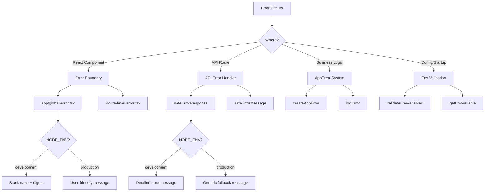

# Модели за обработка на грешки

## Преглед

Шаблонът Ever Works внедрява многопластова стратегия за обработка на грешки, която обхваща границите на грешките на React, отговорите за грешка на маршрута на API, въведените грешки в приложението и валидирането на променливите на средата. Дизайнът дава приоритет на сигурността (без изтичане на информация в производството), като същевременно поддържа удобно за разработчиците отстраняване на грешки в разработката.

## Архитектура



## Изходни файлове

|Файл|Цел|
|------|---------|
|`template/app/global-error.tsx`|Граница на React грешка на основно ниво|
|`template/app/not-found.tsx`|404 Не е намерена страница|
|`template/lib/utils/api-error.ts`|Помощни програми за грешка при маршрутизиране на API|
|`template/lib/utils/error-handler.ts`|Типове грешки в приложението и регистриране|
|`template/lib/auth/error-handler.ts`|Обработка на специфични за удостоверяването грешки|

## Реагиране на граници на грешки

### Глобална граница на грешката

Файлът `global-error.tsx` улавя необработени грешки в корена на приложението:

```typescript
'use client';

export default function GlobalError({
    error,
    reset,
}: {
    error: Error & { digest?: string };
    reset: () => void;
}) {
    useEffect(() => {
        console.error(error);
    }, [error]);

    return (
        <html lang="en">
            <body>
                <h1>Something went wrong!</h1>
                {process.env.NODE_ENV !== 'production' && (
                    <div>
                        <p className="text-red-600">{error.message}</p>
                        {error.stack && <pre>{error.stack}</pre>}
                        {error.digest && <p>Error ID: {error.digest}</p>}
                    </div>
                )}
                <Button onPress={() => reset()}>Refresh</Button>
                <Link href="/">Go Home</Link>
            </body>
        </html>
    );
}
```

Ключови поведения:
- **Разработване**: Показва съобщение за грешка, проследяване на стека и обобщение на грешките
- **Производство**: Показва само общо съобщение
- **Извлечение на грешка**: Уникален идентификатор, генериран от Next.js за корелация на грешки от страна на сървъра
- **Нулиране на функция**: Рендерира повторно поддървото на границата на грешката
- **Самостоятелен HTML**: Включва свои собствени тагове `<html>` и `<body>`, тъй като замества цялата страница

### Не е намерена страница

```typescript
'use client';

export default function NotFound() {
    const router = useRouter();
    return (
        <div>
            <h1>404</h1>
            <h2>Page Not Found</h2>
            <Button onClick={() => router.back()}>Go Back</Button>
            <Button onClick={() => router.push('/')}>Back to Home</Button>
        </div>
    );
}
```

## API обработка на грешки

### safeErrorResponse

Основната помощна програма за отговори на грешки в маршрута на API:

```typescript
export function safeErrorResponse(
    error: unknown,
    fallbackMessage: string,
    status: number = 500
): NextResponse {
    const detail = error instanceof Error ? error.message : String(error);

    // Always log full details server-side
    console.error(`[API Error] ${fallbackMessage}:`, detail);

    const message = process.env.NODE_ENV === "development" ? detail : fallbackMessage;

    return NextResponse.json({ success: false, error: message }, { status });
}
```

Използване в API маршрути:

```typescript
export async function GET(request: NextRequest) {
    try {
        const result = await someOperation();
        return NextResponse.json(result);
    } catch (error) {
        return safeErrorResponse(error, 'Failed to process request');
    }
}
```

### safeErrorMessage

За случаите, когато имате нужда от низа за грешка, без да създавате отговор:

```typescript
export function safeErrorMessage(error: unknown, fallbackMessage: string): string {
    if (process.env.NODE_ENV === "development") {
        return error instanceof Error ? error.message : String(error);
    }
    return fallbackMessage;
}
```

## Система за грешки в приложението

### Видове грешки

```typescript
export enum ErrorType {
    AUTH = 'auth',
    CONFIG = 'config',
    DATABASE = 'database',
    NETWORK = 'network',
    VALIDATION = 'validation',
    UNKNOWN = 'unknown'
}

export interface AppError {
    message: string;
    type: ErrorType;
    code?: string;
    originalError?: unknown;
}
```

### Създаване на въведени грешки

```typescript
import { createAppError, ErrorType } from '@/lib/utils/error-handler';

const error = createAppError(
    'Failed to configure OAuth providers',
    ErrorType.CONFIG,
    'OAUTH_CONFIG_FAILED',
    originalError
);
```

### Структурирано регистриране на грешки

```typescript
import { logError } from '@/lib/utils/error-handler';

// Logs: [CONFIG] [Auth Config]: Failed to configure OAuth providers
// Logs: Error code: OAUTH_CONFIG_FAILED
// Logs: Original error: <original error details>
logError(error, 'Auth Config');
```

Функцията `logError` обработва три форми на грешка:
1. **AppError** -- структуриран дневник с тип, код и оригинална грешка
2. **Грешка** -- стандартен журнал със съобщение и проследяване на стека
3. **Неизвестно** -- резервен регистрационен файл с принудителен низ

### Валидиране на променливата на средата

```typescript
import { validateEnvVariables, getEnvVariable } from '@/lib/utils/error-handler';

// Validate multiple variables at once
const validationError = validateEnvVariables([
    'DATABASE_URL', 'AUTH_SECRET', 'CRON_SECRET'
]);
if (validationError) {
    logError(validationError, 'Startup');
}

// Get a single required variable (throws if missing)
const dbUrl = getEnvVariable('DATABASE_URL');

// Get an optional variable
const optional = getEnvVariable('OPTIONAL_VAR', false);
```

## Обработка на грешки в Auth

Конфигурацията за удостоверяване използва грациозна деградация:

```typescript
const configureProviders = () => {
    try {
        const oauthProviders = configureOAuthProviders();
        return createNextAuthProviders({ /* full config */ });
    } catch (error) {
        const appError = createAppError(
            'Failed to configure OAuth providers. Falling back to credentials only.',
            ErrorType.CONFIG,
            'OAUTH_CONFIG_FAILED',
            error
        );
        logError(appError, 'Auth Config');

        // Fallback to credentials only
        return createNextAuthProviders({
            credentials: { enabled: true },
            google: { enabled: false },
            github: { enabled: false },
            facebook: { enabled: false },
            twitter: { enabled: false },
        });
    }
};
```

Ако конфигурирането на доставчика на OAuth е неуспешно, системата се връща към удостоверяване само с идентификационни данни, вместо да се срива.

## Обработка на грешки Поток по слой

|Слой|Стратегия|Производствено поведение|
|-------|----------|-------------------|
|Компоненти на React|Граница на грешката (`global-error.tsx`)|Общо съобщение, без проследяване на стека|
|API маршрути|`safeErrorResponse()`|Генерично резервно съобщение|
|Действия на сървъра|`validatedAction()` улавя Zod грешки|Първо съобщение за грешка при валидиране|
|Auth Config|Опитайте/хванете с `createAppError()`|Грациозно деградиране до пълномощията|
|Cron Джобс|Опитай/улови + структурирано регистриране|Регистрирана грешка, върнат отговор|
|Уеб кукички|Опитайте/хванете + 400 отговор|Общо съобщение за грешка до доставчика|

## Най-добри практики

1. **Никога не излагайте вътрешни елементи в производството** -- винаги използвайте `safeErrorResponse` за API маршрути
2. **Регистрирайте всичко от страна на сървъра** -- пълните подробности за грешката отиват в конзолата/регистрирането, независимо от средата
3. **Използвайте въведени грешки** -- `createAppError` с `ErrorType` за последователна категоризация
4. **Грациозно влошаване** - върнете се към намалена функционалност, вместо да се срива
5. **Обобщени грешки за корелация** – използвайте полето `digest` от грешките на Next.js, за да проследите проблеми от страна на сървъра
6. **Потвърдете в границите** -- проверете env vars при стартиране, проверете въвеждането в границите на API
