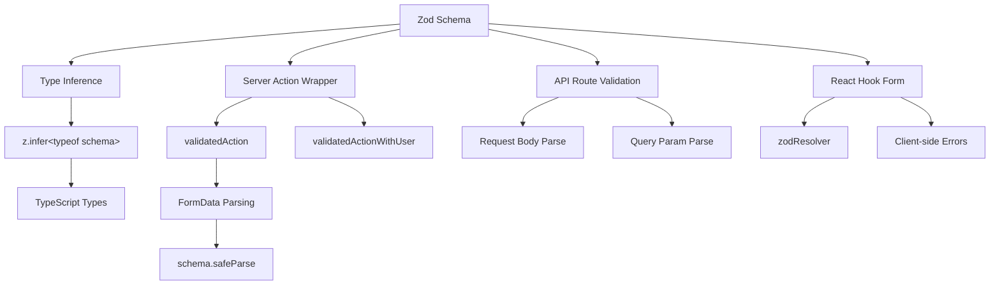

# Модели за валидиране на формуляри

## Преглед

Шаблонът Ever Works използва **Zod** като единствен източник на истина за валидиране на данни през границите на клиента и сървъра. Схемите за валидиране са организирани в `lib/validations/` и се използват от:

- **Действия на сървъра** чрез `validatedAction()` и `validatedActionWithUser()` обвивки
- **API Route Handlers** за валидиране на тялото на заявката/параметъра на заявката
- **React Hook Form** интеграция за валидиране на формуляр от страна на клиента
- **Извод за тип** чрез `z.infer<>` за безопасност на типа от край до край

## Архитектура



## Изходни файлове

|Файл|Цел|
|------|---------|
|`template/lib/validations/auth.ts`|Схема за валидиране на парола|
|`template/lib/validations/company.ts`|Фирмени CRUD схеми|
|`template/lib/validations/client-item.ts`|Схеми за подаване/актуализация на клиентски артикул|
|`template/lib/validations/client-dashboard.ts`|Схеми за заявки на таблото за управление|
|`template/lib/validations/sponsor-ad.ts`|Схеми за жизнения цикъл на рекламите на спонсори|
|`template/lib/validations/item.ts`|Схема на данните за местоположението|
|`template/lib/validations/user-location.ts`|Схема за настройки на местоположението на потребителя|
|`template/lib/auth/middleware.ts`|`validatedAction` / `validatedActionWithUser` помощни програми|

## Модели на схеми за валидиране

### Модел 1: Валидиране на парола с верижни правила

```typescript
import { z } from "zod";

export const passwordSchema = z
    .string()
    .min(8, "Password must be at least 8 characters")
    .regex(/[A-Z]/, "Password must contain at least one uppercase letter")
    .regex(/[a-z]/, "Password must contain at least one lowercase letter")
    .regex(/[0-9]/, "Password must contain at least one number")
    .regex(/[^A-Za-z0-9]/, "Password must contain at least one special character");
```

Тази схема налага строги изисквания за парола чрез верижни уточнения. Всеки `.regex()` предоставя конкретно съобщение за грешка, което потребителският интерфейс може да показва вградено.

### Модел 2: Създаване/актуализиране на двойки схеми

Проверката на компанията демонстрира модела за създаване/актуализация:

```typescript
export const createCompanySchema = z.object({
    name: z.string().min(1, "Company name is required").max(255),
    website: z.string().url("Invalid URL format").optional().or(z.literal("")),
    domain: z.string().max(255).optional()
        .transform((val) => val?.toLowerCase().trim() || undefined),
    slug: z.string().max(255).optional()
        .transform((val) => val?.toLowerCase().trim() || undefined)
        .refine(
            (val) => !val || /^[a-z0-9-]+$/.test(val),
            { message: "Slug must contain only lowercase letters, numbers, and hyphens" }
        ),
    status: z.enum(companyStatus).default("active"),
});

export const updateCompanySchema = z.object({
    id: z.string().uuid(),
    name: z.string().min(1).max(255).optional(),  // Optional for updates
    // ... other fields also optional
    status: z.enum(companyStatus).optional(),
});
```

Ключови разлики:
- **Създаване на схеми** има задължителни полета със стойности по подразбиране
- **Схемите за актуализиране** изискват `id` и правят всички други полета незадължителни
- И двете споделят `.transform()` логика за нормализиране (напр. малки букви)

### Модел 3: Полета за състояние, базирани на списък

```typescript
export const companyStatus = ["active", "inactive"] as const;
export const itemStatus = ['pending', 'approved', 'rejected'] as const;
export const sponsorAdStatuses = [
    "pending_payment", "pending", "rejected",
    "active", "expired", "cancelled",
] as const;

// Usage in schemas
status: z.enum(companyStatus).default("active"),
status: z.enum(sponsorAdStatuses).optional(),
```

Използването на `as const` масиви с `z.enum()` осигурява както валидиране по време на изпълнение, така и безопасност на типа по време на компилиране.

### Модел 4: Схеми на параметри на заявка с трансформации

```typescript
export const clientItemsListQuerySchema = z.object({
    page: z.string().optional()
        .transform(val => (val ? parseInt(val, 10) : 1))
        .refine(val => !Number.isNaN(val), { message: 'Page must be a valid number' })
        .refine(val => val >= 1, { message: 'Page must be at least 1' }),
    limit: z.string().optional()
        .transform(val => (val ? parseInt(val, 10) : 10))
        .refine(val => val >= 1 && val <= 100, { message: 'Limit must be between 1 and 100' }),
    status: z.enum(clientStatusFilter).optional().default('all'),
    search: z.string().max(100, 'Search query is too long').optional(),
    sortBy: z.enum(['name', 'updated_at', 'status', 'submitted_at']).optional().default('updated_at'),
    sortOrder: z.enum(['asc', 'desc']).optional().default('desc'),
    deleted: z.string().optional().transform(val => val === 'true'),
});
```

Параметрите на заявката пристигат като низове. Схемата използва `.transform()`, за да ги преобразува в правилните типове (числа, булеви стойности), като същевременно прилага валидиране и настройки по подразбиране.

### Модел 5: Схеми на вложени обекти с кръстосано валидиране

```typescript
export const updateLocationSchema = z
    .object({
        defaultLatitude: z.number().min(-90).max(90).nullable().optional(),
        defaultLongitude: z.number().min(-180).max(180).nullable().optional(),
        defaultCity: z.string().max(200).nullable().optional(),
        defaultCountry: z.string().max(100).nullable().optional(),
        locationPrivacy: locationPrivacySchema.optional(),
    })
    .refine(
        (data) => {
            const hasLat = data.defaultLatitude != null;
            const hasLng = data.defaultLongitude != null;
            return hasLat === hasLng;  // Both or neither
        },
        { message: 'Both latitude and longitude must be provided together' }
    );
```

`.refine()` на ниво обект потвърждава зависимостите между полетата -- географската ширина и дължина трябва да присъстват или и двете да отсъстват.

### Модел 6: Типове съюзи за гъвкави входове

```typescript
category: z.union([
    z.string().min(1, 'Category is required'),
    z.array(z.string().min(1)).min(1, 'At least one category is required'),
]).optional().nullable(),
```

Това приема както единичен низ, така и масив от низове за полето за категория, като включва различни типове въвеждане на формуляр.

## Валидиране от страна на сървъра

### validatedAction Wrapper

```typescript
export function validatedAction<S extends z.ZodType<any, any>, T>(
    schema: S,
    action: ValidatedActionFunction<S, T>
) {
    return async (prevState: ActionState, formData: FormData): Promise<T> => {
        const result = schema.safeParse(Object.fromEntries(formData));
        if (!result.success) {
            return { error: result.error.issues[0].message } as T;
        }
        return action(result.data, formData);
    };
}
```

Тази функция от по-висок ред:
1. Преобразува `FormData` в обикновен обект
2. Валидира спрямо схемата на Zod с помощта на `safeParse()`
3. Връща първата грешка при валидиране, ако е невалидна
4. Извиква функцията за действие с анализирани, въведени данни, ако е валидна

### validatedActionWithUser Wrapper

```typescript
export function validatedActionWithUser<S extends z.ZodType<any, any>, T>(
    schema: S,
    action: ValidatedActionWithUserFunction<S, T>
) {
    return async (prevState: ActionState, formData: FormData): Promise<T> => {
        const session = await auth();
        if (!session?.user) {
            throw new Error("User is not authenticated");
        }
        const result = schema.safeParse(Object.fromEntries(formData));
        if (!result.success) {
            return { error: result.error.issues[0].message } as T;
        }
        return action(result.data, formData, session.user);
    };
}
```

Това добавя проверка за удостоверяване преди валидиране, като предава удостоверения обект `user` към функцията за действие.

## Извод за тип

Every schema exports inferred TypeScript types:

```typescript
export type CreateCompanyInput = z.infer<typeof createCompanySchema>;
export type UpdateCompanyInput = z.infer<typeof updateCompanySchema>;
export type ClientUpdateItemInput = z.infer<typeof clientUpdateItemSchema>;
export type ClientCreateItemInput = z.infer<typeof clientCreateItemSchema>;
```

Тези типове се използват в целия сервизен слой и маршрутите на API, като гарантират, че валидираната форма на данни съответства на това, което бизнес логиката очаква.

## Най-добри практики

1. **Единична схема, множество потребители** -- дефинирайте веднъж в `lib/validations/`, използвайте навсякъде
2. **Трансформиране на границата** -- използвайте `.transform()` за преобразуване на низове в правилни типове
3. **Персонализирани съобщения за грешка** -- всяко правило за проверка включва удобно за потребителя съобщение
4. **Споделени подсхеми** -- повторно използване на схеми като `locationSchema` и `passwordSchema` във формуляри
5. **Извеждайте типове от схеми** -- никога не дефинирайте ръчно типове, които дублират дефиниции на схеми
6. **Кръстосано валидиране на полета** -- използвайте `.refine()` на ниво обект за правила за множество полета
7. **Разумни настройки по подразбиране** -- използвайте `.default()` за незадължителни полета със стандартни стойности
