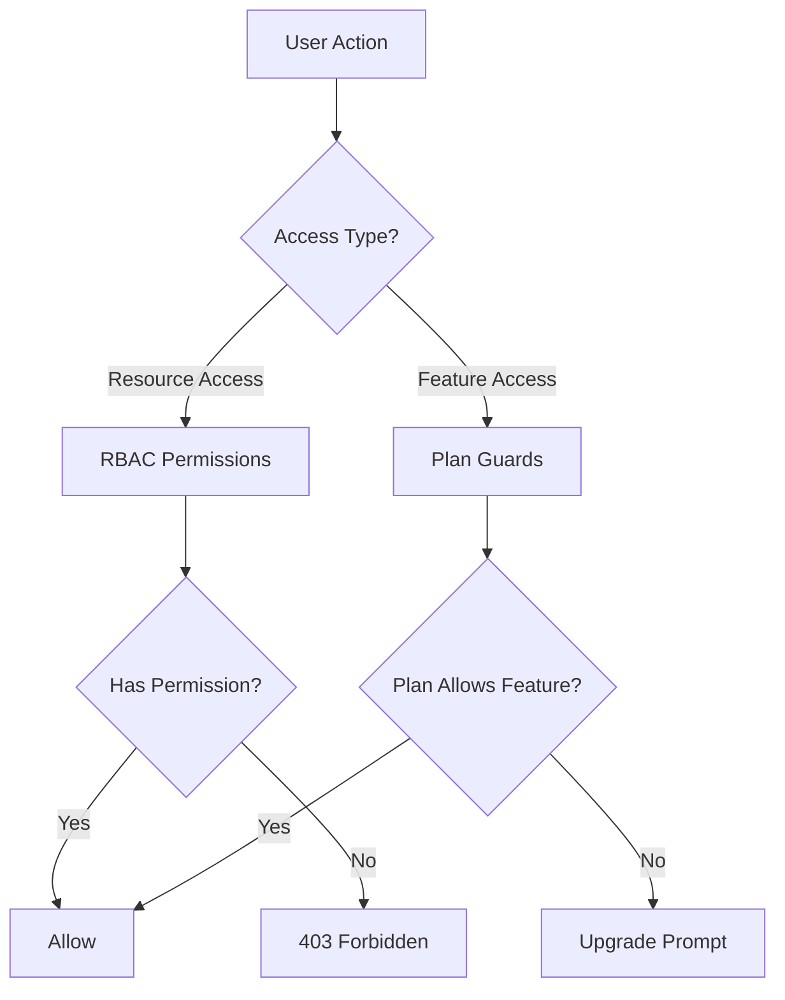
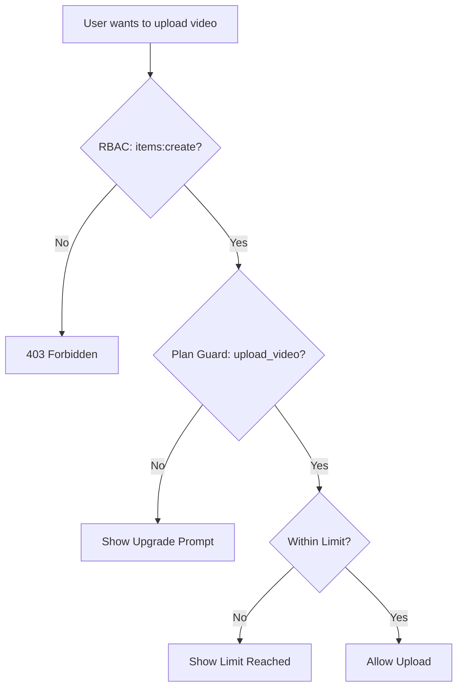

# Система за охрана и разрешителни

Шаблонът Ever Works внедрява двуслойна система за контрол на достъпа: **RBAC разрешения** за базиран на роли достъп до ресурси и **предпазители на плана** за стробиране на функции, базирани на абонамент. Заедно тези системи контролират какво могат да правят потребителите и до какви функции имат достъп.

## Архитектура на системата



## RBAC система за разрешения

### Дефиниции на разрешения

Всички разрешения са дефинирани в `lib/permissions/definitions.ts` с помощта на `resource:action` формат:

```typescript
const PERMISSIONS = {
  items: {
    read: 'items:read',
    create: 'items:create',
    update: 'items:update',
    delete: 'items:delete',
    review: 'items:review',
    approve: 'items:approve',
    reject: 'items:reject',
  },
  categories: { read, create, update, delete },
  tags: { read, create, update, delete },
  roles: { read, create, update, delete },
  users: { read, create, update, delete, assignRoles },
  analytics: { read, export },
  system: { settings },
} as const;
```

### Тип разрешение

Типът `Permission` е извлечен от константния обект `PERMISSIONS`, осигурявайки безопасност на типа:

```typescript
type Permission = 'items:read' | 'items:create' | ... | 'system:settings';
```

### Роли по подразбиране

Предварително са конфигурирани две роли по подразбиране:

|Роля|ID|Разрешения|
|---|---|---|
|Супер администратор|`super-admin`|Всички системни разрешения|
|Мениджър на съдържанието|`content-manager`|Елементи + Категории + Етикети (пълен CRUD + преглед)|

### Групи за разрешения

Разрешенията са организирани в удобни за потребителския интерфейс групи в `lib/permissions/groups.ts`:

|Група|Икона|Включени ресурси|
|---|---|---|
|Управление на съдържанието|`FileText`|Елементи, категории, етикети|
|Управление на потребителите|`Users`|Потребители, роли|
|Система и анализ|`Settings`|Анализ, система|

### Полезни функции

Модулът `lib/permissions/utils.ts` предоставя помощни програми за управление на състоянието за потребителския интерфейс с разрешения:

```typescript
// Create a permission state map for checkboxes
const state = createPermissionState(currentPermissions);
// { 'items:read': true, 'items:create': true, ... }

// Get selected permissions from state
const selected = getSelectedPermissions(state);

// Calculate changes between old and new permissions
const changes = calculatePermissionChanges(original, updated);
// { added: ['items:delete'], removed: ['tags:create'] }

// Compare two permission sets
const equal = arePermissionsEqual(perms1, perms2);

// Filter permissions by search term
const filtered = filterPermissions(allPerms, 'items');
```

## Система за охрана на плана

Защитниците на плана контролират достъпа до функции въз основа на абонаментния план на потребителя. Системата е дефинирана в `lib/guards/plan-features.guard.ts`.

### Йерархия на плана

```typescript
const PLAN_LEVELS: Record<string, number> = {
  free: 1,
  standard: 2,
  premium: 3,
};
```

### Дефиниции на характеристиките

Всички затворени функции са изброени в `FEATURES`:

|Категория|Характеристики|
|---|---|
|Подчинение|`submit_product`, `extended_description`, `unlimited_description`, `upload_images`, `upload_video`|
|Значки|`verified_badge`, `sponsored_badge`|
|Преглед|`priority_review`, `instant_review`|
|Видимост|`search_visibility`, `category_placement`, `sponsored_position`, `homepage_featured`, `newsletter_mention`|
|Анализ|`view_statistics`, `advanced_analytics`|
|поддръжка|`email_support`, `priority_email_support`, `phone_support`|
|Социални|`social_sharing`, `learn_more_button`|
|други|`free_modifications`, `unlimited_submissions`|

### Матрица за достъп до функции

Всяка функция се съпоставя с правило за достъп:

|Тип достъп|Синтаксис|Пример|
|---|---|---|
|Всички планове|`'all'`|`submit_product`, `upload_images`|
|Единичен план|`PaymentPlan.PREMIUM`|`upload_video`, `instant_review`|
|Минимален план|`{ minPlan: PaymentPlan.STANDARD }`|`verified_badge`, `priority_review`|
|Конкретни планове|`[PaymentPlan.STANDARD, PaymentPlan.PREMIUM]`|(персонализирани функции)|

### Ограничения на плана

Числените ограничения варират според плана:

|Лимит|безплатно|Стандартен|Премиум|
|---|---|---|---|
|`max_images`| 1 | 5 |Неограничен|
|`max_description_words`| 200 | 500 |Неограничен|
|`max_submissions`| 1 | 10 |Неограничен|
|`review_days`| 7 | 3 | 1 |
|`free_modification_days`| 0 | 30 | 365 |

### Използване на защита от страната на сървъра

```typescript
import { canAccessFeature, createPlanGuard, FEATURES } from '@/lib/guards';

// Simple check
const allowed = canAccessFeature(FEATURES.UPLOAD_VIDEO, userPlan);

// Guard factory for multiple checks
const guard = createPlanGuard(userPlan);
guard.canAccess(FEATURES.VERIFIED_BADGE);       // boolean
guard.requireFeature(FEATURES.UPLOAD_VIDEO);     // throws PlanGuardError
guard.getLimit('max_images');                    // number | null
guard.isWithinLimit('max_submissions', count);   // boolean
guard.getAccessibleFeatures();                   // Feature[]
```

### PlanGuardError

Когато `requireFeature` се провали, той извежда въведена грешка:

```typescript
class PlanGuardError extends Error {
  feature: Feature;      // e.g., 'upload_video'
  userPlan: string;      // e.g., 'free'
  requiredPlan: PaymentPlan; // e.g., 'premium'
}
```

### Предпазна кука от страната на клиента

Куката `usePlanGuard` в `hooks/use-plan-guard.ts` обгръща предпазната система за компонентите на React:

```typescript
import { usePlanGuard, FEATURES } from '@/hooks/use-plan-guard';

function VideoUploadButton() {
  const { canAccess, requireUpgrade, isLoading } = usePlanGuard();

  if (isLoading) return <Spinner />;

  const upgradePlan = requireUpgrade(FEATURES.UPLOAD_VIDEO);
  if (upgradePlan) {
    return <UpgradePrompt plan={upgradePlan} />;
  }

  return <Button>Upload Video</Button>;
}
```

### Специализирани куки

#### `useFeatureAccess`

Проверете достъпа до една функция:

```typescript
const { hasAccess, requiredPlan, isLoading } = useFeatureAccess(FEATURES.VERIFIED_BADGE);
```

#### `useFeatureLimit`

Проверете числените ограничения с оставащия брой:

```typescript
const { limit, isUnlimited, remaining, isWithinLimit } = useFeatureLimit('max_images', currentCount);

if (!isUnlimited && remaining <= 0) {
  return <LimitReached />;
}
```

## Съставяне на гвардия

Пазачите съставят естествено за сложни сценарии за контрол на достъпа:

```typescript
// Server: Combine RBAC + plan check
function canCreateItem(userPermissions: UserPermissions, userPlan: string): boolean {
  const hasRBACAccess = hasPermission(userPermissions, 'items:create');
  const hasPlanAccess = canAccessFeature(FEATURES.SUBMIT_PRODUCT, userPlan);
  return hasRBACAccess && hasPlanAccess;
}

// Client: Combine hooks
function CreateItemButton() {
  const { canAccess } = usePlanGuard();
  const { permissions } = useRolePermissions();

  const canCreate =
    hasPermission(permissions, 'items:create') &&
    canAccess(FEATURES.SUBMIT_PRODUCT);

  if (!canCreate) return null;
  return <Button>Create Item</Button>;
}
```

## Блок-схема на охраната



## Добавяне на нови пазачи

### Добавяне на ново разрешение

1. Добавете към `PERMISSIONS` в `lib/permissions/definitions.ts`:

```typescript
billing: {
  read: 'billing:read',
  manage: 'billing:manage',
},
```

2. Добавете към група разрешения в `lib/permissions/groups.ts`
3. Присвояване на подходящи роли по подразбиране

### Добавяне на функция за нов план

1. Добавете константата на функцията към `FEATURES` в `lib/guards/plan-features.guard.ts`
2. Дефинирайте правилото за достъп в `FEATURE_ACCESS`
3. По желание добавете цифрови ограничения към `PLAN_LIMITS`

## Най-добри практики

1. **Предпочитайте предпазители на план за стробиране на функции** и RBAC за контрол на достъпа до ресурси -- не ги смесвайте.
2. **Винаги проверявайте на сървъра** дори ако клиентът скрива елементите на потребителския интерфейс -- проверките от страна на клиента са само за UX.
3. **Използвайте `createPlanGuard`** за множество проверки в една и съща заявка, за да избегнете повтарящи се търсения на план.
4. **Обработване на състояния на зареждане** в кукички – данните за плана може да се зареждат асинхронно от абонаментната услуга.
5. **Запазете имената на функциите описателни** -- използвайте `upload_video`, а не `feature_3` за яснота в регистрационните файлове и съобщенията за грешки.
