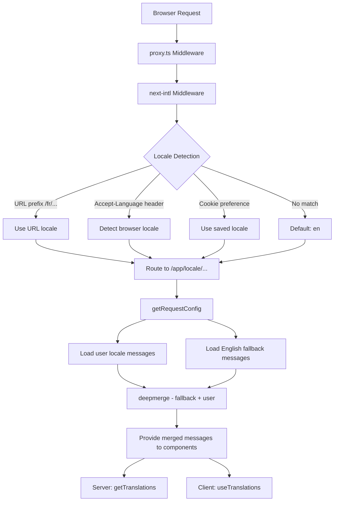

# Внедряване на i18n

## Преглед

Шаблонът Ever Works внедрява интернационализация с помощта на **next-intl** с поддръжка за 20+ локала, посока на текста RTL (отдясно наляво), резервни съобщения за дълбоко сливане и навигация, съобразена с локала. Системата е изградена около три слоя: конфигурация на маршрутизиране, зареждане на съобщения с резервен вариант и помощни средства за навигация, съобразени с локала.

## Архитектура



## Изходни файлове

|Файл|Цел|
|------|---------|
|`template/i18n/routing.ts`|Конфигурация на локално маршрутизиране|
|`template/i18n/request.ts`|Зареждане на съобщение с обхват на заявка|
|`template/i18n/navigation.ts`|Експортиране на навигация в зависимост от локала|
|`template/lib/constants.ts`|Локални и RTL дефиниции|
|`template/messages/*.json`|Файлове със съобщения за превод|
|`template/proxy.ts`|Мидълуер с разделителна способност на локалния префикс|

## Поддържани локали

```typescript
// lib/constants.ts
export const DEFAULT_LOCALE = 'en';
export const LOCALES = [
    'en', 'fr', 'es', 'de', 'zh', 'ar', 'he',
    'ru', 'uk', 'pt', 'it', 'ja', 'ko', 'nl',
    'pl', 'tr', 'vi', 'th', 'hi', 'id', 'bg'
] as const;

export type Locale = (typeof LOCALES)[number];

/** Locales that use right-to-left text direction */
export const RTL_LOCALES: readonly Locale[] = ['ar', 'he'] as const;
```

Шаблонът поддържа 20 локала, включително два RTL локала (арабски и иврит).

## Конфигурация на маршрутизиране

```typescript
// i18n/routing.ts
import { defineRouting } from "next-intl/routing";
import { DEFAULT_LOCALE, LOCALES } from "@/lib/constants";

export const routing = defineRouting({
    locales: LOCALES,
    defaultLocale: DEFAULT_LOCALE,
    localeDetection: true,
    localePrefix: "as-needed",
});
```

|Настройка|Стойност|Ефект|
|---------|-------|--------|
|`locales`|20 локални кода|Поддържан езиков набор|
|`defaultLocale`|`'en'`|Резервен вариант, когато не съответства локал|
|`localeDetection`|`true`|Автоматично откриване от заглавката `Accept-Language`|
|`localePrefix`|`"as-needed"`|Локалът по подразбиране няма префикс; други го правят|

С `localePrefix: "as-needed"`:
- Английски (по подразбиране): `https://example.com/about`
- френски: `https://example.com/fr/about`
- Арабски: `https://example.com/ar/about`

## Зареждане на съобщения с резервен вариант

```typescript
// i18n/request.ts
import deepmerge from "deepmerge";
import { getRequestConfig } from "next-intl/server";

export default getRequestConfig(async ({ requestLocale }) => {
    let locale = await requestLocale;

    if (!locale || !routing.locales.includes(locale as any)) {
        locale = routing.defaultLocale;
    }

    const userMessages = (await import(`../messages/${locale}.json`)).default;
    const defaultMessages = (await import(`../messages/en.json`)).default;
    const messages = deepmerge(defaultMessages, userMessages) as any;

    return { locale, messages };
});
```

Стратегията за дълбоко сливане гарантира, че:
1. Английските съобщения служат като пълен резервен набор
2. Съобщенията, специфични за локала, имат приоритет над английския, където има преводи
3. Липсващите преводи елегантно се връщат на английски, вместо да показват ключове

### Файлова структура на съобщението

```
messages/
  en.json        # Complete English messages (base)
  fr.json        # French translations
  es.json        # Spanish translations
  de.json        # German translations
  ar.json        # Arabic translations
  he.json        # Hebrew translations
  zh.json        # Chinese translations
  ...            # 13+ more locales
```

### Формати за дата/число

```typescript
// i18n/request.ts
export const formats = {
    dateTime: {
        short: {
            day: "numeric",
            month: "short",
            year: "numeric",
        },
    },
    number: {
        precise: {
            maximumFractionDigits: 5,
        },
    },
    list: {
        enumeration: {
            style: "long",
            type: "conjunction",
        },
    },
} satisfies Formats;
```

## Помощници за навигация

```typescript
// i18n/navigation.ts
import { createNavigation } from "next-intl/navigation";
import { routing } from "./routing";

export const { Link, redirect, usePathname, useRouter, getPathname } =
    createNavigation(routing);
```

Тези експорти заменят стандартните помощни програми за навигация Next.js с версии, съобразени с локала:

|Експортиране|Стандартен Next.js|Поведение, съобразено с локала|
|--------|-----------------|----------------------|
|`Link`|`next/link`|Добавя локален префикс към `href`|
|`redirect`|`next/navigation`|Запазва текущия локал при пренасочване|
|`usePathname`|`next/navigation`|Връща път без локален префикс|
|`useRouter`|`next/navigation`|`push()` / `replace()` добавете локален префикс|
|`getPathname`| -- |Път от страна на сървъра с локал|

### Използване в сървърни компоненти

```typescript
import { getTranslations } from 'next-intl/server';

export default async function Page({ params }: { params: Promise<{ locale: string }> }) {
    const { locale } = await params;
    const t = await getTranslations({ locale, namespace: 'common' });

    return <h1>{t('WELCOME')}</h1>;
}
```

### Използване в клиентски компоненти

```typescript
'use client';
import { useTranslations } from 'next-intl';
import { Link } from '@/i18n/navigation';

export function NavLink() {
    const t = useTranslations('navigation');
    return <Link href="/about">{t('ABOUT')}</Link>;
}
```

## Резолюция на локалния софтуер на мидълуера

Мидълуерът в `proxy.ts` разрешава локална информация за решения за защита на авторите:

```typescript
function resolveLocalePrefix(pathname: string): {
    prefix: string;           // "/fr" or ""
    hasLocale: boolean;
    locale?: string;
    pathWithoutLocale: string; // "/admin/items"
} {
    const segments = pathname.split('/').filter(Boolean);
    const maybeLocale = segments[0];
    const hasLocale = routing.locales.includes(maybeLocale as any);
    const pathWithoutLocale = hasLocale
        ? `/${segments.slice(1).join('/')}`
        : pathname;
    return {
        prefix: hasLocale ? `/${maybeLocale}` : '',
        hasLocale,
        locale: hasLocale ? maybeLocale : undefined,
        pathWithoutLocale
    };
}
```

Това се използва за създаване на URL адреси за пренасочване, съобразени с локала, в защитата на удостоверяването:

```typescript
url.pathname = `${localePrefix}/auth/signin`;
```

## Поддръжка на RTL

RTL локалите са дефинирани в `lib/constants.ts`:

```typescript
export const RTL_LOCALES: readonly Locale[] = ['ar', 'he'] as const;
```

Основният компонент на оформлението трябва да приложи атрибута `dir` въз основа на текущия локал:

```typescript
// app/[locale]/layout.tsx
const isRTL = RTL_LOCALES.includes(locale as Locale);

return (
    <html lang={locale} dir={isRTL ? 'rtl' : 'ltr'}>
        {/* ... */}
    </html>
);
```

## SEO: Алтернативи на Hreflang

Помощната програма `lib/seo/hreflang.ts` генерира алтернативни езикови връзки за SEO:

```typescript
import { generateHreflangAlternates } from '@/lib/seo/hreflang';

export async function generateMetadata(): Promise<Metadata> {
    return {
        alternates: {
            languages: generateHreflangAlternates('/about')
        }
    };
}
```

Това генерира `<link rel="alternate" hreflang="fr" href="...">` тагове за всички поддържани локали, плюс `x-default` запис, сочещ към английската версия.

## Интегриране на плъгин Next.js

```typescript
// next.config.ts
import createNextIntlPlugin from "next-intl/plugin";

const withNextIntl = createNextIntlPlugin('./i18n/request.ts');
const configWithIntl = withNextIntl(nextConfig);
```

Плъгинът `next-intl` се прилага към конфигурацията на Next.js с изричен път към конфигурационния файл на заявката.

## Най-добри практики

1. **Винаги използвайте `getTranslations` в сървърните компоненти** -- зарежда преводи без разходи за клиентски пакет
2. **Импортиране на навигация от `@/i18n/navigation`** -- осигурява свързване, съобразено с локала
3. **Запазете английския пълен** -- той служи като резервен вариант за всички други локали
4. **Използвайте преводи с пространство от имена** -- организирайте по функция (`common`, `footer`, `pages` и т.н.)
5. **Проверете RTL с `RTL_LOCALES`** -- приложете `dir="rtl"` на ниво оформление
6. **Генерирайте тагове hreflang** -- използвайте `generateHreflangAlternates()` във функциите за метаданни
