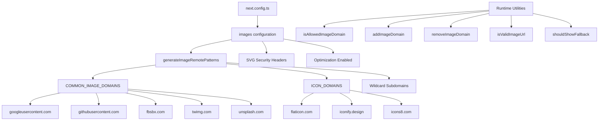

# Оптимизация на изображението

## Преглед

Шаблонът Ever Works конфигурира Next.js Image Optimization с динамични отдалечени шаблони, SVG поддръжка и помощен слой за управление на домейн. Системата обработва изображения от доставчици на OAuth (Google, GitHub, Facebook, Twitter), услуги за стокови снимки (Unsplash) и библиотеки с икони, като същевременно налага заглавки за сигурност за SVG съдържание.

## Архитектура



## Изходни файлове

|Файл|Цел|
|------|---------|
|`template/next.config.ts`|Конфигурация на изображението Next.js|
|`template/lib/utils/image-domains.ts`|Помощни програми за управление на домейн|

## Конфигурация

### Настройки на изображението Next.js

```typescript
// next.config.ts
images: {
    remotePatterns: generateImageRemotePatterns(),
    dangerouslyAllowSVG: true,
    contentDispositionType: 'attachment',
    contentSecurityPolicy: "default-src 'self'; script-src 'none'; sandbox;",
    unoptimized: false,
},
```

|Настройка|Стойност|Цел|
|---------|-------|---------|
|`remotePatterns`|Динамично чрез `generateImageRemotePatterns()`|Домейни на външни изображения в белия списък|
|`dangerouslyAllowSVG`|`true`|Разрешете SVG изображения чрез оптимизатора|
|`contentDispositionType`|`'attachment'`|Принудително изтегляне вместо вградено изобразяване за необработен достъп|
|`contentSecurityPolicy`|Строг пясъчник|Предотвратете базирани на SVG XSS атаки|
|`unoptimized`|`false`|Поддържайте активирана оптимизация на изображението|

### Сигурност на SVG

SVG файловете могат да съдържат вграден JavaScript. Шаблонът смекчава това с:
- **Правила за сигурност на съдържанието**: `script-src 'none'; sandbox;` предотвратява изпълнението на скриптове в SVG
- **Разпореждане на съдържанието**: `attachment` гарантира, че SVG файловете се изтеглят, а не се изпълняват при директен достъп

## Дистанционно генериране на шаблони

Функцията `generateImageRemotePatterns()` изгражда списъка с разрешени динамично:

```typescript
export function generateImageRemotePatterns() {
    const patterns = [
        {
            protocol: 'https' as const,
            hostname: 'lh3.googleusercontent.com',
            pathname: '/a/**'
        },
        {
            protocol: 'https' as const,
            hostname: 'avatars.githubusercontent.com',
            pathname: '/u/**'
        },
        {
            protocol: 'https' as const,
            hostname: 'platform-lookaside.fbsbx.com',
            pathname: '/platform/**'
        },
        // ... more specific patterns
    ];

    // Add wildcard subdomain patterns
    [...COMMON_IMAGE_DOMAINS, ...ICON_DOMAINS].forEach((domain) => {
        patterns.push({
            protocol: 'https' as const,
            hostname: `*.${domain}`,
            pathname: '/**'
        });
    });

    return patterns;
}
```

### Разрешени домейни

**Общи домейни на изображения** (OAuth аватари, стокови снимки):

|Домейн|Източник|
|--------|--------|
|`lh3.googleusercontent.com`|Google OAuth аватари|
|`avatars.githubusercontent.com`|GitHub OAuth аватари|
|`platform-lookaside.fbsbx.com`|Facebook OAuth аватари|
|`pbs.twimg.com`|Twitter/X аватари|
|`images.unsplash.com`|Unsplash стокови снимки|

**Икони на домейни** (икони на артикули):

|Домейн|Източник|
|--------|--------|
|`flaticon.com`|Flaticon икони|
|`iconify.design`|Иконифицирайте икони|
|`icons8.com`|Икони8 икони|
|`feathericons.com`|Икони с пера|
|`heroicons.com`|Икони на герои|
|`tabler-icons.io`|Икони на Tabler|

## Управление на домейн по време на изпълнение

### Проверка на разрешените домейни

```typescript
import { isAllowedImageDomain } from '@/lib/utils/image-domains';

// Returns true for whitelisted domains
isAllowedImageDomain('https://lh3.googleusercontent.com/a/photo.jpg'); // true
isAllowedImageDomain('https://cdn.flaticon.com/icons/svg/123.svg');    // true
isAllowedImageDomain('https://evil-site.com/image.jpg');               // false

// Relative URLs are always allowed
isAllowedImageDomain('/images/logo.png'); // true
```

### Динамично добавяне на домейн

```typescript
import { addImageDomain, removeImageDomain } from '@/lib/utils/image-domains';

// Add a new domain at runtime
addImageDomain('cdn.example.com');

// Add as an icon domain
addImageDomain('my-icons.com', true);

// Remove a domain
removeImageDomain('old-cdn.com');
```

Забележка: Добавките по време на изпълнение засягат функциите на помощната програма, но не променят отдалечените модели на Next.js `next.config.ts` (те изискват повторно изграждане).

### URL валидиране

```typescript
import { isValidImageUrl, isProblematicUrl, shouldShowFallback } from '@/lib/utils/image-domains';

// Check URL format validity
isValidImageUrl('https://example.com/photo.jpg'); // true
isValidImageUrl('/images/local.png');              // true (relative)
isValidImageUrl('not-a-url');                      // false

// Check for problematic URLs (non-image pages, redirect URLs)
isProblematicUrl('https://flaticon.com/icone-gratuite/search'); // true (not a direct image)
isProblematicUrl('https://cdn.flaticon.com/icon.svg');          // false (has image extension)

// Determine if fallback icon should be shown
shouldShowFallback('');                                          // true (empty)
shouldShowFallback('https://flaticon.com/icone-gratuite/123');   // true (problematic)
shouldShowFallback('https://cdn.flaticon.com/icon.svg');         // false
```

## Защитни заглавки

`next.config.ts` прилага заглавки за сигурност към всички маршрути:

```typescript
async headers() {
    return [{
        source: "/(.*)",
        headers: [
            { key: "X-Content-Type-Options", value: "nosniff" },
            { key: "X-Frame-Options", value: "DENY" },
            { key: "Referrer-Policy", value: "strict-origin-when-cross-origin" },
            { key: "X-DNS-Prefetch-Control", value: "on" },
            { key: "Strict-Transport-Security", value: "max-age=63072000; includeSubDomains; preload" },
            {
                key: "Content-Security-Policy",
                value: "default-src 'self'; script-src 'self' 'unsafe-inline' https://assets.lemonsqueezy.com; style-src 'self' 'unsafe-inline'; img-src 'self' data: https:; font-src 'self'; connect-src 'self' https:; frame-ancestors 'none';"
            },
        ],
    }];
},
```

Директивата `img-src 'self' data: https:` позволява изображения от един и същ произход, URI на данни и всеки HTTPS източник. Това умишлено е допустимо за `img-src`, тъй като компонентът Image Next.js обработва валидирането на домейн на ниво приложение.

## Най-добри практики

1. **Използвайте `next/image`** за всички външни изображения -- обработва оптимизация, отложено зареждане и преобразуване на формат
2. **Добавяне на нови домейни към `image-domains.ts`** -- не вградени в `next.config.ts`
3. **Проверете `shouldShowFallback()`** преди изобразяване - покажете икона по подразбиране за невалидни/липсващи URL адреси
4. **Запазете SVG заглавките за сигурност** -- никога не премахвайте настройките `contentSecurityPolicy` или `contentDispositionType`
5. **Предпочитайте ограничения за имена на пътища** -- използвайте специфични `pathname` модели (напр. `/a/**`) вместо широки заместващи знаци, когато е възможно
