# Общ преглед на помощните програми на Lib

Директорията `template/lib/` е основният помощен и бизнес логически слой на шаблона Ever Works. Той съдържа споделени модули за анализи, API комуникация, удостоверяване, фонови задачи, кеширане, конфигурация, достъп до база данни, плащания, инструменти за редактор, охрана и др. Цялата некомпонентна, немаршрутна логика живее тук, следвайки принципа за поддържане на представянето на компонентите и делегиране на тежка логика на `lib/`.

## Карта на модула

```mermaid
graph TD
    subgraph Core Infrastructure
        A[config/] --> B[config.ts / config-manager.ts]
        C[db/] --> D[drizzle.ts / queries/ / migrate.ts]
        E[cache-config.ts] --> F[cache-invalidation.ts]
    end

    subgraph Auth & Security
        G[auth/] --> H[NextAuth / Supabase / Guards / Caching]
        I[guards/] --> J[Plan Feature Access Control]
        K[permissions/] --> L[Role-Based Permissions]
    end

    subgraph API Layer
        M[api/] --> N[ApiClient / ServerClient / Error Handling]
    end

    subgraph Analytics & Tracking
        O[analytics/] --> P[PostHog + Sentry Singleton]
    end

    subgraph Background Processing
        Q[background-jobs/] --> R[Trigger.dev / Local / NoOp]
    end

    subgraph Content & Editor
        S[content.ts] --> T[Git CMS Content Loader]
        U[editor/] --> V[TipTap Rich Text Editor]
        W[lib.ts] --> X[Content Path / File Utilities]
    end

    subgraph Business Logic
        Y[services/] --> Z[20+ Domain Services]
        AA[repositories/] --> AB[Data Access Layer]
        AC[payment/] --> AD[Stripe / LemonSqueezy / Polar]
    end

    subgraph Shared Utilities
        AE[constants.ts + constants/]
        AF[utils.ts + utils/]
        AG[types.ts + types/]
        AH[validations/]
        AI[helpers.ts]
    end
```



## Структура на директорията

|Директория / Файл|Описание|
|-----------------|-------------|
|`lib/analytics/`|PostHog + Sentry analytics singleton ([docs](./analytics-module))|
|`lib/api/`|HTTP клиенти за браузър и сървър ([docs](./api-client-module))|
|`lib/auth/`|Удостоверяване с NextAuth.js + Supabase ([docs](./auth-utilities-module))|
|`lib/background-jobs/`|Планиране на задачи с Trigger.dev / local / no-op ([docs](./background-jobs-module))|
|`lib/cache-config.ts`|Кеш TTL и дефиниции на тагове ([docs](./cache-invalidation-module))|
|`lib/cache-invalidation.ts`|Функции за анулиране на кеша ([docs](./cache-invalidation-module))|
|`lib/config/`|Централизирана услуга за конфигуриране със схеми на Zod|
|`lib/config.ts`|Конфигурация на сайта (`siteConfig`)|
|`lib/config-manager.ts`|Мениджър на конфигурацията по време на изпълнение|
|`lib/constants.ts`|Константи на приложението ([docs](./constants-reference-module))|
|`lib/constants/`|Константи, специфични за домейна (плащане, анализи)|
|`lib/content.ts`|Зареждане и кеширане на CMS съдържание, базирано на Git|
|`lib/db/`|Връзка с база данни, миграции, зареждане, заявки ([docs](./db-utilities-module))|
|`lib/editor/`|Компоненти и помощни програми за редактор на форматиран текст TipTap ([docs](./editor-utilities-module))|
|`lib/guards/`|Контрол на достъпа до функции, базиран на план ([docs](./guards-module))|
|`lib/helpers.ts`|Съпоставяне на езиков код с код на държава|
|`lib/lib.ts`|Резолюция на пътя на съдържанието, помощни програми на файловата система|
|`lib/logger.ts`|Помощна програма за структурирано регистриране|
|`lib/mail/`|Изпращане на имейл с поддръжка на шаблони|
|`lib/mappers/`|Преобразуватели на трансформация на данни|
|`lib/maps/`|Интеграции на доставчик на карти (Google Maps, Mapbox)|
|`lib/middleware/`|Next.js мидълуер помощни програми|
|`lib/newsletter/`|Доставчици на абонамент за бюлетин|
|`lib/paginate.ts`|Помощна функция за пагиниране|
|`lib/payment/`|Обработка на плащания (Stripe, LemonSqueezy, Solidgate, Polar)|
|`lib/permissions/`|Дефиниции на разрешения, базирани на роли|
|`lib/query-client.ts`|Конфигурация на клиента на React Query|
|`lib/react-query-config.ts`|Опции по подразбиране на React Query|
|`lib/repositories/`|Слой за достъп до данни (образец на хранилище)|
|`lib/repository.ts`|Операции в хранилището на Git (клониране, изтегляне, синхронизиране)|
|`lib/seo/`|SEO метаданни и генератори на структурирани данни|
|`lib/services/`|Услуги за бизнес логика (20+ домейн услуги)|
|`lib/stripe-helpers.ts`|Помощни програми, специфични за Stripe|
|`lib/swagger/`|Анотации на Swagger/OpenAPI|
|`lib/theme-color-manager.ts`|Динамично управление на цветовете на темата|
|`lib/theme-utils.ts`|Помощни функции на темата|
|`lib/themes.tsx`|Дефиниции на теми|
|`lib/types.ts`|Дефиниции на споделен тип|
|`lib/types/`|Дефиниции на домейн специфични типове|
|`lib/utils.ts`|Общи полезни функции|
|`lib/utils/`|Помощни програми, специфични за домейна (15+ модула)|
|`lib/validations/`|Схеми за валидиране на Zod|

## Ключови самостоятелни модули

### `lib/helpers.ts` -- Съпоставяне на език/код на държава

```typescript
type LanguageCode = 'en' | 'fr' | 'es' | 'zh' | 'de' | 'ar' | ... ;

const LANGUAGE_COUNTRY_CODES: Record<LanguageCode, string>;
// { en: 'US', fr: 'FR', es: 'ES', zh: 'CN', ... }

const appLocales: string[];
// All supported locale codes

function getCountryCode(languageCode?: LanguageCode): string;
// 'en' -> 'US', 'fr' -> 'FR'
```

### `lib/lib.ts` -- Път на съдържанието и файлова система

Помощни програми само за сървър за управление на директория със съдържание:

```typescript
function getContentPath(): string;
// Returns '.content' path (local) or '/tmp/.content' (Vercel runtime)

async function ensureContentAvailable(): Promise<string>;
// Ensures content is available, triggering Git clone if needed

async function fsExists(filepath: string): Promise<boolean>;
async function dirExists(dirpath: string): Promise<boolean>;
```

### `lib/paginate.ts` -- Помощник за пагиниране

```typescript
function paginate<T>(items: T[], page: number, limit: number): T[];
```

### `lib/logger.ts` -- Структурирано регистриране

```typescript
const logger = {
  info(message: string, context?: Record<string, any>): void;
  warn(message: string, context?: Record<string, any>): void;
  error(message: string, context?: Record<string, any>): void;
  debug(message: string, context?: Record<string, any>): void;
};
```

### `lib/color-generator.ts` -- Детерминистично генериране на цветове

Генерира последователни цветове от низове (използвани за аватари, тагове и т.н.).

### `lib/theme-color-manager.ts` -- Динамични цветове на темата

Управлява персонализирани актуализации на CSS свойства за превключване на теми.

## Слой услуги (`lib/services/`)

Директорията на услугите съдържа услуги за бизнес логика, организирани по домейн:

|Обслужване|Отговорност|
|---------|---------------|
|`analytics-background-processor.ts`|Фонова аналитична обработка|
|`analytics-export.service.ts`|Експортиране на данни за анализ|
|`analytics-scheduled-reports.service.ts`|Планирани аналитични отчети|
|`category-file.service.ts`|Операции с категорийни файлове|
|`category-git.service.ts`|Категория Git операции|
|`collection-git.service.ts`|Колекция Git операции|
|`company.service.ts`|Управление на фирмен профил|
|`currency-detection.service.ts`|Откриване на потребителска валута|
|`currency.service.ts`|Конвертиране на валута|
|`email-notification.service.ts`|Имейл известия|
|`engagement.service.ts`|Преглед/гласуване/проследяване на любими|
|`file.service.ts`|Качване/управление на файлове|
|`geocoding/`|Геокодиране с доставчици на Google/Mapbox|
|`item-audit.service.ts`|Одитна пътека на артикул|
|`item-git.service.ts`|Елемент Git операции|
|`location/`|Индексиране и управление на местоположение|
|`moderation.service.ts`|Модериране на съдържанието|
|`notification.service.ts`|Push известия|
|`posthog-api.service.ts`|API на PostHog от страна на сървъра|
|`role-db.service.ts`|Управление на ролите|
|`settings.service.ts`|Настройки на приложението|
|`sponsor-ad.service.ts`|Управление на реклами на спонсори|
|`stripe-products.service.ts`|Синхронизиране на продукта с ивици|
|`subscription-jobs.ts`|Абонаментни фонови задачи|
|`subscription.service.ts`|Жизнен цикъл на абонамента|
|`survey.service.ts`|Управление на проучването|
|`sync-service.ts`|Синхронизиране на Git хранилище|
|`tag-git.service.ts`|Операции с етикет Git|
|`twenty-crm-*.ts`|Twenty CRM интеграция (5 файла)|
|`user-db.service.ts`|Операции с потребителска база данни|
|`webhook-subscription.service.ts`|Управление на уеб кукичка|

## Слой Utils (`lib/utils/`)

Помощни модули за специфични проблеми:

|Модул|Цел|
|--------|---------|
|`api-error.ts`|API клас на грешка|
|`bot-detection.ts`|Откриване на потребителски агент на бот|
|`checkout-utils.ts`|Помощници при плащане при плащане|
|`client-auth.ts`|Помощни програми за удостоверяване от страна на клиента|
|`currency-format.ts`|Форматиране на валута|
|`custom-navigation.ts`|Персонализирана навигация на рутера|
|`database-check.ts`|Проверка на състоянието на базата данни|
|`email-validation.ts`|Проверка на имейл формата|
|`error-handler.ts`|Обработчик на глобални грешки|
|`featured-items.ts`|Избор на избран артикул|
|`footer-utils.ts`|Помощни програми за връзки в долния колонтитул|
|`image-domains.ts`|Разрешени домейни на изображения|
|`pagination-validation.ts`|Валидиране на параметър за пагиниране|
|`payment-provider.ts`|Откриване на доставчик на плащания|
|`plan-expiration.utils.ts`|Планирайте изчисления за изтичане|
|`rate-limit.ts`|Ограничаване на скоростта на API|
|`request-body.ts`|Заявка за анализ на тялото|
|`server-url.ts`|Резолюция на URL адреса на сървъра|
|`settings.ts`|Помощни функции за настройки|
|`slug.ts`|Генериране на URL slug|
|`url-cleaner.ts`|Дезинфекция на URL адреси|
|`url-filter-sync.ts`|Синхронизиране на състоянието на URL филтъра|

## Принципи на проектиране

1. **Разделяне на притесненията** -- Бизнес логика в `services/`, достъп до данни в `repositories/` и `db/queries/`, представяне в `components/`.

2. **Безопасност на скриптове** -- Модулите, използвани от скриптове за миграция/зареждане (като `constants/payment.ts` и `db/config.ts`), избягват импортирането на специфичен за Next.js код.

3. **Мързелива инициализация** -- Връзките с бази данни, API клиентите и мениджърите на задания използват единични модели с мързелива инициализация, за да избегнат грешки по време на изграждане.

4. **Динамично импортиране** -- Специфичните за Node.js модули използват динамично импортиране във фонови задания и удостоверяване, за да предотвратят проблеми с групирането на уебпакети.

5. **Граница сървър/клиент** -- Модулите само за сървър използват пакета `server-only`. Модулите, безопасни за клиента, избягват импортиране на сървър. Директивата `'use client'` се използва пестеливо.
