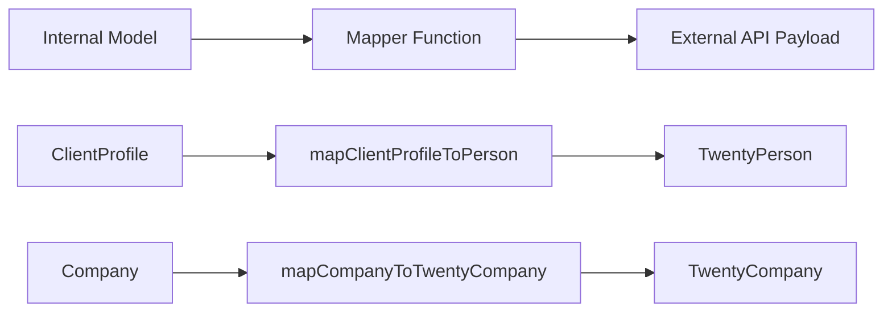

# Mapper Patterns

Шаблонът използва чисти функции за картографиране, за да трансформира данни между вътрешни модели и външни полезни натоварвания на API. Картографите са без странични ефекти, нулеви и валидират задължителните полета преди трансформация.

## Преглед на архитектурата



## Изходни файлове

|Файл|Цел|
|------|---------|
|`lib/mappers/twenty-crm.mapper.ts`|Картографира местни обекти към полезни натоварвания на Twenty CRM API|

## Принципи на проектиране

Модулът за картографиране следва стриктни конвенции за функционално програмиране:

1. **Чисти функции** -- без странични ефекти, без мутации, без извиквания на база данни
2. **Null-safe** -- всички незадължителни полета използват изрични нулеви/недефинирани проверки
3. **Проверка преди съпоставяне** -- задължителните полета се потвърждават с описателни грешки
4. **Принудително прилагане на външен идентификатор** -- всеки картографиран обект трябва да има валиден `external_id`

## External ID Validation

Всеки обект, картографиран към външна система, изисква валиден идентификатор:

```typescript
export function ensureExternalId(id: string | undefined | null, entityType: string): string {
  if (!id || id.trim() === '') {
    throw new Error(`${entityType} ID is required for external_id mapping`);
  }
  return id.trim();
}
```

Тази функция се извиква в началото на всеки картограф, за да се гарантира, че полето `external_id` никога не е празно.

## Location Extraction

Помощна функция анализира имената на градове от низове за местоположение в свободен текст:

```typescript
export function extractCityFromLocation(location: string | undefined | null): string | null {
  if (!location || location.trim() === '') return null;
  const parts = location.split(',');
  const city = parts[0]?.trim();
  return city || null;
}
```

Работи с формати като `"San Francisco"`, `"San Francisco, CA"` и `"San Francisco, CA, USA"`.

## Клиентски профил до двадесет CRM лица

Картира вътрешни `ClientProfile` записи към Twenty CRM `TwentyPerson` полезен товар:

```typescript
export function mapClientProfileToPerson(clientProfile: ClientProfile): TwentyPerson {
  const external_id = ensureExternalId(clientProfile.id, 'ClientProfile');

  const person: TwentyPerson = {
    external_id,
    name: clientProfile.name,
    email: clientProfile.email,
  };

  // Optional field mapping (null-safe)
  if (clientProfile.phone)     person.phone = clientProfile.phone;
  if (clientProfile.jobTitle)  person.job_title = clientProfile.jobTitle;
  if (clientProfile.company)   person.company_name = clientProfile.company;
  if (clientProfile.website)   person.website = clientProfile.website;

  const city = extractCityFromLocation(clientProfile.location);
  if (city) person.city = city;

  // Custom fields
  if (clientProfile.accountType) person.account_type = clientProfile.accountType;
  if (clientProfile.plan)        person.plan = clientProfile.plan;
  if (clientProfile.totalSubmissions !== null && clientProfile.totalSubmissions !== undefined) {
    person.total_submissions = clientProfile.totalSubmissions;
  }

  return person;
}
```

### Field Mapping Table

|ClientProfile Field|TwentyPerson Field|Задължително|Бележки|
|--------------------|--------------------|----------|-------|
|`id`|`external_id`|да|Validated and trimmed|
|`name`|`name`|да|Direct mapping|
|`email`|`email`|да|Direct mapping|
|`phone`|`phone`|не|Само ако присъства|
|`jobTitle`|`job_title`|не|camelCase към snake_case|
|`company`|`company_name`|не|Преименувано поле|
|`website`|`website`|не|Direct mapping|
|`location`|`city`|не|Извлечено чрез `extractCityFromLocation`|
|`accountType`|`account_type`|не|Персонализирано поле|
|`plan`|`plan`|не|Персонализирано поле|
|`totalSubmissions`|`total_submissions`|не|Изисква се изрична нулева проверка|

## Компания към Twenty CRM Company

Картографира вътрешни `Company` обекти към полезния товар на Twenty CRM `TwentyCompany`:

```typescript
export function mapCompanyToTwentyCompany(company: Company): TwentyCompany {
  const external_id = ensureExternalId(company.id, 'Company');

  const twentyCompany: TwentyCompany = {
    external_id,
    name: company.name,
  };

  if (company.domain)  twentyCompany.domain_name = company.domain;
  if (company.website) twentyCompany.website = company.website;
  if (company.status)  twentyCompany.status = company.status;

  return twentyCompany;
}
```

### Field Mapping Table

|Фирмено поле|Поле TwentyCompany|Задължително|Бележки|
|--------------|---------------------|----------|-------|
|`id`|`external_id`|да|Validated and trimmed|
|`name`|`name`|да|Direct mapping|
|`domain`|`domain_name`|не|Преименувано поле|
|`website`|`website`|не|Direct mapping|
|`status`|`status`|не|`'active'` или `'inactive'`|

## Добавяне на нови картографи

Когато създавате съпоставители за нови интеграции, следвайте установените модели:

```typescript
// 1. Always validate external_id first
const external_id = ensureExternalId(entity.id, 'EntityName');

// 2. Build the required fields object
const payload: ExternalType = {
  external_id,
  // ... required fields
};

// 3. Conditionally add optional fields (null-safe)
if (entity.optionalField) {
  payload.optional_field = entity.optionalField;
}

// 4. Return the payload -- never mutate the input
return payload;
```

## Съображения за тестване

Тъй като картографите са чисти функции, те са лесни за тестване на единици:

- Тествайте с попълнени всички незадължителни полета
- Тествайте с всички незадължителни полета като `null` или `undefined`
- Тествайте дали липсващите задължителни идентификатори хвърлят описателни грешки
- Тествайте извличането на местоположение с различни формати на низове
- Уверете се, че входният обект никога не е мутиран
