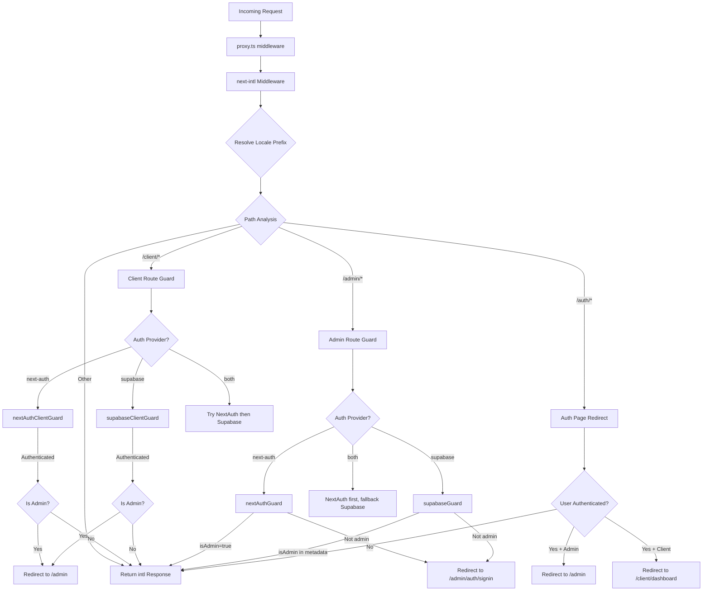

# Мидълуер верига и обработка на заявки

## Преглед

Шаблонът Ever Works използва архитектура на **унифициран междинен софтуер**, дефинирана в `proxy.ts` в основата на проекта. Този междинен софтуер организира три критични проблеми за всяка входяща заявка:

1. **Интернационализация** -- откриване на локал, вмъкване на префикс и маршрутизиране чрез `next-intl`
2. **Пазачи за удостоверяване** -- защита на `/admin/*` и `/client/*` маршрути с помощта на NextAuth, Supabase или и двете
3. **Базирано на роли пренасочване** -- изпращане на удостоверени потребители далеч от публични страници за удостоверяване и пренасочване на администратори/клиенти към съответните им табла за управление

Дизайнът поддържа модел на **pluggable auth provider**: междинният софтуер чете текущия `AuthProviderType` (`'next-auth'`, `'supabase'` или `'both'`) от централизираната конфигурация за удостоверяване и съответно избира подходящите функции за защита.

## Диаграма на архитектурата



## Изходни файлове

|Файл|Цел|
|------|---------|
|`template/proxy.ts`|Основна входна точка за междинен софтуер|
|`template/lib/auth/config.ts`|Конфигурация на доставчик на удостоверяване (`getAuthConfig()`)|
|`template/lib/auth/supabase/middleware.ts`|Помощник за опресняване на сесия Supabase|
|`template/lib/auth/validate-callback-url.ts`|Безопасно изграждане на URL адрес за обратно извикване|
|`template/i18n/routing.ts`|Конфигурация на локално маршрутизиране|

## Поръчка за обработка на заявка

### Стъпка 1: Интернационализация

Всяка заявка първо преминава през `next-intl` междинния софтуер, създаден с `createIntlMiddleware(routing)`:

```typescript
import createIntlMiddleware from 'next-intl/middleware';
import { routing } from './i18n/routing';

const intl = createIntlMiddleware(routing);
```

Това обработва откриването на локал чрез заглавката `Accept-Language`, предпочитанията за бисквитки и URL префикса. Конфигурацията за маршрутизиране използва `localePrefix: "as-needed"`, което означава, че локалът по подразбиране (`en`) не изисква URL префикс.

### Стъпка 2: Резолюция на локал

Помощникът `resolveLocalePrefix` извлича информация за локал от името на пътя:

```typescript
function resolveLocalePrefix(pathname: string): {
    prefix: string;       // e.g., "/fr" or ""
    hasLocale: boolean;
    locale?: string;
    pathWithoutLocale: string;  // e.g., "/admin/items"
}
```

Това е критично, защото всички последващи съвпадения на пътя (напр. проверка за `/admin` или `/client`) трябва да работят по пътя **без** префикса за локал.

### Стъпка 3: Избор на охрана въз основа на маршрута

Мидълуерът оценява `pathWithoutLocale`, за да определи коя защитна верига да приложи:

|Модел на пътя|Приложена охрана|Цел|
|-------------|--------------|---------|
|`/client` или `/client/*`|Защита на автентичността на клиента|Изисква удостоверяване; пренасочва администраторите към `/admin`|
|`/admin/*` (с изключение на `/admin/auth/signin`)|Административна защита на авторизацията|Изисква удостоверяване + `isAdmin` флаг|
|`/auth/*`|Пренасочване на страница за удостоверяване|Пренасочва удостоверените потребители от влизане/регистриране|
|Всичко останало|Без охрана|Преминава с отговор i18n|

### Стъпка 4: Проверка на автентификацията

#### NextAuth Guard (базиран на JWT)

```typescript
const token = await getToken({ req, secret: process.env.AUTH_SECRET });
if (token?.isAdmin === true) {
    return baseRes; // Admin access granted
}
```

Защитниците на NextAuth използват `getToken()` от `next-auth/jwt`, за да прочетат JWT токена от бисквитките. Това е съвместимо с Edge Runtime и не изисква търсене в база данни.

#### Supabase Guard

```typescript
const supRes = await supabaseUpdate(req);
// Merge cookies...
const { data: { user } } = await supabase.auth.getUser();
const isAdmin = user?.user_metadata?.isAdmin === true
    || user?.user_metadata?.role === 'admin';
```

Защитата на Supabase първо опреснява сесията с помощта на `updateSession()`, след което проверява потребителските метаданни за администраторски флагове.

### Стъпка 5: Разпространение на бисквитки

Важен детайл при изпълнението: когато пазач генерира отговор за пренасочване, всички бисквитки от `intlResponse` трябва да бъдат разпространени:

```typescript
const redirectRes = NextResponse.redirect(url);
baseRes.cookies.getAll().forEach((c) => redirectRes.cookies.set(c));
return redirectRes;
```

Това гарантира, че локалните предпочитания и бисквитките на сесията за удостоверяване оцеляват при пренасочвания.

## Конфигурация

### Избор на доставчик на удостоверяване

Доставчикът на удостоверяване се определя от `getAuthConfig()` в `lib/auth/config.ts`:

```typescript
export type AuthProviderType = 'supabase' | 'next-auth' | 'both';

export function getAuthConfig(): AuthConfig {
    // Priority 1: Global override via configureAuth()
    // Priority 2: Environment-based (detects Supabase env vars)
    // Priority 3: Default ('next-auth')
}
```

### Съпоставяне на междинен софтуер

```typescript
export const config = {
    matcher: ['/((?!api|trpc|_next|_vercel|.*\\..*).*)']
};
```

Този регулярен израз изключва:
- `/api/*` маршрути (обработвани от слоя API на Next.js)
- `/trpc/*` маршрути
- `/_next/*` (вътрешни елементи на Next.js)
- `/_vercel/*` (вътрешни части на Vercel)
- Всеки път с файлово разширение (статични активи)

### Сигурност на URL адреса за обратно извикване

Мидълуерът използва `createSafeCallbackUrl()` за предотвратяване на отворени атаки за пренасочване:

```typescript
export function createSafeCallbackUrl(pathname: string, search?: string): string {
    // Limits URL length to 2048 characters
    // Validates relative-only paths
}

export function isValidCallbackUrl(url: string | null): boolean {
    return url?.startsWith('/') && !url.startsWith('//');
}
```

## Режим на двоен доставчик („и двете“)

Когато `provider === 'both'`, междинният софтуер прилага резервна верига:

1. **Клиентски маршрути**: Първо опитайте NextAuth; ако не сте удостоверени, опитайте Supabase
2. **Административни маршрути**: Първо опитайте NextAuth; ако произвежда пренасочване (отказано), опитайте Supabase
3. **Auth pages**: Първо проверете NextAuth token, след това проверете Supabase сесията

Това позволява на организациите да мигрират между доставчици на удостоверяване, без да прекъсват съществуващите потребители.

## Ключови подробности за внедряването

### Съвместимост на Edge Runtime

Мидълуерът работи в Next.js Edge Runtime. Всички проверки за удостоверяване използват Edge-съвместими API:
- NextAuth: `getToken()` (базиран на JWT, не е необходима DB)
- Supabase: `createServerClient()` със сесия, базирана на бисквитки

### Разработка срещу производствена регистрация

Регистрирането на грешки се затваря зад `NODE_ENV === 'development'`:

```typescript
if (process.env.NODE_ENV === 'development') {
    console.log('[Middleware] Admin access granted via token');
}
```

### Обновяване на сесията на Supabase

Помощникът за междинен софтуер на Supabase (`updateSession`) се извиква преди всяка проверка за удостоверяване, за да се гарантира, че токените се обновяват:

```typescript
export async function updateSession(request: NextRequest) {
    const supabase = createServerClient(url, anonKey, {
        cookies: { getAll, setAll }
    });
    // IMPORTANT: DO NOT REMOVE auth.getUser()
    await supabase.auth.getUser();
    return supabaseResponse;
}
```

Коментарът в изходния код подчертава, че `auth.getUser()` не трябва да се премахва - това задейства цикъла на опресняване на токена, който предотвратява произволни излизания.
