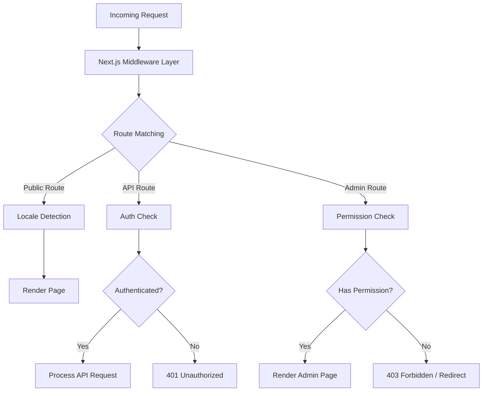
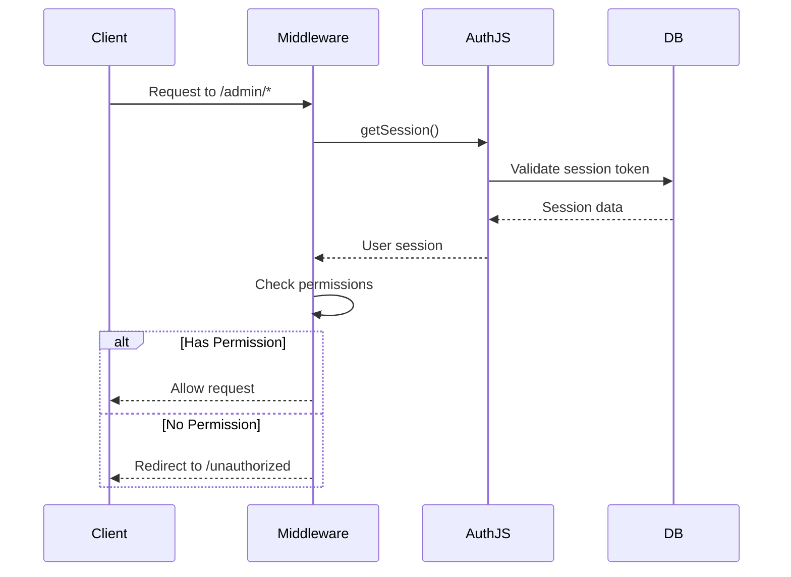
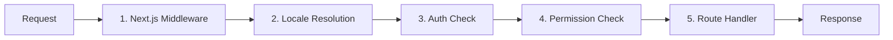

# Дълбоко потапяне в междинния софтуер

Шаблонът Ever Works използва многопластова архитектура на междинен софтуер, изградена на Next.js App Router конвенции и персонализирана логика за проверка на разрешения. Този документ обхваща пълния тръбопровод за обработка на заявки, проверки на разрешения, мидълуер за удостоверяване, обработка на локали и подреждане на мидълуер.

## Преглед на архитектурата



## Мидълуер за проверка на разрешения

Системата за проверка на разрешения се намира в `lib/middleware/permission-check.ts` и осигурява подробен контрол на достъпа за API маршрути и администраторски страници.

### Основен интерфейс

```typescript
interface UserPermissions {
  userId: string;
  roles: string[];
  permissions: Permission[];
}
```

### Функции за проверка на разрешения

|функция|Цел|Връща се|
|---|---|---|
|`hasPermission(user, permission)`|Проверете единично разрешение|`boolean`|
|`hasAnyPermission(user, permissions)`|Проверете дали потребителят има поне един|`boolean`|
|`hasAllPermissions(user, permissions)`|Проверете дали потребителят е изброил всички|`boolean`|
|`hasResourcePermission(user, resource, action)`|Проверете формата `resource:action`|`boolean`|
|`getResourcePermissions(user, resource)`|Получете всички разрешения за ресурс|`Permission[]`|
|`canManageResource(user, resource)`|Проверете достъпа за създаване/актуализиране/изтриване|`boolean`|
|`isSuperAdmin(user)`|Проверете за роля на суперадминистратор или всички разрешения|`boolean`|

### Използване в API Routes

```typescript
import { hasPermission, hasAnyPermission } from '@/lib/middleware/permission-check';

export async function GET(request: Request) {
  const userPermissions = await getUserPermissions(session);

  // Single permission check
  if (!hasPermission(userPermissions, 'items:read')) {
    return new Response('Forbidden', { status: 403 });
  }

  // Multiple permission check (any)
  if (!hasAnyPermission(userPermissions, ['items:review', 'items:approve'])) {
    return new Response('Forbidden', { status: 403 });
  }
}
```

### Проверки на ниво ресурси

```typescript
// Check specific resource and action
const canEdit = hasResourcePermission(userPermissions, 'items', 'update');

// Get all permissions for a resource
const itemPerms = getResourcePermissions(userPermissions, 'items');
// Returns: ['items:read', 'items:create', 'items:update']

// Check management capability (create, update, or delete)
const canManage = canManageResource(userPermissions, 'categories');
```

### Специализирани помощници за разрешения

Мидълуерът предоставя специфични за домейна помощници, които комбинират множество проверки на разрешения:

```typescript
// Can the user review, approve, or reject items?
const canReview = canReviewItems(userPermissions);

// Can the user manage users (read, create, update, delete, assignRoles)?
const canAdmin = canManageUsers(userPermissions);

// Can the user view analytics data?
const canView = canViewAnalytics(userPermissions);

// Is the user a super admin?
const isAdmin = isSuperAdmin(userPermissions);
```

### Откриване на супер администратор

Функцията `isSuperAdmin` използва двустепенен подход:

1. **Проверка на ролята** (основна): Проверява дали потребителят има роля `super-admin`
2. **Проверка на разрешение** (резервен): Проверява, че потребителят има всички системни разрешения

```typescript
function isSuperAdmin(userPermissions: UserPermissions): boolean {
  // Fast path: check role
  if (userPermissions.roles.includes('super-admin')) {
    return true;
  }
  // Exhaustive check: verify all permissions
  return hasAllPermissions(userPermissions, allSystemPermissions);
}
```

## Мидълуер за удостоверяване

Удостоверяването се извършва чрез NextAuth.js (Auth.js v5), конфигуриран в `auth.config.ts`. Мидълуерът работи при всяка заявка към защитени маршрути.

### Конфигурация на доставчика

Конфигурацията за удостоверяване динамично конфигурира доставчиците на OAuth с елегантен резервен вариант:

|Доставчик|Източник на конфигурация|
|---|---|
|Google|`authConfig.google.clientId/clientSecret`|
|GitHub|`authConfig.github.clientId/clientSecret`|
|Facebook|`authConfig.facebook.clientId/clientSecret`|
|Twitter/X|`authConfig.twitter.clientId/clientSecret`|
|пълномощията|Винаги активиран|

Ако конфигурирането на OAuth е неуспешно, системата се връща към удостоверяване само с идентификационни данни.

### Поток на сесията за удостоверяване



## Локален междинен софтуер

Шаблонът поддържа 20+ локализации чрез `next-intl` интегриране на междинен софтуер. Откриването на локали следва модела на префикса "при необходимост":

- Локал по подразбиране (`en`): Без URL префикс -- `/items/my-app`
- Други локали: Локален префикс -- `/fr/items/my-app`

### Поддържани локали

|локал|език|локал|език|
|---|---|---|---|
|`en`|английски (по подразбиране)|`ja`|японски|
|`fr`|френски|`ko`|корейски|
|`es`|испански|`nl`|холандски|
|`de`|немски|`pl`|полски|
|`zh`|китайски|`tr`|турски|
|`ar`|арабски|`vi`|виетнамски|
|`he`|иврит|`th`|тайландски|
|`ru`|руски|`hi`|хинди|
|`uk`|украински|`id`|индонезийски|
|`pt`|португалски|`bg`|български|
|`it`|италиански| | |

## Тръбопровод за обработка на заявки

Пълният тръбопровод за обработка на заявки следва следния ред:



### Стъпки на тръбопровода

1. **Next.js Middleware** (`middleware.ts`): Изпълнява се при всяка заявка, съответстваща на конфигурираните съвпадения. Обработва пренасочвания, презаписи и инжектиране на заглавки.

2. **Резолюция на локала**: Открива предпочитания от потребителя локал от URL пътя, `Accept-Language` хедъра или бисквитката. Задава локала за контекста на заявката.

3. **Проверка на удостоверяване**: За защитени маршрути (`/admin/*`, `/dashboard/*`, `/api/admin/*`), проверява токена на сесията на потребителя.

4. **Проверка на разрешение**: След удостоверяване, проверява дали потребителят има необходимите разрешения за конкретния ресурс и действие.

5. **Манипулатор на маршрута**: Действителният компонент на страницата или манипулаторът на маршрута на API обработва заявката.

### Гаранции за поръчка на междинен софтуер

Системата налага строг ред:

- Откриването на локал винаги се изпълнява първо (необходимо за страници с грешки)
- Проверките за удостоверяване се изпълняват преди проверките за разрешения (необходим е потребител за проверка на разрешенията)
- Проверките на разрешения са последната врата преди манипулаторите на маршрути
- API маршрутите използват проверки на разрешения на ниво функция (не на ниво междинен софтуер)

## Помощни програми за проверка на разрешения

Мидълуерът включва помощници за валидиране за работа с низове за разрешение:

```typescript
// Validate a permission string
validatePermission('items:read');     // true
validatePermission('invalid:perm');   // false

// Parse a permission into parts
parsePermission('items:update');
// Returns: { resource: 'items', action: 'update' }

// Get summary grouped by resource
getPermissionSummary(userPermissions);
// Returns: { items: ['read', 'create'], categories: ['read'] }
```

## Обработка на грешки

Системата за междинен софтуер обработва грешки на всеки слой:

|Слой|Грешка|Отговор|
|---|---|---|
|локал|Невалиден локал|Пренасочване към локал по подразбиране|
|авт|Няма сесия|401 или пренасочете към вход|
|авт|Изтекла сесия|401 с подсказка за опресняване|
|разрешение|Липсва разрешение|403 Забранено|
|разрешение|Невалиден низ за разрешение|Предупреждението е регистрирано, достъпът е отказан|

## Най-добри практики

1. **Използвайте най-специфичната проверка** -- предпочитайте `hasPermission` с едно разрешение пред `isSuperAdmin` за редовно стробиране на функции.

2. **Проверете разрешенията в маршрутите на API** -- не разчитайте единствено на междинен софтуер; винаги валидирайте в манипулатора на маршрута за защита в дълбочина.

3. **Използвайте динамично импортиране** в междинния софтуер, за да избегнете групирането на сървърни модули в крайното време за изпълнение.

4. **Поддържайте бързи проверки на разрешения** -- търсенето на набор от разрешения `O(1)` гарантира минимални разходи за заявка.

5. **Неуспешни разрешения за регистрация** -- използвайте структурирано регистриране с потребителския идентификатор и опит за разрешение за одит на сигурността.
