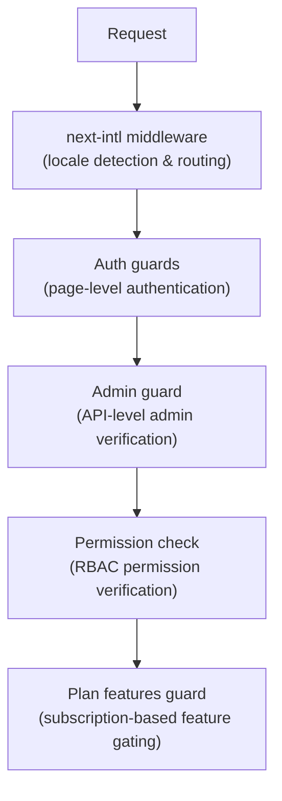

# Мидълуер и предпазители

Шаблонът Ever Works използва многопластова система за защита, състояща се от междинен софтуер Next.js за маршрутизиране, предпазители за удостоверяване за страница и защита на API, проверки на разрешения за RBAC и предпазители на функции, базирани на план, за стробиране на абонамент.

## Слоеве на междинен софтуер



## Локален междинен софтуер (следващ-включен)

Основният междинен софтуер обработва маршрутизирането на интернационализация чрез `next-intl`. Конфигурира се чрез `i18n/routing.ts` и `i18n/request.ts`.

Отговорности:
- Откриване на локал на потребителя от URL път, бисквитки или заглавка `Accept-Language`
- Пренасочване на заявки без локален префикс към подходящия локал
- По подразбиране е английски (`en`), когато не се открие предпочитание
- Поддържа 6 локализации: `en`, `fr`, `es`, `de`, `ar`, `zh`

## Пазачи за удостоверяване

### Пазачи на ниво страница (`lib/auth/guards.ts`)

Модулът guards осигурява проверки за удостоверяване от страна на сървъра за страници. Те се извикват в горната част на сървърните компоненти, за да защитят достъпа до страницата.

**`requireAuth()`** -- Изисква потребителят да бъде удостоверен:

```typescript
import { requireAuth } from '@/lib/auth/guards';

export default async function ProtectedPage() {
  const session = await requireAuth();
  // session.user is guaranteed to exist here
  return <div>Welcome {session.user.email}</div>;
}
```

Ако потребителят не е удостоверен, той се пренасочва към `/auth/signin`.

**`requireAdmin()`** -- Изисква потребителят да бъде удостоверен И да има администраторска роля:

```typescript
import { requireAdmin } from '@/lib/auth/guards';

export default async function AdminPage() {
  const session = await requireAdmin();
  return <div>Admin: {session.user.email}</div>;
}
```

Ако потребителят не е удостоверен, той се пренасочва към `/admin/auth/signin`. Ако са удостоверени, но не са администратор, те се пренасочват към `/unauthorized`.

**`getSession()`** -- Получава сесия без пренасочване:

```typescript
const session = await getSession();
if (session) {
  // Authenticated
} else {
  // Guest
}
```

**`checkIsAdmin()`** -- Проверява статуса на администратор без пренасочване:

```typescript
const isAdmin = await checkIsAdmin();
// Returns true or false
```

### Валидирани действия (`lib/auth/guards.ts`)

Модулът guards също така предоставя валидирани обвивки на действие за Next.js Server Actions:

**`validatedAction(schema, action)`** -- Валидира данните от формуляра спрямо Zod схема:

```typescript
export const myAction = validatedAction(mySchema, async (data, formData) => {
  // data is validated and typed
});
```

**`validatedActionWithUser(schema, action)`** -- Валидира и изисква удостоверяване:

```typescript
export const myAction = validatedActionWithUser(mySchema, async (data, formData, user) => {
  // data is validated, user is authenticated
});
```

## Административна охрана (`lib/auth/admin-guard.ts`)

Защитата на администратора осигурява защита на маршрута на API специално за крайни точки на администратор.

**`checkAdminAuth()`** -- Мидълуер функция за API маршрути:

```typescript
import { checkAdminAuth } from '@/lib/auth/admin-guard';

export async function GET(request: NextRequest) {
  const authError = await checkAdminAuth();
  if (authError) return authError;

  // User is verified admin, proceed with handler
}
```

Връща `null`, ако е оторизиран, или `NextResponse` със съответния статус на грешка (401 или 403).

**`withAdminAuth(handler)`** -- Обвивка на функция от по-висок ред:

```typescript
import { withAdminAuth } from '@/lib/auth/admin-guard';

export const GET = withAdminAuth(async (request) => {
  // Already verified as admin
  return NextResponse.json({ data: 'admin only' });
});
```

Защитата на администратора проверява както удостоверяването (съществува сесия), така и оторизацията (потребителят има администраторска роля в базата данни чрез проверка `isAdmin()`).

## Система за проверка на разрешения (`lib/middleware/permission-check.ts`)

Системата за разрешения прилага контрол на достъпа, базиран на роли (RBAC) с подробни разрешения.

### Структура на разрешенията

Разрешенията следват формат `resource:action`:

```typescript
// Examples of permission keys
'items:read'
'items:create'
'items:update'
'items:delete'
'items:review'
'items:approve'
'items:reject'
'categories:read'
'categories:create'
'users:assignRoles'
'analytics:read'
'system:settings'
```

### Функции за проверка на разрешения

```typescript
import {
  hasPermission,
  hasAnyPermission,
  hasAllPermissions,
  hasResourcePermission,
  canManageResource,
  canReviewItems,
  canManageUsers,
  canManageRoles,
  canViewAnalytics,
  isSuperAdmin,
} from '@/lib/middleware/permission-check';

// Single permission check
hasPermission(userPermissions, 'items:create');

// Any of multiple permissions
hasAnyPermission(userPermissions, ['items:create', 'items:update']);

// All permissions required
hasAllPermissions(userPermissions, ['items:read', 'items:update']);

// Resource-level check
hasResourcePermission(userPermissions, 'items', 'create');

// Domain-specific helpers
canManageResource(userPermissions, 'categories'); // create, update, or delete
canReviewItems(userPermissions);                  // review, approve, or reject
canManageUsers(userPermissions);                  // user CRUD + assignRoles
isSuperAdmin(userPermissions);                    // all system permissions
```

### Откриване на супер администратор

Функцията `isSuperAdmin()` проверява две условия:
1. Дали потребителят има роля `super-admin` (предпочитана)
2. Като резервен вариант, дали потребителят има ВСИЧКИ системни разрешения

### Валидиране на разрешение

```typescript
// Validate a permission string is defined in the system
validatePermission('items:create'); // true
validatePermission('invalid:perm'); // false

// Parse permission into resource and action
parsePermission('items:create'); // { resource: 'items', action: 'create' }
```

## Защита на функциите на плана (`lib/guards/plan-features.guard.ts`)

Планът включва функции за контрол на охраната, достъп въз основа на абонаментни планове (безплатен, стандартен, премиум).

### Йерархия на плана

```typescript
const PLAN_LEVELS = {
  free: 1,
  standard: 2,
  premium: 3,
};
```

### Матрица за достъп до функции

Всяка функция е съпоставена с плановете, които имат достъп до нея:

|Характеристика|безплатно|Стандартен|Премиум|
|---------|------|----------|---------|
|Изпратете продукт|да|да|да|
|Качване на изображения|да|да|да|
|Поддръжка по имейл|да|да|да|
|Разширено описание| - |да|да|
|Потвърдена значка| - |да|да|
|Приоритетен преглед| - |да|да|
|Преглед на статистиката| - |да|да|
|Качване на видео| - | - |да|
|Спонсорирана значка| - | - |да|
|Препоръчана начална страница| - | - |да|
|Разширен анализ| - | - |да|
|Неограничени изпращания| - | - |да|

### Ограничения на плана

Всеки план има числени ограничения за определени функции:

|Лимит|безплатно|Стандартен|Премиум|
|-------|------|----------|---------|
|Макс изображения| 1 | 5 |Неограничен|
|Макс. думи за описание| 200 | 500 |Неограничен|
|Макс. изпращания| 1 | 10 |Неограничен|
|Дни за преглед| 7 | 3 | 1 |
|Безплатни дни за модификация| 0 | 30 | 365 |

### Използване на Plan Guard

**Директни извиквания на функции:**

```typescript
import { canAccessFeature, getFeatureLimit, isWithinLimit } from '@/lib/guards';

canAccessFeature('upload_video', 'free');    // false
canAccessFeature('upload_video', 'premium'); // true
getFeatureLimit('max_images', 'standard');   // 5
isWithinLimit('max_submissions', 3, 'free'); // false (limit is 1)
```

**Фабрика за охрана (за множество проверки):**

```typescript
import { createPlanGuard } from '@/lib/guards';

const guard = createPlanGuard('standard');
guard.canAccess('verified_badge');     // true
guard.canAccess('upload_video');       // false
guard.getLimit('max_images');          // 5
guard.requireFeature('upload_video');  // throws PlanGuardError
```

**Интеграция на React hook:**

```typescript
import { createPlanGuardResult } from '@/lib/guards';

// In a hook or component
const guardResult = createPlanGuardResult(userPlan);
guardResult.canAccess('verified_badge');
guardResult.accessibleFeatures; // array of all accessible features
```

`PlanGuardError`, хвърлен от `requireFeature()`, включва името на функцията, текущия план на потребителя и необходимия план, което позволява информативни подкани за надстройка в потребителския интерфейс.
