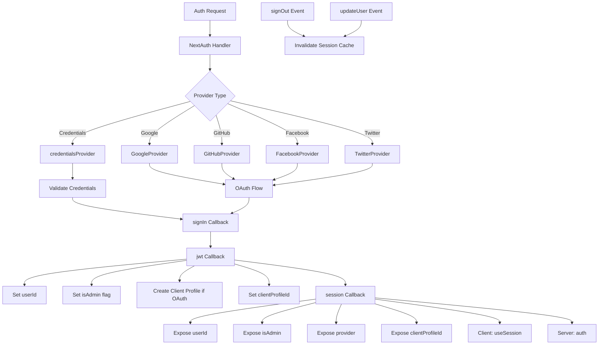

# Конфигурация на NextAuth

## Преглед

Шаблонът Ever Works конфигурира NextAuth.js (Auth.js v5) със сесии, базирани на JWT, адаптер Drizzle ORM, множество OAuth доставчици (Google, GitHub, Facebook, Twitter), удостоверяване, базирано на идентификационни данни, и персонализирани обратни извиквания за управление на ролята на администратор/клиент. Системата поддържа автоматично създаване на клиентски профил за OAuth потребители и кеширане на сесии с анулиране на кеша.

## Архитектура



## Изходни файлове

|Файл|Цел|
|------|---------|
|`template/lib/auth/index.ts`|Основна конфигурация и експортиране на NextAuth|
|`template/auth.config.ts`|Конфигурация на доставчик (съвместим с Edge)|
|`template/lib/auth/config.ts`|Избор на тип доставчик на удостоверяване|
|`template/lib/auth/providers.ts`|Фабрични функции на доставчик на OAuth|
|`template/lib/auth/credentials.ts`|Внедряване на доставчик на идентификационни данни|
|`template/lib/auth/guards.ts`|Помощни програми за защита на удостоверяване от страна на сървъра|
|`template/lib/auth/middleware.ts`|Валидирани обвивки на действие|
|`template/lib/auth/setup.ts`|Помощник за инициализация на удостоверяване|
|`template/lib/auth/cached-session.ts`|Управление на кеша на сесиите|
|`template/lib/auth/session-cache.ts`|Реализация на кеша на сесиите|
|`template/lib/auth/admin-guard.ts`|Логика за защита, специфична за администратора|

## Инициализация на NextAuth

```typescript
// lib/auth/index.ts
export const { handlers, auth, signIn, signOut, unstable_update } = NextAuth({
    adapter: drizzle,
    session: {
        strategy: 'jwt',
        maxAge: 30 * 24 * 60 * 60,    // 30 days
        updateAge: 24 * 60 * 60        // Refresh every 24 hours
    },
    jwt: {
        maxAge: 30 * 24 * 60 * 60      // 30 days
    },
    callbacks: { authorized, redirect, signIn, jwt, session },
    events: { signOut, updateUser },
    pages: {
        signIn: '/auth/signin',
        signOut: '/auth/signout',
        error: '/auth/error',
        verifyRequest: '/auth/verify-request',
        newUser: '/auth/register'
    },
    ...authConfig  // Merges providers from auth.config.ts
});
```

### Стратегия на сесията

Шаблонът използва **JWT сесии** (`strategy: 'jwt'`), а не сесии на база данни. Това означава:
- Сесиите се съхраняват в криптирани бисквитки, а не в базата данни
- Не е необходима заявка в база данни за валидиране на сесия
- Съвместим с Edge Runtime (среден софтуер)
- Данните за сесията са ограничени до това, което се побира в JWT токен

## Адаптер за база данни

```typescript
const isDatabaseAvailable = !!coreConfig.DATABASE_URL && typeof db !== 'undefined';

const drizzle = isDatabaseAvailable
    ? DrizzleAdapter(getDrizzleInstance(), {
        usersTable: users,
        accountsTable: accounts,
        sessionsTable: sessions,
        verificationTokensTable: verificationTokens
    })
    : undefined;
```

Адаптерът се създава условно въз основа на наличността на база данни. Това позволява на шаблона да стартира дори без база данни (напр. по време на първоначалната настройка), въпреки че удостоверяването ще бъде ограничено.

## Конфигурация на доставчика

### auth.config.ts (съвместим с Edge)

```typescript
// auth.config.ts
const configureProviders = () => {
    try {
        const oauthProviders = configureOAuthProviders();
        return createNextAuthProviders({
            google: oauthProviders.find((p) => p.id === 'google')
                ? { enabled: true, clientId: '...', clientSecret: '...' }
                : { enabled: false },
            github: { /* ... */ },
            facebook: { /* ... */ },
            twitter: { /* ... */ },
            credentials: { enabled: true },
        });
    } catch (error) {
        // Fallback to credentials only
        return createNextAuthProviders({
            credentials: { enabled: true },
            google: { enabled: false },
            github: { enabled: false },
            facebook: { enabled: false },
            twitter: { enabled: false },
        });
    }
};

export default {
    trustHost: true,
    providers: configureProviders(),
} satisfies NextAuthConfig;
```

### Фабрика на доставчика

```typescript
// lib/auth/providers.ts
export function createNextAuthProviders(config: OAuthProvidersConfig) {
    const providers = [];

    if (config.google?.enabled && config.google.clientId && config.google.clientSecret) {
        providers.push(GoogleProvider({
            clientId: config.google.clientId,
            clientSecret: config.google.clientSecret,
            ...config.google.options,
        }));
    }
    // GitHub, Facebook, Twitter follow the same pattern...

    if (config.credentials?.enabled) {
        providers.push(credentialsProvider);
    }

    return providers;
}
```

Доставчиците се добавят само когато имат валидни идентификационни данни, което предотвратява грешки в конфигурацията при стартиране.

## Обратни повиквания

### влизане Обратно повикване

```typescript
signIn: async ({ user, account, profile }) => {
    const isCredentials = account?.provider === 'credentials';

    if (!user?.email) {
        return !isCredentials; // Allow OAuth without email
    }

    if (!isDatabaseAvailable) {
        return !isCredentials; // Skip DB validation if no DB
    }

    // For OAuth providers, allow account linking
    if (!isCredentials && account?.provider) {
        return true;
    }

    return true;
}
```

### jwt Обратно извикване

JWT обратното извикване е ядрото на тръбопровода за удостоверяване. Изпълнява се при всяка заявка и управлява:

```typescript
jwt: async ({ token, user, account }) => {
    // 1. Set userId from user object or token.sub
    if (user?.id) token.userId = user.id;
    if (!token.userId && token.sub) token.userId = token.sub;

    // 2. Set clientProfileId
    if (user?.clientProfileId) token.clientProfileId = user.clientProfileId;

    // 3. Record provider
    if (account?.provider) token.provider = account.provider;

    // 4. Auto-create client profile for OAuth users
    if (isOAuthProvider && !token.clientProfileId && token.userId) {
        let clientProfile = await getClientProfileByUserId(token.userId);
        if (!clientProfile) {
            clientProfile = await createClientProfile({
                userId: token.userId,
                email: token.email,
                name: token.name || token.email?.split('@')[0],
            });
        }
        token.clientProfileId = clientProfile?.id;
    }

    // 5. Set isAdmin flag
    if (user?.isClient !== undefined) {
        token.isAdmin = !user.isClient;
    } else if (user?.isAdmin !== undefined) {
        token.isAdmin = user.isAdmin;
    } else if (token.isAdmin === undefined) {
        token.isAdmin = false; // Default: non-admin
    }

    return token;
}
```

### сесия Обратно извикване

Картографира полетата на JWT токена към обекта на сесията, изложен на клиентските компоненти:

```typescript
session: async ({ session, token }) => {
    if (token && session.user) {
        session.user.id = token.userId;
        session.user.clientProfileId = token.clientProfileId;
        session.user.provider = token.provider || 'credentials';
        session.user.isAdmin = token.isAdmin;
    }
    return session;
}
```

## събития

### Невалидност на кеша на сесията

```typescript
events: {
    signOut: async (event) => {
        const token = 'token' in event ? event.token : undefined;
        if (token?.userId) {
            await invalidateSessionCache(undefined, token.userId);
        }
    },
    updateUser: async ({ user }) => {
        if (user?.id) {
            await invalidateSessionCache(undefined, user.id);
        }
    }
}
```

И двете събития `signOut` и `updateUser` задействат анулиране на кеша на сесията, като гарантират, че остарелите данни за сесията не се обслужват след промени в състоянието на удостоверяване.

## Пазачи от страната на сървъра

### requireAuth

```typescript
export async function requireAuth() {
    const session = await auth();
    if (!session?.user) {
        redirect('/auth/signin');
    }
    return session;
}
```

### изисква Админ

```typescript
export async function requireAdmin() {
    const session = await auth();
    if (!session?.user) {
        redirect('/admin/auth/signin');
    }
    if (!session.user.isAdmin) {
        redirect('/unauthorized');
    }
    return session;
}
```

### Пазачи на комунални услуги

```typescript
// Check without redirecting
export async function getSession() {
    return await auth();
}

export async function checkIsAdmin() {
    const session = await auth();
    return session?.user?.isAdmin === true;
}
```

## Персонализирани страници

|Страница|Пътека|Цел|
|------|------|---------|
|Вход|`/auth/signin`|Форма за вход|
|Излезте|`/auth/signout`|Потвърждение за излизане|
|Грешка|`/auth/error`|Показване на грешка при удостоверяване|
|Потвърдете заявката|`/auth/verify-request`|Подкана за потвърждение на имейл|
|Регистрирайте се|`/auth/register`|Регистрация на нов потребител|

## Променливи на средата

|Променлива|Задължително|Цел|
|----------|----------|---------|
|`AUTH_SECRET`|да|Тайна за JWT криптиране|
|`AUTH_GOOGLE_ID`|не|Google OAuth клиентски идентификатор|
|`AUTH_GOOGLE_SECRET`|не|Клиентска тайна на Google OAuth|
|`AUTH_GITHUB_ID`|не|GitHub OAuth клиентски идентификатор|
|`AUTH_GITHUB_SECRET`|не|Клиентска тайна за GitHub OAuth|
|`AUTH_FACEBOOK_ID`|не|Facebook OAuth клиентски идентификатор|
|`AUTH_FACEBOOK_SECRET`|не|Facebook OAuth клиентска тайна|
|`AUTH_TWITTER_ID`|не|Twitter/X OAuth клиентски идентификатор|
|`AUTH_TWITTER_SECRET`|не|Twitter/X OAuth клиентска тайна|
|`DATABASE_URL`|За адаптер|Низ за връзка с база данни|

## Най-добри практики

1. **Използвайте JWT стратегия** за съвместимост на Edge Runtime в междинен софтуер
2. **Автоматично създаване на клиентски профили** за OAuth потребители в JWT обратното извикване
3. **Изящно влошаване** -- ако OAuth конфигурацията е неуспешна, върнете се само към идентификационни данни
4. **Невалиден кеш при събития за удостоверяване** -- излизане и потребителска актуализация и двете изчистват кешираните сесии
5. **Условен адаптер** -- позволява стартиране без база данни за първоначална конфигурация
6. **Охранителни функции** -- използвайте `requireAuth()` / `requireAdmin()` в компонентите на сървъра, а не ръчни проверки на сесии
7. **Персонализирани страници** -- заменете страниците по подразбиране NextAuth за съвместим потребителски интерфейс с дизайна на шаблона
