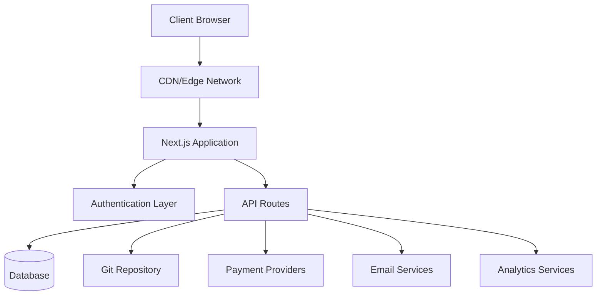
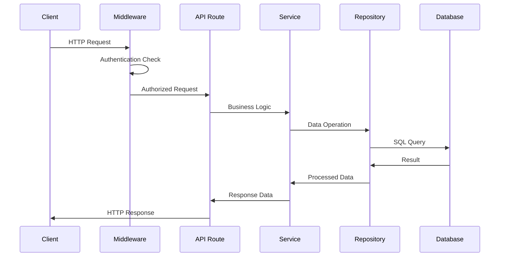
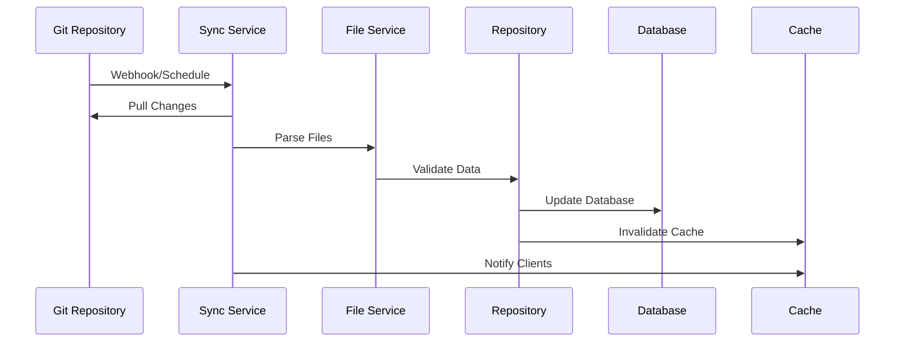
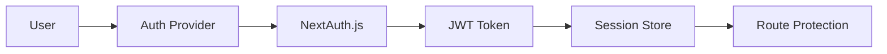

# Преглед на архитектурата

Ever Works следва модерна, мащабируема архитектура, проектирана за производителност, поддръжка и опит за разработчици.

## Архитектура на високо ниво



## Основни принципи

### 1. Разделяне на загрижеността
- **Презентационен слой**: React компоненти и логика на потребителския интерфейс
- **Бизнес ниво**: Услуги и хранилища
- **Слой данни**: База данни и външни API

### 2. Модулен дизайн
- Организация, базирана на функции
- Компоненти за многократна употреба
- Плъгин-подобни интеграции

### 3. Тип Безопасност
- TypeScript навсякъде
- Стриктна проверка на типа
- Валидиране по време на изпълнение със Zod

### 4. Изпълнението на първо място
- Рендиране от страна на сървъра
- Статично генериране, където е възможно
- Оптимизирани стратегии за кеширане

## Приложни слоеве

### Преден слой

**Технология**: React 19 + Next.js 15
**Отговорности**:
- Изобразяване на потребителски интерфейс
- Управление на състоянието от страна на клиента
- Потребителски взаимодействия
- Обработка на маршрута

**Ключови компоненти**:
- Компоненти на страницата (`app/[locale]/`)
- Компоненти на потребителския интерфейс за многократна употреба (`components/`)
- Персонализирани куки (`hooks/`)
- Доставчици на контекст (`components/providers/`)

### API слой

**Технология**: Next.js API маршрути
**Отговорности**:
- Изпълнение на бизнес логиката
- Валидиране на данни
- Интегриране на външни услуги
- Обработка на удостоверяване

**Структура**:
```
app/api/
├── auth/           # Authentication endpoints
├── admin/          # Admin-only endpoints
├── items/          # Item management
└── webhooks/       # External service webhooks
```

### Слой данни

**Технологии**: Drizzle ORM + PostgreSQL
**Отговорности**:
- Устойчивост на данните
- Оптимизация на заявките
- Управление на транзакции
- Миграции на схеми

**Компоненти**:
- Схема на база данни (`lib/db/schema.ts`)
- Хранилища (`lib/repositories/`)
- Файлове за миграция (`lib/db/migrations/`)

### Съдържателен слой

**Технология**: базирана на Git CMS
**Отговорности**:
- Синхронизиране на съдържание
- Контрол на версиите
- Съвместно редактиране
- Валидиране на съдържанието

**Структура**:
```
.content/
├── config.yml      # Site configuration
├── items/          # Item definitions
├── categories/     # Category definitions
└── tags/           # Tag definitions
```

## Дизайнерски модели

### 1. Модел на хранилище

Логика за достъп до данни за резюмета:

```typescript
interface ItemRepository {
  findById(id: string): Promise<Item | null>;
  findBySlug(slug: string): Promise<Item | null>;
  findWithFilters(filters: ItemFilters): Promise<Item[]>;
  create(item: CreateItemRequest): Promise<Item>;
  update(id: string, updates: UpdateItemRequest): Promise<Item>;
  delete(id: string): Promise<void>;
}
```

### 2. Модел на слоя на услугата

Капсулира бизнес логиката:

```typescript
class ItemService {
  constructor(
    private itemRepository: ItemRepository,
    private gitService: GitService,
    private notificationService: NotificationService
  ) {}

  async submitItem(data: SubmitItemRequest): Promise<SubmissionResult> {
    // Business logic here
  }
}
```

### 3. Фабричен модел

Създава екземпляри на услугата:

```typescript
class PaymentProviderFactory {
  static create(provider: PaymentProvider): PaymentService {
    switch (provider) {
      case 'stripe':
        return new StripePaymentService();
      case 'lemonsqueezy':
        return new LemonSqueezyPaymentService();
      default:
        throw new Error(`Unsupported provider: ${provider}`);
    }
  }
}
```

### 4. Модел на наблюдател

Актуализации, управлявани от събития:

```typescript
class ContentSyncService {
  private observers: ContentObserver[] = [];

  addObserver(observer: ContentObserver): void {
    this.observers.push(observer);
  }

  notifyObservers(event: ContentEvent): void {
    this.observers.forEach(observer => observer.update(event));
  }
}
```

## Поток от данни

### 1. Поток на заявките



### 2. Поток на синхронизиране на съдържанието



## Архитектура за сигурност

### 1. Поток на удостоверяване



### 2. Слоеве за оторизация

- **Ниво на маршрут**: Защита на междинния софтуер
- **API-ниво**: Защитници на крайни точки
- **Ниво на данни**: Сигурност на ниво ред
- **UI-ниво**: Контрол на достъпа, базиран на компоненти

### 3. Мерки за сигурност

- **Валидиране на входа**: Zod схеми
- **SQL инжектиране**: Параметризирани заявки
- **XSS защита**: Дезинфекция на съдържанието
- **CSRF защита**: Валидиране на токени
- **Ограничаване на скоростта**: Заявка за регулиране

## Стратегия за кеширане

### 1. Кеш на приложението

- **React Query**: Кеш на данни от страна на клиента
- **Next.js Cache**: Кеш на страница и API маршрут
- **Статично генериране**: Предварително изградени страници

### 2. Кеш на базата данни

- **Обединяване на връзки**: Ефективни DB връзки
- **Оптимизация на заявките**: Индексирани заявки
- **Реплики за четене**: Разпределени операции за четене

### 3. CDN кеш

- **Статични активи**: изображения, CSS, JS
- **API отговори**: Кешируеми крайни точки
- **Edge Locations**: Глобално разпространение

## Съображения за мащабируемост

### 1. Хоризонтално мащабиране

- **Stateless Design**: Няма сесии от страната на сървъра
- **Мащабиране на база данни**: Четете реплики и шардинг
- **CDN разпространение**: Глобално крайно кеширане

### 2. Оптимизация на производителността

- **Разделяне на код**: Динамично импортиране
- **Оптимизация на изображението**: Компонент за изображение на Next.js
- **Оптимизация на пакета**: Разклащане на дърво и минимизиране

### 3. Мониторинг и наблюдение

- **Проследяване на грешки**: Интегриране на Sentry
- **Мониторинг на производителността**: Основни уеб показатели
- **Analytics**: Интегриране на PostHog
- **Регистриране**: Структурирано регистриране

## Технологични решения

### Защо Next.js?
- **Full-stack framework**: API маршрути + интерфейс
- **Ефективност**: SSR, SSG и ISR
- **Опит за разработчици**: Горещо презареждане, поддръжка на TypeScript
- **Екосистема**: Богата екосистема на плъгини

### Защо Drizzle ORM?
- **Безопасност на типа**: Пълна поддръжка на TypeScript
- **Ефективност**: Минимални разходи
- **Гъвкавост**: Необработен SQL, когато е необходимо
- **Система за миграция**: Промени в схемата, контролирани от версията

### Защо базирана на Git CMS?
- **Контрол на версиите**: Проследяване на пълната история
- **Сътрудничество**: Работен процес на заявка за изтегляне
- **Резервно копие**: Разпространено по природа
- **Гъвкавост**: Всеки доставчик на Git

### Защо React Query?
- **Кеширане**: Интелигентно управление на кеша
- **Синхронизация**: Актуализации на заден план
- **Оптимистични актуализации**: По-добър UX
- **Обработка на грешки**: Опитайте отново логика

## Точки за разширение

Архитектурата предоставя няколко точки за разширение:

### 1. Персонализирани доставчици на удостоверяване
```typescript
// lib/auth/providers/custom-provider.ts
export function CustomProvider(options: CustomProviderOptions) {
  return {
    id: "custom",
    name: "Custom Provider",
    type: "oauth",
    // Implementation
  }
}
```

### 3. Интегриране на източника на съдържание
```typescript
// lib/content/sources/custom-source.ts
export class CustomContentSource implements ContentSource {
  async sync(): Promise<SyncResult> {
    // Implementation
  }
}
```

## Следващи стъпки

- [Разгледайте техническия стек](./tech-stack) в детайли
