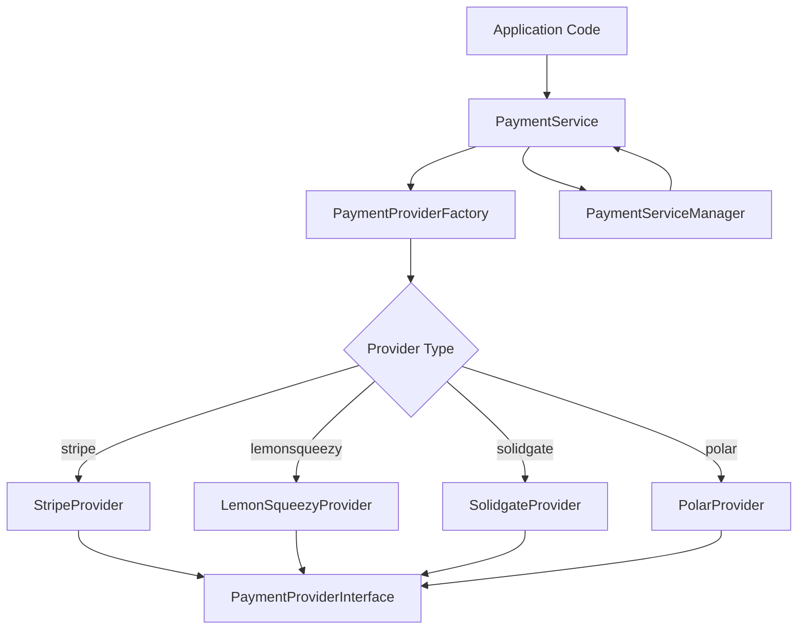
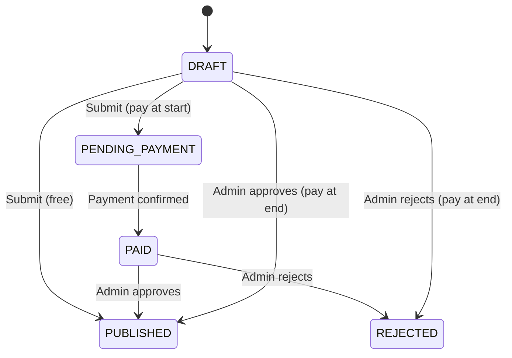

# Библиотека за плащане

Шаблонът внедрява система за плащане с множество доставчици, използвайки моделите Factory и Strategy. Той поддържа Stripe, LemonSqueezy, Solidgate и Polar като доставчици на плащания с унифициран интерфейс за плащания, абонаменти, уеб кукички и възстановяване на средства.

## Преглед на архитектурата



## Изходни файлове

|Файл|Цел|
|------|---------|
|`lib/payment/index.ts`|Експортиране на публичен API|
|`lib/payment/lib/payment-provider-factory.ts`|Фабрика за създаване на инстанции на доставчик|
|`lib/payment/lib/payment-service.ts`|Единна сервизна фасада|
|`lib/payment/lib/payment-service-manager.ts`|Единичен мениджър за жизнения цикъл на услугата|
|`lib/payment/types/payment-types.ts`|Основни интерфейси и enum|
|`lib/payment/types/payment.ts`|Поток на плащане и видове подаване|
|`lib/payment/config/`|Конфигуриране и валидиране на доставчика|
|`lib/payment/lib/providers/`|Индивидуални реализации на доставчика|
|`lib/payment/hooks/`|React куки за платежни потоци от страна на клиента|
|`lib/payment/ui/`|Компоненти на платежната форма|

## Основни интерфейси

### PaymentProviderInterface

Всеки доставчик прилага този изчерпателен интерфейс:

```typescript
export interface PaymentProviderInterface {
  // Payment operations
  createPaymentIntent(params: CreatePaymentParams): Promise<PaymentIntent>;
  confirmPayment(paymentId: string, paymentMethodId: string): Promise<PaymentIntent>;
  verifyPayment(paymentId: string): Promise<PaymentVerificationResult>;
  createSetupIntent(user: User | null): Promise<SetupIntent>;

  // Subscription management
  createCustomer(params: CreateCustomerParams): Promise<CustomerResult>;
  createSubscription(params: CreateSubscriptionParams): Promise<SubscriptionInfo>;
  cancelSubscription(subscriptionId: string, cancelAtPeriodEnd?: boolean): Promise<SubscriptionInfo>;
  updateSubscription(params: UpdateSubscriptionParams): Promise<SubscriptionInfo>;
  hasCustomerId(user: User | null): boolean;
  getCustomerId(user: User | null): Promise<string | null>;

  // Webhooks and refunds
  handleWebhook(payload: any, signature: string, ...args: any[]): Promise<WebhookResult>;
  refundPayment(paymentId: string, amount?: number): Promise<any>;

  // Client configuration and UI
  getClientConfig(): ClientConfig;
  getUIComponents(): UIComponents;
}
```

### PaymentProviderFactory

Създава екземпляри на доставчик въз основа на конфигурация:

```typescript
export type SupportedProvider = 'stripe' | 'solidgate' | 'lemonsqueezy' | 'polar';

export class PaymentProviderFactory {
  static createProvider(
    providerType: SupportedProvider,
    config: PaymentProviderConfig
  ): PaymentProviderInterface {
    switch (providerType) {
      case 'stripe':       return new StripeProvider(config);
      case 'solidgate':    return new SolidgateProvider(config);
      case 'lemonsqueezy': return new LemonSqueezyProvider(config);
      case 'polar':        return new PolarProvider(config);
      default:             throw new Error(`Unsupported payment provider: ${providerType}`);
    }
  }
}
```

## PaymentService

Класът `PaymentService` предоставя унифицирана фасада за всички операции на доставчика:

```typescript
export class PaymentService {
  private provider: PaymentProviderInterface;

  constructor(config: PaymentServiceConfig) {
    this.provider = PaymentProviderFactory.createProvider(config.provider, config.config);
  }

  // All methods delegate to the underlying provider
  async createPaymentIntent(params: CreatePaymentParams): Promise<PaymentIntent> {
    return this.provider.createPaymentIntent(params);
  }

  async createSubscription(params: CreateSubscriptionParams): Promise<SubscriptionInfo> {
    return this.provider.createSubscription(params);
  }

  // ... additional delegated methods
}
```

## Типове данни

### Енуми за плащане

```typescript
export enum PaymentType {
  ONE_TIME = 'one_time',
  SUBSCRIPTION = 'subscription',
  FREE = 'free',
}

export enum SubscriptionStatus {
  INCOMPLETE = 'incomplete',
  INCOMPLETE_EXPIRED = 'incomplete_expired',
  TRIALING = 'trialing',
  ACTIVE = 'active',
  PAST_DUE = 'past_due',
  CANCELED = 'canceled',
  UNPAID = 'unpaid',
}

export enum PaymentFlow {
  PAY_AT_START = "pay_at_start",
  PAY_AT_END = "pay_at_end",
}
```

### Събития за уеб кукичка

```typescript
export enum WebhookEventType {
  PAYMENT_SUCCEEDED = 'payment_succeeded',
  PAYMENT_FAILED = 'payment_failed',
  SUBSCRIPTION_CREATED = 'subscription_created',
  SUBSCRIPTION_UPDATED = 'subscription_updated',
  SUBSCRIPTION_CANCELLED = 'subscription_cancelled',
  INVOICE_PAID = 'invoice_paid',
  REFUND_CREATED = 'refund_created',
  // ... additional event types
}
```

### Ключови структури от данни

|Тип|Цел|
|------|---------|
|`PaymentIntent`|Платежна сесия с идентификатор, сума, валута, статус, clientSecret|
|`SubscriptionInfo`|Подробности за абонамент със статус, край на период, информация за пробен период|
|`CustomerResult`|Създаден клиент с ID, имейл, име|
|`WebhookResult`|Обработена уебкукичка с тип, id, данни|
|`ClientConfig`|Безопасна за предния край конфигурация с publicKey и тип шлюз|
|`UIComponents`|React компоненти и визуални активи за доставчика|

## Валутни услуги

Библиотеката включва помощни функции за форматиране на валута:

```typescript
// Format cents to display currency
export function formatCentsToCurrency(
  cents: number, currency: string = 'USD', locale: string = 'en-US'
): string {
  const amount = cents / 100;
  return new Intl.NumberFormat(locale, {
    style: 'currency', currency,
    minimumFractionDigits: 2, maximumFractionDigits: 2,
  }).format(amount);
}

// Convert between cents and decimal
export function convertCentsToDecimal(cents: number): number;
export function convertDecimalToCents(decimal: number): number;

// Convert timestamps to Date objects
export function convertNumberToDate(timestamp?: number): Date | null;
export function safeTimestampToDate(timestamp: number | null | undefined): Date | undefined;
```

## Видове платежни потоци

Системата поддържа два потока на плащане при подаване:

|Поток|Enum|Описание|
|------|------|-------------|
|Плащане в началото|`PAY_AT_START`|Изисква се плащане преди преглед на подаването|
|Плащане в края|`PAY_AT_END`|Плащането се събира след одобрение от администратор|

### Жизнен цикъл на състоянието на подаването



## Интерфейс на компонентите на потребителския интерфейс

Всеки доставчик излага компоненти на потребителския интерфейс за интегриране на интерфейса:

```typescript
export interface UIComponents {
  PaymentForm: React.ComponentType<PaymentFormProps>;
  logo: string;
  cardBrands: CardBrandIcon[];
  supportedPaymentMethods: string[];
  translations: Record<string, Record<string, string>>;
}
```

## Интеграция от страна на клиента

Контекстът `usePayment` и `PaymentProvider` осигуряват интеграция на React:

```typescript
import { usePayment, PaymentProvider } from '@/lib/payment';

// Wrap your app with the payment provider
<PaymentProvider>
  <PaymentForm
    amount={2999}
    currency="usd"
    isSubscription={false}
    onSuccess={(paymentId) => console.log('Paid:', paymentId)}
    onError={(error) => console.error('Failed:', error)}
  />
</PaymentProvider>
```

## Конфигурация на доставчика

```typescript
export interface PaymentProviderConfig {
  apiKey: string;
  webhookSecret?: string;
  secretKey?: string;
  options?: Record<string, any>;
}
```

Всеки доставчик изисква минимум `apiKey`. Stripe и Solidgate също използват `webhookSecret` за проверка на подпис на webhook.
