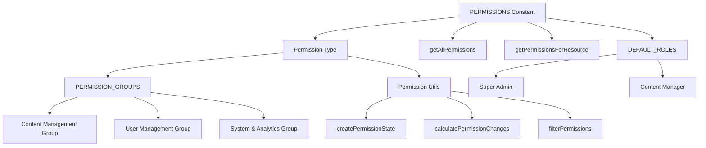

# Система за разрешения

Шаблонът внедрява подробна система за разрешения, базирана на ресурси, с дефиниции на разрешения, безопасни за типа, логически групи за организация на потребителския интерфейс и помощни функции за управление на състоянието и откриване на промени.

## Преглед на архитектурата



## Изходни файлове

|Файл|Цел|
|------|---------|
|`lib/permissions/definitions.ts`|Константи на разрешения, извличане на типове, роли по подразбиране|
|`lib/permissions/groups.ts`|Групиране на разрешения, ориентирани към потребителския интерфейс, с метаданни|
|`lib/permissions/utils.ts`|Управление на състоянието, изчисляване на разлика и филтриране|

## Дефиниции на разрешения

Разрешенията следват `resource:action` конвенция за именуване. Обектът `PERMISSIONS` ги организира по ресурс:

```typescript
export const PERMISSIONS = {
  items: {
    read: 'items:read',
    create: 'items:create',
    update: 'items:update',
    delete: 'items:delete',
    review: 'items:review',
    approve: 'items:approve',
    reject: 'items:reject',
  },
  categories: {
    read: 'categories:read',
    create: 'categories:create',
    update: 'categories:update',
    delete: 'categories:delete',
  },
  tags: {
    read: 'tags:read',
    create: 'tags:create',
    update: 'tags:update',
    delete: 'tags:delete',
  },
  roles: {
    read: 'roles:read',
    create: 'roles:create',
    update: 'roles:update',
    delete: 'roles:delete',
  },
  users: {
    read: 'users:read',
    create: 'users:create',
    update: 'users:update',
    delete: 'users:delete',
    assignRoles: 'users:assignRoles',
  },
  analytics: {
    read: 'analytics:read',
    export: 'analytics:export',
  },
  system: {
    settings: 'system:settings',
  },
} as const;
```

### Пълен списък с разрешения

|Ресурс|Действия|
|----------|---------|
|`items`|`read`, `create`, `update`, `delete`, `review`, `approve`, `reject`|
|`categories`|`read`, `create`, `update`, `delete`|
|`tags`|`read`, `create`, `update`, `delete`|
|`roles`|`read`, `create`, `update`, `delete`|
|`users`|`read`, `create`, `update`, `delete`, `assignRoles`|
|`analytics`|`read`, `export`|
|`system`|`settings`|

## Безопасен тип разрешение

Типът `Permission` се извлича от константата `PERMISSIONS` с помощта на рекурсивни условни типове:

```typescript
type PermissionValues<T> = T extends Record<string, infer U>
  ? U extends Record<string, infer V>
    ? V extends string ? V : never
    : never
  : never;

export type Permission = PermissionValues<typeof PERMISSIONS>;
// Resolves to: 'items:read' | 'items:create' | ... | 'system:settings'
```

Това гарантира безопасност по време на компилиране: всеки низ за разрешение, който не съществува в константата `PERMISSIONS`, ще причини грешка на TypeScript.

## Функции за заявки

```typescript
// Get all permissions as a flat array
export function getAllPermissions(): Permission[];

// Get permissions for a specific resource
export function getPermissionsForResource(resource: keyof typeof PERMISSIONS): Permission[];

// Validate whether a string is a valid permission
export function isValidPermission(permission: string): permission is Permission;
```

## Роли по подразбиране

Две вградени дефиниции на роли предоставят отправни точки:

```typescript
export const DEFAULT_ROLES = {
  SUPER_ADMIN: {
    id: 'super-admin',
    name: 'Super Administrator',
    description: 'Full system access with all permissions',
    permissions: getAllPermissions(), // Every permission
  },
  CONTENT_MANAGER: {
    id: 'content-manager',
    name: 'Content Manager',
    description: 'Manage content including items, categories, and tags',
    permissions: [
      ...getPermissionsForResource('items'),
      ...getPermissionsForResource('categories'),
      ...getPermissionsForResource('tags'),
    ],
  },
} as const;
```

## Групи за разрешения

Групите организират разрешения за показване на потребителския интерфейс с икони и описания:

```typescript
export interface PermissionGroup {
  id: string;
  name: string;
  description: string;
  icon: string;       // Lucide icon name
  permissions: Permission[];
}

export const PERMISSION_GROUPS: PermissionGroup[] = [
  {
    id: 'content',
    name: 'Content Management',
    description: 'Manage items, categories, and tags',
    icon: 'FileText',
    permissions: [...items, ...categories, ...tags],
  },
  {
    id: 'users',
    name: 'User Management',
    description: 'Manage users and their roles',
    icon: 'Users',
    permissions: [...users, ...roles],
  },
  {
    id: 'system',
    name: 'System & Analytics',
    description: 'System settings and analytics access',
    icon: 'Settings',
    permissions: [...analytics, ...system],
  },
];
```

### Функции за групови заявки

```typescript
// Find which group a permission belongs to
export function getPermissionGroup(permission: Permission): PermissionGroup | undefined;

// Get all permissions in a group by group ID
export function getPermissionsByGroup(groupId: string): Permission[];
```

### Разрешение за форматиране на дисплея

```typescript
// Format for display: "items:approve" -> "Approve Items"
export function formatPermissionName(permission: Permission): string;

// Generate description: "items:approve" -> "Approve submissions items and submissions"
export function formatPermissionDescription(permission: Permission): string;
```

Форматът за описание използва справочни таблици както за действия, така и за ресурси:

|Действие|Префикс на описанието|
|--------|-------------------|
|`read`|Преглед и достъп|
|`create`|Създайте нов|
|`update`|Редактирайте съществуващото|
|`delete`|Премахнете|
|`review`|Прегледайте и модерирайте|
|`approve`|Одобряване на заявките|
|`reject`|Отхвърляне на подавания|
|`assignRoles`|Задайте роли на|
|`export`|Експортиране на данни от|
|`settings`|Управление на настройките за|

## Управление на състояние на разрешение

Модулът за помощни програми предоставя функции за управление на състоянието на разрешения в потребителския интерфейс:

### Създаване на състояние от разрешения

```typescript
export function createPermissionState(currentPermissions: Permission[]): PermissionState;
// Returns: { 'items:read': true, 'items:create': true, ... }
```

### Извличане на избрани разрешения

```typescript
export function getSelectedPermissions(permissionState: PermissionState): Permission[];
// Filters the state object to return only permissions where value is `true`
```

### Откриване на промяна

```typescript
export function calculatePermissionChanges(
  originalPermissions: Permission[],
  newPermissions: Permission[]
): PermissionChanges;
// Returns: { added: Permission[], removed: Permission[] }
```

### Проверка на равенството

```typescript
export function arePermissionsEqual(
  permissions1: Permission[],
  permissions2: Permission[]
): boolean;
// Uses Set-based comparison for order-independent equality
```

### Филтриране на търсенето

```typescript
export function filterPermissions(
  permissions: Permission[],
  searchTerm: string
): Permission[];
// Matches against permission string and space-separated format
// e.g., "assign" matches "users:assignRoles" and "users assignRoles"
```

## Пример за използване

```typescript
import { PERMISSIONS, getAllPermissions } from '@/lib/permissions/definitions';
import { PERMISSION_GROUPS, formatPermissionName } from '@/lib/permissions/groups';
import { createPermissionState, calculatePermissionChanges } from '@/lib/permissions/utils';

// Check a specific permission
if (userPermissions.includes(PERMISSIONS.items.approve)) {
  // User can approve items
}

// Build a permission editor UI
const state = createPermissionState(user.permissions);

// After user toggles permissions
const changes = calculatePermissionChanges(user.permissions, newPermissions);
console.log(`Added: ${changes.added.length}, Removed: ${changes.removed.length}`);
```
