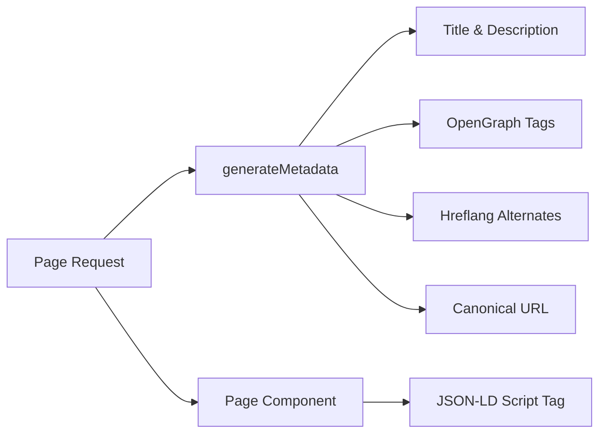

# SEO система

Шаблонът Ever Works включва цялостна SEO система, която генерира структурирани данни (JSON-LD), тагове hreflang, метаданни на OpenGraph и динамични карти на сайта. Всички помощни програми за SEO живеят под `lib/seo/` и се интегрират с API за метаданни на Next.js.

## Преглед на архитектурата



### Изходни файлове

|Файл|Цел|
|---|---|
|`lib/seo/schema.ts`|JSON-LD генератори на структурирани данни|
|`lib/seo/hreflang.ts`|Генератори на алтернативни езикови URL адреси|
|`lib/seo/listing-metadata.ts`|Фабрика за метаданни на страницата със списък|

## JSON-LD структурирани данни

Модулът `lib/seo/schema.ts` генерира структурирани данни на Schema.org за богати резултати на търсачката.

### Продуктова схема

За страници с подробности за артикула генерира `Product` схема:

```typescript
import { generateProductSchema } from '@/lib/seo/schema';

const schema = generateProductSchema({
  name: 'My App',
  description: 'A productivity tool',
  image: 'https://example.com/icon.png',
  url: 'https://example.com/items/my-app',
  category: 'Productivity',
  sourceUrl: 'https://myapp.com',
  brandName: 'MyApp Inc.',
});
```

Генериран изход:

```json
{
  "@context": "https://schema.org",
  "@type": "Product",
  "name": "My App",
  "description": "A productivity tool",
  "image": "https://example.com/icon.png",
  "url": "https://example.com/items/my-app",
  "category": "Productivity",
  "brand": {
    "@type": "Brand",
    "name": "MyApp Inc."
  },
  "offers": {
    "@type": "Offer",
    "url": "https://myapp.com",
    "availability": "https://schema.org/InStock"
  }
}
```

### Организационна схема

Генерира `Organization` схема за целия сайт за видимост на панела на знанието:

```typescript
import { generateOrganizationSchema } from '@/lib/seo/schema';

const schema = generateOrganizationSchema();
```

Тази схема включва:
- Име на марката, URL адрес и лого
- Връзки към социални профили (`sameAs` масив) от `siteConfig.social`
- Точка за контакт с имейл (когато е конфигуриран)

### Схема на уеб сайт с SearchAction

Активира полето за търсене на Google Sitelinks:

```typescript
import { generateWebSiteSchema } from '@/lib/seo/schema';

const schema = generateWebSiteSchema('en');
// Includes potentialAction with SearchAction targeting /?q={search_term_string}
```

Схемата зачита локалните префикси:
- Локал по подразбиране: `https://example.com`
- Други локали: `https://example.com/fr`

### Навигационна схема

Генерира `BreadcrumbList` за резултати от търсене с навигация:

```typescript
import { generateBreadcrumbSchema } from '@/lib/seo/schema';

const schema = generateBreadcrumbSchema([
  { name: 'Home', url: 'https://example.com' },
  { name: 'Productivity', url: 'https://example.com/categories/productivity' },
  { name: 'My App', url: 'https://example.com/items/my-app' },
]);
```

### Вграждане в страници

JSON-LD е вграден с помощта на маркер `<script>` в компонента на страницата:

```tsx
export default function ItemDetailPage({ item }) {
  const schema = generateProductSchema({ ... });

  return (
    <>
      <script
        type="application/ld+json"
        dangerouslySetInnerHTML={{ __html: JSON.stringify(schema) }}
      />
      <ItemDetail item={item} />
    </>
  );
}
```

## Етикети Hreflang

Модулът `lib/seo/hreflang.ts` генерира алтернативни езикови URL адреси за мултилокално SEO.

### URL модел

Шаблонът използва модела на префикса на локала „при необходимост“:

|локал|URL модел|
|---|---|
|`en` (по подразбиране)|`https://example.com/items/my-app`|
|`fr`|`https://example.com/fr/items/my-app`|
|`es`|`https://example.com/es/items/my-app`|
|`x-default`|Същото като `en` (локал по подразбиране)|

### Генериране на алтернативи

```typescript
import { generateHreflangAlternates } from '@/lib/seo/hreflang';

// For any page path
const alternates = generateHreflangAlternates('/about');
// Returns: { en: 'https://example.com/about', fr: 'https://example.com/fr/about', ... }

// Convenience functions for common page types
import { generateItemHreflangAlternates } from '@/lib/seo/hreflang';
const itemAlternates = generateItemHreflangAlternates('my-app');

import { generatePageHreflangAlternates } from '@/lib/seo/hreflang';
const pageAlternates = generatePageHreflangAlternates('about');
```

### Интеграция с метаданни Next.js

```typescript
export async function generateMetadata({ params }) {
  const { locale, slug } = await params;
  return {
    alternates: {
      canonical: `https://example.com/${locale}/items/${slug}`,
      languages: generateItemHreflangAlternates(slug),
    },
  };
}
```

### Поддържани локални съпоставки

Всички 20+ локала са картографирани в `LOCALE_TO_HREFLANG`:

```
en -> en, fr -> fr, es -> es, de -> de, zh -> zh,
ar -> ar, he -> he, ru -> ru, uk -> uk, pt -> pt,
it -> it, ja -> ja, ko -> ko, nl -> nl, pl -> pl,
tr -> tr, vi -> vi, th -> th, hi -> hi, id -> id, bg -> bg
```

## Метаданни на страницата със списък

Модулът `lib/seo/listing-metadata.ts` генерира пълни обекти `Metadata` за страници със списъци и категории.

### Използване

```typescript
import { generateListingMetadata } from '@/lib/seo/listing-metadata';

export async function generateMetadata({ params }) {
  const { locale } = await params;
  return generateListingMetadata({
    title: 'Time Tracking Tools',
    description: 'Browse the best time tracking tools',
    path: '/categories/time-tracking',
    locale,
    itemCount: 42,
    keywords: ['time tracking', 'productivity', 'tools'],
    imageUrl: 'https://example.com/og/time-tracking.png',
  });
}
```

### Генерирана структура на метаданни

Функцията създава пълен Next.js обект `Metadata`:

|Поле|Източник|
|---|---|
|`title`|`{title} \|{siteName}`|
|`description`|Персонализирано или автоматично генерирано от заглавие + брой елементи|
|`keywords`|Обединен масив от ключови думи|
|`openGraph.type`|`'website'`|
|`openGraph.siteName`|От `siteConfig.name`|
|`openGraph.url`|Каноничен URL адрес с локал|
|`openGraph.images`|URL адрес на изображението по избор|
|`twitter.card`|`'summary_large_image'`|
|`alternates.canonical`|Пълен каноничен URL адрес|
|`alternates.languages`|Hreflang се редува за всички локали|

## Генериране на изображения на OpenGraph

Динамичните OG изображения се генерират с помощта на Next.js `ImageResponse` на две нива:

|Файл|Маршрут|Цел|
|---|---|---|
|`app/opengraph-image.tsx`|`/opengraph-image`|OG изображение по подразбиране за целия сайт|
|`app/[locale]/items/[slug]/opengraph-image.tsx`|`/items/{slug}/opengraph-image`|Динамично OG изображение за всеки артикул|

Тези файлове използват модула `next/og` за изобразяване на компоненти на React като изображения по време на заявка, което позволява динамичен текст, лога и брандиране.

## Контролен списък за SEO

Когато добавяте нов тип страница, уверете се, че следните SEO елементи са налице:

|елемент|Внедряване|
|---|---|
|Заглавие на страницата|`generateMetadata` с описателно заглавие|
|Мета описание|Персонализирано описание или автоматично генерирано|
|Каноничен URL адрес|Задайте в `alternates.canonical`|
|Hreflang тагове|Използвайте `generateHreflangAlternates`|
|Тагове на OpenGraph|Включва се чрез `generateListingMetadata` или ръчно|
|Twitter карта|Задайте `twitter.card` на `summary_large_image`|
|JSON-LD|Добавяне на схема чрез `<script type="application/ld+json">`|
|галета|Използвайте `generateBreadcrumbSchema` за вложени страници|

## Най-добри практики

1. **Винаги задавайте канонични URL адреси** -- предотвратява проблеми с дублиране на съдържание в различни локали.
2. **Включете hreflang за всички локали** -- дори ако съдържанието все още не е преведено, URL структурата помага на търсачките.
3. **Използвайте описателни, уникални заглавия** -- избягвайте общи заглавия като „Начало“ без името на сайта.
4. **Поддържайте описанията под 160 знака** -- по-дългите описания се съкращават в резултатите от търсенето.
5. **Тествайте структурирани данни** с инструмента Google Rich Results Test преди внедряване.
6. **Генерирайте динамично OG изображения** -- статичните резервни изображения пропускат възможности за брандиране на конкретни артикули.
