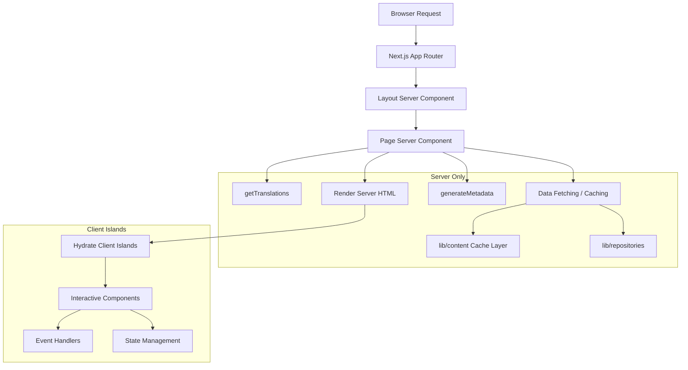

# Модели на сървърни компоненти

## Преглед

Шаблонът Ever Works използва React Server Components (RSC) като стратегия за изобразяване по подразбиране в целия Next.js App Router. Компонентите на сървъра обработват извличането на данни, зареждането на превода, генерирането на метаданни и композирането на оформлението на сървъра, като изпращат само изобразения HTML на клиента.

## Архитектура



## Изходни файлове

|Файл|Демонстриран модел|
|------|---------------------|
|`template/app/[locale]/about/page.tsx`|Извличане на данни, i18n, метаданни, MDX изобразяване|
|`template/app/[locale]/layout.tsx`|Основно оформление с доставчик на локал|
|`template/app/layout.tsx`|Глобално оформление, шрифтове, доставчици|
|`template/app/sitemap.ts`|Генериране на маршрут само за сървър|
|`template/app/robots.ts`|Конфигурация само за сървър|

## Основни модели

### Модел 1: Асинхронни компоненти на страница с i18n

Всяка локализирана страница следва този модел:

```typescript
// Server Component -- no "use client" directive
export const revalidate = 3600; // ISR: revalidate every hour

interface PageProps {
    params: Promise<{ locale: string }>;
}

export async function generateMetadata({ params }: PageProps): Promise<Metadata> {
    const { locale } = await params;
    const t = await getTranslations({ locale, namespace: 'footer' });
    return {
        title: t('ABOUT_US'),
        description: t('ABOUT_PAGE_META_DESCRIPTION'),
        alternates: {
            languages: generateHreflangAlternates('/about')
        }
    };
}

export default async function AboutPage({ params }: PageProps) {
    const { locale } = await params;
    const pageData = await getCachedPageContent('about', locale);
    const tCommon = await getTranslations({ locale, namespace: 'common' });

    return (
        <PageContainer>
            <MDX source={pageData?.content || DEFAULT_CONTENT} />
        </PageContainer>
    );
}
```

Ключови характеристики:
- `params` е `Promise` (конвенция Next.js 15+ App Router)
- Множество `getTranslations()` извиквания за различни пространства от имена
- Извличане на кеширано съдържание чрез `getCachedPageContent()`
- Статичен интервал на презаверка с `export const revalidate`

### Модел 2: Генериране на метаданни

Сървърните компоненти генерират SEO метаданни на ниво маршрут:

```typescript
export async function generateMetadata({ params }: PageProps): Promise<Metadata> {
    const { locale } = await params;
    const t = await getTranslations({ locale, namespace: 'pages' });

    return {
        metadataBase: new URL(appUrl),
        title: t('PAGE_TITLE'),
        description: t('PAGE_DESCRIPTION'),
        alternates: {
            languages: generateHreflangAlternates('/path')
        }
    };
}
```

Помощната програма `generateHreflangAlternates()` от `lib/seo/hreflang.ts` автоматично генерира алтернативни езикови връзки за всички поддържани локали.

### Модел 3: ISR с кеширане на съдържание

```typescript
export const revalidate = 3600; // Revalidate every hour

export default async function Page({ params }: PageProps) {
    const data = await getCachedPageContent('page-name', locale);
    // Render with cached data...
}
```

Функцията `getCachedPageContent()` осигурява кеш слой от страна на сървъра върху базираното на Git CMS съдържание в `.content/`. В комбинация с `revalidate`, това създава ISR (Incremental Static Regeneration) модел, при който страниците се генерират статично и периодично се опресняват.

### Модел 4: Проверки за удостоверяване от страна на сървъра

Защитените страници използват защитници от страна на сървъра от `lib/auth/guards.ts`:

```typescript
import { requireAuth, requireAdmin } from '@/lib/auth/guards';

export default async function ProtectedPage() {
    const session = await requireAuth();
    // session.user is guaranteed to exist here
    return <div>Welcome {session.user.email}</div>;
}

export default async function AdminPage() {
    const session = await requireAdmin();
    // session.user.isAdmin is guaranteed true here
    return <AdminDashboard />;
}
```

Тези пазачи се обаждат на `auth()` вътрешно и използват `redirect()` от `next/navigation`, за да изпратят неупълномощени потребители към страницата за влизане. Пренасочването се извършва от страна на сървъра, така че не е необходим клиентски JavaScript.

### Модел 5: Композиране на сървърни и клиентски компоненти

Компонентите на сървъра делегират интерактивност на "острови" на клиентския компонент:

```typescript
// Server Component (page.tsx)
export default async function Page({ params }: PageProps) {
    const { locale } = await params;
    const data = await fetchData();
    const t = await getTranslations({ locale, namespace: 'page' });

    return (
        <div>
            <h1>{t('TITLE')}</h1>
            {/* Server-rendered static content */}
            <StaticContent data={data} />
            {/* Client island for interactivity */}
            <InteractiveFilter initialData={data} />
        </div>
    );
}
```

Данните се движат надолу от сървъра към клиента като сериализируеми подпори. Клиентските компоненти получават предварително извлечени данни и обработват потребителските взаимодействия.

## Стратегии за извличане на данни

### Директен достъп до хранилище

Сървърните компоненти могат директно да импортират и извикват функциите на хранилището:

```typescript
import { getItemBySlug } from '@/lib/repositories/item-repository';

export default async function ItemPage({ params }) {
    const item = await getItemBySlug(params.slug);
    // ...
}
```

### Слой с кеширано съдържание

За базирано на Git CMS съдържание:

```typescript
import { getCachedPageContent } from '@/lib/content';

const pageData = await getCachedPageContent('about', locale);
```

### Външни API извиквания

Сервизните функции в `lib/services/` капсулират външни API взаимодействия:

```typescript
import { triggerManualSync } from '@/lib/services/sync-service';
```

## Поточно предаване и съспенс

Компонентите на сървъра поддържат поточно предаване през границите на React Suspense. Големите страници могат да показват състояния на зареждане за отделни секции:

```typescript
import { Suspense } from 'react';

export default async function Page() {
    return (
        <div>
            <Header /> {/* Renders immediately */}
            <Suspense fallback={<LoadingSkeleton />}>
                <SlowDataSection /> {/* Streams when ready */}
            </Suspense>
        </div>
    );
}
```

## Най-добри практики в шаблона

1. **Няма `"use client"`, освен ако не е необходимо** -- компонентите са компоненти на сървъра по подразбиране
2. **Преводите са заредени от страна на сървъра** -- `getTranslations()` работи само на сървъра
3. **Метаданни, разположени съвместно със страници** -- `generateMetadata` се експортира от същия файл
4. **Препотвърждаване на ниво маршрут** -- `export const revalidate` контролира времето за ISR
5. **Функции за защита за удостоверяване** -- пренасочвания от страна на сървъра без разходи за клиентски пакет
6. **Реквизити надолу, събития нагоре** -- сървърните компоненти предават данни към клиентските острови като реквизити
