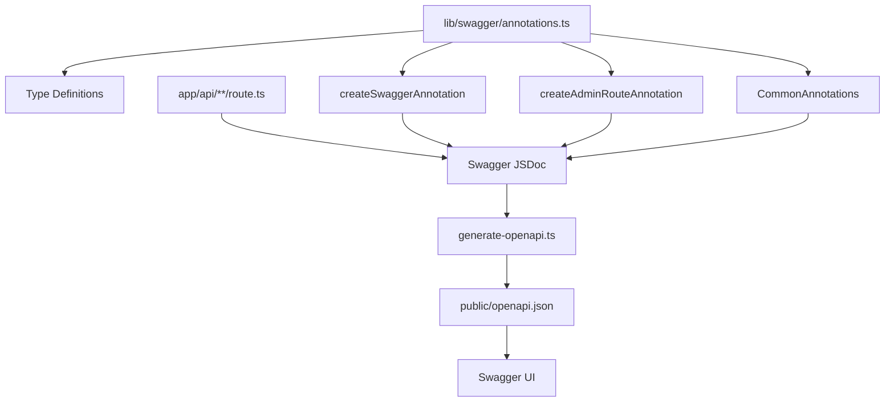
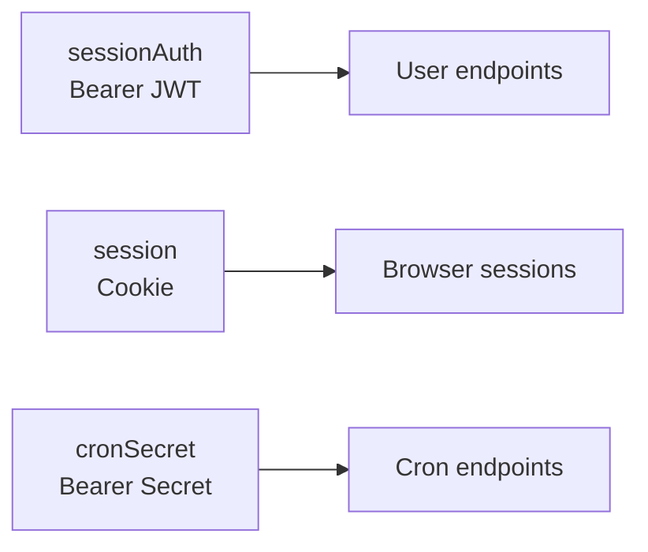

# Система Swagger

Шаблонът предоставя пълна система за документиране на Swagger/OpenAPI, изградена на `swagger-jsdoc`. Той включва помощни средства за анотации в `lib/swagger/annotations.ts` за стандартизиране на API документация във всички манипулатори на маршрути.

## Архитектура



## Система за тип анотации

Модулът `lib/swagger/annotations.ts` дефинира TypeScript интерфейси, които отразяват спецификацията OpenAPI 3.0:

### SwaggerRouteConfig

Основният конфигурационен обект за документиране на API маршрут:

```typescript
interface SwaggerRouteConfig {
  tags: string[];                              // API grouping tags
  summary: string;                             // Brief description
  description: string;                         // Detailed description
  security?: Array<Record<string, string[]>>;  // Security requirements
  parameters?: SwaggerParameter[];             // Query/path/header params
  requestBody?: SwaggerRequestBody;            // Request body schema
  responses: Record<string, SwaggerResponse>;  // Response definitions
}
```

### SwaggerParameter

Дефинира параметри на заявка, път или заглавка:

```typescript
interface SwaggerParameter {
  name: string;
  in: 'query' | 'path' | 'header';
  required?: boolean;
  schema: {
    type: string;
    format?: string;
    minimum?: number;
    maximum?: number;
    default?: any;
    enum?: string[];
  };
  description?: string;
  example?: any;
}
```

### SwaggerRequestBody

Дефинира структурата на тялото на заявката:

```typescript
interface SwaggerRequestBody {
  required: boolean;
  content: {
    'application/json': {
      schema: {
        $ref?: string;       // Reference to a component schema
        type?: string;       // Inline type definition
        properties?: Record<string, any>;
      };
      example?: any;
    };
  };
}
```

### SwaggerResponse

Дефинира кодовете за състояние на отговор и техните схеми:

```typescript
interface SwaggerResponse {
  description: string;
  content?: {
    'application/json': {
      schema: {
        $ref?: string;
        type?: string;
        properties?: Record<string, any>;
      };
      example?: any;
      examples?: Record<string, any>;
    };
  };
}
```

## Често срещани анотации

Обектът `CommonAnnotations` предоставя градивни елементи за многократна употреба:

### Стандартни отговори за грешка

```typescript
CommonAnnotations.responses.unauthorized
// { description: 'Authentication required', ... }

CommonAnnotations.responses.forbidden
// { description: 'Forbidden - Admin access required', ... }

CommonAnnotations.responses.notFound
// { description: 'Resource not found', ... }

CommonAnnotations.responses.serverError
// { description: 'Internal server error', ... }
```

Всеки отговор за грешка включва стандартен пример:

```json
{
  "success": false,
  "error": "Error message"
}
```

### Параметри за пагинация

```typescript
CommonAnnotations.paginationParameters
// [
//   { name: 'page', in: 'query', schema: { type: 'integer', minimum: 1, default: 1 } },
//   { name: 'limit', in: 'query', schema: { type: 'integer', minimum: 1, maximum: 100, default: 10 } }
// ]
```

### Защита на администратора

```typescript
CommonAnnotations.adminSecurity
// [{ sessionAuth: [] }]
```

## Създаване на анотации

### createSwaggerAnnotation()

Генерира пълен низ за коментар `@swagger` JSDoc:

```typescript
import { createSwaggerAnnotation, CommonAnnotations } from '@/lib/swagger/annotations';

const annotation = createSwaggerAnnotation('/api/items', 'GET', {
  tags: ['Items'],
  summary: 'List all items',
  description: 'Returns a paginated list of items with filtering support',
  parameters: [
    ...CommonAnnotations.paginationParameters,
    {
      name: 'category',
      in: 'query',
      required: false,
      schema: { type: 'string' },
      description: 'Filter by category',
      example: 'Web Development'
    }
  ],
  responses: {
    '200': {
      description: 'Paginated list of items',
      content: {
        'application/json': {
          schema: { $ref: '#/components/schemas/Pagination' },
          example: {
            items: [{ id: '1', title: 'Sample Item' }],
            pagination: { page: 1, pageSize: 10, total: 50, totalPages: 5 }
          }
        }
      }
    },
    '500': CommonAnnotations.responses.serverError
  }
});
```

### createAdminRouteAnnotation()

Съкращение за защитени от администратор маршрути. Автоматично добавя `sessionAuth` сигурност:

```typescript
import { createAdminRouteAnnotation, CommonAnnotations } from '@/lib/swagger/annotations';

const annotation = createAdminRouteAnnotation('/api/admin/users', 'GET', {
  tags: ['Admin'],
  summary: 'List all users',
  description: 'Returns all registered users with their profiles and roles',
  parameters: CommonAnnotations.paginationParameters,
  responses: {
    '200': {
      description: 'User list with pagination',
      content: {
        'application/json': {
          schema: { type: 'object' },
          example: {
            items: [{ id: '1', email: 'admin@example.com', role: 'admin' }],
            pagination: { page: 1, pageSize: 10, total: 100, totalPages: 10 }
          }
        }
      }
    },
    '401': CommonAnnotations.responses.unauthorized,
    '403': CommonAnnotations.responses.forbidden,
    '500': CommonAnnotations.responses.serverError
  }
});
```

## Писане на документация за маршрута

### Шаблон за директна анотация

Най-често срещаният подход е писането на `@swagger` коментари директно във файловете на маршрута:

```typescript
// app/api/items/route.ts

/**
 * @swagger
 * /api/items:
 *   get:
 *     tags: ["Items"]
 *     summary: "Get all items"
 *     description: "Returns paginated items list with optional category filter"
 *     parameters:
 *       - name: "page"
 *         in: query
 *         schema:
 *           type: integer
 *           default: 1
 *       - name: "limit"
 *         in: query
 *         schema:
 *           type: integer
 *           default: 10
 *     responses:
 *       200:
 *         description: "Success"
 *       500:
 *         description: "Server error"
 */
export async function GET(request: Request) {
  // implementation
}
```

### POST маршрут с тяло на заявката

```typescript
/**
 * @swagger
 * /api/items:
 *   post:
 *     tags: ["Items"]
 *     summary: "Create a new item"
 *     security:
 *       - sessionAuth: []
 *     requestBody:
 *       required: true
 *       content:
 *         application/json:
 *           schema:
 *             type: object
 *             properties:
 *               title:
 *                 type: string
 *               description:
 *                 type: string
 *               category:
 *                 type: string
 *           example:
 *             title: "My New Item"
 *             description: "Item description"
 *             category: "Web Development"
 *     responses:
 *       201:
 *         description: "Item created"
 *       400:
 *         description: "Validation error"
 *       401:
 *         description: "Unauthorized"
 */
export async function POST(request: Request) {
  // implementation
}
```

## Организация на етикети

Организирайте API маршрутите в логически групи с помощта на тагове:

|Етикет|Маршрути|Описание|
|---|---|---|
|`Items`|`/api/items/*`|Обществен списък с артикули и подробности|
|`Admin`|`/api/admin/*`|Операции на администраторското табло|
|`Auth`|`/api/auth/*`|Потоци за удостоверяване|
|`Profile`|`/api/profile/*`|Управление на потребителски профил|
|`Newsletter`|`/api/newsletter/*`|Абонаменти за бюлетин|
|`Comments`|`/api/comments/*`|Коментирайте CRUD операции|
|`Payments`|`/api/payments/*`|Обработка на плащане|
|`Cron`|`/api/cron/*`|Планирани крайни точки на работа|

## Схеми за сигурност

Три схеми за сигурност са дефинирани в конфигурацията на OpenAPI:



### Използване в анотации

```yaml
# JWT Bearer authentication
security:
  - sessionAuth: []

# Cookie-based session
security:
  - session: []

# Cron job secret
security:
  - cronSecret: []
```

## Генериран изход

Скриптът `generate-openapi.ts` произвежда `public/openapi.json` със следната структура:

```json
{
  "openapi": "3.0.0",
  "info": { "title": "Ever Works API", "version": "1.0.0" },
  "servers": [{ "url": "/" }],
  "paths": {
    "/api/items": { "get": { ... }, "post": { ... } },
    "/api/admin/users": { "get": { ... } }
  },
  "components": {
    "securitySchemes": { ... },
    "schemas": {
      "ErrorResponse": { ... },
      "PaginationMeta": { ... },
      "Pagination": { ... }
    }
  },
  "tags": [
    { "name": "Items" },
    { "name": "Admin" }
  ]
}
```

## Най-добри практики

1. **Документирайте всеки обществен маршрут** -- Всички маршрути в `app/api/` трябва да имат `@swagger` анотации
2. **Използвайте `$ref` за споделени схеми** -- Референтни компонентни схеми вместо дублиране на дефиниции
3. **Включете примери** -- Винаги предоставяйте `example` стойности за тела на заявка и отговор
4. **Използвайте CommonAnnotations** -- Използвайте споделените отговори за грешка и параметрите за страниране
5. **Постоянно етикетиране** -- Групирайте свързани крайни точки под едно и също име на етикет
6. **Опишете параметрите** -- Включете `description` и `example` за всеки параметър
7. **Документирайте всички кодове на състояние** -- Покривайте случаи на успех, грешка при валидиране, грешка при удостоверяване и грешки на сървъра
8. **Дръжте анотациите близо до манипулаторите** -- Поставете `@swagger` коментари директно над функцията за манипулиране на маршрута
