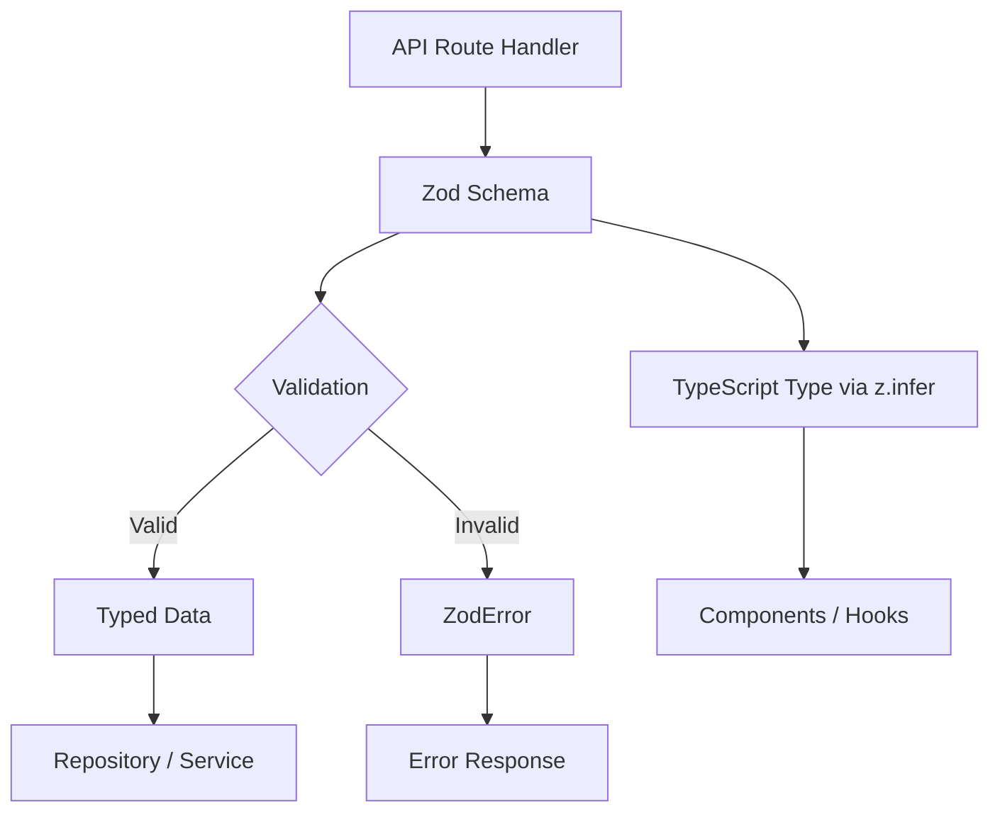

# Модели за валидиране

Шаблонът използва Zod за базирано на схема валидиране във всички граници на API. Схемите за валидиране дефинират форми на данни, ограничения, трансформации и изводи за тип в един източник на истина. Всеки домейн има свой собствен валидиращ модул със схеми за създаване, актуализиране и операции за заявки.

## Преглед на архитектурата



## Изходни файлове

|Файл|Цел|
|------|---------|
|`lib/validations/auth.ts`|Пароли и схеми за удостоверяване|
|`lib/validations/item.ts`|Схема на данните за местоположението на артикула|
|`lib/validations/client-item.ts`|Схеми за създаване/актуализиране/заявка на елемент, обърнат към клиента|
|`lib/validations/company.ts`|Фирмени CRUD и схеми за асоцииране на артикул-компания|
|`lib/validations/sponsor-ad.ts`|Схеми за жизнения цикъл на рекламите на спонсори|
|`lib/validations/client-dashboard.ts`|Схеми на параметри на заявка за табло за управление|
|`lib/validations/user-location.ts`|Потребителско местоположение и настройки за поверителност|

## Основни модели

### Модел 1: Схема + Изведен тип

Всяка схема експортира съответния тип TypeScript чрез `z.infer`:

```typescript
import { z } from 'zod';

export const createCompanySchema = z.object({
  name: z.string().min(1, "Company name is required").max(255),
  website: z.string().url("Invalid URL format").optional().or(z.literal("")),
  status: z.enum(["active", "inactive"]).default("active"),
});

export type CreateCompanyInput = z.infer<typeof createCompanySchema>;
// Inferred type:
// {
//   name: string;
//   website?: string | "";
//   status: "active" | "inactive";
// }
```

### Модел 2: Трансформиране и нормализиране

Схемите използват `.transform()` за нормализиране на входните данни:

```typescript
domain: z.string()
  .max(255)
  .optional()
  .transform((val) => val?.toLowerCase().trim() || undefined),

slug: z.string()
  .max(255)
  .optional()
  .transform((val) => val?.toLowerCase().trim() || undefined)
  .refine(
    (val) => !val || /^[a-z0-9-]+$/.test(val),
    { message: "Slug must contain only lowercase letters, numbers, and hyphens" }
  ),
```

### Модел 3: Enum ограничения

Полетата за състояние използват `z.enum()` с константни масиви за безопасност на типа:

```typescript
export const companyStatus = ["active", "inactive"] as const;
export const sponsorAdStatuses = [
  "pending_payment", "pending", "rejected",
  "active", "expired", "cancelled",
] as const;
export const sponsorAdIntervals = ["weekly", "monthly"] as const;

// Usage in schemas
status: z.enum(companyStatus).default("active"),
interval: z.enum(sponsorAdIntervals),
```

### Модел 4: Принудени параметри на заявката

Параметрите на низа на заявката от HTTP заявки се извличат от низове:

```typescript
export const querySponsorAdsSchema = z.object({
  page: z.coerce.number().int().positive().default(1),
  limit: z.coerce.number().int().positive().max(100).default(10),
  status: z.enum(sponsorAdStatuses).optional(),
  sortBy: z.enum(["createdAt", "updatedAt", "startDate", "endDate", "status"]).default("createdAt"),
  sortOrder: z.enum(["asc", "desc"]).default("desc"),
});
```

### Модел 5: Трансформация от низ към число

За параметри на заявка, които пристигат като низове, но представляват числа:

```typescript
page: z.string()
  .optional()
  .transform(val => (val ? parseInt(val, 10) : 1))
  .refine(val => !Number.isNaN(val), { message: 'Page must be a valid number' })
  .refine(val => val >= 1, { message: 'Page must be at least 1' }),

deleted: z.string()
  .optional()
  .transform(val => val === 'true'),  // String "true" -> boolean true
```

### Модел 6: Валидиране на различни полета с прецизиране

Комплексни правила за валидиране, които обхващат множество полета:

```typescript
export const updateLocationSchema = z.object({
  defaultLatitude: z.number().min(-90).max(90).nullable().optional(),
  defaultLongitude: z.number().min(-180).max(180).nullable().optional(),
  defaultCity: z.string().max(200).nullable().optional(),
  defaultCountry: z.string().max(100).nullable().optional(),
  locationPrivacy: locationPrivacySchema.optional(),
}).refine(
  (data) => {
    const hasLat = data.defaultLatitude != null;
    const hasLng = data.defaultLongitude != null;
    return hasLat === hasLng;  // Both or neither
  },
  { message: 'Both latitude and longitude must be provided together' }
);
```

### Модел 7: Типове съюзи

Полета, които приемат множество формати:

```typescript
category: z.union([
  z.string().min(1, 'Category is required'),
  z.array(z.string().min(1)).min(1, 'At least one category is required'),
]).optional().nullable(),
```

## Схеми на домейни

### Удостоверяване

Валидиране на парола с множество ограничения на регулярен израз:

```typescript
export const passwordSchema = z.string()
  .min(8, "Password must be at least 8 characters")
  .regex(/[A-Z]/, "Must contain at least one uppercase letter")
  .regex(/[a-z]/, "Must contain at least one lowercase letter")
  .regex(/[0-9]/, "Must contain at least one number")
  .regex(/[^A-Za-z0-9]/, "Must contain at least one special character");
```

### Местоположение на елемента

Географски данни с ограничени координати:

```typescript
export const locationSchema = z.object({
  address: z.string().optional(),
  city: z.string().optional(),
  state: z.string().optional(),
  country: z.string().optional(),
  postal_code: z.string().optional(),
  latitude: z.number().min(-90).max(90).optional(),
  longitude: z.number().min(-180).max(180).optional(),
  service_area: z.enum(['local', 'regional', 'national', 'global']).optional(),
  is_remote: z.boolean().optional(),
  geocoded_by: z.enum(['mapbox', 'google']).optional(),
}).optional();
```

### Поверителност на местоположението на потребителя

Базирани на enum настройки за поверителност:

```typescript
export const locationPrivacyValues = ['private', 'city', 'exact'] as const;
export const locationPrivacySchema = z.enum(locationPrivacyValues);
export type LocationPrivacy = z.infer<typeof locationPrivacySchema>;
```

### Изпращане на клиентски артикул

Пълна схема за създаване с константи за външно валидиране:

```typescript
import { ITEM_VALIDATION } from '@/lib/types/item';

export const clientCreateItemSchema = z.object({
  name: z.string()
    .min(ITEM_VALIDATION.NAME_MIN_LENGTH)
    .max(ITEM_VALIDATION.NAME_MAX_LENGTH),
  description: z.string()
    .min(ITEM_VALIDATION.DESCRIPTION_MIN_LENGTH)
    .max(ITEM_VALIDATION.DESCRIPTION_MAX_LENGTH),
  source_url: z.string().url('Invalid URL format'),
  category: z.union([
    z.string().min(1),
    z.array(z.string().min(1)).min(1),
  ]).optional().nullable(),
  tags: z.array(z.string().min(1)).optional().default([]),
  icon_url: z.string().url().optional().or(z.literal('')),
  location: locationSchema,
});
```

### Спонсорирайте рекламния жизнен цикъл

Множество схеми, покриващи пълния работен процес на спонсориране на реклами:

|Схема|Цел|
|--------|---------|
|`createSponsorAdSchema`|Изпращане на нова реклама за спонсор|
|`updateSponsorAdSchema`|Актуализация на администратора (статус, дати, абонамент)|
|`approveSponsorAdSchema`|Одобрение от администратор|
|`rejectSponsorAdSchema`|Отхвърляне на администратор с причина (10-500 знака)|
|`cancelSponsorAdSchema`|Анулиране с незадължителна причина|
|`querySponsorAdsSchema`|Страниран списък с филтри|

## Шаблони за повторно използване на схема

### Частични схеми за актуализации

Схемите за актуализиране често огледално създават схеми с всички полета по избор:

```typescript
export const updateCompanySchema = z.object({
  id: z.string().uuid(),
  name: z.string().min(1).max(255).optional(),
  website: z.string().url().optional().or(z.literal("")),
  status: z.enum(companyStatus).optional(),
});
```

### Псевдоним на схема

Когато две операции имат идентични нужди за валидиране:

```typescript
export const assignCompanyToItemSchema = z.object({
  itemSlug: z.string().min(1).max(255).transform(val => val.toLowerCase().trim()),
  companyId: z.string().uuid("Invalid company ID format"),
});

// Reuse for updates (identical validation)
export const updateItemCompanySchema = assignCompanyToItemSchema;
```

### Селективно бране

Използване на `.pick()` за създаване на схеми на подмножество:

```typescript
const validatedData = userValidationSchema
  .pick({ email: true, password: true })
  .parse(data);
```

## Използване в API Routes

```typescript
import { clientCreateItemSchema } from '@/lib/validations/client-item';

export async function POST(request: Request) {
  const body = await request.json();

  // Validation + transformation in one step
  const result = clientCreateItemSchema.safeParse(body);

  if (!result.success) {
    return Response.json(
      { errors: result.error.flatten().fieldErrors },
      { status: 400 }
    );
  }

  // result.data is fully typed and transformed
  const item = await repository.create(result.data);
  return Response.json(item, { status: 201 });
}
```
