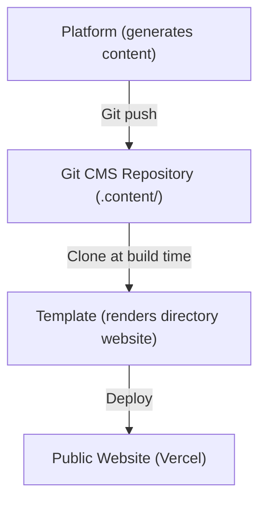
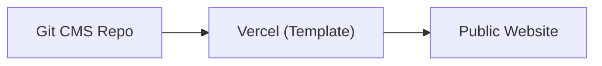
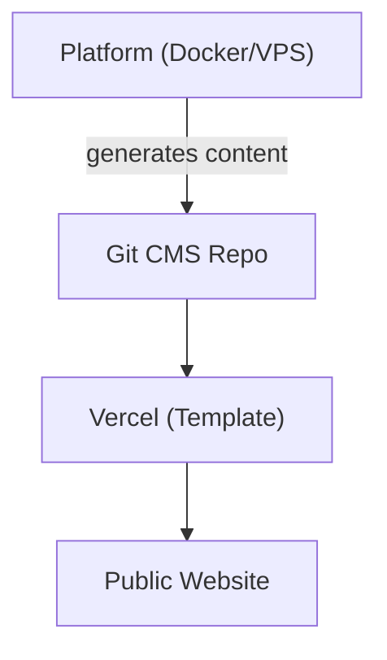
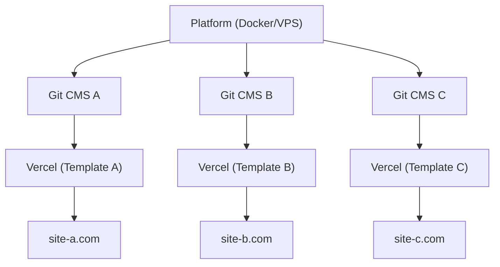

# Платформа срещу Шаблон

Ever Works се състои от два основни продукта, които служат за различни цели, но работят заедно като единна екосистема. Тази страница обяснява разликата и кога да се използва кой от тях.

## Платформата Ever Works

**Платформата Ever Works** е бекенд инфраструктурата за изграждане и управление на уебсайтове-директории в мащаб. Тя предоставя REST API, конвейери за генериране на съдържание с помощта на AI, система от плъгини и оркестрация на внедряване.

За пълна документация на платформата, посетете [docs.ever.works](https://docs.ever.works).

## Directory Web Template

**Directory Web Template** (този проект) е готов за производство пълностоков уебсайт-директория, който можете да клонирате, персонализирате и внедрите като самостоятелно приложение.

### Какво прави

- Предоставя пълен **уебсайт-директория** с листинги на елементи, търсене, филтриране, категории, тагове и колекции
- Включва **удостоверяване** чрез NextAuth.js v5 с OAuth доставчици (Google, GitHub, Facebook, Twitter, Microsoft) и Supabase Auth
- Поддържа **плащания** чрез Stripe, LemonSqueezy и Polar с управление на абонаменти
- Предлага **интернационализация** с множество езици и поддръжка на RTL чрез next-intl
- Използва **CMS базиран на Git** за синхронизиране на съдържанието на директорията от Git хранилища
- Включва **система от теми** с вградени теми и динамично генериране на цветове
- Осигурява **анализи и мониторинг** чрез PostHog и Sentry
- Снабден е с **SEO оптимизация**, генериране на карта на сайта и структурирани данни (JSON-LD)
- Включва **администраторско табло** с управление на съдържанието, потребителите и анализи

### Технологичен Стек

- **Фреймуорк:** Next.js 15, React 19
- **Език:** TypeScript 5
- **ORM:** Drizzle ORM (PostgreSQL)
- **UI:** Tailwind CSS 4, HeroUI React, Radix UI
- **Auth:** NextAuth.js v5, Supabase Auth
- **Плащания:** Stripe, LemonSqueezy, Polar
- **Тестване:** Playwright (E2E)
- **Внедряване:** Vercel (основно), Docker (алтернативно)

## Сравнение Едно до Друго

| Аспект               | Платформа                                  | Шаблон                                 |
| -------------------- | ------------------------------------------ | -------------------------------------- |
| **Цел**              | Бекенд инфраструктура и AI конвейер        | Фронтенд уебсайт-директория            |
| **Архитектура**      | Монорепо (Turborepo + pnpm)                | Самостоятелно приложение Next.js       |
| **Бекенд**           | NestJS 11 API                              | API маршрути на Next.js                |
| **ORM на база данни** | TypeORM                                   | Drizzle ORM                            |
| **Удостоверяване**   | JWT + OAuth (NestJS Guards)                | NextAuth.js v5 + Supabase Auth         |
| **Плащания**         | Не е включено                              | Stripe, LemonSqueezy, Polar            |
| **AI функции**       | LangChain агенти, 7 LLM доставчика         | Няма (консумира AI-генерирано съдържание) |
| **Съдържание**       | Генерира съдържание чрез AI конвейери      | Чете съдържание от Git-базиран CMS     |
| **Внедряване**       | Docker на всеки VPS                        | Vercel (или Docker)                    |
| **Тестване**         | Jest + Vitest                              | Playwright                             |
| **Аудитория**        | Оператори на платформи, AI разработчици    | Строители на уебсайтове, създатели на директории |

## Как се Свързват

Платформата и Шаблонът работят заедно чрез модела на **Git-базиран CMS**:

### Независима Работа

- **Шаблон без Платформа:** Управлявайте ръчно съдържанието на директорията, като редактирате YAML и Markdown файлове в Git CMS хранилището. Шаблонът работи като напълно функционален уебсайт-директория без AI генериране.
- **Платформа без Шаблон:** Използвайте API на Платформата за генериране на данни от директорията и exportиране в произволен фронтенд.

## Кога Да Използвате Кое

### Използвайте Шаблона, когато...

- Искате да стартирате уебсайт-директория бързо с минимална бекенд настройка
- Съдържанието на директорията ви е ръчно курирано или идва от статичен източник на данни
- Нуждаете се от готов за производство уебсайт с удостоверяване, плащания и SEO от кутията
- Предпочитате да внедрявате на Vercel без управление на сървър

### Използвайте Платформата, когато...

- Имате нужда от AI-генериране на съдържание за мащабни директории
- Искате автоматизирани конвейери, откривящи, обогатяващи и актуализиращи елементи на директорията
- Трябва да управлявате множество директории от един бекенд
- Искате да използвате системата от плъгини за потребителски интеграции

### Използвайте И Двете, когато...

- Искате AI-генерирано съдържание да тече в производствен уебсайт
- Изграждате SaaS продукт върху Ever Works
- Имате нужда от автоматизирано генериране на съдържание И изрядна потребителска страна

## Архитектури на Внедряване

### Само Шаблон (Най-Просто)

Ръчно управление на съдържанието чрез Git. Единично внедряване на Vercel.

### Платформа + Шаблон (Full Stack)

Автоматизирано генериране на съдържание чрез Платформата. Свързано чрез Git.

### Платформа + Множество Шаблони

Единна инстанция на Платформата, управляваща множество уебсайтове-директории.
