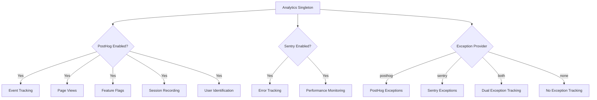
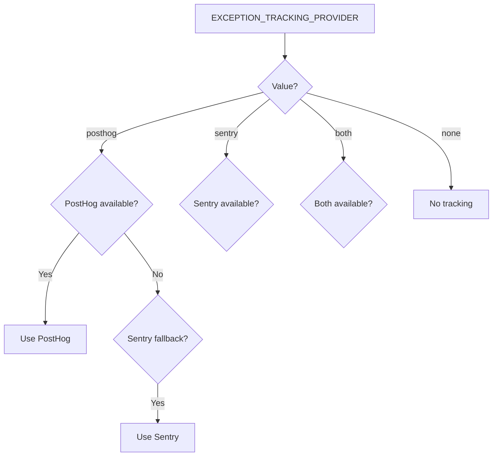

# Конфигурация на Анализ

Шаблонът предоставя унифицирана система за анализ, която интегрира PostHog за продуктов анализ и Sentry за проследяване на грешки. И двата доставчика се управляват чрез единствен екземпляр на класа `Analytics` с автоматично резервно поведение.

## Архитектура



## Променливи на Средата

### Конфигурация на PostHog

| Променлива | Задължително | По подразбиране | Описание |
|---|---|---|---|
| `NEXT_PUBLIC_POSTHOG_KEY` | Да (за анализ) | -- | API ключ на проект PostHog |
| `NEXT_PUBLIC_POSTHOG_HOST` | Да (за анализ) | -- | URL на инстанция PostHog |
| `POSTHOG_DEBUG` | Не | `false` | Включване на дебъг логиране |
| `POSTHOG_SESSION_RECORDING_ENABLED` | Не | `true` | Включване на запис на сесии |
| `POSTHOG_AUTO_CAPTURE` | Не | `false` | Автоматично захващане на прегледи на страници |
| `POSTHOG_EXCEPTION_TRACKING` | Не | `true` | Включване на проследяване на изключения в PostHog |

### Конфигурация на Sentry

| Променлива | Задължително | По подразбиране | Описание |
|---|---|---|---|
| `NEXT_PUBLIC_SENTRY_DSN` | Да (за грешки) | -- | Sentry Data Source Name |
| `SENTRY_ENABLE_DEV` | Не | `false` | Включване на Sentry в режим на разработка |
| `SENTRY_DEBUG` | Не | `false` | Включване на дебъг режим на Sentry |
| `SENTRY_EXCEPTION_TRACKING` | Не | `true` | Включване на проследяване на изключения в Sentry |

### Унифицирано Проследяване на Изключения

| Променлива | Задължително | По подразбиране | Описание |
|---|---|---|---|
| `EXCEPTION_TRACKING_PROVIDER` | Не | `both` | Доставчик за използване: `posthog`, `sentry`, `both` или `none` |

## Настройка на PostHog

### Стъпка 1: Получете идентификационни данни

1. Регистрирайте се на [posthog.com](https://posthog.com) или хоствайте PostHog сами
2. Създайте проект
3. Копирайте API ключа на проекта и URL на хоста

### Стъпка 2: Конфигурирайте средата

```env
NEXT_PUBLIC_POSTHOG_KEY=phc_your_project_key_here
NEXT_PUBLIC_POSTHOG_HOST=https://app.posthog.com
```

PostHog се активира автоматично, когато са зададени и двете стойности: `NEXT_PUBLIC_POSTHOG_KEY` и `NEXT_PUBLIC_POSTHOG_HOST`.

### Стъпка 3: Честота на вземане на извадки

Честотата на вземане на извадки се настройва автоматично според средата:

| Среда | Честота на извадки на събития | Честота на запис на сесии |
|---|---|---|
| Продукция | 10% (`0.1`) | 10% (`0.1`) |
| Разработка | 100% (`1.0`) | 100% (`1.0`) |

## Настройка на Sentry

### Стъпка 1: Получете DSN

1. Създайте проект на [sentry.io](https://sentry.io)
2. Копирайте DSN от настройките на проекта

### Стъпка 2: Конфигурирайте средата

```env
NEXT_PUBLIC_SENTRY_DSN=https://examplePublicKey@o0.ingest.sentry.io/0
SENTRY_ENABLE_DEV=true  # По избор: включване в режим на разработка
```

Sentry се активира автоматично в продукция, когато DSN е зададен. За разработка изрично задайте `SENTRY_ENABLE_DEV=true`.

## API на клас Analytics

Класът `Analytics` е единствен екземпляр, достъпен в цялото приложение:

```typescript
import { analytics } from '@/lib/analytics';
```

### Инициализация

```typescript
// Инициализиране на анализа (извикайте веднъж в корена на приложението)
analytics.init();
```

Методът `init()` е само за клиентска страна и е безопасен за извикване в сървърни контексти (само ще бъде пропуснат).

### Проследяване на събития

```typescript
// Проследяване на персонализирано събитие
analytics.track('button_clicked', {
  buttonName: 'signup',
  page: '/landing'
});

// Проследяване на преглед на страница
analytics.trackPageView('/dashboard', {
  referrer: document.referrer
});
```

### Идентификация на потребителя

```typescript
// Идентифициране на потребител (след вход)
analytics.identify('user-123', {
  email: 'user@example.com',
  plan: 'premium',
  company: 'Acme Inc.'
});

// Нулиране на идентичността (след изход)
analytics.reset();

// Задаване на постоянни свойства на потребителя
analytics.setUserProperties({
  subscription_tier: 'premium',
  signup_date: '2024-01-15'
});

// Задаване на суперсвойства (изпращат се с всяко събитие)
analytics.setSuperProperties({
  app_version: '2.0.0',
  platform: 'web'
});
```

### Флагове на функции

```typescript
// Проверка дали флаг на функция е активиран
const isEnabled = analytics.isFeatureEnabled('new-dashboard', false);

// Презареждане на флагове на функции от сървъра
await analytics.reloadFeatureFlags();
```

### Проследяване на изключения

```typescript
// Захващане на изключение (насочва се към конфигурирания доставчик)
analytics.captureException(error, {
  component: 'PaymentForm',
  action: 'submit'
});

// Захващане с текстово съобщение
analytics.captureException('Payment processing failed', {
  orderId: 'ord-123'
});
```

## Избор на доставчик за проследяване на изключения


