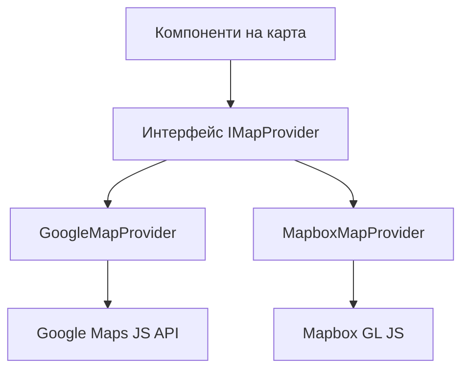

# Конфигурация на карта

Шаблонът включва агностична към доставчик система за карти, поддържаща Google Maps и Mapbox GL JS. Общ слой от интерфейси позволява превключване между доставчиците без промяна на кода на компонентите.

## Архитектура



## Избор на доставчик

Доставчикът на карта се определя от конфигурираните API ключове:

| Доставчик | Необходима променлива на средата |
|---|---|
| Google Maps | `NEXT_PUBLIC_GOOGLE_MAPS_API_KEY` |
| Mapbox | `NEXT_PUBLIC_MAPBOX_ACCESS_TOKEN` |

## Настройка на Google Maps

### Стъпка 1: Получаване на API ключ

1. Отидете на [Google Cloud Console](https://console.cloud.google.com)
2. Активирайте следните API:
   - Maps JavaScript API
   - Places API
   - Geocoding API

### Стъпка 2: Конфигуриране на средата

```env
NEXT_PUBLIC_GOOGLE_MAPS_API_KEY=AIzaSy...your-api-key
NEXT_PUBLIC_GOOGLE_MAPS_MAP_ID=your-map-id
```

**Изисквани ограничения на API ключ:**
- Ограничение на приложението: HTTP реферери
- Добавете шаблоните на вашия домейн

## Настройка на Mapbox

### Стъпка 1: Получаване на токен за достъп

```env
NEXT_PUBLIC_MAPBOX_ACCESS_TOKEN=pk.eyJ1Ijoi...your-token
```

**Изисквани ограничения на токена:**
- Използвайте **публичен** токен (префикс `pk.`)
- Никога не използвайте тайни токени (`sk.*`) в клиентски код

## Интерфейс на доставчика

### Методи на IMapProvider

| Метод | Описание |
|---|---|
| `isLoaded()` | Проверка дали скриптът на доставчика е зареден |
| `loadScript()` | Зареждане на библиотеката на доставчика (идемпотентно) |
| `createMap(container, options)` | Създаване на инстанция на карта в DOM елемент |
| `createMarker(map, options)` | Добавяне на маркер на картата |
| `createClusterer(map, options, onClick)` | Групиране на близки маркери в клъстери |
| `createAutocomplete(input, onSelect)` | Прикачване на автодопълване на адрес |
| `isConfigured()` | Проверка на наличието на API ключове |

### Стилове на карта

| Стил | Google Maps | Mapbox |
|---|---|---|
| `streets` | `roadmap` | `mapbox://styles/mapbox/streets-v12` |
| `satellite` | `satellite` | `mapbox://styles/mapbox/satellite-streets-v12` |

## Типова система

```typescript
interface Coordinates {
  latitude: number;
  longitude: number;
}

interface MapBounds {
  north: number;
  south: number;
  east: number;
  west: number;
}

interface MapMarkerData {
  id: string;
  coordinates: Coordinates;
  title: string;
  icon?: string;
  category?: string;
  slug: string;
  description?: string;
}

interface ClusterOptions {
  radius?: number;
  maxZoom?: number;
  minZoom?: number;
  minPoints?: number;
}
```

## Пропси на компонента на карта

| Проп | Тип | По подразбиране | Описание |
|---|---|---|---|
| `markers` | `MapMarkerData[]` | `[]` | Маркери за показване |
| `center` | `Coordinates` | -- | Начална централна позиция |
| `zoom` | `number` | -- | Начално ниво на мащаб (1-20) |
| `style` | `MapStyle` | `streets` | Стил на картата |
