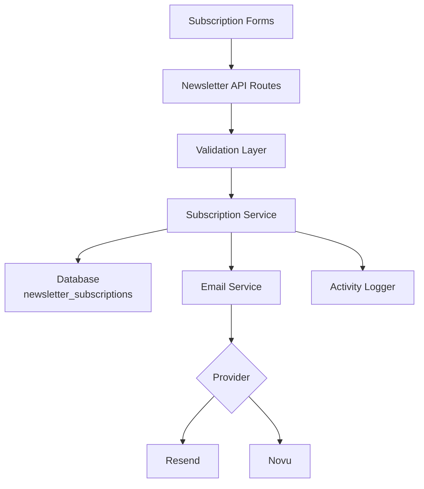
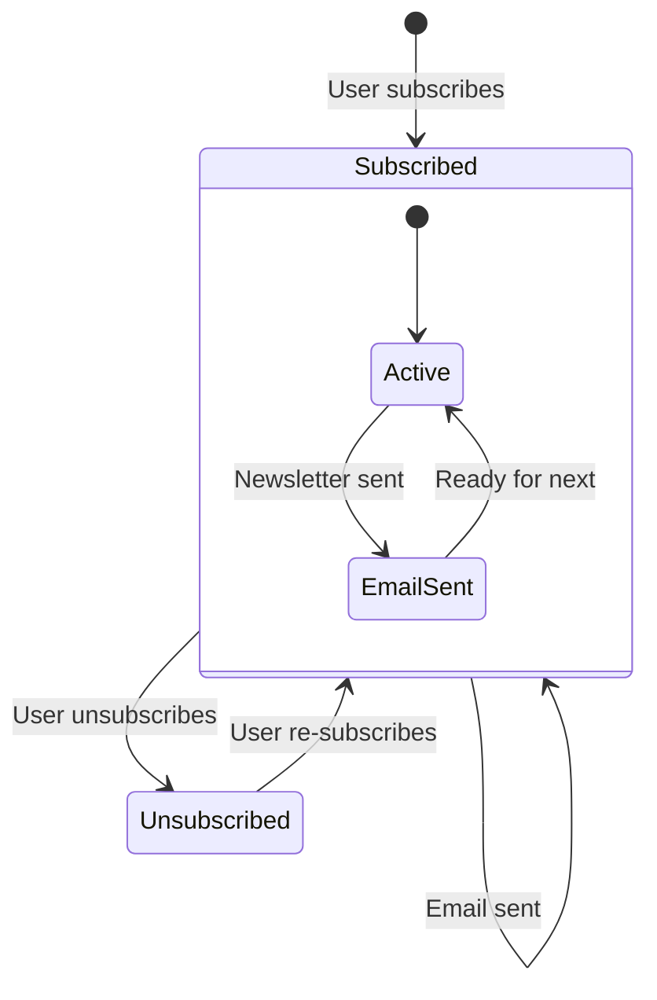

# Конфигурация на Бюлетин

Шаблонът включва пълноценна система за абониране за бюлетин с интеграция на имейл доставчик, валидиране, управление на жизнения цикъл на абонаментите и записване на дейности. Конфигурацията е централизирана в `lib/newsletter/`.

## Архитектура



## Структура на Файловете

```
lib/newsletter/
├── config.ts    # Configuration, types, validation schemas
└── utils.ts     # Email sending, subscription validation, logging
```

## Константи на Конфигурацията

Обектът `NEWSLETTER_CONFIG` в `config.ts` дефинира всички стойности по подразбиране и съобщения:

```typescript
export const NEWSLETTER_CONFIG = {
  DEFAULT_PROVIDER: "resend",
  DEFAULT_FROM: "onboarding@resend.dev",
  DEFAULT_COMPANY_NAME: "Ever Works",

  SOURCES: {
    FOOTER: "footer",
    POPUP: "popup",
    SIGNUP: "signup",
  },

  ERRORS: {
    INVALID_EMAIL: "Please enter a valid email address",
    ALREADY_SUBSCRIBED: "Email is already subscribed to the newsletter",
    NOT_SUBSCRIBED: "Email is not subscribed to the newsletter",
    SUBSCRIPTION_FAILED: "Failed to create subscription. Please try again.",
    UNSUBSCRIPTION_FAILED: "Failed to unsubscribe. Please try again.",
    EMAIL_SEND_FAILED: "Failed to send email. Please try again.",
    STATS_FAILED: "Failed to get newsletter statistics",
  },

  SUCCESS: {
    SUBSCRIBED: "Successfully subscribed to newsletter",
    UNSUBSCRIBED: "Successfully unsubscribed from newsletter",
  },
};
```

## Настройка на Имейл Доставчика

### Resend (По подразбиране)

```env
RESEND_API_KEY=re_your_api_key_here
```

1. Регистрирайте се на [resend.com](https://resend.com)
2. Създайте API ключ
3. Верифицирайте домейна за изпращане (или използвайте `onboarding@resend.dev` за тестване)

### Novu

```env
NOVU_API_KEY=your_novu_api_key
```

За Novu е налична допълнителна конфигурация в конфигурацията на сайта:

```yaml
mail:
  provider: "novu"
  template_id: "your-template-id"
  backend_url: "https://api.novu.co"
```

## Конфигурация на Имейл

Функцията `createEmailConfig()` изгражда конфигурацията на имейл от конфигурацията на приложението:

```typescript
interface EmailConfig {
  provider: string;      // "resend" or "novu"
  defaultFrom: string;   // Sender email address
  domain: string;        // Application domain URL
  apiKeys: {
    resend: string;
    novu: string;
  };
  novu?: {
    templateId?: string;
    backendUrl?: string;
  };
}
```

Приоритет на конфигурацията:

| Настройка           | Източник                        | Резервна стойност          |
|---|---|---|
| Доставчик           | `config.mail.provider`          | `"resend"`                 |
| Адрес на подателя   | `config.mail.default_from`      | `"onboarding@resend.dev"`  |
| Домейн              | `config.app_url`                | `coreConfig.APP_URL`       |
| Ключ Resend         | Проm. на средата `RESEND_API_KEY` | Празен низ               |
| Ключ Novu           | Проm. на средата `NOVU_API_KEY`  | Празен низ               |

## Схеми за Валидация

Системата за бюлетин използва Zod схеми за валидиране на входните данни:

### Схема за Имейл

```typescript
const emailSchema = z.object({
  email: z
    .string()
    .email("Please enter a valid email address")
    .transform((email) => email.toLowerCase().trim()),
});
```

### Схема за Абонамент

```typescript
const newsletterSubscriptionSchema = z.object({
  email: z
    .string()
    .email("Please enter a valid email address")
    .transform((email) => email.toLowerCase().trim()),
  source: z
    .enum(["footer", "popup", "signup"])
    .default("footer"),
});
```

## Източници на Абонаменти

Проследяване откъде идват абонаментите:

| Източник | Описание                                           |
|---|---|
| `footer` | Форма за абониране в долната част на уебсайта      |
| `popup`  | Изскачащ прозорец/модален прозорец за бюлетин      |
| `signup` | Поток за регистрация на акаунт                     |

## Помощни Инструменти за Бюлетин

### Изпращане на Имейл

```typescript
import { sendEmailSafely, createEmailService } from '@/lib/newsletter/utils';

// Create email service
const { service, config } = await createEmailService();

// Send email with error handling
const result = await sendEmailSafely(
  service,
  config,
  {
    subject: "Welcome to our newsletter!",
    html: "<h1>Welcome!</h1>",
    text: "Welcome!"
  },
  "user@example.com",
  "welcome"
);

if (!result.success) {
  console.error(result.error);
}
```

### Валидация на Абонамент

```typescript
import { canSubscribe, canUnsubscribe } from '@/lib/newsletter/utils';

// Check if email can be subscribed
const { canSubscribe: allowed, error } = await canSubscribe("user@example.com");
if (!allowed) {
  // Email is already subscribed
}

// Check if email can be unsubscribed
const { canUnsubscribe: allowed, error } = await canUnsubscribe("user@example.com");
if (!allowed) {
  // Email is not currently subscribed
}
```

### Записване на Дейности

```typescript
import { logNewsletterActivity, trackNewsletterMetric } from '@/lib/newsletter/utils';

// Log newsletter activity
logNewsletterActivity("subscribe", "user@example.com", "footer", {
  ip: "192.168.1.1"
});

// Track newsletter metrics
trackNewsletterMetric("subscription", "user@example.com", "popup");
```

Видове дейности:

| Действие       | Кога се Записва                                      |
|---|---|
| `subscribe`    | Потребителят се абонира за бюлетина                  |
| `unsubscribe`  | Потребителят се отписва                              |
| `email_sent`   | Имейл на бюлетина изпратен успешно                   |
| `email_failed` | Изпращането на имейл на бюлетина не успя             |

### Помощни Инструменти за Шаблони

```typescript
import { getTemplateWithCompany } from '@/lib/newsletter/utils';

// Generate email template with company name
const template = await getTemplateWithCompany(
  (email, companyName) => ({
    subject: `Welcome to ${companyName}`,
    html: `<p>Thanks for subscribing, ${email}!</p>`,
    text: `Thanks for subscribing, ${email}!`
  }),
  "user@example.com"
);
```

### Помощни Функции за Отговор

```typescript
import { createErrorResponse, createSuccessResponse } from '@/lib/newsletter/utils';

// Standardized error response
const error = createErrorResponse(
  "Subscription failed",
  "user@example.com",
  "subscribe"
);
// { error: "Subscription failed", email: "user@example.com", context: "subscribe" }

// Standardized success response
const success = createSuccessResponse("user@example.com", "subscribe");
// { success: true, email: "user@example.com", context: "subscribe" }
```

## Схема на Базата данни

Абонаментите за бюлетин се съхраняват в таблица `newsletter_subscriptions`:

| Колона           | Тип       | Описание                                          |
|---|---|---|
| `id`             | UUID      | Първичен ключ                                     |
| `email`          | String    | Имейл на абоната (уникален)                       |
| `isActive`       | Boolean   | Текущ статус на абонамента                        |
| `subscribedAt`   | Timestamp | Кога е започнал абонаментът                       |
| `unsubscribedAt` | Timestamp | Кога се е отписал (nullable)                      |
| `lastEmailSent`  | Timestamp | Последен изпратен имейл до абоната                |
| `source`         | String    | Източник на абонамента (footer, popup, signup)    |

## Жизнен Цикъл на Абонамента



## Типове

```typescript
type NewsletterSource = "footer" | "popup" | "signup";

interface NewsletterActionResult {
  success?: boolean;
  error?: string;
  email?: string;
}

interface NewsletterStats {
  totalActive: number;
  recentSubscriptions: number;
}
```

## Сигурност

- Имейл адресите се нормализират до малки букви и се изрязват преди съхранение
- Валидацията на имейл използва безопасен регекс, предотвратяващ атаки ReDoS (от `lib/utils/email-validation.ts`)
- Функцията `sendEmailSafely` обгражда всички операции с имейл в блокове try-catch
- API ключовете никога не се разкриват на клиента — всички имейл операции се извършват на сървъра

## Отстраняване на Проблеми

| Проблем                             | Решение                                                                             |
|---|---|
| Имейлите не се изпращат             | Проверете дали `RESEND_API_KEY` или `NOVU_API_KEY` е зададен                        |
| Грешка „вече абониран"              | Проверете таблица `newsletter_subscriptions` за съществуващ активен запис           |
| Грешен адрес на подателя            | Актуализирайте `mail.default_from` в конфигурацията на сайта                        |
| Шаблонът не се зарежда              | Уверете се, че `getCompanyName()` може да достъпи конфигурацията на сайта           |
| Източникът не се проследява         | Предайте параметъра `source` в заявките за абониране                                |
