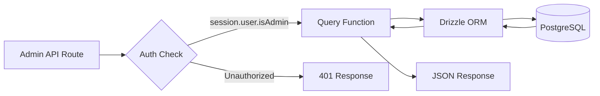
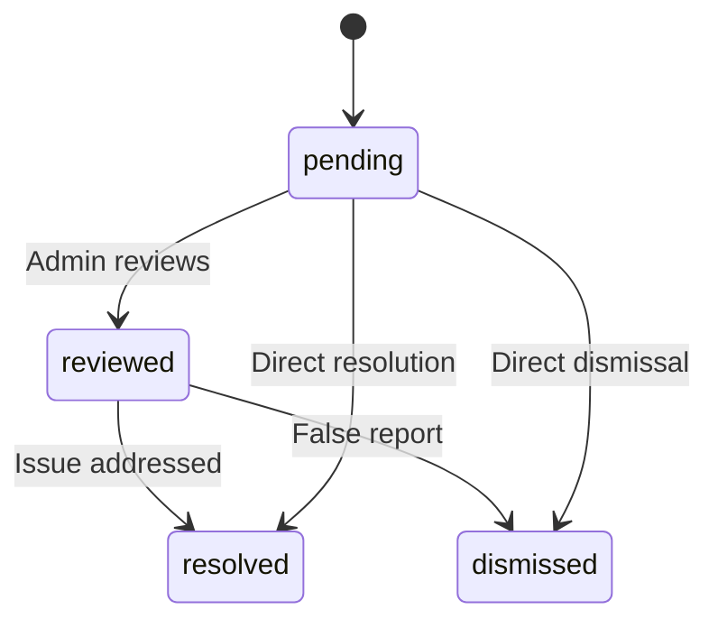

# Администраторски запитвания към бази данни

Администраторските заявки обработват управление на елементи, управление на потребители/клиенти, базиран на роли достъп, статистика на таблото, модериране на отчети и настройки. Тези функции се използват предимно от API маршрути под `app/api/admin/`.

## Поток на администраторските заявки



## Управление на потребителите (`user.queries.ts`)

### Основни функции

|функция|Параметри|Връща се|Описание|
|----------|-----------|---------|-------------|
|`getUserByEmail`|`email: string`|`Потребител \|нула`|Намерете потребител по имейл адрес|
|`getUserById`|`id: string`|`Потребител \|нула`|Намерете потребител по първичен ключ|
|`insertNewUser`|`user: NewUser`|`User[]`|Създайте нов потребителски запис|
|`updateUserPassword`|`hash, userId`|`void`|Актуализирайте хеша на паролата|
|`updateUserVerification`|`email, verified`|`void`|Задаване на статус за потвърждение на имейл|
|`softDeleteUser`|`userId: string`|`void`|Плавно изтриване (прибавя `-deleted` към имейл)|
|`isUserAdmin`|`userId: string`|`boolean`|Проверете ролята на администратор чрез присъединяване|

### Проверка на ролята на администратор

Функцията `isUserAdmin` изпълнява свързване на множество таблици, за да провери състоянието на администратор:

```typescript
export async function isUserAdmin(userId: string): Promise<boolean> {
  const result = await db
    .select({ isAdmin: roles.isAdmin })
    .from(userRoles)
    .innerJoin(roles, eq(userRoles.roleId, roles.id))
    .where(and(
      eq(userRoles.userId, userId),
      eq(roles.isAdmin, true),
      eq(roles.status, 'active')
    ))
    .limit(1);

  return result.length > 0;
}
```

### Шаблон за меко изтриване

Потребителите никога не се изтриват физически. Мекото изтриване свързва потребителския идентификатор с имейла, за да освободи имейл адреса за повторна регистрация:

```typescript
export async function softDeleteUser(userId: string) {
  return db
    .update(users)
    .set({
      deletedAt: sql`CURRENT_TIMESTAMP`,
      email: sql`CONCAT(email, '-', id, '-deleted')`
    })
    .where(eq(users.id, userId));
}
```

## Управление на клиенти (`client.queries.ts`)

### Профил CRUD

|функция|Описание|
|----------|-------------|
|`createClientProfile(data)`|Създайте профил с автоматично генерирано уникално потребителско име|
|`getClientProfileById(id)`|Извличане по ID на профил|
|`getClientProfileByUserId(userId)`|Извличане по потребителска справка|
|`getClientProfileByEmail(email)`|Извличане чрез търсене в таблица с акаунти|
|`updateClientProfile(id, data)`|Частична актуализация с клеймо за време|
|`deleteClientProfile(id)`|Твърдо изтриване на запис на профил|

### Данни на администраторското табло

Функцията `getAdminDashboardData` е оптимизирана за таблото за управление на администратора, като връща както списък с клиенти със страници, така и изчерпателна статистика в минимален брой заявки:

```typescript
export async function getAdminDashboardData(params: {
  page: number;
  limit: number;
  search?: string;
  status?: string;
  plan?: string;
  accountType?: string;
  provider?: string;
  createdAfter?: Date;
  createdBefore?: Date;
}): Promise<{
  clients: ClientProfileWithAuth[];
  stats: { overview, byProvider, byPlan, byAccountType, activity, growth };
  pagination: { page, totalPages, total, limit };
}>
```

Функцията изключва администраторски потребители от листингите на клиенти с помощта на модел LEFT JOIN + IS NULL:

```typescript
// Exclude admin users from client listing
.leftJoin(userRoles, eq(userRoles.userId, clientProfiles.userId))
.leftJoin(roles, and(eq(userRoles.roleId, roles.id), eq(roles.isAdmin, true)))
.where(isNull(roles.id))  // Only non-admin users
```

### Разширено търсене на клиенти

`advancedClientSearch` поддържа комплексно многокритериално филтриране:

|Филтърна категория|Параметри|
|----------------|------------|
|**Текстово търсене**|`search` (през име, имейл, потребителско име, компания, биография, длъжност, индустрия, местоположение)|
|**Enum филтри**|`status`, `plan`, `accountType`, `provider`|
|**Диапазон от време**|`createdAfter`, `createdBefore`, `updatedAfter`, `updatedBefore`, `dateRange`|
|**Специфично за полето**|`emailDomain`, `companySearch`, `locationSearch`, `industrySearch`|
|**Числен**|`minSubmissions`, `maxSubmissions`|
|**Boolean**|`hasAvatar`, `hasWebsite`, `hasPhone`, `emailVerified`, `twoFactorEnabled`|
|**Сортиране**|`sortBy` (създадено на, актуализирано на, име, имейл, фирма, общо изпращания), `sortOrder`|

### Статистика на клиента

`getEnhancedClientStats` връща изчерпателна разбивка:

```typescript
{
  overview: { total, active, inactive, suspended, trial },
  byProvider: { credentials, google, github, facebook, twitter, linkedin, other },
  byPlan: { free: number, standard: number, premium: number },
  byAccountType: { individual, business, enterprise },
  activity: { newThisWeek, newThisMonth, activeThisWeek, activeThisMonth },
  growth: { weeklyGrowth, monthlyGrowth },
}
```

## Управление на отчети (`report.queries.ts`)

### Докладвайте CRUD

|функция|Описание|
|----------|-------------|
|`createReport(data)`|Създаване на отчет за съдържанието (елемент или коментар)|
|`getReportById(id)`|Вземете доклад с подробности за репортера и рецензента|
|`getReports(params)`|Страниран списък с отчети с филтри|
|`updateReport(id, data)`|Актуализиране на състоянието, резолюция, добавяне на бележки за преглед|
|`getReportStats()`|Статистика по статус, тип съдържание, причина|
|`hasUserReportedContent(reportedBy, contentType, contentId)`|Проверка на дублиран отчет|

### Поток на състоянието на отчета



### Филтриране на отчети

Докладите поддържат филтриране по статус, тип съдържание (артикул/коментар) и причина (спам, тормоз, неподходящо, друго):

```typescript
export async function getReports(params: {
  page?: number;
  limit?: number;
  search?: string;
  status?: ReportStatusValues;
  contentType?: ReportContentTypeValues;
  reason?: ReportReasonValues;
}): Promise<{
  reports: ReportWithReporter[];
  total: number;
  page: number;
  totalPages: number;
  limit: number;
}>
```

## Статистика на таблото (`dashboard.queries.ts`)

### Налични показатели

|функция|Цел|Използва се в|
|----------|---------|---------|
|`getVotesReceivedCount(itemSlugs)`|Общо гласове за елементи|Резюме на таблото за управление|
|`getCommentsReceivedCount(itemSlugs)`|Общ брой коментари по елементи|Резюме на таблото за управление|
|`getUniqueItemsInteractedCount(clientId)`|Елементи, с които потребителят се е ангажирал|Панел за активност|
|`getUserTotalActivityCount(clientId)`|Общо гласове + коментари от потребител|Панел за активност|
|`getWeeklyEngagementData(itemSlugs, weeks)`|Седмична диаграма с гласове/коментари|Таблица на годежа|
|`getDailyActivityData(clientId, itemSlugs, days)`|Разбивка на дневната активност|Диаграма на активността|
|`getTopItemsEngagement(itemSlugs, limit)`|Топ елементи по ангажираност|Панел с горни елементи|

### Седмични данни за ангажираност

Връща данни за ангажираност, обобщени по ISO седмица, съответстващи на `to_char(date, 'IYYY-IW')` формат на PostgreSQL:

```typescript
const weeklyVotes = await db
  .select({
    week: sql<string>`to_char(${votes.createdAt}, 'IYYY-IW')`.as('week'),
    count: count(),
  })
  .from(votes)
  .where(and(inArray(votes.itemId, itemSlugs), gte(votes.createdAt, startDate)))
  .groupBy(sql`to_char(${votes.createdAt}, 'IYYY-IW')`)
  .orderBy(sql`to_char(${votes.createdAt}, 'IYYY-IW')`);
```

## Управление на маркери за удостоверяване (`auth.queries.ts`)

|функция|Описание|
|----------|-------------|
|`getPasswordResetTokenByEmail(email)`|Намерете маркер за нулиране по имейл|
|`getPasswordResetTokenByToken(token)`|Намерете маркера за нулиране по низ от символи|
|`deletePasswordResetToken(token)`|Премахване на използван/изтекъл токен|
|`getVerificationTokenByEmail(email)`|Намерете маркер за потвърждение по имейл|
|`getVerificationTokenByToken(token)`|Намерете токена за потвърждение по низ от токени|
|`deleteVerificationToken(token)`|Премахване на използван/изтекъл токен|

Всички функции на токени следват същия прост модел на избор по поле с `.limit(1)`.
