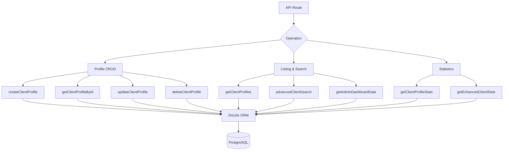

# Запитвания, насочени към клиента

Клиентските заявки обработват управление на профили, списък с метаданни за удостоверяване, разширено многокритериално търсене и изчерпателна статистика. Всички функции живеят в `client.queries.ts` и се използват както от администраторски, така и от клиентски API маршрути.

## Архитектура на клиентските заявки



## Профил CRUD

### Създаване на профил

Новите профили автоматично генерират уникални потребителски имена от имейл адреса, когато не е предоставено потребителско име:

```typescript
export async function createClientProfile(data: {
  userId: string;
  email: string;
  name: string;
  displayName?: string;
  username?: string;
  bio?: string;
  jobTitle?: string;
  company?: string;
  status?: string;
  plan?: string;
  accountType?: string;
}): Promise<ClientProfile>
```

Логика за генериране на потребителско име:

1. Ако е предоставен `username`, нормализирайте и осигурете уникалност
2. В противен случай извлечете потребителското име от имейл чрез `extractUsernameFromEmail()`
3. Резервен: генериране на `user<timestamp>` префикс
4. Всички пътища минават през `ensureUniqueUsername()`, който добавя цифрови суфикси, ако е необходимо

Стойности по подразбиране, приложени по време на създаването:

|Поле|По подразбиране|
|-------|---------|
|`displayName`|Същото като `name`|
|`bio`|`"Welcome! I'm a new user on this platform."`|
|`jobTitle`|`"User"`|
|`company`|`"Unknown"`|
|`status`|`"active"`|
|`plan`|`"free"`|
|`accountType`|`"individual"`|

### Прочетете операциите

|функция|Поле за търсене|Връща се|
|----------|-------------|---------|
|`getClientProfileById(id)`|`clientProfiles.id`|`Клиентски профил \|нула`|
|`getClientProfileByUserId(userId)`|`clientProfiles.userId`|`Клиентски профил \|нула`|
|`getClientProfileByEmail(email)`|Чрез таблица `accounts`|`Клиентски профил \|нула`|

Базираното на имейл търсене разрешава чрез таблицата `accounts`, за да намери свързания `userId`, след което запитва `clientProfiles`:

```typescript
export async function getClientProfileByEmail(email: string): Promise<ClientProfile | null> {
  const account = await getClientAccountByEmail(email);
  if (!account) return null;
  const [profile] = await db
    .select()
    .from(clientProfiles)
    .where(eq(clientProfiles.userId, account.userId))
    .limit(1);
  return profile || null;
}
```

### Актуализиране и изтриване

- **`updateClientProfile(id, data)`** -- Частична актуализация с автоматичен `updatedAt` времеви печат
- **`deleteClientProfile(id)`** -- Твърдо изтриване (връща булев успех)

## Страничен списък

`getClientProfiles` връща пагинирани резултати с данни за доставчика на удостоверяване, с изключение на администраторските потребители:

```typescript
export async function getClientProfiles(params: {
  page?: number;
  limit?: number;
  search?: string;
  status?: string;
  plan?: string;
  accountType?: string;
  provider?: string;
}): Promise<{
  profiles: ClientProfileWithAuth[];
  total: number;
  page: number;
  totalPages: number;
  limit: number;
}>
```

### Шаблон за изключване на администратор

Както заявката за преброяване, така и заявката за данни използват модел LEFT JOIN + IS NULL, за да изключат администраторски потребители:

```typescript
.leftJoin(userRoles, eq(userRoles.userId, clientProfiles.userId))
.leftJoin(roles, and(eq(userRoles.roleId, roles.id), eq(roles.isAdmin, true)))
.where(isNull(roles.id))  // Only non-admin users
```

### Подзаявка за доставчик

За да се избегнат дублиращи се редове, когато потребител има множество акаунти за удостоверяване, доставчикът се разрешава чрез скаларна подзаявка:

```typescript
accountProvider: sql<string>`coalesce(
  (SELECT provider FROM ${accounts}
   WHERE ${accounts.userId} = ${clientProfiles.userId}
   LIMIT 1),
  'unknown'
)`
```

### Филтър за търсене

Текстовото търсене използва `ILIKE` в множество полета с предотвратяване на SQL инжектиране:

```typescript
const escapedSearch = search
  .replace(/\\/g, '\\\\')
  .replace(/[%_]/g, '\\$&');

whereConditions.push(
  sql`(${clientProfiles.username} ILIKE ${`%${escapedSearch}%`} OR
       ${clientProfiles.displayName} ILIKE ${`%${escapedSearch}%`} OR
       ${clientProfiles.company} ILIKE ${`%${escapedSearch}%`} OR
       ${clientProfiles.name} ILIKE ${`%${escapedSearch}%`} OR
       ${clientProfiles.email} ILIKE ${`%${escapedSearch}%`})`
);
```

## Разширено търсене на клиенти

`advancedClientSearch` поддържа над 20 филтърни критерия в множество категории:

|Филтърна категория|Параметри|
|----------------|------------|
|**Текстово търсене**|`search` (през име, имейл, потребителско име, компания, биография, длъжност, индустрия, местоположение)|
|**Enum филтри**|`status`, `plan`, `accountType`, `provider`|
|**Диапазон от време**|`createdAfter`, `createdBefore`, `updatedAfter`, `updatedBefore`, `dateRange`|
|**Специфично за полето**|`emailDomain`, `companySearch`, `locationSearch`, `industrySearch`|
|**Числен**|`minSubmissions`, `maxSubmissions`|
|**Boolean**|`hasAvatar`, `hasWebsite`, `hasPhone`, `emailVerified`, `twoFactorEnabled`|
|**Сортиране**|`sortBy`, `sortOrder`|

## Статистика на клиента

### Основна статистика

`getClientProfileStats` връща прости преброявания:

```typescript
{
  total: number;
  active: number;
  inactive: number;
  byPlan: Record<string, number>;
  byAccountType: Record<string, number>;
}
```

### Подобрена статистика

`getEnhancedClientStats` предоставя цялостна многоизмерна разбивка:

```typescript
{
  overview: { total, active, inactive, suspended, trial },
  byProvider: { credentials, google, github, facebook, twitter, linkedin, other },
  byPlan: { free: number, standard: number, premium: number },
  byAccountType: { individual, business, enterprise },
  activity: { newThisWeek, newThisMonth, activeThisWeek, activeThisMonth },
  growth: { weeklyGrowth, monthlyGrowth },
}
```

Подобрената статистика използва `countDistinct` с обединения на множество таблици, за да произвежда точни преброявания дори когато потребителите имат множество доставчици на акаунти:

```typescript
const statsResult = await db
  .select({
    status: clientProfiles.status,
    plan: clientProfiles.plan,
    accountType: clientProfiles.accountType,
    provider: accounts.provider,
    count: countDistinct(clientProfiles.id)
  })
  .from(clientProfiles)
  .leftJoin(accounts, eq(clientProfiles.userId, accounts.userId))
  .leftJoin(userRoles, eq(userRoles.userId, clientProfiles.userId))
  .leftJoin(roles, and(eq(userRoles.roleId, roles.id), eq(roles.isAdmin, true)))
  .where(isNull(roles.id))
  .groupBy(
    clientProfiles.status,
    clientProfiles.plan,
    clientProfiles.accountType,
    accounts.provider
  );
```

### Показатели за дейността

Прозорците на активността се изчисляват с помощта на аритметика за дати:

```typescript
const oneWeekAgo = new Date(now.getTime() - 7 * 24 * 60 * 60 * 1000);
const oneMonthAgo = new Date(now.getTime() - 30 * 24 * 60 * 60 * 1000);
```

Темповете на растеж са опростени проценти на новите регистрации спрямо общия брой:

```typescript
const weeklyGrowth = total > 0 ? Math.round((newThisWeek / total) * 100) : 0;
```

## Видове

Всички типове клиентски заявки са дефинирани в `lib/db/queries/types.ts`:

```typescript
export type ClientProfileWithAuth = ClientProfile & {
  accountProvider: string;
  isActive: boolean;
};

export type ClientStatus = "active" | "inactive" | "suspended" | "trial";
export type ClientPlan = "free" | "standard" | "premium";
export type ClientAccountType = "individual" | "business" | "enterprise";
```
