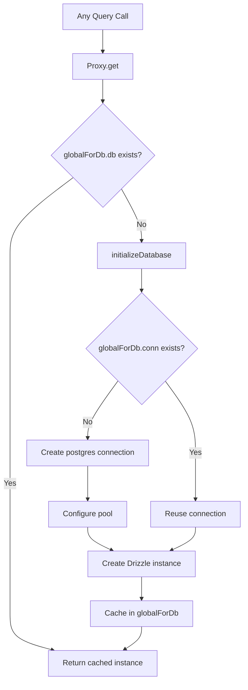

# Свързване с база данни и групиране

Шаблонът използва `postgres.js` (пакета `postgres` npm) като драйвер за PostgreSQL с Drizzle ORM. Управлението на връзката се управлява чрез мързелив модел за инициализация с глобално кеширане на единичен елемент, за да оцелее при разработката на Next.js hot module replacement (HMR).

## Архитектура на връзката



## Настройка на база данни (`lib/db/drizzle.ts`)

### Мързелива инициализация с прокси

Екземплярът на базата данни се експортира като `Proxy`, който инициализира връзката при първи достъп:

```typescript
export const db = new Proxy({} as ReturnType<typeof drizzle>, {
  get(target, prop) {
    const database = initializeDatabase();
    return database[prop as keyof typeof database];
  },
});
```

Това гарантира:
- Не се създава връзка по време на импортиране
- Скриптовете, които импортират модула, но не отправят заявки към базата данни, не водят до допълнителни разходи за връзка
- Първата действителна операция на базата данни задейства инициализация

### Функция за инициализация

```typescript
function initializeDatabase(): ReturnType<typeof drizzle> {
  if (!getDatabaseUrl()) {
    throw new Error('DATABASE_URL environment variable is required');
  }

  if (globalForDb.db) {
    return globalForDb.db;
  }

  const poolSize = getPoolSize();
  const conn = postgres(getDatabaseUrl()!, {
    max: poolSize,
    idle_timeout: 20,
    connect_timeout: 30,
    prepare: false,
    onnotice: getNodeEnv() === 'development' ? console.log : undefined,
  });

  globalForDb.conn = conn;
  globalForDb.db = drizzle(conn, { schema });
  return globalForDb.db;
}
```

### Опции за свързване

|опция|Стойност|Цел|
|--------|-------|---------|
|`max`|Възможност за конфигуриране (вижте размера на басейна)|Максимални връзки в пула|
|`idle_timeout`|`20` секунди|Затворете неактивните връзки след тази продължителност|
|`connect_timeout`|`30` секунди|Максимално време за установяване на връзка|
|`prepare`|`false`|Деактивиране на подготвените отчети (изисква се за някои PaaS среди)|
|`onnotice`|`console.log` (само за разработчици)|Регистрирайте PostgreSQL NOTICE съобщения в процес на разработка|

## Оразмеряване на басейн

### Конфигурация

Размерът на пула може да се конфигурира чрез променливата на средата `DB_POOL_SIZE`, със стандартни настройки за средата:

```typescript
const getPoolSize = (): number => {
  const envPoolSize = process.env.DB_POOL_SIZE;
  if (envPoolSize) {
    const parsed = parseInt(envPoolSize, 10);
    return isNaN(parsed) ? 20 : Math.max(1, Math.min(parsed, 50));
  }
  return getNodeEnv() === 'production' ? 20 : 10;
};
```

### По подразбиране

|Околна среда|Размер на басейна по подразбиране|Обхват|
|-------------|------------------|-------|
|производство| 20 | 1 - 50 |
|развитие| 10 | 1 - 50 |

Размерът на пула е ограничен между 1 и 50, независимо от конфигурираната стойност.

### Указания за размера на басейна

- **Разработване (10):** Достатъчно за един разработчик с HMR. Поддържа ниско потребление на ресурси.
- **Производство (20):** Обработва едновременни заявки за API. Увеличете за инсталации с голям трафик.
- **Без сървър (1-5):** Използвайте малки пулове при внедряване на платформи без сървъри, където всеки екземпляр получава свой собствен пул.

## Глобален единичен модел

### HMR Безопасност

Режимът на разработка на Next.js повторно изпълнява модули при промени във файла. Без защита всеки цикъл на HMR би създал нов пул от връзки, бързо изчерпвайки връзките към базата данни.

Шаблонът прикрепя връзката към `globalThis`, за да оцелее в HMR:

```typescript
const globalForDb = globalThis as unknown as {
  conn: postgres.Sql | undefined;
  db: ReturnType<typeof drizzle> | undefined;
};
```

Когато модул се изпълнява повторно:
1. `initializeDatabase()` проверява `globalForDb.db`
2. Ако екземплярът съществува, той се връща незабавно
3. Ако връзката съществува, но екземплярът на Drizzle не съществува, съществуващата връзка се използва повторно

Регистрирането на разработката показва дали връзката е била използвана повторно:

```
Reusing existing database connection; pool size is unchanged
```

или прясно създадени:

```
Database connection established successfully with pool size: 10
```

### Директен достъп до екземпляри

За библиотеки, които изискват конкретен екземпляр на Drizzle (напр. адаптерът Auth.js), се предоставя функция за получаване:

```typescript
export function getDrizzleInstance(): ReturnType<typeof drizzle> {
  return initializeDatabase();
}
```

## Модул за конфигурация (`lib/db/config.ts`)

Конфигурационен модул, безопасен за скриптове, който **не** импортира `server-only`, позволявайки му да бъде използван от скриптове за миграция и първични скриптове:

```typescript
export function getDatabaseUrl(): string | undefined {
  return process.env.DATABASE_URL;
}

export function getNodeEnv(): 'development' | 'production' | 'test' {
  const env = process.env.NODE_ENV;
  if (env === 'production' || env === 'test') return env;
  return 'development';
}

export function isProduction(): boolean {
  return getNodeEnv() === 'production';
}
```

## Migration Runner (`lib/db/migrate.ts`)

Програмата за мигриране е идемпотентна и безопасна за извикване при всяко стартиране на приложение:

```typescript
export async function runMigrations(): Promise<boolean> {
  const { db } = await import('./drizzle');
  await migrate(db, { migrationsFolder: './lib/db/migrations' });
  return true;
}
```

Ключови поведения:
- Дъжд проследява приложените миграции в `drizzle.__drizzle_migrations`
- Вече приложените миграции автоматично се пропускат
- Връща `true` при успех, `false` при неуспех (не хвърля)
- Регистрира състоянието на миграция преди и след изпълнение

## Променливи на средата

|Променлива|Задължително|По подразбиране|Описание|
|----------|----------|---------|-------------|
|`DATABASE_URL`|да| -- |Низ за свързване на PostgreSQL|
|`DB_POOL_SIZE`|не|`20` (продукция) / `10` (dev)|Размер на пула на връзката (1-50)|
|`NODE_ENV`|не|`development`|Околна среда (разработка/производство/тест)|

## Конфигурация на комплекта за дъжд

Конфигурацията на Drizzle Kit за генериране на схема и управление на миграцията:

```typescript
// drizzle.config.ts
export default {
  schema: "./lib/db/schema.ts",
  out: "./lib/db/migrations",
  dialect: "postgresql",
  dbCredentials: {
    url: process.env.DATABASE_URL,
  },
} satisfies Config;
```

## Отстраняване на неизправности

|Издаване|причина|Решение|
|-------|-------|----------|
|`DATABASE_URL is required`|Липсва env var|Задайте `DATABASE_URL` в `.env.local`|
|Време за изчакване на връзката|Бавна мрежа или претоварена база данни|Увеличете `connect_timeout` или проверете здравето на DB|
|Изчерпване на пула в разработката|HMR създава множество пулове|Уверете се, че шаблонът `globalForDb` е непокътнат|
|Изчерпване на басейна в произв|Твърде много едновременни заявки|Увеличете `DB_POOL_SIZE` (макс. 50)|
|`prepare` грешки на PaaS|PaaS pgBouncer в режим на транзакция|Запазете `prepare: false`|
